# Prerequisites

> **Release:** Zurich | **Flow:** Pre-Build Setup **Complete these steps before starting any lab exercise.**

***

## What This Is

Before building the Agentic Workflow and AI Agents in this lab, there are a number of instance-level prerequisites that must be in place. Skipping these steps will result in cross-scope errors, missing components, or silent failures during the build exercises.

Complete every step below in order before proceeding to [01 — Now Assist for Virtual Agent (NAVA)](01-now-assist-virtual-agent.md).

Lab resources that you will need in order to complete the lab: [Lab resources folder](../Lab%20resources/)

***

### Pre-Requisite 1: Switch to the `x_nava_agentic_lab` Application Scope

All lab artefacts — topics, agents, agentic workflows, flow actions, and tables — live in the **x\_nava\_agentic\_lab** scoped application. If you build or configure components in the wrong scope (e.g., Global), they will not be visible to the AI Agent at runtime and cross-scope privilege errors will occur.

### Steps

1. In the ServiceNow banner frame, click the **globe icon** (Application scope picker) in the top-right navigation bar
2. In the **Application scope** dropdown, type `x_nava` in the filter field
3. Select **x\_nava\_agentic\_lab** from the results

.png>)

4. Confirm the scope picker now displays **x\_nava\_agentic\_lab** as the active scope

> **This must remain your active scope for the entire lab.** If you navigate away and the scope resets to Global, switch back before making any changes. A common symptom of being in the wrong scope is seeing _"Record not found"_ or _"Insufficient privileges"_ errors when saving flow actions or agent configurations.

***

## Pre-Requisite 2: Verify the Incident Extend Table, Update Numbering, and Confirm Sample Records

The lab scenario uses a **custom table called incident extend** (`x_snc_apacaienable_incident_extend`) that adds fields specific to the Veritas NetBackup triage use case — such as error codes, product, serial number, and barcode. This table must already exist on your instance. Before the lab begins, you need to verify the table exists, update its auto-numbering counter to avoid collisions with seed data, and confirm sample records are populated.

### Steps

1. In the **Filter navigator** (left-hand sidebar), type `System defin`
2. Under **System Definition**, click **Tables**

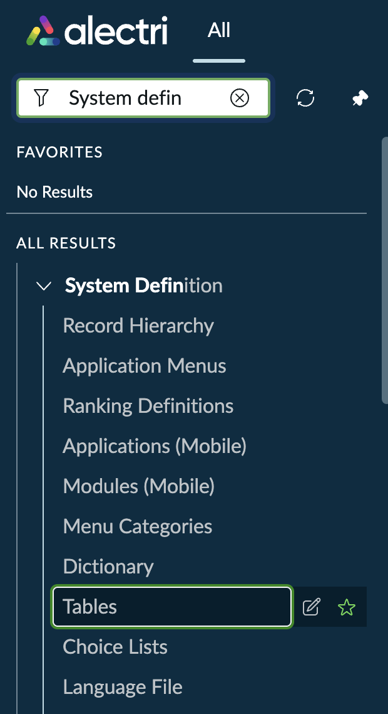

3. In the **Tables** list, filter by **Label starts with `Incident Extend`**
4. Confirm the **incident extend** table appears with the following details:

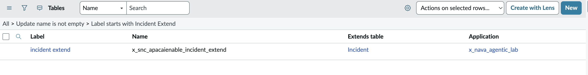

| Field         | Expected Value                       |
| ------------- | ------------------------------------ |
| Label         | `incident extend`                    |
| Name          | `x_snc_apacaienable_incident_extend` |
| Extends table | `Incident`                           |
| Application   | `x_nava_agentic_lab`                 |

5. Click on **incident extend** to open the Table Definition form
6. Select the **Controls** tab
7. Locate the **auto-numbering** section and update the **Number** field to `12,000`
8. **Right-click** on the form header bar and select **Save** to save the change without navigating away from the page

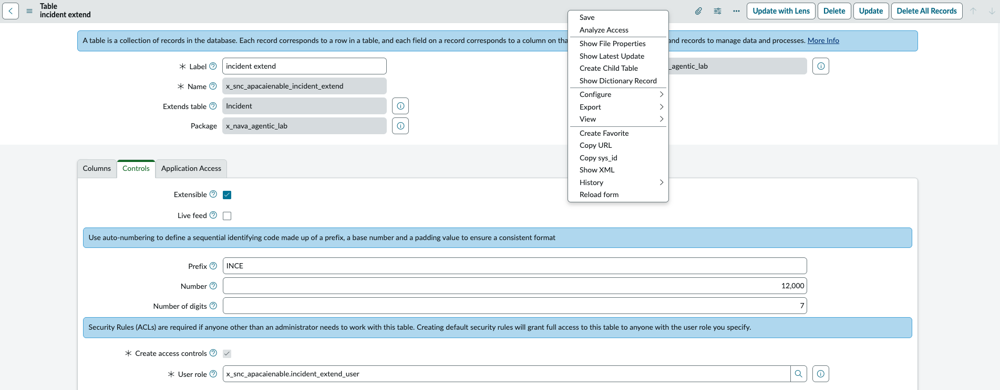

> Confirm the following fields on the Controls tab after saving:

| Field                  | Expected Value                            |
| ---------------------- | ----------------------------------------- |
| Prefix                 | `INCE`                                    |
| Number                 | `12,000`                                  |
| Number of digits       | `7`                                       |
| Extensible             | ✅ Checked                                 |
| Create access controls | ✅ Checked                                 |
| User role              | `x_snc_apacaienable.incident_extend_user` |

9. Scroll down to the **Related Links** section at the bottom of the Table Definition form
10. Click **Show List** to open the incident extend records list view

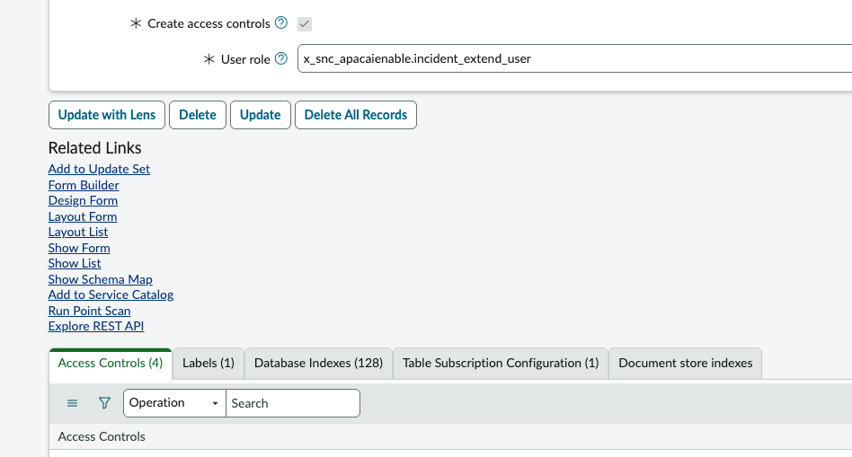

11. Confirm the **incident extends** list view loads and displays sample records
12. Verify that records are populated with Veritas NetBackup-related data — you should see incidents with short descriptions referencing hardware overheating, error codes (e.g., error 84, error 37, status code 2817), and categories such as **Hardware** and **Software**

.png>)

> **What to look for:** The records should include a mix of categories, assignment groups (e.g., IT Operations Support, IT Client Systems Engineering), and states set to **Resolved**. These sample records are used by Predictive Intelligence for training and by the AI Agent for pattern matching during triage. If the table is empty or missing, the downstream Agentic Workflow will have no historical data to reference when generating resolution plans.

| Field                  | Expected Value                               |
| ---------------------- | -------------------------------------------- |
| Table name             | `x_snc_apacaienable_incident_extend`         |
| List URL path          | `x_snc_apacaienable_incident_extend_list.do` |
| Number prefix          | `INCE`                                       |
| Minimum sample records | 10+                                          |
| Record categories      | Hardware, Software, Inquiry / Help           |

> **If the table is missing or empty:** Contact your lab administrator to import the Update Set that creates the `x_snc_apacaienable` scoped application and its seed data. The table and records are delivered as part of the lab instance provisioning — they are not created during the build exercises.

***

## Pre-Requisite 3: Train the Predictive Intelligence Similarity Model

The AI Agent uses a **Predictive Intelligence Similarity** solution to find historically resolved incidents that are similar to the incoming issue. The Similarity Definition is already configured on your instance — you just need to trigger the training job so the ML model is built and ready before the lab begins.

### Steps

1. In the **Filter navigator**, type `Predictive Intelli` and expand the **Predictive Intelligence** menu

.png>)

2. Under **Similarity**, click **Solution Definitions**
3. Open the definition labelled **Find possible resolution for similar Incident cases**

.png>)

4. Review the Similarity Definition configuration and confirm the following fields match:

.png>)

| Field                   | Expected Value                                                                                             |
| ----------------------- | ---------------------------------------------------------------------------------------------------------- |
| Label                   | `Find possible resolution for similar Incident cases`                                                      |
| Name                    | `ml_x_snc_x_snc_apacaienable_global_find_possibl..`                                                        |
| Active                  | ✅ Checked                                                                                                  |
| Table                   | `Incident [incident]`                                                                                      |
| Test Table              | `incident extend [x_snc_apacaienable_incid...]`                                                            |
| Fields                  | Short description, Configuration item, Resolution code, Resolution notes, Category, Description            |
| Test Fields             | Short description, error code, product bar code, product name, serial number, Category, Configuration item |
| Filter                  | State is Resolved                                                                                          |
| No. of records matching | 96 (approximate — may vary on your instance)                                                               |
| Processing Language     | English                                                                                                    |
| Stopwords               | Default English Stopwords                                                                                  |
| Training Frequency      | Run Once                                                                                                   |
| Update Frequency        | Do not update                                                                                              |

> **Table vs. Test Table:** The **Table** (`Incident`) is the training corpus — the model learns from resolved incidents and their resolution notes. The **Test Table** (`incident extend`) is the table against which similarity is evaluated at runtime. This is why the Test Fields include the custom fields (`error_code`, `product_bar_code`, `serial_number`) that exist on the extended table.

5. Click the **Update & Retrain** button in the top-right corner to trigger the training job
6. Scroll down to the **ML Solutions** tab at the bottom of the form
7. Wait for the solution to reach **Solution Complete** at **100%** progress (Continue on with the lab - you can proceed on with the next steps as you are waiting for the model training to complete)

.png>)

| Field     | Expected Value                                        |
| --------- | ----------------------------------------------------- |
| Active    | `true`                                                |
| Version   | `1`                                                   |
| State     | Solution Complete                                     |
| Progress  | 100%                                                  |
| Row Count | 45 (approximate — depends on resolved incident count) |

> **Training time:** On most lab instances, training completes within 1–2 minutes given the small dataset. If the solution stays in _Training_ state for more than 5 minutes, check that the instance has the **Predictive Intelligence** plugin active and that there are sufficient resolved records in the Incident table matching the filter condition (State = Resolved).

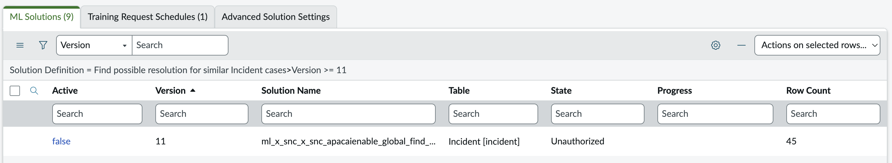

8. If the State becomes `Unauthorized` for the 'Find possible resolution for similar Incident cases' Predictive Intelligence model that you are training, it is likely a training infrastructure issue. At this point, spin up a new DemoHub instance and rerun the End-to-end AI Lab catalog again.

***

## Pre-Requisite 4: Verify the Knowledge Base Article and Index It in AI Search

The First Responder Operations Analyst Agent uses **AI Search** to retrieve Knowledge Base articles as part of its KB deflection path. A Veritas Backup Failure KB article has already been created on your instance — you need to confirm it exists and then trigger the AI Search indexer so the article is available for retrieval at runtime.

### Part A: Verify the KB Article Exists

1. In the **Filter navigator**, type `Knowledge` and open the **Knowledge** list (kb\_knowledge.list)
2. Filter the list by **Short description contains `backup`**
3. Confirm the article **KB0010065 — Veritas Backup Failure** is present and in **Published** workflow state

.png>)

> If the article is missing, contact your lab administrator. The KB article is delivered as part of the lab instance provisioning.

***

### Part B: Navigate to AI Search Indexed Sources

1. In the **Filter navigator**, type `Indexed Sources`
2. Under **AI Search** → **AI Search Index**, click **Indexed Sources**

.png>)

> There are two **Indexed Sources** entries in the navigator — one under **Query Generation > Semantic Filter** and one under **AI Search > AI Search Index**. Use the **AI Search** path.

3. In the **AI Search Indexed Sources** list, filter by **Name starts with `Knowledge Table`**
4. Confirm the **Knowledge Table** record exists with the following values:

.png>)

| Field  | Expected Value             |
| ------ | -------------------------- |
| Name   | Knowledge Table            |
| Source | `Knowledge [kb_knowledge]` |
| Type   | internal                   |
| Active | `true`                     |

***

### Part C: Trigger the Index

1. Click on **Knowledge Table** to open the Indexed Source record
2. You will see the **AI Search Indexed Source — Knowledge Table** form with **Index All Tables** and **Index Selected Table/s** buttons in the top-right corner

.png>)

> **Cross-scope notice:** You may see a banner stating _"This record is in the Global application, but x\_nava\_agentic\_lab is the current application."_ This is expected — the Indexed Source is a Global record. You can still trigger the index from here.

3. Click **Index All Tables** to queue the indexing job
4. The page will navigate to the **Indexed Source History** form. Initially, both **Keyword Ingestion State** and **Semantic Ingestion State** will show `not_started`

.png>)

5. Refresh the page periodically until the indexing completes. When finished, the form should show:

.png>)

| Field                    | Expected Value                           |
| ------------------------ | ---------------------------------------- |
| Keyword Ingestion State  | `indexed`                                |
| Semantic Ingestion State | `indexing` → eventually `indexed`        |
| Records Processed        | 3,681 (approximate — varies by instance) |
| AIS Records Processed    | 3,336 (approximate)                      |
| Number of Errors         | 0                                        |
| Number of Minor Errors   | 0                                        |
| Total Ingestion Duration | \~42 seconds (varies)                    |

> **Indexing time:** The keyword ingestion typically completes within 1–2 minutes. Semantic ingestion may take longer and may still show `indexing` when keyword ingestion has already finished — this is normal. The lab exercises will function once **Keyword Ingestion State** reaches `indexed`. If errors occur during ingestion, verify the Knowledge Table source is active and that the KB article is in Published state.

***

## Pre-Requisite 5: Change Subflow Run As to System User

The **Create and submit Incident record with image upload(s) subflow** is invoked by the L1 First Responder Operations Analyst Agent to create Incident records. By default, the subflow's **Run As** property is set to **User who initiates session** — meaning it executes with the permissions of the chat user (e.g., Alex Rai). This can cause permission failures when the subflow attempts to create records on tables that the chat user does not have write access to.

You need to change the **Run As** property to **System User** so the subflow executes with elevated permissions regardless of who initiated the chat session.

### Steps

1. In the **Filter navigator**, type `workflow stu`
2. Under **Process Automation**, click **Workflow Studio**

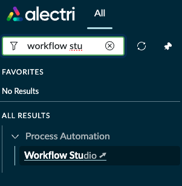

3. In Workflow Studio, click the **Subflows** tab
4. Filter the subflow list by **Name contains `Create and submit`**

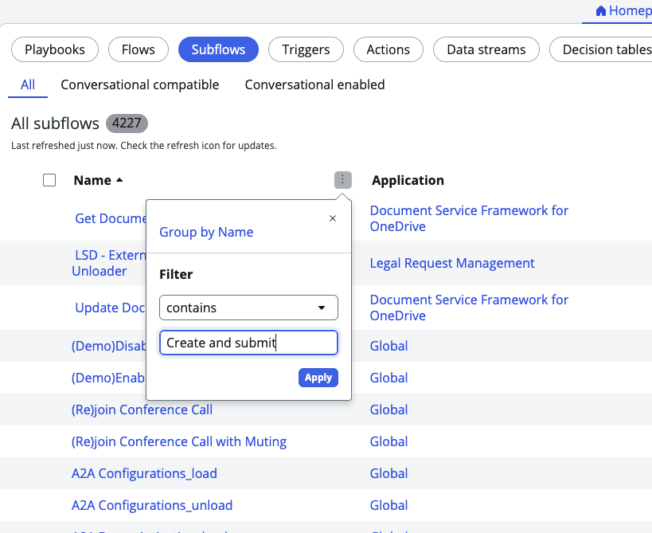

5. Confirm the subflow **Create and submit Incident record with image upload(s) subflow** appears — it should show **Published**, **Active: true**, and belong to the `x_nava_agentic_lab` application

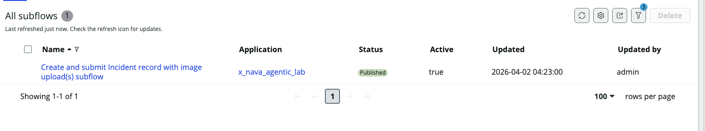

6. Click on the subflow name to open it
7. Click on Edit subflow to begin editing the subflow

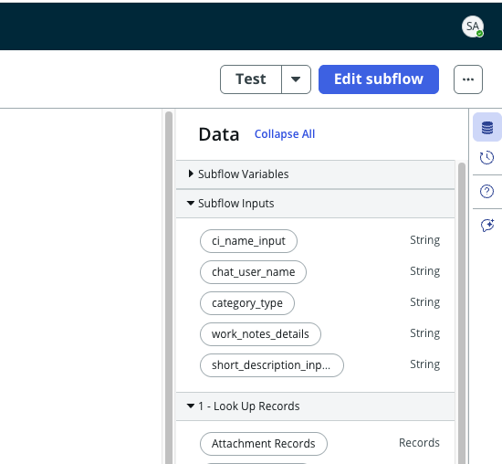

8. Click the **kebab menu** (three-dot icon, top-right) and select **Properties**

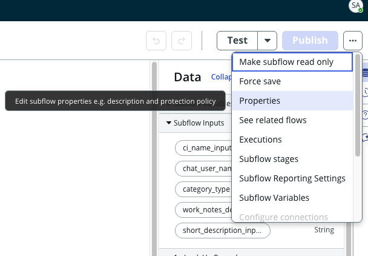

9. In the **Subflow properties** dialog, expand **Advanced Options**
10. Change the **Run As** dropdown from `User who initiates session` to **`System User`**

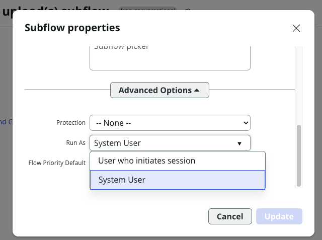

11. Click **Update** to save the change and finally, publish the subflow again

> **Why System User?** When the L1 Agent fires this subflow during a Virtual Agent chat session, the session runs as the end user (e.g., Alex Rai). If Run As is set to "User who initiates session", the subflow inherits that user's ACLs — which typically do not include write access to the Incident Extend table or permission to attach files programmatically. Setting Run As to **System User** ensures the subflow has the necessary permissions to create the Incident record, attach uploaded images, and set all required fields — regardless of who is chatting with the agent.

***

## Pre-Requisite 6: Verify User Permissions for Lab Users
 
The lab scenario involves two key users — **Alex Rai** (the end user / requestor who interacts with the Virtual Agent) and **Amelia Bryant** (the fulfilment user who is assigned incidents). Both users must have the correct roles assigned for the Agentic Workflow to function end-to-end. If these roles are missing, the Virtual Agent session will encounter permission errors during incident creation, or the AI Agent will fail to assign and resolve records.
 
### Steps
 
1. In the **Filter navigator**, type `user admin`
2. Under **User Administration**, click **Users**
 
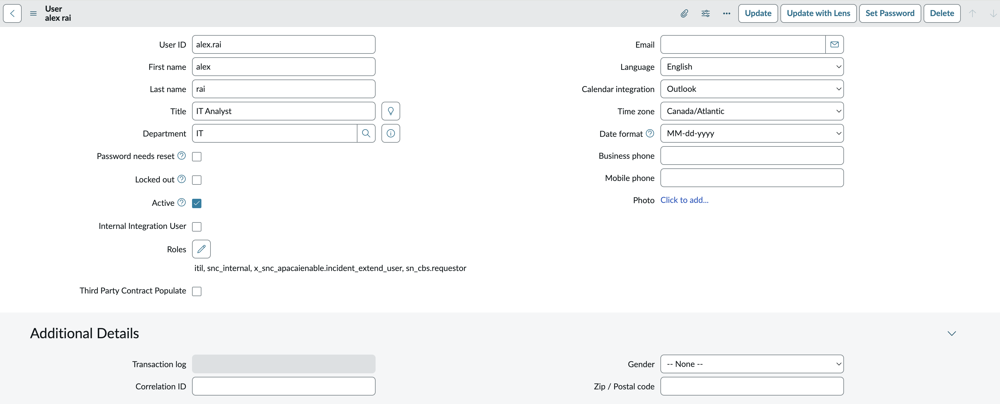
 
***
 
### Part A: Verify Alex Rai's Roles
 
3. In the **Users** list, filter by **User ID starts with `alex.rai`**
 
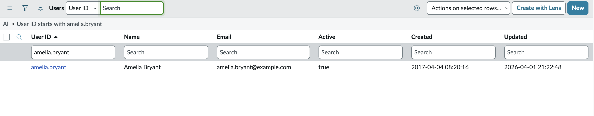
 
4. Click on **alex.rai** to open the User record
5. Confirm the user details and verify the **Roles** field displays the required roles
 
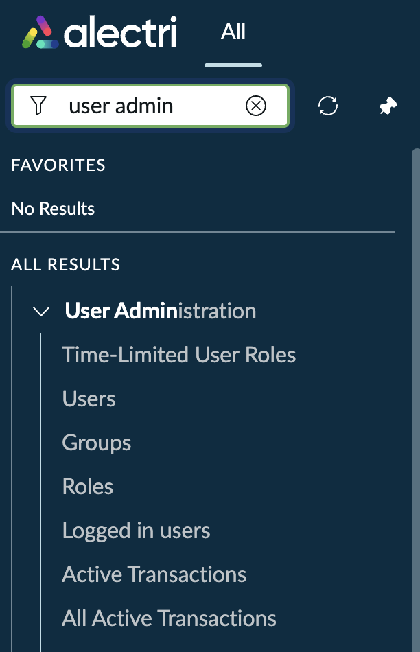
 
| Field      | Expected Value |
| ---------- | -------------- |
| User ID    | `alex.rai`     |
| First name | `alex`         |
| Last name  | `rai`          |
| Title      | `IT Analyst`   |
| Department | `IT`           |
| Active     | ✅ Checked      |
 
Confirm the following **roles** are assigned to Alex Rai:
 
| Role                                          | Purpose                                                                                  |
| --------------------------------------------- | ---------------------------------------------------------------------------------------- |
| `itil`                                        | Grants access to ITSM modules and the ability to interact with Incident records          |
| `snc_internal`                                | Identifies the user as an internal ServiceNow user — required for Virtual Agent sessions |
| `x_snc_apacaienable.incident_extend_user`     | Grants read/write access to the custom Incident Extend table                             |
| `sn_cbs.requestor`                            | Enables the user to act as a requestor in Conversational Bot Sessions (Virtual Agent)    |
 
> **Why these roles matter for Alex Rai:** Alex Rai is the user who initiates the Virtual Agent chat session. The `sn_cbs.requestor` role is required for the Virtual Agent to recognise Alex as a valid chat participant. The `itil` role allows interaction with Incident records, `snc_internal` ensures the user is treated as an internal employee, and `x_snc_apacaienable.incident_extend_user` provides access to the custom fields on the Incident Extend table that the AI Agent populates during triage.
 
***
 
### Part B: Verify Amelia Bryant's Roles
 
6. Navigate back to the **Users** list
7. Filter by **User ID starts with `amelia.bryant`**
 
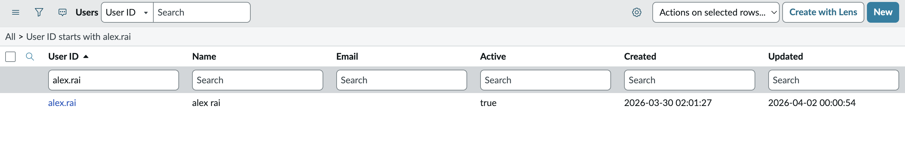
 
8. Click on **amelia.bryant** to open the User record
9. Scroll down to the **Roles** tab at the bottom of the form
10. Filter the Roles related list by **Role Name >= `x_snc_apacaienable`** to locate the scoped role
 
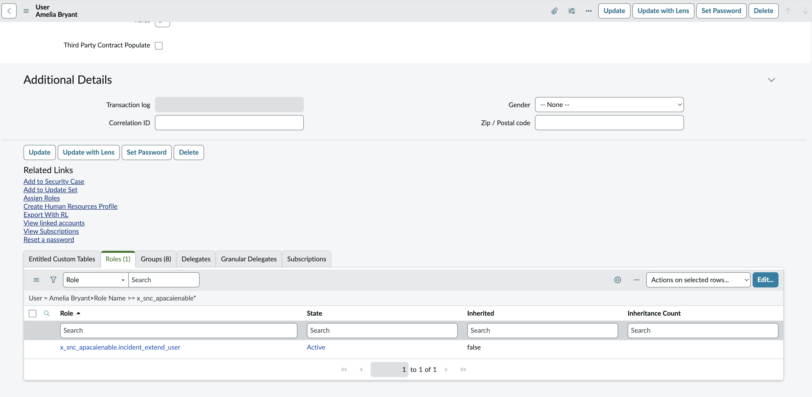
 
Confirm the following **role** is assigned to Amelia Bryant:
 
| Role                                          | Purpose                                                                                        |
| --------------------------------------------- | ---------------------------------------------------------------------------------------------- |
| `x_snc_apacaienable.incident_extend_user`     | Grants read/write access to the custom Incident Extend table for incident fulfilment           |
 
> **Why this role matters for Amelia Bryant:** Amelia Bryant is the fulfilment user — incidents triaged by the AI Agent are assigned to her (or her assignment group). Without the `x_snc_apacaienable.incident_extend_user` role, Amelia would not have access to the custom fields on the Incident Extend table, and any updates she makes to the record (e.g., resolution notes, error code confirmation) would fail with an ACL error.
 
> **If roles are missing:** Use the **Roles** tab on the user record (or click **Assign Roles** under Related Links) to add the missing role. Ensure the role State is **Active** and that the role is directly assigned (Inherited = `false`) to avoid dependency on group membership changes.
 
***

## Checklist

| # | Pre-Requisite                                                         |
| - | --------------------------------------------------------------------- |
| 1 | Application scope set to `x_nava_agentic_lab`                         |
| 2 | Incident extend table exists with sample records                      |
| 3 | Predictive Intelligence Similarity model trained (100%)               |
| 4 | KB article indexed in AI Search (Keyword Ingestion State = `indexed`) |
| 5 | Subflow Run As changed to System User                                 |
| 6 | Alex Rai and Amelia Bryant roles verified                             |

***

## Next Step

Continue to [01 — Now Assist for Virtual Agent (NAVA)](01-now-assist-virtual-agent.md) to configure the conversational entry point for the lab.
