# 00 — Prerequisites
 
> **Release:** Zurich | **Flow:** Pre-Build Setup
> **Complete these steps before starting any lab exercise.**
 
---
 
## What This Is
 
Before building the Agentic Workflow and AI Agents in this lab, there are a number of instance-level prerequisites that must be in place. Skipping these steps will result in cross-scope errors, missing components, or silent failures during the build exercises.
 
Complete every step below in order before proceeding to [01 — Now Assist for Virtual Agent (NAVA)](01-now-assist-virtual-agent.md).
 
---
 
### Pre-Requisite 1: Switch to the `x_nava_agentic_lab` Application Scope

All lab artefacts — topics, agents, agentic workflows, flow actions, and tables — live in the **x_nava_agentic_lab** scoped application. If you build or configure components in the wrong scope (e.g., Global), they will not be visible to the AI Agent at runtime and cross-scope privilege errors will occur.
 
### Steps
 
1. In the ServiceNow banner frame, click the **globe icon** (Application scope picker) in the top-right navigation bar
2. In the **Application scope** dropdown, type `x_nava` in the filter field
3. Select **x_nava_agentic_lab** from the results
 
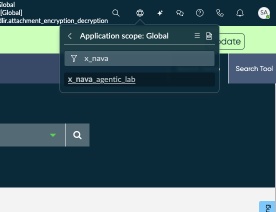
 
4. Confirm the scope picker now displays **x_nava_agentic_lab** as the active scope
 
> **This must remain your active scope for the entire lab.** If you navigate away and the scope resets to Global, switch back before making any changes. A common symptom of being in the wrong scope is seeing *"Record not found"* or *"Insufficient privileges"* errors when saving flow actions or agent configurations.
 
---

## Pre-Requisite 2: Verify the Incident Extend Table and Sample Records
 
The lab scenario uses a **custom table called incident extend** (`x_snc_apacaienable_incident_extend`) that adds fields specific to the Veritas NetBackup triage use case — such as error codes, product, serial number, and barcode. This table must already exist on your instance and be populated with sample incident records before you begin the build.
 
### Steps
 
1. In the **Filter navigator** (left-hand sidebar), type `incident extend` in the search field
2. Under **All Results**, click **incident extends** to open the list view
 
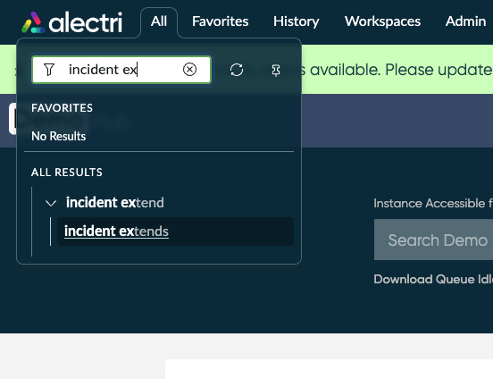
 
3. Confirm the **incident extends** list view loads and displays sample records
4. Verify that records are populated with Veritas NetBackup-related data — you should see incidents with short descriptions referencing hardware overheating, error codes (e.g., error 84, error 37, status code 2817), and categories such as **Hardware** and **Software**
 
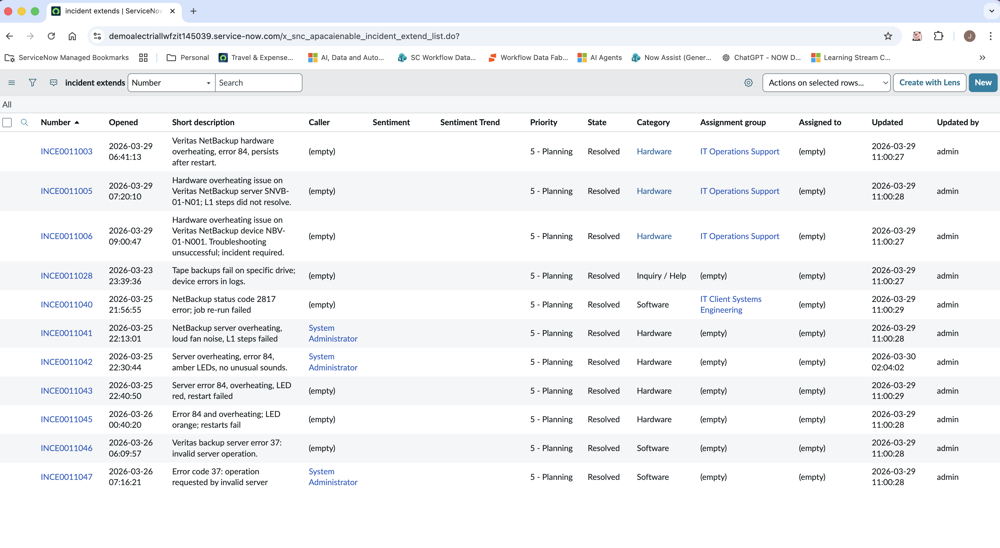
 
> **What to look for:** The records should include a mix of categories, assignment groups (e.g., IT Operations Support, IT Client Systems Engineering), and states. These sample records are used by Predictive Intelligence for training and by the AI Agent for pattern matching during triage. If the table is empty or missing, the downstream Agentic Workflow will have no historical data to reference when generating resolution plans.
 
| Field | Expected Value |
|-------|----------------|
| Table name | `x_snc_apacaienable_incident_extend` |
| List URL path | `x_snc_apacaienable_incident_extend_list.do` |
| Number prefix | `INCE` |
| Minimum sample records | 10+ |
| Record categories | Hardware, Software, Inquiry / Help |
 
> **If the table is missing or empty:** Contact your lab administrator to import the Update Set that creates the `x_snc_apacaienable` scoped application and its seed data. The table and records are delivered as part of the lab instance provisioning — they are not created during the build exercises.
 
---

## Pre-Requisite 3: Train the Predictive Intelligence Similarity Model
 
The AI Agent uses a **Predictive Intelligence Similarity** solution to find historically resolved incidents that are similar to the incoming issue. The Similarity Definition is already configured on your instance — you just need to trigger the training job so the ML model is built and ready before the lab begins.
 
### Steps
 
1. In the **Filter navigator**, type `Predictive Intelli` and expand the **Predictive Intelligence** menu
 
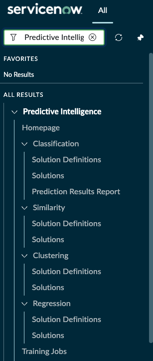
 
2. Under **Similarity**, click **Solution Definitions**
3. Open the definition labelled **Find possible resolution for similar Incident cases**
 
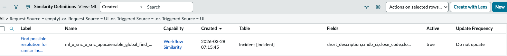
 
4. Review the Similarity Definition configuration and confirm the following fields match:
 
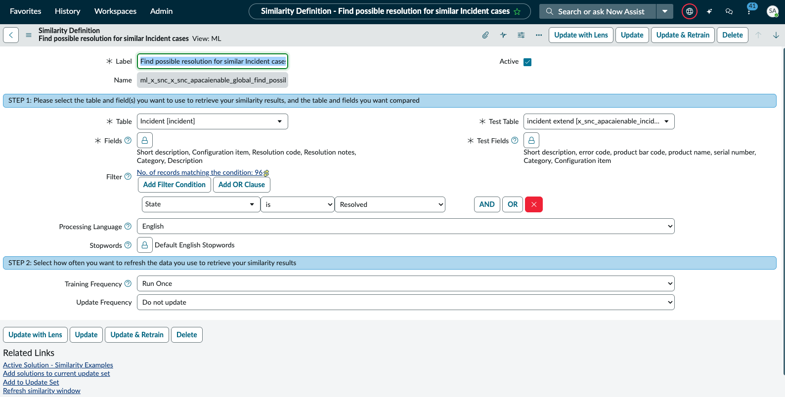
 
| Field | Expected Value |
|-------|----------------|
| Label | `Find possible resolution for similar Incident cases` |
| Name | `ml_x_snc_x_snc_apacaienable_global_find_possil` |
| Active | ✅ Checked |
| Table | `Incident [incident]` |
| Test Table | `incident extend [x_snc_apacaienable_incid...]` |
| Fields | Short description, Configuration item, Resolution code, Resolution notes, Category, Description |
| Test Fields | Short description, error code, product bar code, product name, serial number, Category, Configuration item |
| Filter | State is Resolved |
| No. of records matching | 96 (approximate — may vary on your instance) |
| Processing Language | English |
| Stopwords | Default English Stopwords |
| Training Frequency | Run Once |
| Update Frequency | Do not update |
 
> **Table vs. Test Table:** The **Table** (`Incident`) is the training corpus — the model learns from resolved incidents and their resolution notes. The **Test Table** (`incident extend`) is the table against which similarity is evaluated at runtime. This is why the Test Fields include the custom fields (`error_code`, `product_bar_code`, `serial_number`) that exist on the extended table.
 
5. Click the **Update & Retrain** button in the top-right corner to trigger the training job
6. Scroll down to the **ML Solutions** tab at the bottom of the form
7. Wait for the solution to reach **Solution Complete** at **100%** progress
 
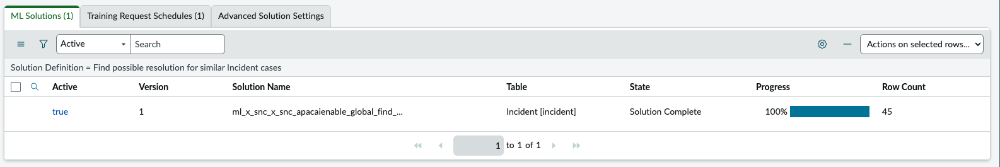
 
| Field | Expected Value |
|-------|----------------|
| Active | `true` |
| Version | `1` |
| State | Solution Complete |
| Progress | 100% |
| Row Count | 45 (approximate — depends on resolved incident count) |
 
> **Training time:** On most lab instances, training completes within 1–2 minutes given the small dataset. If the solution stays in *Training* state for more than 5 minutes, check that the instance has the **Predictive Intelligence** plugin active and that there are sufficient resolved records in the Incident table matching the filter condition (State = Resolved).
 
---

## Pre-Requisite 4: Verify the Knowledge Base Article and Index It in AI Search
 
The First Responder Operations Analyst Agent uses **AI Search** to retrieve Knowledge Base articles as part of its KB deflection path. A Veritas Backup Failure KB article has already been created on your instance — you need to confirm it exists and then trigger the AI Search indexer so the article is available for retrieval at runtime.
 
### Part A: Verify the KB Article Exists
 
1. In the **Filter navigator**, type `Knowledge` and open the **Knowledge** list
2. Filter the list by **Short description contains `backup`**
3. Confirm the article **KB0010065 — Veritas Backup Failure** is present and in **Published** workflow state
 
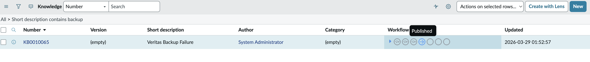
 
> If the article is missing, contact your lab administrator. The KB article is delivered as part of the lab instance provisioning.
 
---
 
### Part B: Navigate to AI Search Indexed Sources
 
1. In the **Filter navigator**, type `Indexed Sources`
2. Under **AI Search** → **AI Search Index**, click **Indexed Sources**
 
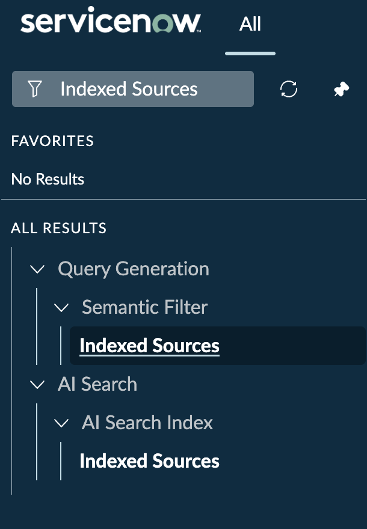
 
> There are two **Indexed Sources** entries in the navigator — one under **Query Generation > Semantic Filter** and one under **AI Search > AI Search Index**. Use the **AI Search** path.
 
3. In the **AI Search Indexed Sources** list, filter by **Name starts with `Knowledge Table`**
4. Confirm the **Knowledge Table** record exists with the following values:
 
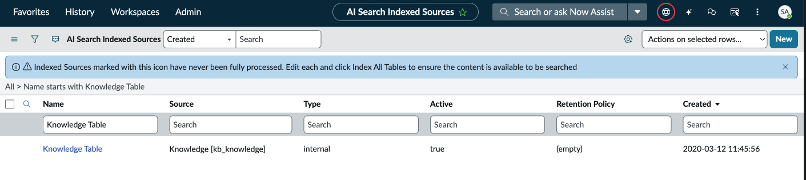
 
| Field | Expected Value |
|-------|----------------|
| Name | Knowledge Table |
| Source | `Knowledge [kb_knowledge]` |
| Type | internal |
| Active | `true` |
 
---
 
### Part C: Trigger the Index
 
1. Click on **Knowledge Table** to open the Indexed Source record
2. You will see the **AI Search Indexed Source — Knowledge Table** form with **Index All Tables** and **Index Selected Table/s** buttons in the top-right corner
 
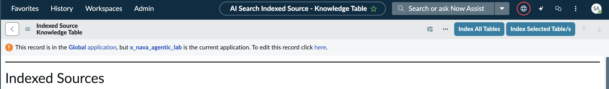
 
> **Cross-scope notice:** You may see a banner stating *"This record is in the Global application, but x_nava_agentic_lab is the current application."* This is expected — the Indexed Source is a Global record. You can still trigger the index from here.
 
3. Click **Index All Tables** to queue the indexing job
4. The page will navigate to the **Indexed Source History** form. Initially, both **Keyword Ingestion State** and **Semantic Ingestion State** will show `not_started`
 
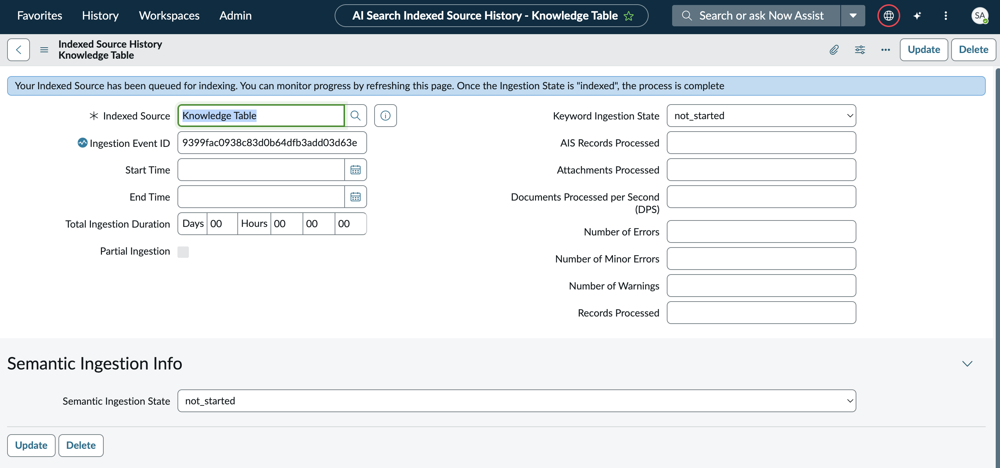
 
5. Refresh the page periodically until the indexing completes. When finished, the form should show:
 
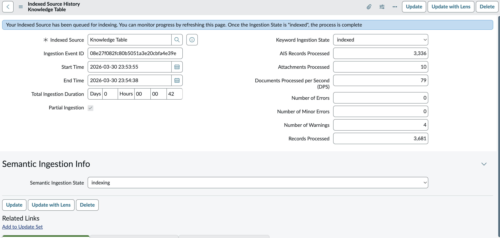
 
| Field | Expected Value |
|-------|----------------|
| Keyword Ingestion State | `indexed` |
| Semantic Ingestion State | `indexing` → eventually `indexed` |
| Records Processed | 3,681 (approximate — varies by instance) |
| AIS Records Processed | 3,336 (approximate) |
| Number of Errors | 0 |
| Number of Minor Errors | 0 |
| Total Ingestion Duration | ~42 seconds (varies) |
 
> **Indexing time:** The keyword ingestion typically completes within 1–2 minutes. Semantic ingestion may take longer and may still show `indexing` when keyword ingestion has already finished — this is normal. The lab exercises will function once **Keyword Ingestion State** reaches `indexed`. If errors occur during ingestion, verify the Knowledge Table source is active and that the KB article is in Published state.
 
---
 
## Checklist
 
| # | Pre-Requisite |
|---|---------------|
| 1 | Application scope set to `x_nava_agentic_lab` |
| 2 | Incident extend table exists with sample records |
| 3 | Predictive Intelligence Similarity model trained (100%) |
| 4 | KB article indexed in AI Search (Keyword Ingestion State = `indexed`) |

---
 
## Next Step
 
Continue to [01 — Now Assist for Virtual Agent (NAVA)](01-now-assist-virtual-agent.md) to configure the conversational entry point for the lab.
