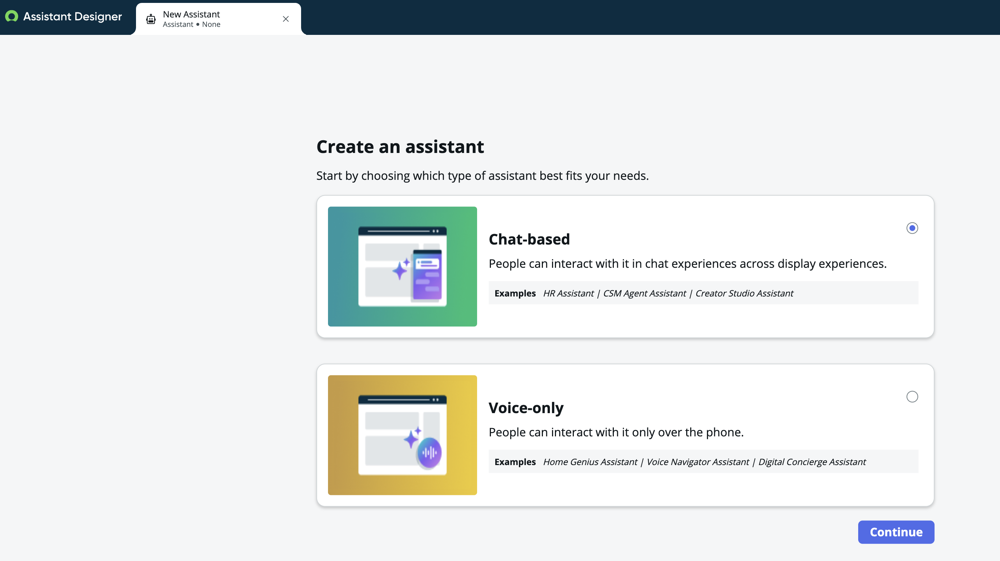
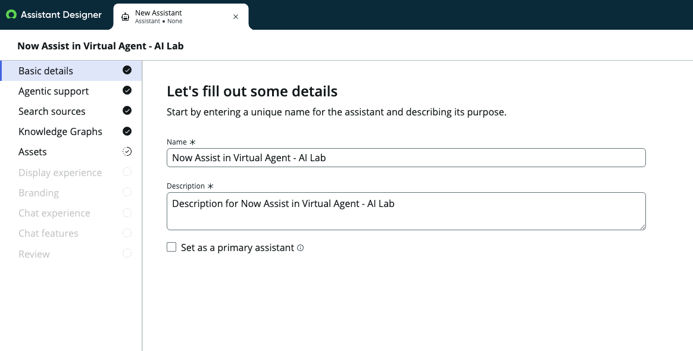
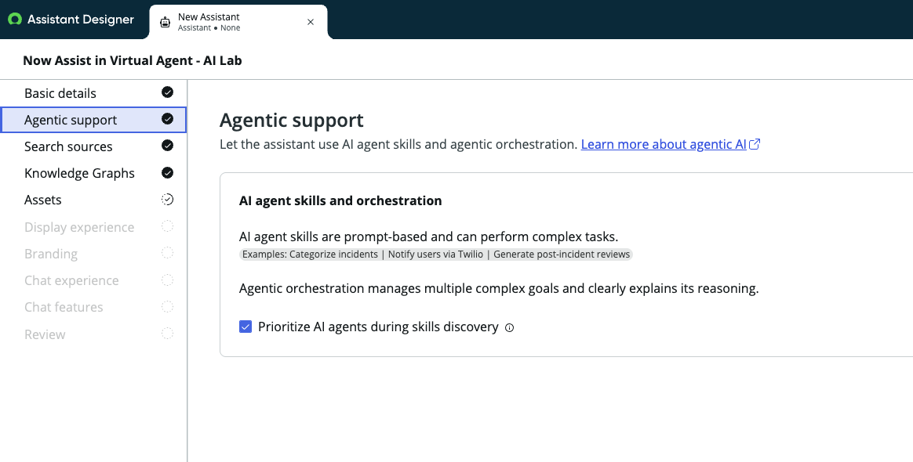
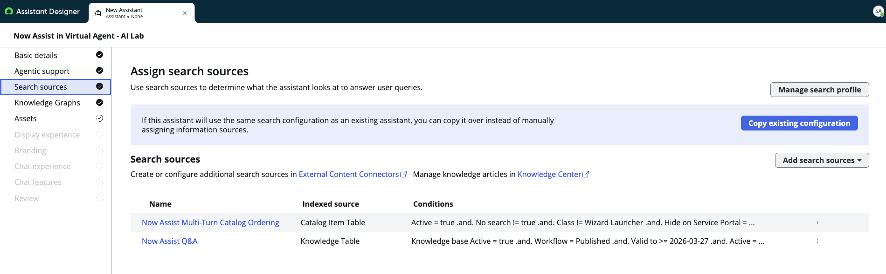
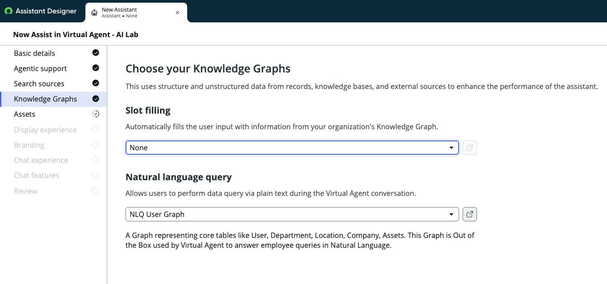
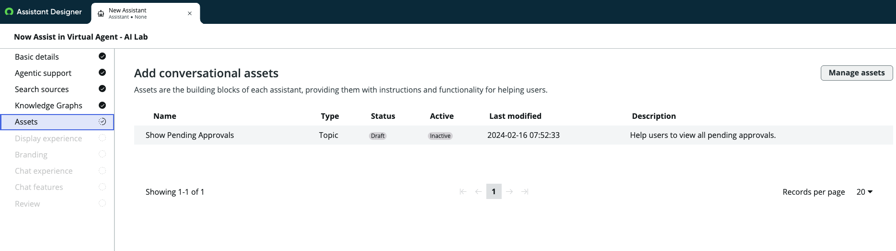
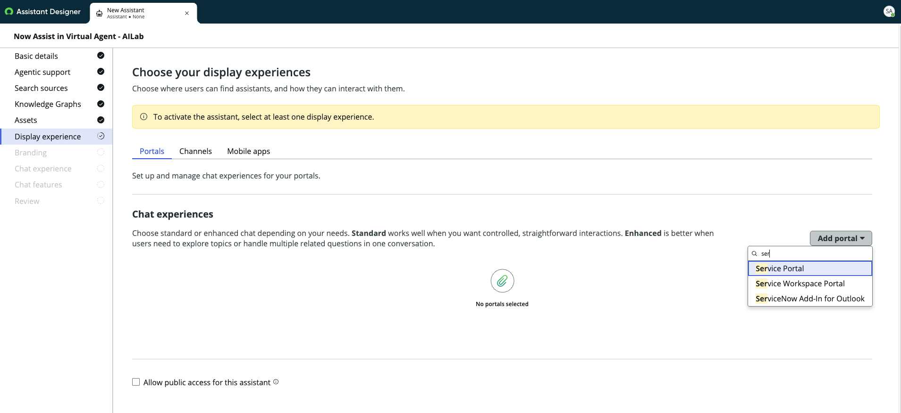
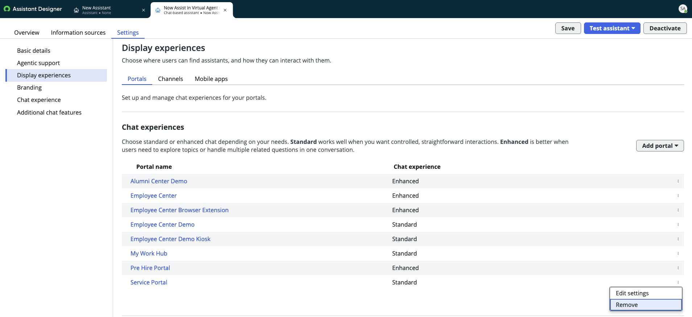
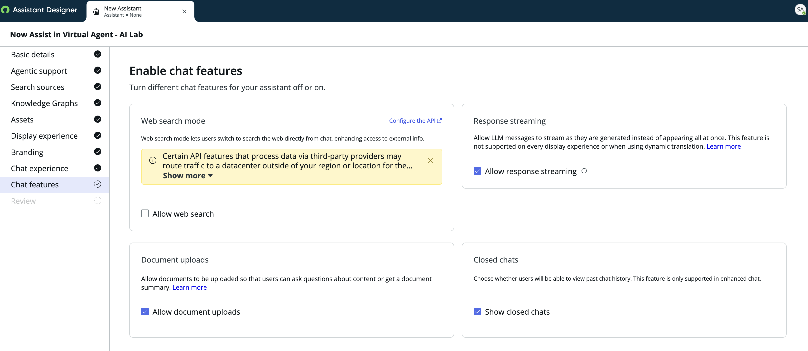

# 01 — Now Assist for Virtual Agent (NAVA)

> **Release:** Zurich | **Flow:** Requestor Flow — Phase 1 (Step 1)
> **Source:** [ServiceNow Zurich — Using Now Assist in Virtual Agent](https://www.servicenow.com/docs/bundle/zurich-conversational-interfaces/page/administer/now-assist-in-va/concept/using-now-assist-in-va.html) | [Configuring Now Assist in Virtual Agent](https://www.servicenow.com/docs/bundle/zurich-conversational-interfaces/page/administer/now-assist-in-va/task/configure-now-assist-va.html)

---

## What It Is

**Now Assist for Virtual Agent (NAVA)** is the AI-powered conversational interface that serves as the **entry point for the entire Requestor Flow**. It is the surface through which users interact with the platform — via Service Portal, Employee Center, or Mobile — using natural language rather than structured forms.

In Zurich, NAVA is no longer a scripted conversation tree. It is powered by large language models (LLMs) and the **AI Agent Fabric**, which means conversations are handled dynamically by AI agents that reason, use tools, and take action. When a user types *"I can't access the server"*, NAVA receives the message, stamps `contact_type = chat` on the session, and routes the conversation to the appropriate AI agent.

### NAVA vs. Virtual Agent — Key Distinction

| Component | Role |
|-----------|------|
| **Virtual Agent** | The underlying conversational platform — topics, flows, channel routing, NLU model |
| **Now Assist for Virtual Agent (NAVA)** | The generative AI layer — LLM-powered responses, AI agent handoffs, Knowledge Graph slot-filling, agentic reasoning |

NAVA is built on top of Virtual Agent. Both must be active for this lab to function.

---

## Role in the Requestor Flow

```
[Step 1 — Requestor Flow]

User types message in Service Portal / Employee Center / Mobile
        │
        ▼
Now Assist for Virtual Agent (NAVA)
        │  stamps contact_type = chat on the session
        ▼
NLU + AI Agent Planner evaluate the message
        │
        ▼
L1 / Requestor AI Agent is triggered
        │
        ▼
... Phase 1 continues (KB deflection → troubleshooting guide → incident creation)
```

> **Why `contact_type = chat` matters:** This field is the trigger condition for the downstream Agentic Workflow. If `contact_type` is not stamped as `chat`, the First Responder Operations Analyst Agent will not fire — even if all other conditions are met.

---

## What NAVA Enables in This Lab

| Capability | How NAVA Enables It |
|-----------|---------------------|
| Conversational intake | User describes the issue in natural language — no form filling |
| Session stamping | `contact_type = chat` is automatically applied to the session and propagates to the Incident record |
| AI Agent routing | NAVA's AI Agent Planner identifies the right agent (First Responder Operations Analyst Agent) and hands off the conversation |
| Agentic support | In Zurich Patch 2+, AI Agents are prioritised in VA responses by default via the **Agentic Support** setting |

---

## Architecture — How NAVA Is Configured

In Zurich, NAVA is configured through the **Assistant Designer**, a unified configuration surface. The wizard steps through the following sections in order:

```
Assistant Designer — Setup Wizard Order
  1. Settings: Basic details
  2. Settings: Agentic support
  3. Settings: Display experience
  4. Settings: Branding
  5. Settings: Chat experience
  6. Settings: Additional Chat features
  7. Information Sources: Search sources
  8. Information Sources: Knowledge Graphs
  9. Information Sources: Assets
  10. Review
```

---

## Lab Exercise — Steps to Configure NAVA

### Step 1: Open the Assistant Designer

Navigate to **Conversational Interfaces** → **Assistant Designer**



> The Assistant Designer shows the **Assistants** tab. The default assistant is **Now Assist for Virtual Agent**. Click **Edit** to open the setup wizard.

---

### Step 2: Basic Details

The first section in the wizard is **Basic details**.



Review and confirm:

| Field | Value for This Lab |
|-------|--------------------|
| Name | `Now Assist in Virtual Agent - AI Lab` |
| Description | Description for Now Assist in Virtual Agent - AI Lab |
| Status | Active |
| Default language | English |

---

### Step 3: Agentic Support

The second section is **Agentic Support**. This is a Zurich Patch 2+ setting.



| Setting | Value |
|---------|-------|
| Enable Agentic Support | On |
| AI Agents prioritised in planner | Enabled (system property: `sn_aia.use_agents_in_planner = true`) |

> This ensures the AI Agent Planner evaluates registered agents **before** falling back to scripted topics. The First Responder Operations Analyst Agent will be evaluated first for every IT infrastructure message. More information on how this works is available here: https://www.servicenow.com/community/now-assist-articles/virtual-agent-with-agentic-reasoning-in-the-october-release-and/ta-p/3406077

---

### Step 4: Search Sources

The third section is **Search Sources**.



No configuration needed on this page - Click "Save and Continue"
---

### Step 5: Knowledge Graphs

The fourth section is **Knowledge Graphs**.



No configuration needed on this page - Click "Save and Continue"

> To note: The First Responder Operations Analyst Agent uses the Knowledge Graph as **Tool** to query user context and identify who they are currently speaking with. The important distinction to note here is that we are not configuring the Knowledge Graphs available within Virtual Agent, but instead adding Knowledge Graph as a tool within the AI agent build.

---

### Step 6: Assets

The fifth section is **Assets**.



No configuration needed on this page - Click "Save and Continue"

---

### Step 7: Display Experience

The sixth section is **Display Experience** — where NAVA is surfaced.



1. Add the **Service Portal** to the Chat experience for the new Assistant that you are creating. You have the option of deciding and configuring if you would like for it to be a Standard or Enhanced Chat experience. This will not affect the lab as much, but more of a conversational experience for users when interacting with the Virtual Agent.



> **Display experiences** determine which portal or workspace the assistant is embedded in. For this lab: **Service Portal** (`/sp`) chat widget.

---

### Step 8: Chat Experience & Chat Features

The eighth through tenth sections are **Branding**, **Chat experience**, and **Chat features**.

For this lab, **Branding** can be left at defaults, or you can choose a specific Branding theme that you like. The critical setting is in **Chat features**:



| Setting | Value |
|---------|-------|
| Web search mode | NOT Checked |
| Response Streaming | ✅ Checked |
| Document uploads | ✅ Checked |
| Closed chats | ✅ Checked |

> **File upload in chat** must be enabled here. Without it, the file upload prompt in the Conversation Topic (Capability 02) will not function, and the user cannot submit error screenshots to trigger Document Intelligence Task.

---

### Step 9: Review and Save

The final section is **Review**. Confirm all settings look correct across each section, then click **Save**. Once all saved, check and make sure that the Assistant is in **Activated** mode.

---

### Step 10: Verify the Chat Widget in Service Portal

1. Navigate to your instance's **Service Portal** (`/sp`)
2. Click the chat icon (bottom-right corner)
3. Verify the Virtual Agent widget loads and NAVA responds
4. Check and confirm that the Chat Widget populated in Service Portal is the Assistant that you had just configured in Virtual Agent Designer.

---

## Key Configuration Fields

| Field | Value for This Lab |
|-------|--------------------|
| Assistant Name | Now Assist in Virtual Agent - AI Lab |
| Display experience | Service Portal (`/sp`) |
| Agentic support | Enabled |
| Chat Features Enabled | Response Streaming, Document Uploads, Closed Chats |

---

## Technical Notes

### `contact_type = chat` — How It Gets Stamped

When a user interacts with NAVA via the Service Portal chat widget, ServiceNow automatically stamps `contact_type = chat` on the virtual agent session. When the L1 Agent subsequently creates an Incident, this value is carried forward to the `channel` field on the Incident record.

This is a **platform behaviour** — no manual configuration needed. However it is critical to verify post-incident creation, as it is one of three conditions that gate the Resolution Pathfinder Agentic Workflow:

```
Agentic Workflow trigger conditions:
  ✓ state = In Progress (2)
  ✓ channel = chat
  ✓ u_extracted_error_code ≠ empty
```

If `channel` is not `chat` (e.g., incident created via email or form), the Agentic Workflow will not trigger.

### Agentic Reasoning — Zurich Patch 2+ Behaviour Change

From Zurich Patch 2, the following default behaviours change:

- AI Agents are **prioritised** over scripted topics in every response
- Multi-intent is supported and appears in responses
- Disambiguation follow-up questions are only asked for very unclear/one-word queries

> Source: [Virtual Agent with agentic reasoning — ServiceNow Community](https://www.servicenow.com/community/now-assist-articles/fully-agentic-virtual-agent-in-the-october-release-and-what-it/ta-p/3406077)

---

## Reference

- [ServiceNow Zurich — Using Now Assist in Virtual Agent](https://www.servicenow.com/docs/bundle/zurich-conversational-interfaces/page/administer/now-assist-in-va/concept/using-now-assist-in-va.html)
- [ServiceNow Zurich — Configuring Now Assist in Virtual Agent](https://www.servicenow.com/docs/bundle/zurich-conversational-interfaces/page/administer/now-assist-in-va/task/configure-now-assist-va.html)
- [Now Assist in Virtual Agent — Resources Guide](https://www.servicenow.com/community/now-assist-articles/now-assist-in-virtual-agent-resources-guide/ta-p/3052139)
- [Virtual Agent with agentic reasoning in Zurich](https://www.servicenow.com/community/now-assist-articles/fully-agentic-virtual-agent-in-the-october-release-and-what-it/ta-p/3406077)

---

## Next Step

Continue to [02 — Conversational Topics](02-conversational-topics.md) to configure the NLU intent and Conversation Topic that routes server issue reports to the L1 Requestor Agent, and to set up the **file upload tool** used in Step 4 of the Requestor Flow.
