# 02 — First Responder Operations Analyst Agent

> **Release:** Zurich | **Flow:** Requestor Flow — Phase 1 (Building of the First Responder Operations Analyst Agent)

---

## What It Is

The **First Responder Operations Analyst Agent** is an AI Agent built in AI Agent Studio. It is the first automated intelligence that engages after NAVA routes a user message — handling the conversation from initial user identification through to Incident creation.

This section covers building the **AI Agent** only.

---

## Role in the Requestor Flow

```
NAVA receives user message (contact_type = chat stamped)
        │
        ▼
Tool 1 — Knowledge Graph (User Graph)
        Silently identifies who the user is and related information about the user
        No questions asked to the user
        │
        ▼
Tool 2 — File Upload (Troubleshooting Resolution Guide)
        L1/L2/L3 severity-tiered troubleshooting guide provided to the AI Agent to accurately categorise, diagnose and recommend suitable troubleshooting and resolution steps
        User works through diagnostic steps
        │
        ▼
   Issue resolved?
   YES → Deflect. Conversation ends. No Incident created.
   NO  → Continue
        │
        ▼
Tool 3 — Conversation Topic (Upload image Topic)
        OOTB topic prompts user to upload error screenshot + device image
        In-chat file picker rendered via Virtual Agent
        │
        ▼
Tool 4 — Subflow (Create and submit Incident record with image upload(s))
        Gets triggered after images are uploaded
        Creates Incident record with all mandatory inputs
        Images attached at creation time
        │
        ▼
Now Assist in Document Intelligence (NADI) auto-triggers on attachments → extracts information such as error code, model details, product bar code, product name, serial number
```

> **Tool 4 fires only after Tool 3 completes.** The Incident creation subflow is sequenced after image upload so the record is created with images already attached — making it immediately NADI-ready. The Create and submit Incident record with image upload(s) subflow will still work as intended even if user decides to not upload any images for the issue. In our lab narrative, we require for images to be uploaded as we use the extract fields for our Agentic Workflow. 

---

## What the Agent Enables

| Capability | Tool | How |
|-----------|------|-----|
| Silent user contextualisation | Tool 1 — Knowledge Graph | Queries User Graph to get attributes related to the user |
| Guided troubleshooting | Tool 2 — File Upload | L1/L2/L3 severity-tiered guide from attached PDF; framework to guide the AI Agent's thinking and reasoning process |
| Deflection | — | Issue resolved in chat → conversation ends, no Incident created |
| In-chat image upload | Tool 3 — Conversation Topic | OOTB topic renders native in-chat image upload picker |
| Enriched Incident creation | Tool 4 — Subflow | Creates and submits Incident after images captured; `state changes from New to In Progress`; images attached; NADI-ready |

---

## Prerequisites

| Requirement | Detail |
|-------------|--------|
| New Virtual Agent assistant created | Complete steps |

---

## Lab Exercise — Steps to Build

### Wizard Step 1 — Define the Specialty

Navigate to **All → AI Agent Studio → Create and manage → AI Agents → New**.

The wizard opens on **Define the specialty**.

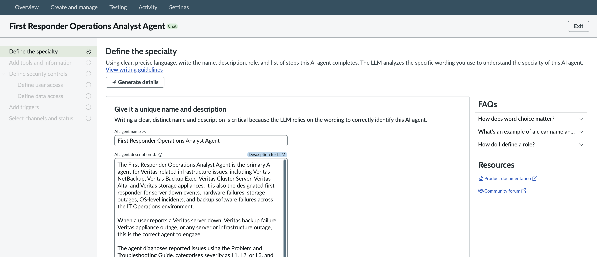

The page instructs: *"Using clear, precise language, write the name, description, role, and list of steps this AI agent completes. Writing a clear, distinct name and description is critical because the LLM relies on the wording to correctly identify and use this agent."*

Configure the following fields:

| Field | Value |
|-------|-------|
| AI agent name | `First Responder Operations Analyst Agent` |
| AI agent description *(Description for LLM)* | See full text below |

**AI agent description**
Expectation: SC to build the prompt for the description

**AI agent role**
Expectation: SC to build the prompt for the description

**List of Steps**
Expectation: SC to build the prompt for the description

### Wizard Step 2 — Add Tools and Information

The wizard advances to **Add tools and information**.

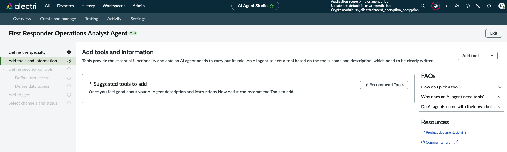

The page reads: *"Tools provide the essential functionality and data an AI agent needs to carry out its role. An AI agent selects a tool based on the tool's name and description, which need to be clearly written."*

Four tools must be added to this AI Agent. Use the **Add tool ▼** dropdown to select the tool type for each.

> You can click **+ Recommend Tools** to get AI-suggested tools based on your agent description, or add each manually.

---

#### Tool 1 — Knowledge Graph

From **Add tool ▼** select **Knowledge graph**.

The **Add a Knowledge graph** dialog opens:

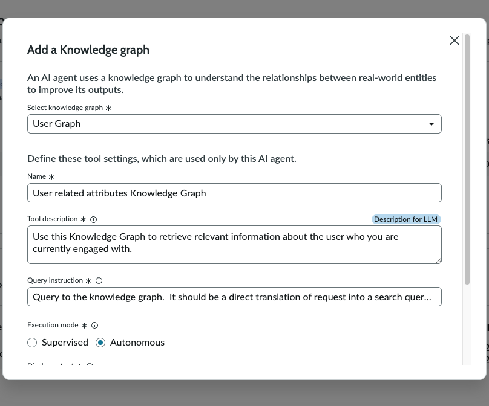

The dialog header explains: *"An AI agent uses a knowledge graph to understand the relationships between real-world entities to improve its outputs."*

Configure the following fields:

| Field | Value |
|-------|-------|
| Select knowledge graph | `User Graph` |
| Name | `User related attributes Knowledge Graph` |
| Tool description *(Description for LLM)* | `Use this Knowledge Graph to retrieve relevant information about the user who you are currently engaged with.` |
| Query instruction | `Query to the knowledge graph. It should be a direct translation of request into a search query.` |
| Execution mode | **Autonomous** |
| Display Output | **No** |

> **Why this tool:** Fires silently at the start of every conversation. The User Graph gives the agent the caller's related user attributes — so it can personalise the response and pre-populate Incident fields without asking the user a single identity question.
>
> **Execution mode Autonomous** means the agent calls this tool without requesting user permission first — the user never sees it happen.

Click **Add**.

---

#### Tool 2 — File Upload (Troubleshooting Resolution Guide)

From **Add tool ▼** select **File upload**.

The **Add file upload** dialog opens:

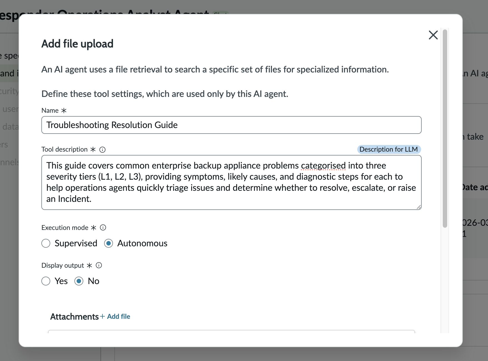

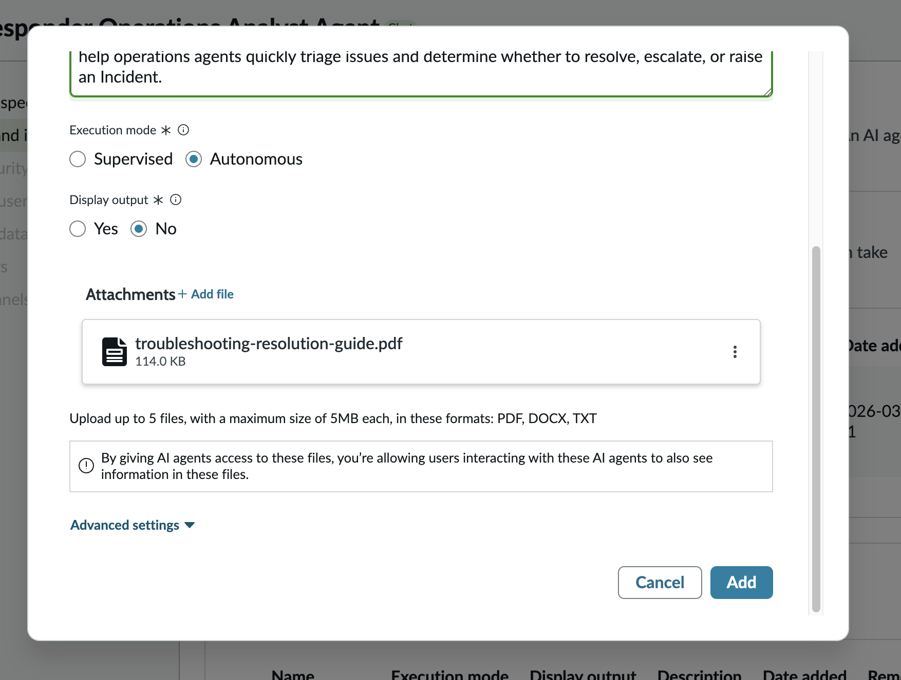

The dialog header explains: *"An AI agent uses a file retrieval to search a specific set of files for specialized information."*

Configure the following fields:

| Field | Value |
|-------|-------|
| Name | `Troubleshooting Resolution Guide` |
| Tool description *(Description for LLM)* | `This guide covers common enterprise backup appliance problems categorised into three severity tiers (L1, L2, L3), providing symptoms, likely causes, and diagnostic steps for each to help operations agents quickly triage issues and determine whether to resolve, escalate, or raise an Incident.` |
| Execution mode | **Autonomous** |
| Display output | **No** |
| Attachments | `troubleshooting-resolution-guide.pdf` — 114.0 KB |

> **Why this tool:** This is the deflection gate. The agent retrieves and presents the relevant L1/L2/L3 severity-tiered diagnostic steps from the attached PDF, with the PDF guide serving as a guidepost to steer and define the boundaries to which the AI Agent can interact within. If the user confirms the steps proposed by the AI Agent resolved their issue, the conversation ends — no Incident is created. Only unresolved issues continue to image collection.
>
> The PDF must be uploaded as an attachment here — the agent cannot reference external URLs. Supported formats: PDF, DOCX, TXT (up to 5 files, 5 MB each).
>
> **Display output: No** — the agent presents content from the guide conversationally; it does not dump the raw file output into the chat.

Click **Add**.

---

#### Tool 3 — Conversational Topic (Image Upload)

From **Add tool ▼** select **Conversational topic**.

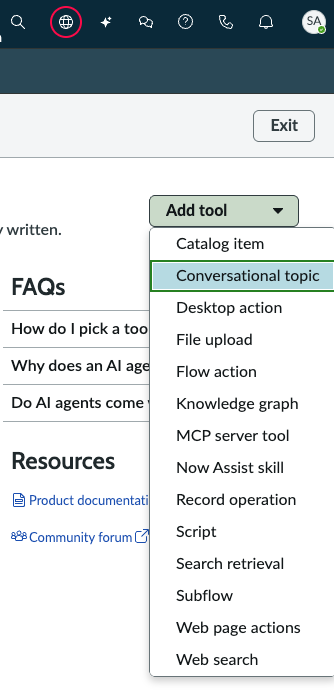

The **Add a conversational topic** dialog opens:

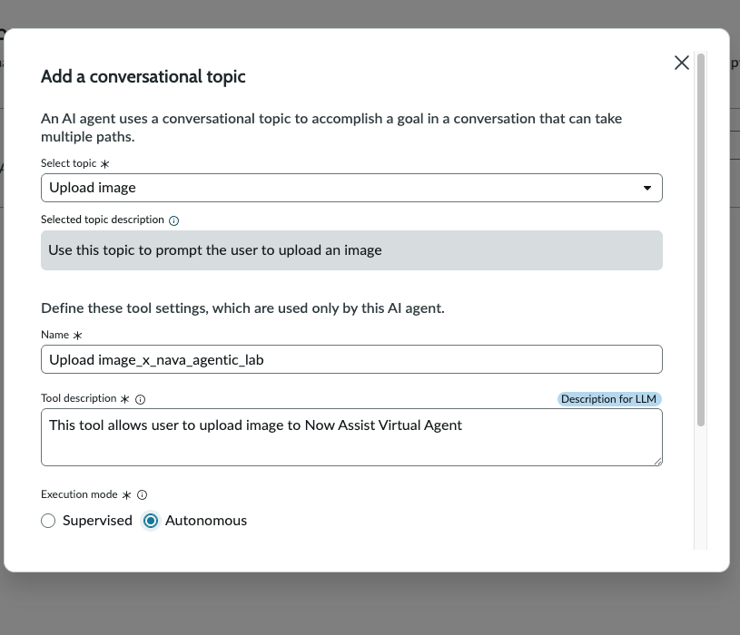

The dialog header explains: *"An AI agent uses a conversational topic to accomplish a goal in a conversation that can take multiple paths."*

Configure the following fields:

| Field | Value |
|-------|-------|
| Select topic | `Upload image x_nava_agentic_lab` |
| Selected topic description *(read-only, auto-populated)* | `Use this topic to prompt the user to upload an image` |
| Name | `Upload image x_nava_agentic_lab` |
| Tool description *(Description for LLM)* | `This tool allows user to upload image to Now Assist Virtual Agent` |
| Execution mode | **Autonomous** |

> **Why this tool:** This Virtual Agent conversation topic renders the native in-chat file picker. The agent invokes it only after the user confirms the Troubleshooting Guide did not resolve their issue. The images uploaded here are what NADI processes in the next capability to extract the error code.
>
> The topic `Upload image x_nava_agentic_lab` is scoped to the `x_nava_agentic_lab` application scope — ensure this scope is active and the Virtual Agent topic is published before testing. For this to work, ensure that you have duplicated the OOTB Topic 'Upload Image' within Virtual Agent Designer (due to cross-application scope reasons, you have to duplicate the OOTB topic and use it).

Click **Add**.

---

#### Tool 4 — Subflow (Incident Creation)

From **Add tool ▼** select **Subflow**.

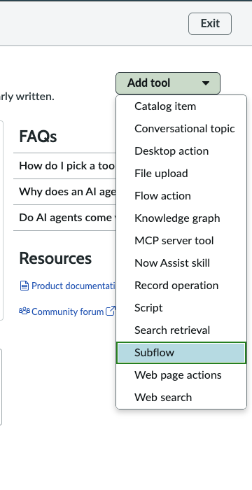

The **Add a subflow** dialog opens:

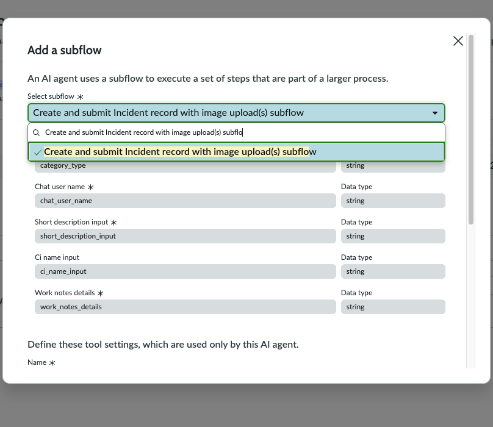

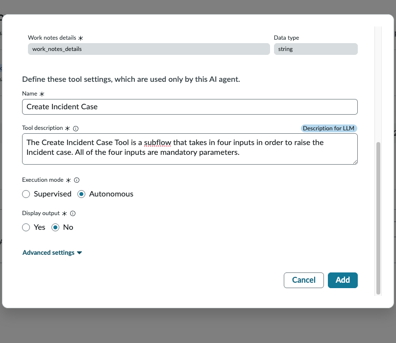

The dialog header explains: *"An AI agent uses a subflow to execute a set of steps that are part of a larger process."*

**Select the subflow and review its mandatory inputs:**

| Input field | Internal name | Data type | Source |
|------------|--------------|-----------|--------|
| Select subflow | — | — | `Create and submit Incident record with image upload(s) subflow` |
| Category type | `category_type` | string | Derived from the conversation context |
| Chat user name | `chat_user_name` | string | Retrieved by Tool 1 (Knowledge Graph) |
| Short description input | `short_description_input` | string | User-reported issue description |
| CI name input | `ci_name_input` | string | Retrieved by Tool 1 (Knowledge Graph) |
| Work notes details | `work_notes_details` | string | Diagnostic notes from the troubleshooting session |

**Tool settings:**

| Field | Value |
|-------|-------|
| Name | `Create Incident Case` |
| Tool description *(Description for LLM)* | `The Create Incident Case Tool is a subflow that takes in four inputs in order to raise the Incident case. All of the four inputs are mandatory parameters.` |
| Execution mode | **Autonomous** |
| Display output | **No** |

> **Why this tool:** Creates and submits the Incident record — but only after Tool 3 (image upload) has completed. The sequencing is deliberate: the Incident is created with images already attached so NADI triggers immediately on the attachments and can extract `u_extracted_error_code`.
>
> All inputs are mandatory. `chat_user_name` and `ci_name_input` come from Tool 1; `short_description_input` comes from the user's message; `category_type` and `work_notes_details` come from the troubleshooting session. The subflow will not fire until all inputs are populated.
>
> **Display output: No** — the agent confirms Incident creation to the user via its own conversational response, not by surfacing the raw subflow output.

Click **Add**.

---

### Wizard Step 3 — Define User Access

The wizard advances to **Define security controls → Define user access**.

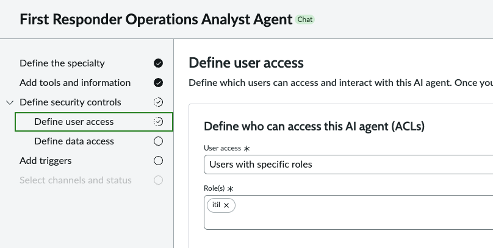

The section heading reads: *"Define who can access this AI agent (ACLs)"*

| Field | Value |
|-------|-------|
| User access | `Users with specific roles` |
| Role(s) | `itil` |

> Restricts agent access to users with the `itil` role — authenticated IT service desk users. General platform users without this role cannot invoke the agent via NAVA.

Click **Save and continue**.

---

### Wizard Step 4 — Define Data Access

The wizard advances to **Define data access**.

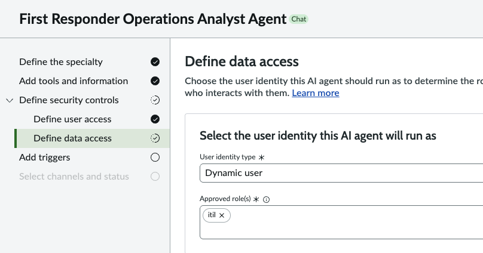

The section heading reads: *"Select the user identity this AI agent will run as"*

| Field | Value |
|-------|-------|
| User identity type | `Dynamic user` |
| Approved role(s) | `itil` |

> **Dynamic user** means the agent runs as the logged-in user's identity — it inherits their ACLs for every read and write operation. The `itil` approved role sets the ceiling: the agent cannot exceed the permissions of the `itil` role regardless of who is logged in. This prevents privilege escalation.

Click **Save and continue**.

---

### Wizard Step 5 — Select Channels and Status

The wizard advances to **Select channels and status**.

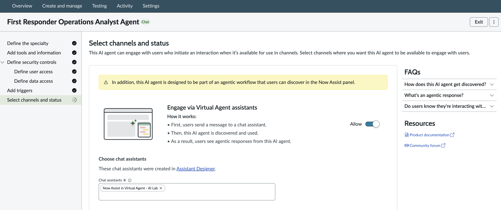

| Setting | Value |
|---------|-------|
| Engage via the Now Assist panel | **Allow: OFF** |
| Engage via Virtual Agent assistants | **Allow: ON** |
| Chat assistants | `Now Assist in Virtual Agent AlLab` |

> The Requestor Flow is triggered through NAVA (Virtual Agent), not the Now Assist Panel — so the Virtual Agent channel is the correct one here. The Now Assist panel toggle stays **OFF** deliberately.
>
> Under **Choose chat assistants**, select `Now Assist in Virtual Agent AlLab` — the Virtual Agent assistant created in Capability 01. The agent is only discoverable in NAVA sessions tied to this assistant.
>
> The yellow informational banner — *"this AI agent is designed to be part of an agentic workflow that users can discover in the Now Assist panel"* — does not require action for this lab.

Click **Save and continue** to complete the agent configuration.

---

### Wizard Step 6 — Test the Agent

Steps for testing **Impersonate as the user Alex Rai → Navigate to Service Portal → Chat Widget**.

1. Enter: *"I can't reach the backup server"*
2. **Tool 1 check** — agent responds with caller context (username, full name, department, roles) without asking for it
3. **Tool 2 check** — agent presents L1/L2/L3 diagnostic steps from the guide based on the user's questions
4. Reply *"resolved"* → conversation ends, no Incident created (**deflection path confirmed**)
5. Re-run. Reply *"not resolved"* → **Tool 3 check** — in-chat image upload prompt appears
6. Upload a test image → **Tool 4 check** — Incident created with `state = New`, `contact_type = chat`, all inputs populated, image attached
7. Open the Incident case (from the Incident Extend table) — confirm NADI triggered and `u_extracted_error_code` is populated

---

## Key Configuration Summary

| Field | Value |
|-------|-------|
| Agent name | `First Responder Operations Analyst Agent` |
| Type | Chat |
| Tool 1 | Knowledge Graph — `User related attributes Knowledge Graph` — User Graph |
| Tool 2 | File Upload — `Troubleshooting Resolution Guide` — `troubleshooting-resolution-guide.pdf` |
| Tool 3 | Conversational Topic — `Upload image x_nava_agentic_lab` |
| Tool 4 | Subflow — `Create Incident Case` — `Create and submit Incident record with image upload(s) subflow` |
| User access | `Users with specific roles` → `itil` |
| Data access | `Dynamic user` → approved role: `itil` |
| Channel | Virtual Agent — `Now Assist in Virtual Agent AlLab` |
| Now Assist panel | OFF |

---

## Technical Notes

### Tool Execution Order

The agent's instructions govern when each tool fires:

1. **Tool 1 (Knowledge Graph)** — conversation start; silently builds user context
2. **Tool 2 (File Upload)** — presents troubleshooting guide; deflection gate
3. **Tool 3 (Conversational Topic)** — fires only if user confirms issue unresolved; triggers image upload
4. **Tool 4 (Subflow)** — fires only after Tool 3 completes; creates Incident with images already attached

All subflow inputs are mandatory — the agent accumulates them across the conversation before invoking Tool 4.

```

---

## Reference

- [ServiceNow Zurich — AI Agent Studio](https://www.servicenow.com/docs/bundle/zurich-intelligent-experiences/page/administer/now-assist-ai-agents/concept/ai-agent-studio.html)
- [ServiceNow Zurich — Create an AI agent](https://www.servicenow.com/docs/r/zurich/intelligent-experiences/configure-next-best-action-agent.html)
- [ServiceNow Zurich — Add tools and information](https://www.servicenow.com/docs/r/zurich/intelligent-experiences/add-tool-aia.html)
- [AI Agents FAQ and Troubleshooting](https://www.servicenow.com/community/now-assist-articles/ai-agents-faq-and-troubleshooting/ta-p/3200454)

---

## Next Steps

→ [03 — Now Assist Document Intelligence](03-now-assist-document-intelligence.md) — configure NADI, which auto-triggers on Incident attachments created by Tool 4 and populates important fields such as `u_extracted_error_code`
