# 02 — Now Assist in Document Intelligence (NADI)

> **Release:** Zurich | **Flow:** Requestor Flow — Phase 1 (Steps 5 & 6)
> **Source:** [ServiceNow Zurich — Now Assist in Document Intelligence](https://www.servicenow.com/docs/bundle/zurich-intelligent-experiences/page/administer/document-intelligence/concept/docintel-nowassist-landing.html) | [Use cases for Now Assist in Document Intelligence](https://www.servicenow.com/docs/r/intelligent-experiences/now-assist-in-document-intelligence/use-cases-now-assist-document-intelligence.html)

---

## What It Is

**Now Assist in Document Intelligence (NADI)** uses generative AI to extract structured data from images and documents and map it directly into ServiceNow table fields — with no manual data entry required.

In Zurich, the legacy Document Intelligence (DocIntel) application is **no longer activated on new instances** and is being prepared for future deprecation. **Now Assist in Document Intelligence is the current, supported product** for all new implementations.

In this lab, NADI is configured with a use case called **Veritas Extract**. When a user uploads an error screenshot or device label image (via the Conversation Topic upload in Step 4 of the Requestor Flow), NADI auto-triggers on the Incident attachment and extracts structured fields — specifically `u_extracted_error_code` — which arms the downstream Agentic Workflow trigger.

---

## Role in the Requestor Flow

```
[Steps 5 & 6 — Requestor Flow]

Step 5: Incident created (state = In Progress)
        │  uploaded images attached to the record
        ▼
Step 6: Now Assist in Document Intelligence auto-triggers
        │  on each image attachment present on the Incident
        ▼
  Use Case: Veritas Extract
  Target table: Incident Extend (x_snc_apacaienable_incident_extend)
        │
        ▼
  GenAI reads image, extracts:
    • u_extracted_error_code  ← KEY FIELD — gates the Agentic Workflow
    • Additional fields (model, product name, serial number, barcode) as configured
        │
        ▼
  Document task status → Done
        │
        ▼
  Auto-generated Flow fires:
    "DocIntel Extract Values Flow — Veritas Extract"
    Writes extracted values to Incident Extend (x_snc_apacaienable_incident_extend) record fields
        │
        ▼
Down the line Agentic Workflow can now evaluate trigger conditions:
  ✓ state = In Progress
  ✓ channel = chat
  ✓ u_extracted_error_code ≠ empty   ← populated by NADI
```

> **Why this matters:** `u_extracted_error_code` is a custom field on the extended Incident table. It is populated **exclusively** by NADI. If NADI is not configured or fails to extract, this field remains empty and the Resolution Pathfinder Agentic Workflow will not fire.

---

## What NADI Enables in This Lab

| Capability | How NADI Delivers It |
|-----------|---------------------|
| Auto-field population | Error code and device details extracted from uploaded image — no manual copy-paste |
| Agentic Workflow arming | `u_extracted_error_code` populated on the Incident, enabling the downstream trigger |
| Full automation mode | No agent review required — GenAI writes directly to record fields |
| Richer AI agent context | Extracted error code used by Resolution Pathfinder to search KB, logs, and web |
| Higher data quality | AI reads directly from source image — eliminates transcription errors |

---

## Lab Exercise — Steps to Configure NADI

### Step 1: Open Now Assist in Document Intelligence

Navigate to **All** → search **Now Assist Admin** → **Platform** → **Search for 'Document'** → **Edit 'Extract information from documents'**

In the Now Assist skills for Platform screen, locate the **Extract Information from documents** skill.

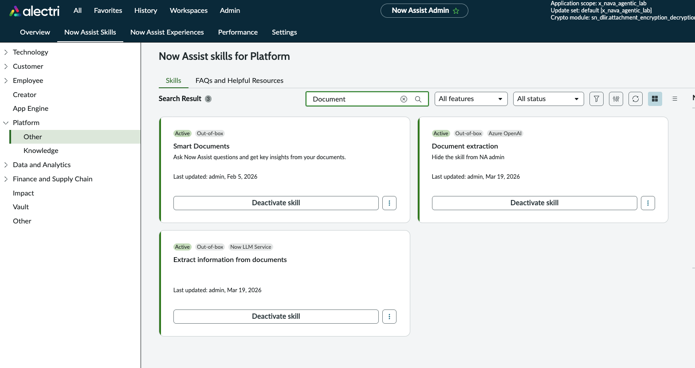

> This is the entry point for all NADI configuration. The skill is OOB — you do not create it. You create **use cases** within it.

---

### Step 2: Create the Use Case

1. Click **Edit** on the **Extract Information from documents** skill
2. Click **New use case**

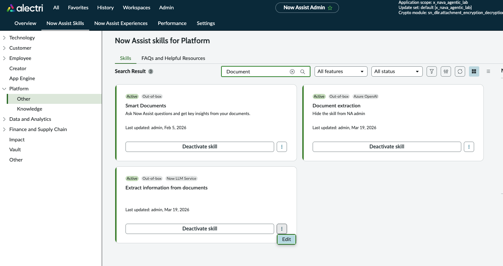

Fill in the use case details:

| Field | Value |
|-------|-------|
| Use case name | `Veritas Extract` |
| Target table | Extended Incident table (`x_nava_agentic_lab_incident_extend`) |
| LLM | `Azure OpenAI - GPT Large` (or your configured provider) |

3. Click **Next**

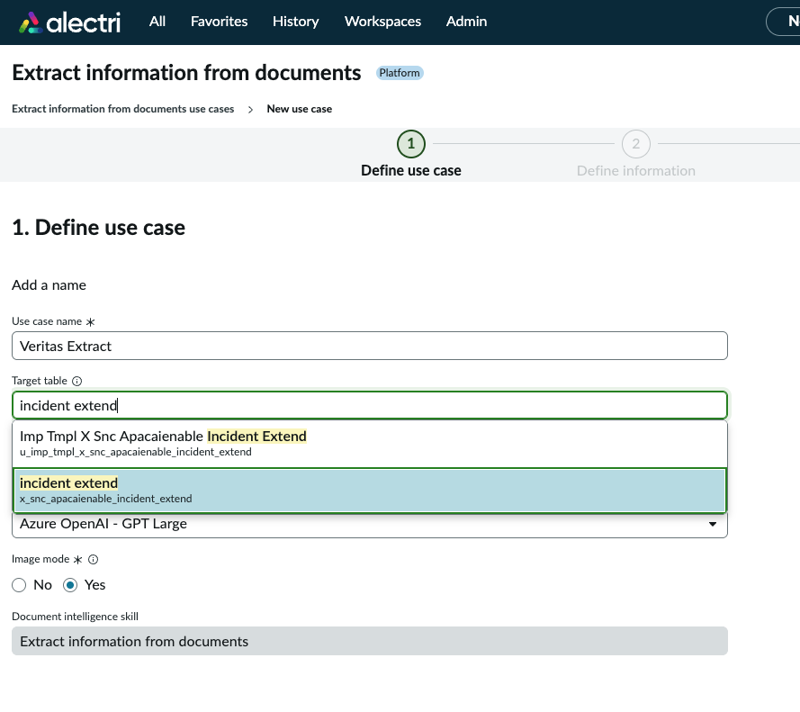

---

### Step 3: Add Extraction Fields

On the **Fields** step, click **Add a field** → select **Field** (not question or table).

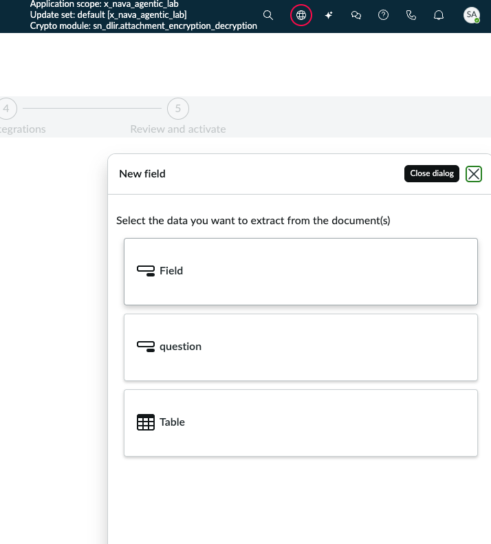

Configure the following fields:

#### Field 1 — Error Code

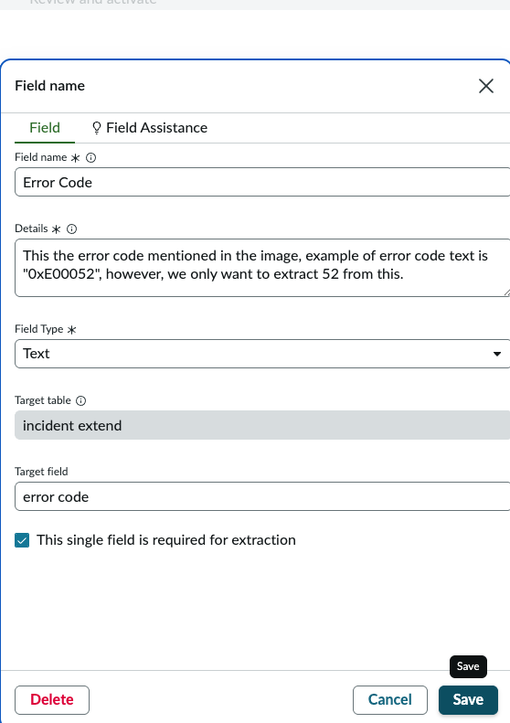

| Setting | Value |
|---------|-------|
| Field name | `Error Code` |
| Details | `This is the error code mentioned in the image, example of error code text is "0xE00052", however, we only want to extract 52 from this.` |
| Field type | `Text` |
| Target table | Extended Incident table |
| Target field | `u_extracted_error_code` |
| Required for extraction | ✅ Yes |

> **This is the critical field.** `u_extracted_error_code` is the gate for the downstream Agentic Workflow. It must be mapped to the correct target field on the extended Incident table.

#### Field 2 — Model Details

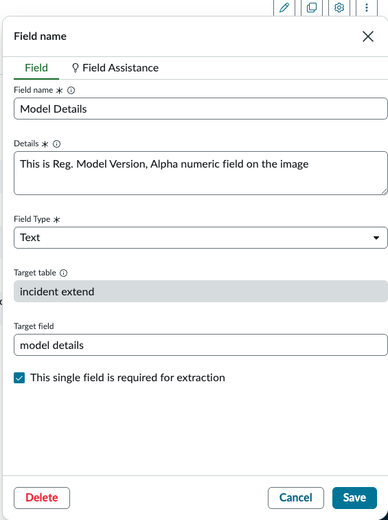

| Setting | Value |
|---------|-------|
| Field name | `Model Details` |
| Details | `This is Reg. Model Version, Alpha numeric field on the image` |
| Field type | `Text` |
| Target field | `model_details` |
| Required for extraction | Optional |

#### Field 3 — Product Name

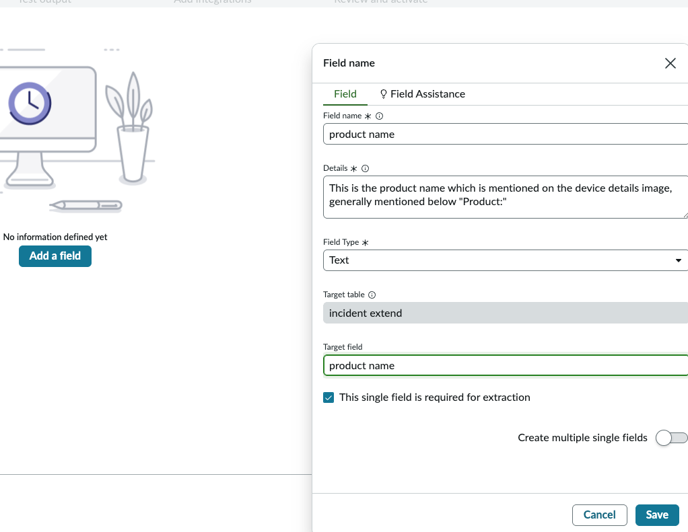

| Setting | Value |
|---------|-------|
| Field name | `product name` |
| Details | `This is the product name which is mentioned on the device details image, generally mentioned below "Product:"` |
| Field type | `Text` |
| Target field | `product` |
| Required for extraction | Optional |

#### Field 4 — Serial Number

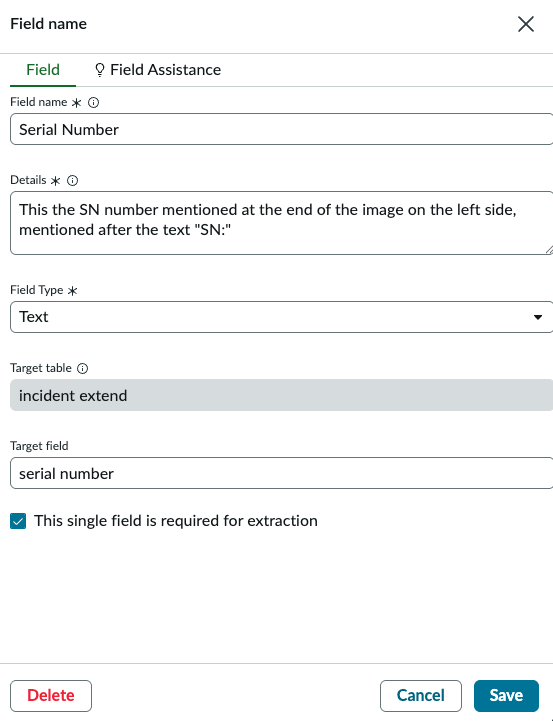

| Setting | Value |
|---------|-------|
| Field name | `Serial Number` |
| Details | `This is the SN number mentioned at the end of the image on th left side, mentioned after the text "SN:"` |
| Field type | `Text` |
| Target field | `serial_number` |
| Required for extraction | Optional |

#### Field 5 — PN / Bar Code

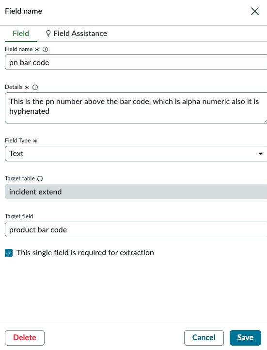

| Setting | Value |
|---------|-------|
| Field name | `PN / Bar Code` |
| Details | `This is the pn number above the bar code, which is alpha numeric also it is hyphenated` |
| Field type | `Text` |
| Target field | `pn_bar_code` |
| Required for extraction | Optional |

---

### Step 4: Test the Extraction

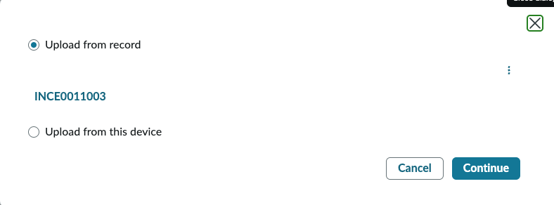

1. In the test dialog, choose:
   - **Upload from record** — select an existing Incident with an image attached, or
   - **Upload from this device** — upload a Veritas device label image directly
2. Click **Continue**

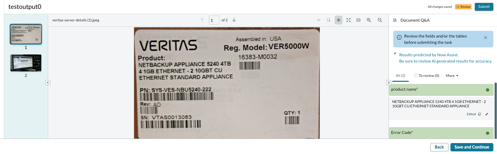

The Document Q&A panel displays the extracted values. Verify:
- `error_code` → numeric error value extracted from the image
- `product` → product name as printed on the label
- `serial_number` → serial number if present
- `pn_bar_code` → product bar code if present
- `model_details` → model details if present

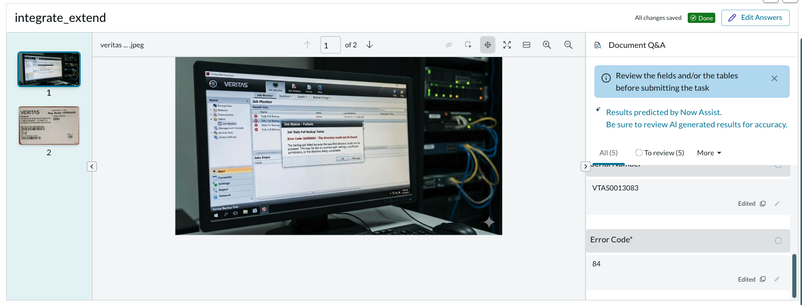

> If extraction does not complete and the status stays **In Progress**, the document may still be processing. Click **Refresh**. If it stays stuck, check the execution logs.

---

### Step 5: Add the Integration

The integration tells NADI what to do once extraction is complete — specifically, it creates the Flow that writes extracted values back to the Incident record.

1. In the use case, navigate to the **Integrations** step
2. Click **Add Integration**

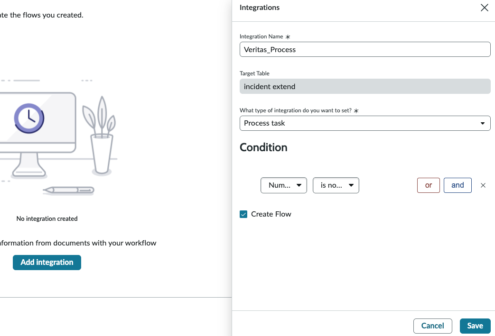

Fill in:

| Field | Value |
|-------|-------|
| Integration Name | `Veritas_Process` |
| Target Table | Extended Incident table |
| Integration type | `Process task` |
| Create Flow | ✅ Checked |

3. Click **Save**

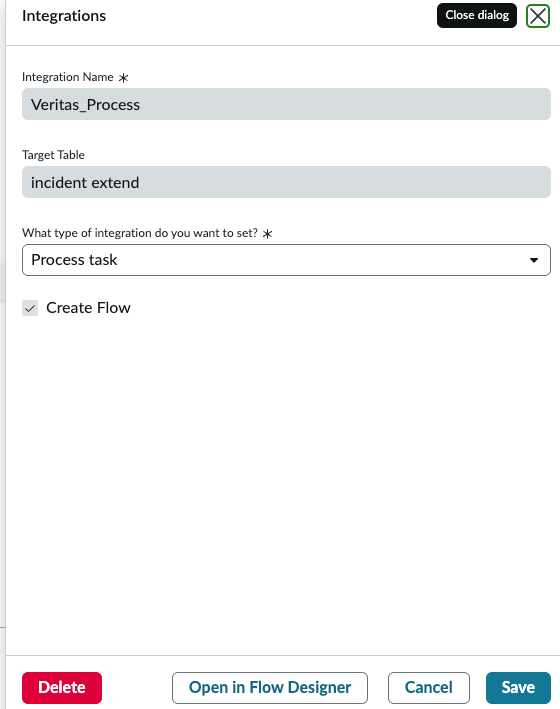

This auto-generates a Flow in Workflow Studio:

```
Flow name: DocIntel Extract Values Flow — Veritas Extract

Trigger: Document Task Updated
  WHERE status changes to Done
  AND source table = extended Incident table
  AND use case = Veritas Extract
```

---

### Step 6: Activate the Integration

1. In the **Integrations** panel, locate **Veritas_Process**

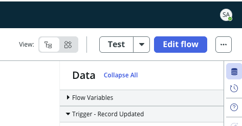

2. Click **Open in Flow Designer** (or navigate to the auto-generated flow in Workflow Studio)
3. The flow opens with status **Inactive**
4. Click **Activate** → status updates to **Active**

---

### Step 7: Configure the Incident Integration Trigger

This step wires NADI to auto-trigger when images are attached to an Incident created via NAVA chat.

1. Navigate to the **Integrations** tab of the use case
2. Add a second integration — or configure the trigger on the existing flow:

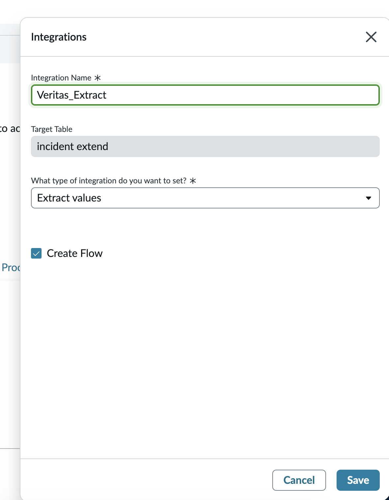

| Field | Value |
|-------|-------|
| Integration Name | `Veritas_Extract` |
| Target Table | incident extend |
| Integration type | `Extract Values` |
| Create Flow | ✅ Checked |

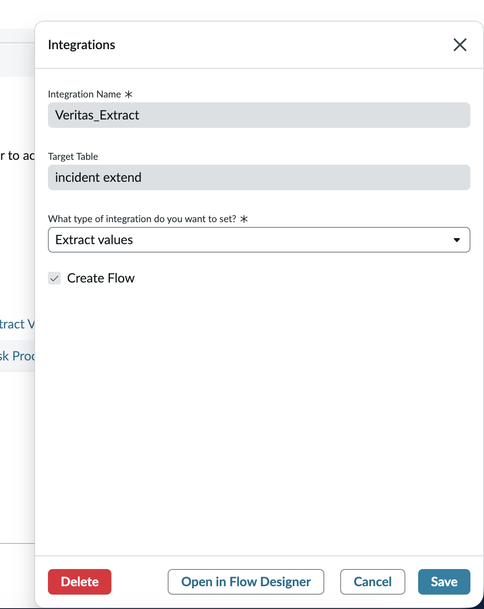

3. Verify the trigger activates correctly

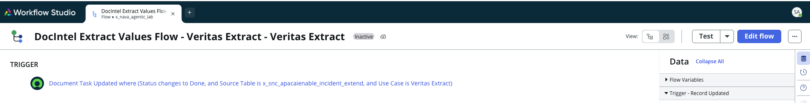

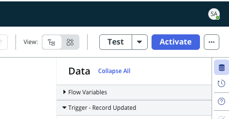

> **Note:** The integration trigger ensures NADI runs automatically whenever an image is attached to a chat-originated Incident — no manual intervention required by the L1 Agent or user.

---

### Step 8: Verify Full Automation End-to-End

1. Click the **Settings** (gear) icon on the use case
2. Navigate to **Extraction mode**
3. Toggle **Full automation mode (no agent review required)** → **On**

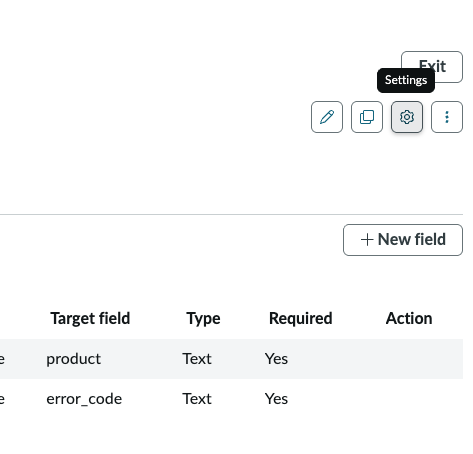

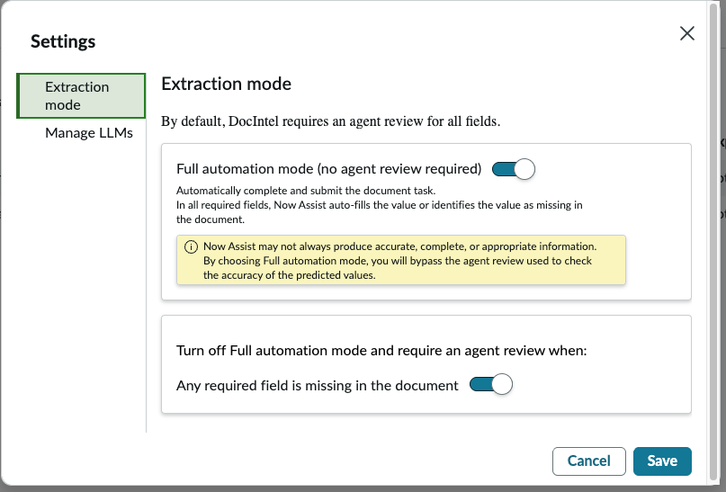

> Full automation mode means the GenAI extracts fields and writes them directly to the Incident record without waiting for an agent to review or approve. This is required for the Requestor Flow — the Incident must be enriched immediately after image upload so the Agentic Workflow trigger can fire.

---

## Key Configuration Fields

| Field | Value for This Lab |
|-------|--------------------|
| Skill | Extract Information from documents |
| Use case name | Veritas Extract |
| Target table | Extended Incident table |
| Extraction mode | Full automation (no agent review) |
| Integration name | Veritas_Process |
| Integration type | Process task |

---

## Technical Notes

### Why `u_extracted_error_code` is the Critical Field

This field is the **third and final condition** for the Resolution Pathfinder Agentic Workflow trigger:

```
Agentic Workflow trigger conditions:
  ✓ state = In Progress (2)       ← set when L1 Agent creates the Incident
  ✓ contact_type = chat           ← stamped by NAVA (Capability 01)
  ✓ u_extracted_error_code ≠ empty ← populated by NADI (this capability)
```

Without NADI running successfully, the workflow will never fire — regardless of how correctly the L1 Agent and NAVA are configured.

### Full Automation Mode vs. Agent Review Mode

| Mode | Behaviour | Use When |
|------|-----------|----------|
| **Full automation** | GenAI extracts and writes fields immediately, no review | Trusted document types with consistent layouts (device labels) |
| **Agent review** | GenAI extracts but a human reviews before values are written | Complex or variable documents where accuracy must be validated |

For this lab, **Full automation** is required — the Incident enrichment must happen immediately after image upload to enable the Agentic Workflow within the same session.

### Supported Document Types

Now Assist in Document Intelligence supports: PDF, PNG, JPEG, and other common image formats. For this lab, the primary input is a PNG/JPEG screenshot or device label photo uploaded by the user via the NAVA chat interface.

---

## Reference

- [ServiceNow Zurich — Now Assist in Document Intelligence](https://www.servicenow.com/docs/bundle/zurich-intelligent-experiences/page/administer/document-intelligence/concept/docintel-nowassist-landing.html)
- [Use cases for Now Assist in Document Intelligence](https://www.servicenow.com/docs/r/intelligent-experiences/now-assist-in-document-intelligence/use-cases-now-assist-document-intelligence.html)
- [Exploring Now Assist in Document Intelligence](https://www.servicenow.com/docs/bundle/zurich-intelligent-experiences/page/administer/document-intelligence/concept/docintel-exploring-now-assist.html)

---

## Next Step

Continue to [04a — Now Assist Skill Kit: CreateOptimalSearchQuery](04a-now-assist-skill-kit-createoptimalsearchqueryskill.md) to build the first of three Custom Now Assist Skills needed for second AI Agent (Resolution Pathfinder for Incident case Agent).
