# 03-part2 — Now Assist Skill Kit: ResolutionFinderUsingInternalData

> **Release:** Zurich | **Flow:** Fulfiller Flow — Phase 2, Path A (Steps 1–3)
> **Source:** [Now Assist Skill Kit — Tool and Deployment Options](https://www.servicenow.com/community/now-assist-articles/now-assist-skill-kit-tool-and-deployment-options/ta-p/3284803) | [NASK FAQ](https://www.servicenow.com/community/now-assist-articles/now-assist-skill-kit-nask-faq/ta-p/3007953)

---

## What It Is

`ResolutionFinderUsingInternalData` is the **orchestrating skill** for Path A of the Fulfiller Flow. It combines two tools running in parallel — a Predictive Intelligence model and the `CreateOptimalSearchQuery` skill built in the previous section — then feeds their merged outputs into a single LLM reasoning step that determines whether a viable resolution exists.

This skill covers **all three steps of Path A**:

```
Path A — Step 1 (parallel):
  ├── FindSimilarIncidents (Predictive Intelligence tool)
  │   ML-based similarity matching — returns top 3 similar resolved incidents as JSON
  └── GenerateSearchQueryAgainstAISearch (Skill tool — parallel node)
      Calls CreateOptimalSearchQuery → returns optimised AI Search query string
        │
        ▼ (both branches merge)
Path A — Step 2:
  RetrieveRelevantKBContent (Retriever — configured separately)
  KB results + similar incidents merged
        │
        ▼
Path A — Step 3:
  Assess if solution exists (Skill Prompt)
  LLM evaluates combined output — confirms whether a resolution exists
        │
        ▼
Path A — Result:
  YES → build Resolution Plan, write to Incident, continue to Phase 3
  NO  → fall through to Path B
```

> **The parallel node is the key design pattern here.** `FindSimilarIncidents` and `GenerateSearchQueryAgainstAISearch` fire simultaneously from the Start node — neither waits for the other. Their outputs are both available to the `Assess if solution exists` prompt, maximising context while minimising latency.

---

## Skill Architecture

| Node | Type | Fires | Purpose |
|------|------|-------|---------|
| `FindSimilarIncidents` | Predictive Intelligence | Parallel (from Start) | ML similarity matching — returns top 3 similar resolved incidents as `json_object` |
| `GenerateSearchQueryAgainstAISearch` | Skill (parallel node) | Parallel (from Start) | Calls `CreateOptimalSearchQuery` — returns optimised AI Search query string |
| `Assess if solution exist...` | Skill Prompt | After merge | LLM reasoning step — evaluates combined PI + KB context to determine if a resolution exists |

---

## Skill Inputs

This skill takes two inputs — one of each type — to serve both tools:

| Input name | Datatype | Used by |
|-----------|----------|---------|
| `Record from Incident Extend table` | **Record** (table: `incident extend`) | `FindSimilarIncidents` — PI tool reads record fields directly |
| `Record from Incident Extend table String` | **String** | `GenerateSearchQueryAgainstAISearch` — skill tool passes the string identifier as `{{record_from_incident_extend_table_string}}` |

> Two separate inputs are needed because the Predictive Intelligence tool accepts a **Record** datatype (platform record reference), while the Skill tool expects a **String** input that it passes to `CreateOptimalSearchQuery`'s `incidentextendrecord` parameter.

---

## Prerequisites

| Requirement | Detail |
|-------------|--------|
| NASK plugin | `sn_now_assist_skill_kit` — Active |
| `CreateOptimalSearchQuery` skill | Must be **published and active** — this skill is called as a parallel tool |
| Predictive Intelligence solution | `Find possible resolution for similar Incident cases` — must be trained and active (`ml_x_snc_x_snc_apacaienable_global_find_possible_resolution_for_similar_incident_cases`) |
| Extended Incident table | `x_snc_nava_incident` / `incident extend` — must be populated before skill fires |
| Azure OpenAI or Now LLM | LLM provider configured |
| Role | `sn_skill_kit.admin` or `admin` |

---

## Lab Exercise — Steps to Build

### Step 1: Create the Skill — General Info

Navigate to **All → Now Assist Skill Kit → Home → Create skill**.

The **New skill** wizard opens on **General info**.

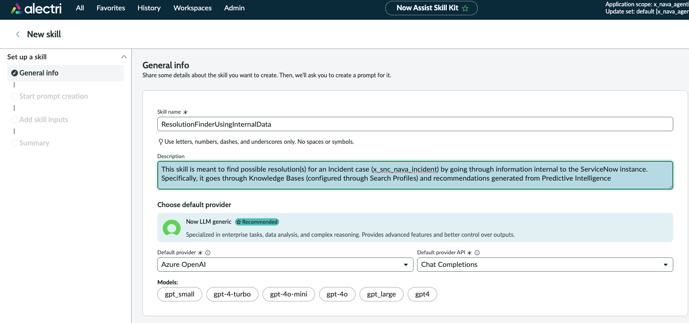

| Field | Value |
|-------|-------|
| Skill name | `ResolutionFinderUsingInternalData` |
| Description | `This skill is meant to find possible resolution(s) for an Incident case (x_snc_nava_incident) by going through information internal to the ServiceNow instance. Specifically, it goes through Knowledge Bases (configured through Search Profiles) and recommendations generated from Predictive Intelligence` |
| Default provider | `Azure OpenAI` |
| Default provider API | `Chat Completions` |

> The description is critical — it defines the scope of the skill for both the LLM and the platform routing. The reference to `x_snc_nava_incident` explicitly scopes this skill to the lab's extended Incident table.

---

### Step 2: Configure Security Controls

Scroll down to **Configure security controls**.

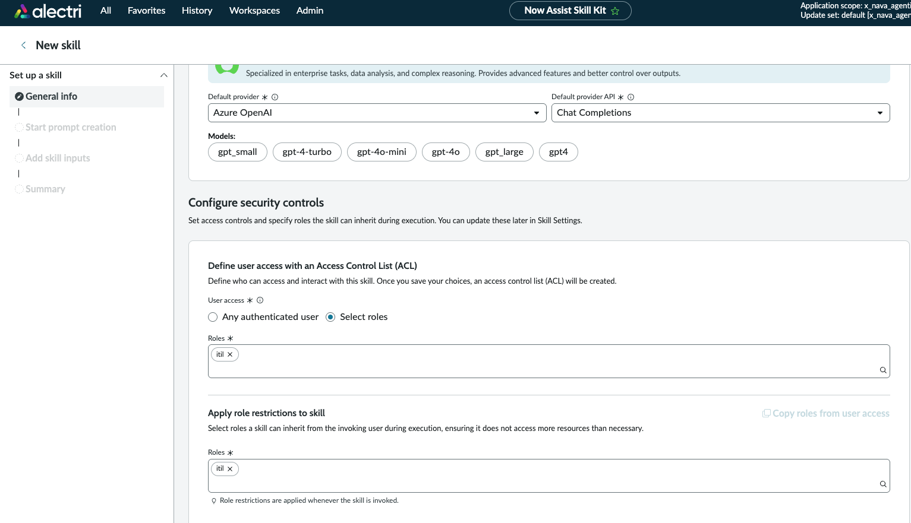

| Field | Value |
|-------|-------|
| User access | `Select roles` |
| Roles | `itil` |
| Apply role restrictions — Roles | `itil` |

> Consistent with the access model across the lab — `itil` for both ACL and execution role restriction.

---

### Step 3: Add Skill Inputs

This skill requires **two inputs**. Add them from the **Edit prompt** tab → **Inputs** section → **+**.

#### Input 1 — Record type (for Predictive Intelligence tool)

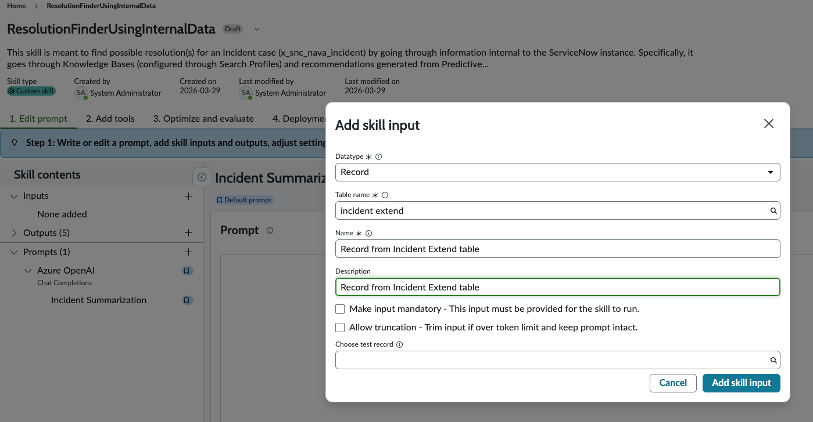

| Field | Value |
|-------|-------|
| Datatype | `Record` |
| Table name | `incident extend` |
| Name | `Record from Incident Extend table` |
| Description | `Record from Incident Extend table` |
| Make input mandatory | Unchecked |
| Allow truncation | Unchecked |

> The **Record** datatype gives the Predictive Intelligence tool a direct platform reference to the extended Incident record. It resolves field values from the record at runtime — enabling the PI model to access `category`, `cmdb_ci`, `error_code`, `product`, `serial_number`, and `short_description` via `{{record_from_incident_extend_table.<field>}}`.

#### Input 2 — String type (for Skill tool)

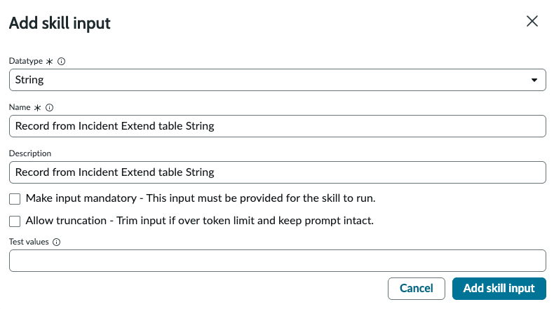

| Field | Value |
|-------|-------|
| Datatype | `String` |
| Name | `Record from Incident Extend table String` |
| Description | `Record from Incident Extend table String` |
| Make input mandatory | Unchecked |
| Allow truncation | Unchecked |

> The **String** input is what gets passed to `GenerateSearchQueryAgainstAISearch` as `{{record_from_incident_extend_table_string}}` — which then threads it through to `CreateOptimalSearchQuery`'s `incidentextendrecord` parameter. A String is required because the published skill expects a String input, not a Record reference.

---

### Step 4: Add Tools — Navigate to Add Tools Tab

Click the **Add tools** tab (Step 2 of the NASK wizard).

The canvas is empty: Start → End. Two tools must be added — one Predictive Intelligence tool and one Skill tool, both as parallel nodes.

---

### Step 5: Add Tool 1 — Predictive Intelligence (FindSimilarIncidents)

Click the **+** connector on the canvas. Select **Tool node** → **Add**.

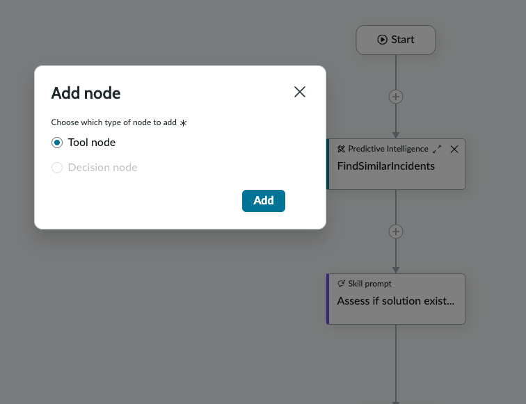

The tool type picker appears. Select **Predictive Intelligence** and click **Configure tool**.

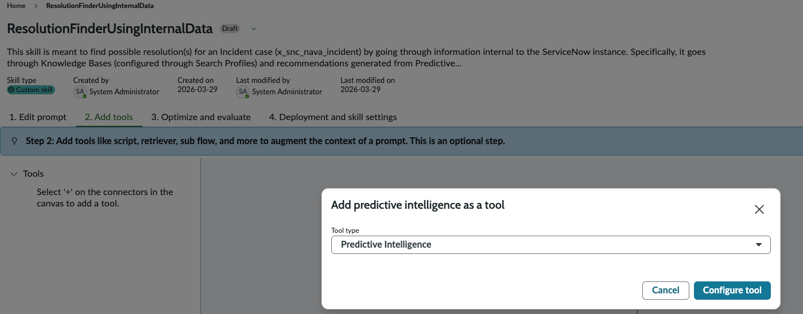

The **Add predictive intelligence as a tool** wizard opens (5 steps).

---

#### Step 5a — General Info

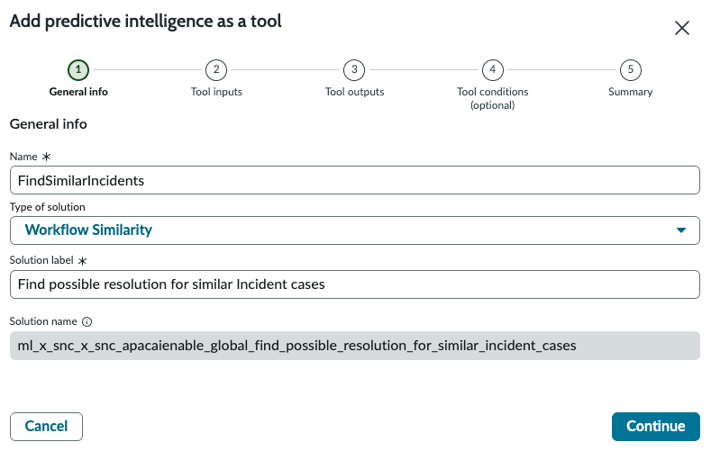

| Field | Value |
|-------|-------|
| Name | `FindSimilarIncidents` |
| Type of solution | `Workflow Similarity` |
| Solution label | `Find possible resolution for similar Incident cases` |
| Solution name | `ml_x_snc_x_snc_apacaienable_global_find_possible_resolution_for_similar_incident_cases` |

> **Workflow Similarity** is the Predictive Intelligence solution type used for finding historically similar records. The solution `Find possible resolution for similar Incident cases` must be trained on resolved Incident data before this tool will return meaningful results.

Click **Continue**.

---

#### Step 5b — Tool Inputs

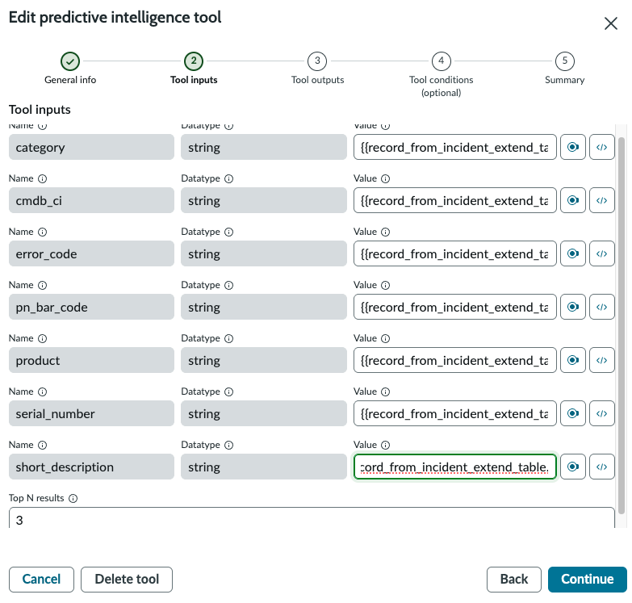

All inputs are mapped from the Record input (`{{record_from_incident_extend_table.<field>}}`):

| Input name | Datatype | Value |
|-----------|----------|-------|
| `category` | string | `{{record_from_incident_extend_table.category}}` |
| `cmdb_ci` | string | `{{record_from_incident_extend_table.cmdb_ci}}` |
| `error_code` | string | `{{record_from_incident_extend_table.error_code}}` |
| `pn_bar_code` | string | `{{record_from_incident_extend_table.pn_bar_code}}` |
| `product` | string | `{{record_from_incident_extend_table.product}}` |
| `serial_number` | string | `{{record_from_incident_extend_table.serial_number}}` |
| `short_description` | string | `{{record_from_incident_extend_table.short_description}}` |
| `topNResult` | — | `3` |

> **topNResult: 3** tells the PI model to return the top 3 most similar resolved incidents. This is a deliberate constraint — returning too many results increases token consumption in the downstream prompt without proportionally improving resolution quality.

Click **Continue**.

---

#### Step 5c — Tool Outputs

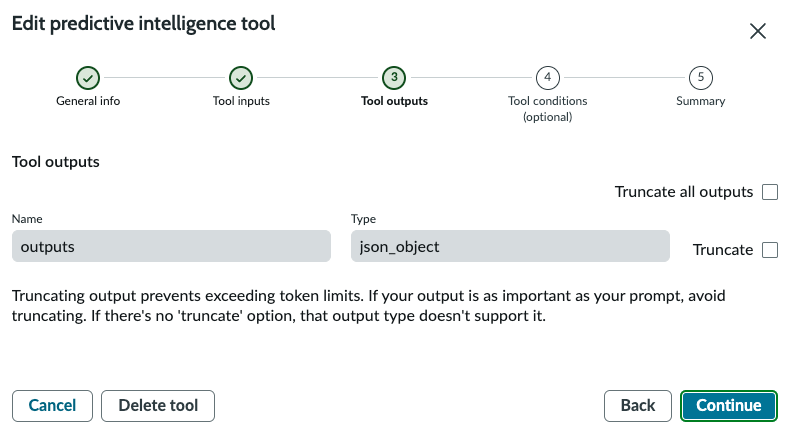

| Output name | Type |
|------------|------|
| `outputs` | `json_object` |

> The PI tool returns a single `json_object` output containing the ranked similar incidents and their resolution data. The `Assess if solution exists` prompt parses this JSON alongside the KB retriever results to evaluate whether a resolution exists.

Click **Continue**.

---

#### Step 5d — Tool Conditions

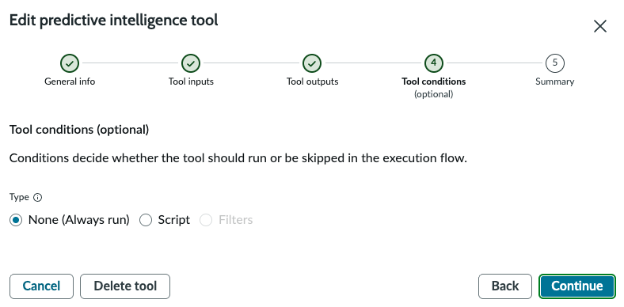

| Field | Value |
|-------|-------|
| Type | **None (Always run)** |

Click **Continue**.

---

#### Step 5e — Summary

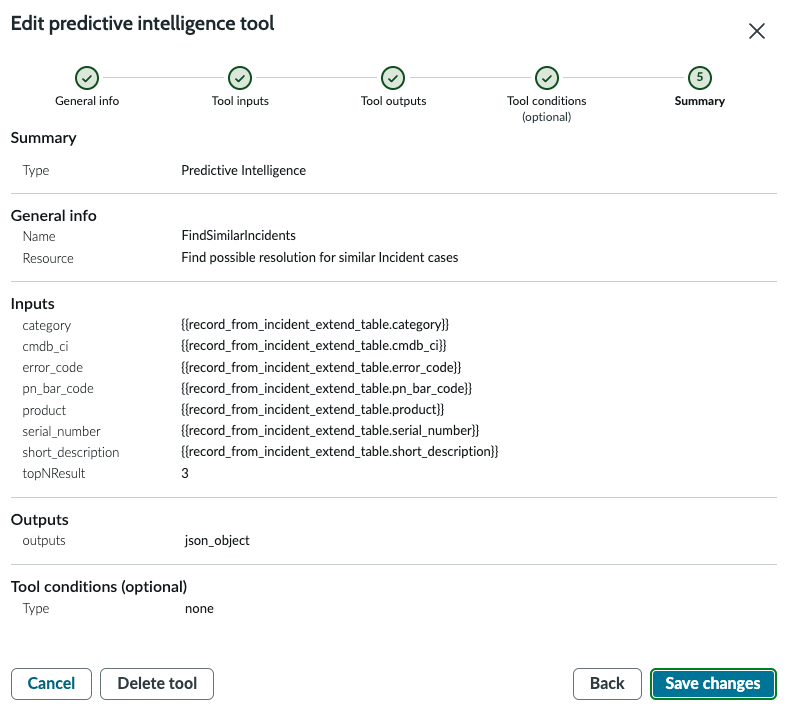

Verify before saving:

| Section | Field | Value |
|---------|-------|-------|
| Type | — | Predictive Intelligence |
| General info | Name | `FindSimilarIncidents` |
| General info | Resource | `Find possible resolution for similar Incident cases` |
| Inputs | category → short_description | `{{record_from_incident_extend_table.*}}` |
| Inputs | topNResult | `3` |
| Outputs | outputs | json_object |
| Tool conditions | Type | none |

Click **Save changes**.

---

### Step 6: Add Tool 2 — Skill (GenerateSearchQueryAgainstAISearch) as Parallel Node

With `FindSimilarIncidents` on the canvas, click the **+** connector on the **parallel branch** from Start (not the connector below `FindSimilarIncidents`). Select **Tool node** → **Add**.

The tool type picker appears. Select **Skill** and check **Add as parallel node**.

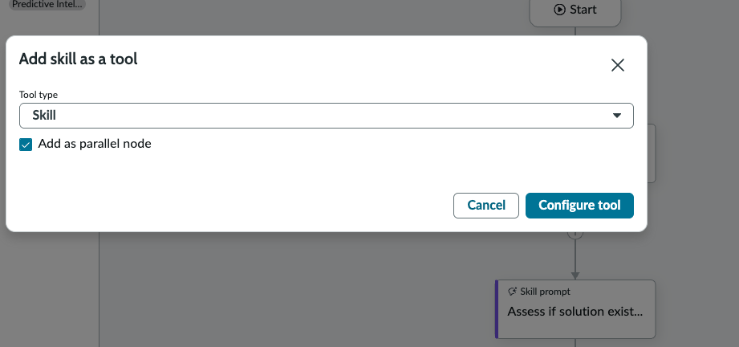

| Field | Value |
|-------|-------|
| Tool type | `Skill` |
| Add as parallel node | ✅ **Yes** |

Click **Configure tool**.

> **Add as parallel node** is what makes both tools fire simultaneously from the Start node. Without this checked, the skill tool would execute sequentially after `FindSimilarIncidents`, adding unnecessary latency.

---

#### Step 6a — General Info

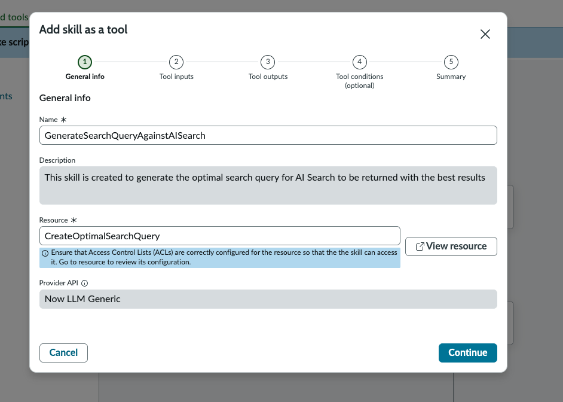

| Field | Value |
|-------|-------|
| Name | `GenerateSearchQueryAgainstAISearch` |
| Description | `This skill is created to generate the optimal search query for AI Search to be returned with the best results` |
| Resource | `CreateOptimalSearchQuery` |
| Provider API | `Now LLM Generic` |

> **Resource** points to the `CreateOptimalSearchQuery` skill built in the previous section. The skill must be **published and active** for it to appear in the Resource picker here.

Click **Continue**.

---

#### Step 6b — Tool Inputs

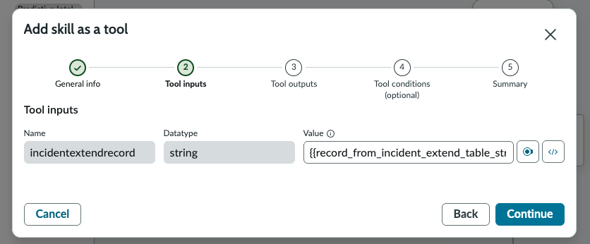

| Input name | Datatype | Value |
|-----------|----------|-------|
| `incidentextendrecord` | `string` | `{{record_from_incident_extend_table_string}}` |

> This maps the String skill input (`record_from_incident_extend_table_string`) into `CreateOptimalSearchQuery`'s `incidentextendrecord` parameter — completing the chain from Incident record → query string.

Click **Continue**.

---

#### Step 6c — Tool Outputs

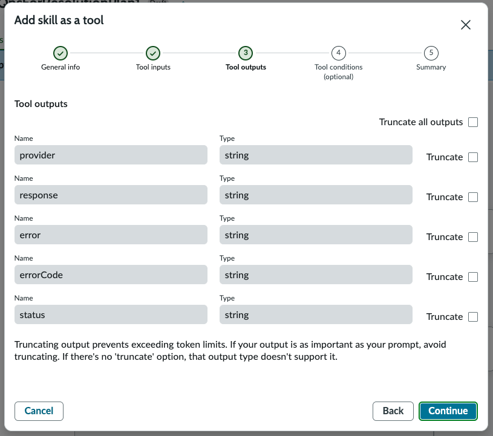

| Output name | Type |
|------------|------|
| `provider` | string |
| `response` | string |
| `error` | string |
| `errorCode` | string |
| `status` | string |

> The `response` output contains the optimised AI Search query string generated by `CreateOptimalSearchQuery`. This is what the downstream retriever (Step 2) uses to fetch ranked KB results. `provider`, `error`, `errorCode`, and `status` are standard NASK skill output fields.

Click **Continue**.

---

#### Step 6d — Tool Conditions

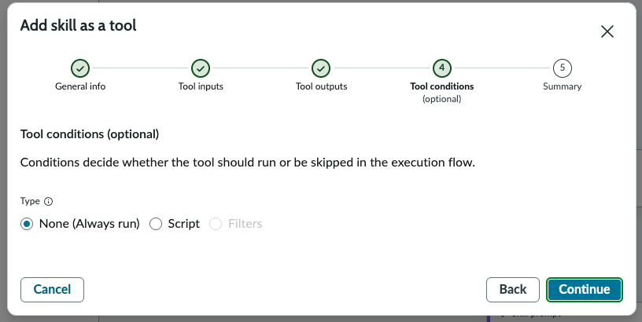

| Field | Value |
|-------|-------|
| Type | **None (Always run)** |

Click **Continue**.

---

#### Step 6e — Summary

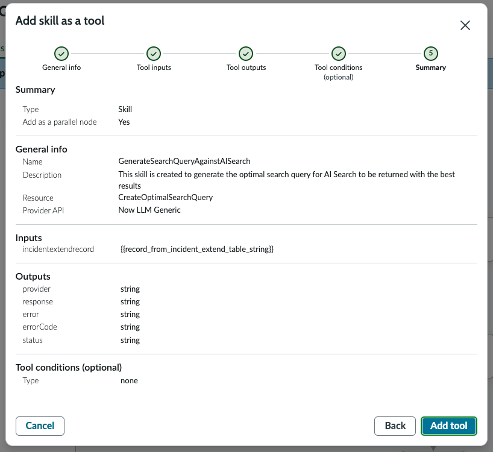

Verify before adding:

| Section | Field | Value |
|---------|-------|-------|
| Type | — | Skill |
| Add as a parallel node | — | **Yes** |
| General info | Name | `GenerateSearchQueryAgainstAISearch` |
| General info | Resource | `CreateOptimalSearchQuery` |
| General info | Provider API | Now LLM Generic |
| Inputs | incidentextendrecord | `{{record_from_incident_extend_table_string}}` |
| Outputs | provider, response, error, errorCode, status | string |
| Tool conditions | Type | none |

Click **Add tool**.

---

### Step 7: Verify the Final Canvas

After both tools are added, the canvas shows the complete parallel execution flow:

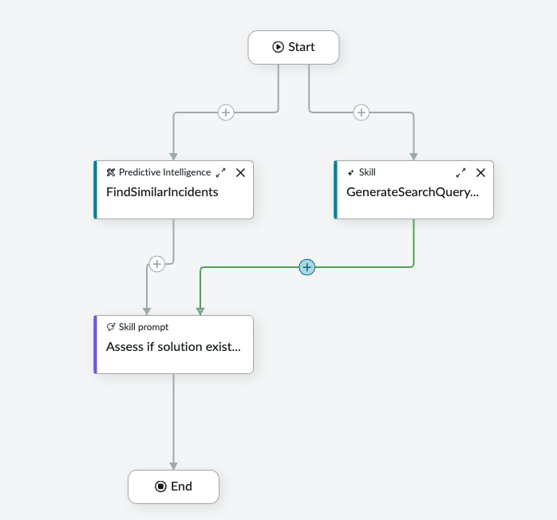

```
                    Start
                      │
          ┌───────────┴───────────┐
          ▼                       ▼
FindSimilarIncidents        GenerateSearchQuery...
(Predictive Intelligence)   (Skill — parallel node)
          │                       │
          └───────────┬───────────┘
                      ▼ (merge)
              Assess if solution exist...
              (Skill Prompt)
                      │
                      ▼
                     End
```

Both `FindSimilarIncidents` and `GenerateSearchQueryAgainstAISearch` connect from Start via the **+** parallel connectors. Their outputs merge at a single **+** node that feeds into the `Assess if solution exist...` Skill Prompt.

> The **Skill Prompt** node (`Assess if solution exist...`) is authored in **Step 1: Edit prompt**. It receives both tools' outputs as context variables — `{{FindSimilarIncidents.outputs}}` (JSON of similar incidents) and `{{GenerateSearchQueryAgainstAISearch.response}}` (optimised query string) — and determines whether a viable resolution exists. This is a reasoning step: the agent does **not** proceed to remediation unless the prompt explicitly confirms a solution.

---

## Key Configuration Summary

| Field | Value |
|-------|-------|
| Skill name | `ResolutionFinderUsingInternalData` |
| Skill type | Custom skill |
| Default provider | Azure OpenAI / Chat Completions |
| Input 1 | `Record from Incident Extend table` — Record (table: incident extend) |
| Input 2 | `Record from Incident Extend table String` — String |
| Tool 1 | `FindSimilarIncidents` — Predictive Intelligence — Workflow Similarity |
| Tool 1 solution | `Find possible resolution for similar Incident cases` |
| Tool 1 topNResult | `3` |
| Tool 1 output | `outputs` — json_object |
| Tool 2 | `GenerateSearchQueryAgainstAISearch` — Skill — **parallel node** |
| Tool 2 resource | `CreateOptimalSearchQuery` |
| Tool 2 input | `incidentextendrecord` → `{{record_from_incident_extend_table_string}}` |
| Tool 2 output `response` | Optimised AI Search query string |
| Prompt node | `Assess if solution exists` — LLM reasoning step |
| User access | Select roles → `itil` |
| Role restrictions | `itil` |

---

## Technical Notes

### The Parallel Node Pattern

NASK supports adding tool nodes as **parallel nodes** — they fire simultaneously from the same connector rather than sequentially. This pattern is used here because `FindSimilarIncidents` (ML inference) and `GenerateSearchQueryAgainstAISearch` (LLM call) are independent operations with no data dependency between them. Running them in parallel reduces total skill execution time.

Both outputs are available as context variables in the downstream `Assess if solution exists` prompt once both parallel branches complete.

### Two Inputs, Two Tool Types

The skill requires two inputs because the two tool types have different expectations:

- **Predictive Intelligence** tools accept Record-type inputs — they use the platform record reference to resolve field values at runtime via dot notation (`{{record_from_incident_extend_table.field_name}}`).
- **Skill** tools pass inputs as string parameters into the called skill's declared inputs — they need a String value, not a Record reference.

Attempting to pass a Record input into a Skill tool's string parameter will fail at runtime.

### Assess if Solution Exists — Reasoning Gate

The `Assess if solution exists` Skill Prompt is the decision point that separates Path A (resolution found) from Path B (fallback). It receives:
- `{{FindSimilarIncidents.outputs}}` — top 3 similar incidents with their resolutions
- The KB retrieval results (from the Retriever configured in the workflow, not in this skill directly)

If the combined context contains a viable resolution, the prompt confirms it and the workflow continues to Phase 3 (External Integration). If not, it falls through to Path B — privacy-safe web search — without triggering any automated remediation.

---

## Reference

- [Now Assist Skill Kit — Tool and Deployment Options](https://www.servicenow.com/community/now-assist-articles/now-assist-skill-kit-tool-and-deployment-options/ta-p/3284803)
- [Now Assist Skill Kit FAQ](https://www.servicenow.com/community/now-assist-articles/now-assist-skill-kit-nask-faq/ta-p/3007953)
- [Predictive Intelligence — Workflow Similarity](https://www.servicenow.com/docs/bundle/zurich-intelligent-experiences/page/administer/now-assist-skill-kit/concept/now-assist-skill-kit-landing.html)

---

## Next Steps

→ The `response` output from `GenerateSearchQueryAgainstAISearch` feeds directly into the KB Retriever (configured in the Fulfiller Flow workflow) as the AI Search query.

→ The combined output from both parallel tools feeds the `Assess if solution exists` prompt — which determines whether the flow continues to Phase 3 or falls through to Path B.

→ If Path B is triggered: a privacy-safe web search fires (PII and internal identifiers stripped). If that also yields no result, the Incident escalates to L2 manual pickup.
