# 03-part2 — Now Assist Skill Kit: ResolutionFinderUsingInternalData

> **Release:** Zurich | **Flow:** Fulfiller Flow — Phase 2, Path A (Steps 1–3)
> **Source:** [Now Assist Skill Kit — Tool and Deployment Options](https://www.servicenow.com/community/now-assist-articles/now-assist-skill-kit-tool-and-deployment-options/ta-p/3284803) | [NASK FAQ](https://www.servicenow.com/community/now-assist-articles/now-assist-skill-kit-nask-faq/ta-p/3007953)

---

## What It Is

`ResolutionFinderUsingInternalData` is the **orchestrating skill** for Path A of the Fulfiller Flow. It combines three tools — two running in parallel and one sequentially — then feeds all their outputs into a single LLM reasoning step that determines whether a viable resolution exists.

This skill covers **all three steps of Path A**:

```
Path A — Step 1 (parallel from Start):
  ├── FindSimilarIncidents (Predictive Intelligence)
  │   ML similarity — returns top 3 similar resolved incidents as json_object
  └── GenerateSearchQueryAgainstAISearch (Skill — parallel node)
      Calls CreateOptimalSearchQuery → returns optimised AI Search query string
        │
        ▼ (GenerateSearchQuery output feeds Retriever)
Path A — Step 2:
  RetrieveRelevantKBContent (Retriever — RAG)
  Uses optimised query to fetch ranked KB articles via AI Search (Semantic)
  Returns Rag Results as json_object
        │
        ▼ (Retriever + FindSimilarIncidents outputs merge)
Path A — Step 3:
  Assess if solution exists (Skill Prompt)
  LLM evaluates combined RAG + PI context
  Determines whether a viable resolution exists
        │
        ▼
Path A — Result:
  YES → Resolution Plan built, written to Incident, Phase 3 continues
  NO  → fall through to Path B (privacy-safe web search)
```

> **Correct canvas topology:** `FindSimilarIncidents` and `GenerateSearchQueryAgainstAISearch` fire in parallel. `GenerateSearchQueryAgainstAISearch.response` feeds directly into `RetrieveRelevantKBContent` as the search query. `FindSimilarIncidents` output bypasses the Retriever and merges at the `Assess if solution exists` prompt together with the RAG results.

---

## Skill Architecture

| Node | Type | Fires | Purpose |
|------|------|-------|---------|
| `FindSimilarIncidents` | Predictive Intelligence | Parallel (from Start) | ML similarity — top 3 similar resolved incidents as `json_object` |
| `GenerateSearchQueryAgainstAISearch` | Skill (parallel node) | Parallel (from Start) | Calls `CreateOptimalSearchQuery` — returns optimised query string |
| `RetrieveRelevantKBContent` | Retriever (RAG) | After GenerateSearchQuery | Semantic KB search using optimised query — returns `Rag Results` as `json_object` |
| `Assess if solution exist...` | Skill Prompt | After Retriever + PI merge | LLM reasoning — evaluates RAG + PI combined output |

---

## Skill Inputs

| Input name | Datatype | Used by |
|-----------|----------|---------|
| `Record from Incident Extend table` | **Record** (table: `incident extend`) | `FindSimilarIncidents` — PI tool reads record fields directly |
| `Record from Incident Extend table String` | **String** | `GenerateSearchQueryAgainstAISearch` — passes as `{{record_from_incident_extend_table_string}}` |

---

## Prerequisites

| Requirement | Detail |
|-------------|--------|
| NASK plugin | `sn_now_assist_skill_kit` — Active |
| `CreateOptimalSearchQuery` skill | Published and active |
| PI solution | `Find possible resolution for similar Incident cases` — trained and active |
| AI Search / RAG | Enabled — Search profile `quick_action_kb_search_profile` configured |
| KB articles | Indexed with E5FT embedding model on `body` and `title` semantic indexes |
| Extended Incident table | `x_snc_nava_incident` — populated before skill fires |
| Role | `sn_skill_kit.admin` or `admin` |

---

## Lab Exercise — Steps to Build

### Step 1: Create the Skill — General Info

Navigate to **All → Now Assist Skill Kit → Home → Create skill**.


| Field | Value |
|-------|-------|
| Skill name | `ResolutionFinderUsingInternalData` |
| Description | `This skill is meant to find possible resolution(s) for an Incident case (x_snc_nava_incident) by going through information internal to the ServiceNow instance. Specifically, it goes through Knowledge Bases (configured through Search Profiles) and recommendations generated from Predictive Intelligence` |
| Default provider | `Azure OpenAI` |
| Default provider API | `Chat Completions` |

---

### Step 2: Configure Security Controls


| Field | Value |
|-------|-------|
| User access | `Select roles` |
| Roles | `itil` |
| Apply role restrictions — Roles | `itil` |

---

### Step 3: Add Skill Inputs

Two inputs are required — one per tool type.

#### Input 1 — Record (for Predictive Intelligence tool)


| Field | Value |
|-------|-------|
| Datatype | `Record` |
| Table name | `incident extend` |
| Name | `Record from Incident Extend table` |
| Description | `Record from Incident Extend table` |
| Make input mandatory | Unchecked |
| Allow truncation | Unchecked |

#### Input 2 — String (for Skill tool)


| Field | Value |
|-------|-------|
| Datatype | `String` |
| Name | `Record from Incident Extend table String` |
| Description | `Record from Incident Extend table String` |
| Make input mandatory | Unchecked |
| Allow truncation | Unchecked |

---

### Step 4: Add Tool 1 — Predictive Intelligence (FindSimilarIncidents)

Navigate to the **Add tools** tab. Click **+** on the canvas → **Tool node** → **Add**.


Select **Predictive Intelligence** → **Configure tool**.


#### Step 4a — General Info


| Field | Value |
|-------|-------|
| Name | `FindSimilarIncidents` |
| Type of solution | `Workflow Similarity` |
| Solution label | `Find possible resolution for similar Incident cases` |
| Solution name | `ml_x_snc_x_snc_apacaienable_global_find_possible_resolution_for_similar_incident_cases` |

#### Step 4b — Tool Inputs


| Input name | Datatype | Value |
|-----------|----------|-------|
| `category` | string | `{{record_from_incident_extend_table.category}}` |
| `cmdb_ci` | string | `{{record_from_incident_extend_table.cmdb_ci}}` |
| `error_code` | string | `{{record_from_incident_extend_table.error_code}}` |
| `pn_bar_code` | string | `{{record_from_incident_extend_table.pn_bar_code}}` |
| `product` | string | `{{record_from_incident_extend_table.product}}` |
| `serial_number` | string | `{{record_from_incident_extend_table.serial_number}}` |
| `short_description` | string | `{{record_from_incident_extend_table.short_description}}` |
| `topNResult` | — | `3` |

#### Step 4c — Tool Outputs


| Output | Type |
|--------|------|
| `outputs` | `json_object` |

#### Step 4d — Tool Conditions


Type: **None (Always run)**

#### Step 4e — Summary


Verify and click **Save changes**.

---

### Step 5: Add Tool 2 — Skill (GenerateSearchQueryAgainstAISearch) as Parallel Node

Click the **+** on the **parallel branch from Start**. Select **Tool node** → **Add**. Select **Skill**, check **Add as parallel node** → **Configure tool**.


#### Step 5a — General Info


| Field | Value |
|-------|-------|
| Name | `GenerateSearchQueryAgainstAISearch` |
| Description | `This skill is created to generate the optimal search query for AI Search to be returned with the best results` |
| Resource | `CreateOptimalSearchQuery` |
| Provider API | `Now LLM Generic` |

#### Step 5b — Tool Inputs


| Input | Datatype | Value |
|-------|----------|-------|
| `incidentextendrecord` | string | `{{record_from_incident_extend_table_string}}` |

#### Step 5c — Tool Outputs


| Output | Type |
|--------|------|
| `provider` | string |
| `response` | string |
| `error` | string |
| `errorCode` | string |
| `status` | string |

> `response` carries the optimised AI Search query string — this is what `RetrieveRelevantKBContent` uses as its search query input.

#### Step 5d — Tool Conditions


Type: **None (Always run)**

#### Step 5e — Summary


Verify **Add as a parallel node: Yes** → click **Add tool**.

---

### Step 6: Canvas State After Two Parallel Tools

With both parallel tools added, the canvas shows:


```
                    Start
                      │
          ┌───────────┴───────────┐
          ▼                       ▼
FindSimilarIncidents        GenerateSearchQuery...
(Predictive Intelligence)   (Skill — parallel node)
          │                       │
          └──────────+────────────┘
                     │
              Assess if solution exist...
              (Skill Prompt)
                     │
                    End
```

> At this point the Retriever has not yet been added. The next step inserts `RetrieveRelevantKBContent` between `GenerateSearchQueryAgainstAISearch` and the `Assess if solution exists` prompt.

---

### Step 7: Add Tool 3 — Retriever (RetrieveRelevantKBContent)

Click the **+** connector **between** the parallel merge and `Assess if solution exists`. Select **Tool node** → **Add**.

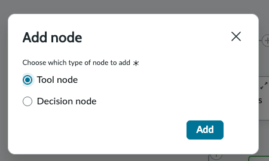

The tool type picker appears. Select **Retriever** → **Configure tool**.

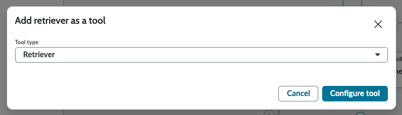

The **Add retriever as a tool** wizard opens (5 steps).

---

#### Step 7a — General Info

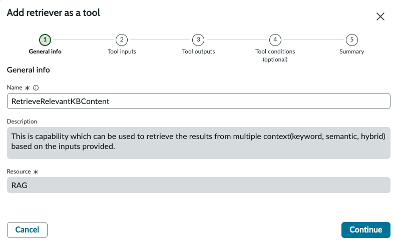

| Field | Value |
|-------|-------|
| Name | `RetrieveRelevantKBContent` |
| Description | `This is capability which can be used to retrieve the results from multiple context(keyword, semantic, hybrid) based on the inputs provided.` |
| Resource | `RAG` |

> **Resource: RAG** is the platform's built-in Retrieval Augmented Generation engine. It handles the AI Search query, embedding, chunking, and re-ranking pipeline internally — the configuration below controls its behaviour for this specific retrieval.

Click **Continue**.

---

#### Step 7b — Tool Inputs

The retriever tool inputs configure the full search pipeline. This is the most detailed configuration step in the skill.

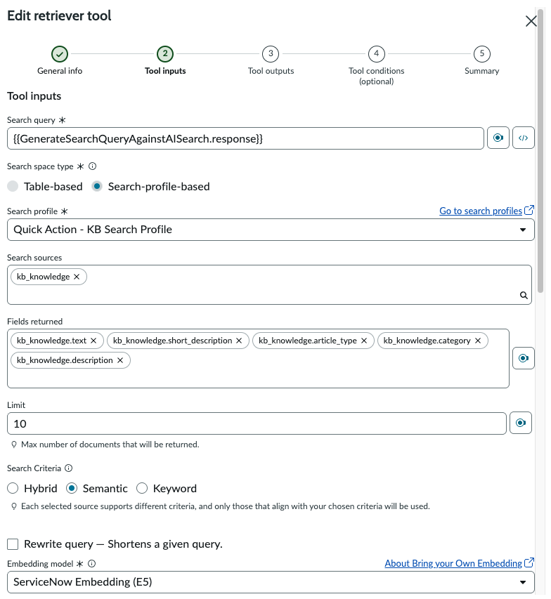

**Core search configuration:**

| Field | Value |
|-------|-------|
| Search query | `{{GenerateSearchQueryAgainstAISearch.response}}` |
| Search space type | `Search-profile-based` |
| Search profile | `Quick Action - KB Search Profile` |
| Search sources | `kb_knowledge` |
| Fields returned | `kb_knowledge.text`, `kb_knowledge.short_description`, `kb_knowledge.article_type`, `kb_knowledge.category`, `kb_knowledge.description` |
| Limit | `10` |
| Search Criteria | `Semantic` |
| Rewrite query | `No` (unchecked) |
| Embedding model | `ServiceNow Embedding (E5)` |
| Semantic Indexes | `body`, `title` |

> **Search query wired to the parallel skill output:** `{{GenerateSearchQueryAgainstAISearch.response}}` is the optimised query string produced by `CreateOptimalSearchQuery`. This is the critical data hand-off — the LLM-generated query drives the semantic KB search.
>
> **Search-profile-based** uses the `quick_action_kb_search_profile` search profile, which defines which KB sources and indexes are searched. **Semantic** criteria uses the E5FT embedding model to find semantically similar articles, not just keyword matches.

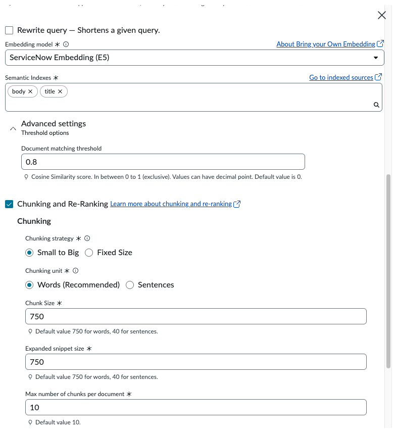

**Advanced settings — Chunking:**

| Field | Value |
|-------|-------|
| Document matching threshold | `0.8` |
| Chunking and Re-Ranking | ✅ Enabled |
| Chunking strategy | `Small to Big` |
| Chunking unit | `Words (Recommended)` |
| Chunk Size | `750` |
| Expanded snippet size | `750` |
| Max number of chunks per document | `10` |

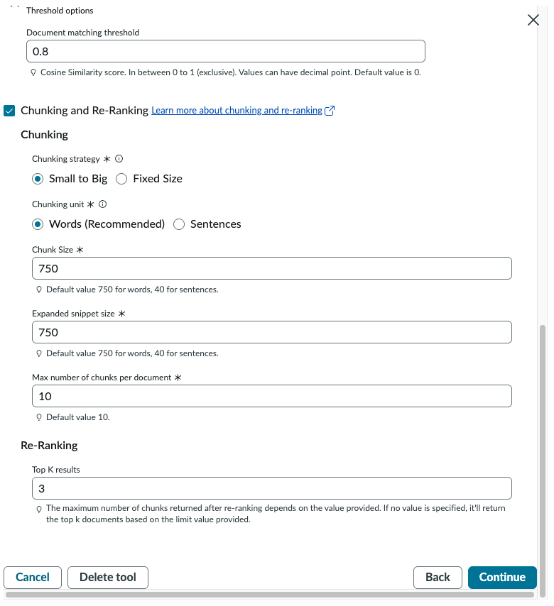

**Advanced settings — Re-Ranking:**

| Field | Value |
|-------|-------|
| Top K results | `3` |

> **Chunking — Small to Big:** Documents are chunked into small units (750 words) for precise similarity scoring, then expanded to 750-word snippets when returned to the prompt — giving the LLM sufficient context around the matched passage.
>
> **Document matching threshold 0.8:** Only chunks with a cosine similarity score ≥ 0.8 are considered relevant. This prevents low-relevance articles from polluting the prompt context.
>
> **Top K results: 3:** After re-ranking, only the top 3 chunks are returned to the skill prompt — matching the `topNResult: 3` pattern used for the PI tool, keeping total token consumption bounded.

Click **Continue**.

---

#### Step 7c — Tool Outputs

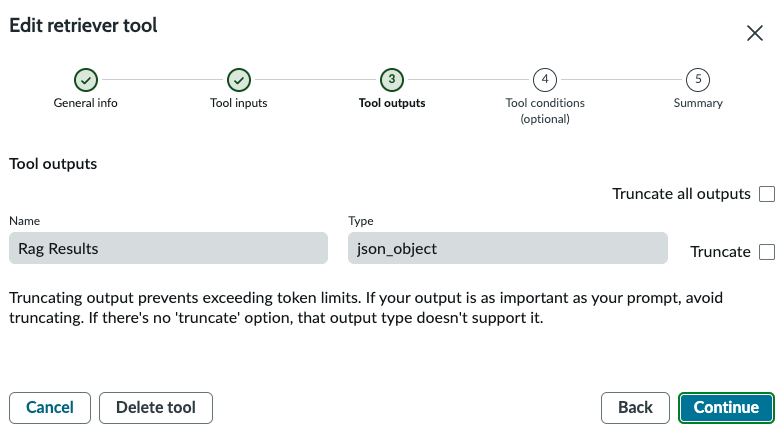

| Output | Type |
|--------|------|
| `Rag Results` | `json_object` |

> The `Rag Results` JSON object contains the top 3 re-ranked KB article chunks with their field values (`text`, `short_description`, `article_type`, `category`, `description`). The `Assess if solution exists` prompt receives this alongside `{{FindSimilarIncidents.outputs}}` to evaluate whether a resolution exists.

Click **Continue**.

---

#### Step 7d — Tool Conditions

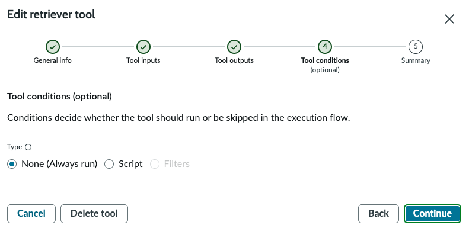

Type: **None (Always run)**

Click **Continue**.

---

#### Step 7e — Summary

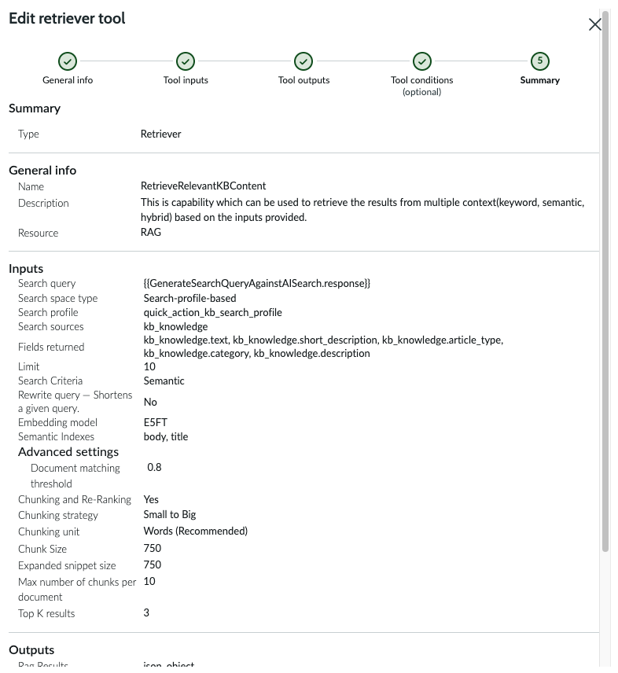

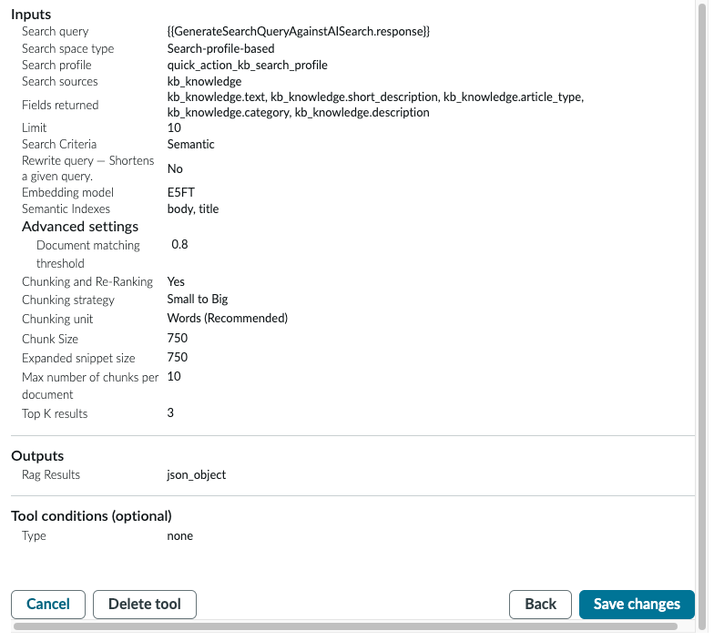

Verify the complete configuration before saving:

| Section | Field | Value |
|---------|-------|-------|
| Type | — | Retriever |
| General info | Name | `RetrieveRelevantKBContent` |
| General info | Resource | RAG |
| Inputs | Search query | `{{GenerateSearchQueryAgainstAISearch.response}}` |
| Inputs | Search space type | Search-profile-based |
| Inputs | Search profile | `quick_action_kb_search_profile` |
| Inputs | Search sources | `kb_knowledge` |
| Inputs | Fields returned | kb_knowledge.text, .short_description, .article_type, .category, .description |
| Inputs | Limit | 10 |
| Inputs | Search Criteria | Semantic |
| Inputs | Embedding model | E5FT |
| Inputs | Semantic Indexes | body, title |
| Inputs | Document matching threshold | 0.8 |
| Inputs | Chunking | Small to Big, Words, 750/750, max 10 |
| Inputs | Top K results | 3 |
| Outputs | Rag Results | json_object |
| Tool conditions | Type | none |

Click **Save changes**.

---

### Step 8: Final Canvas — Complete Skill Flow

After all three tools are added, the canvas shows the complete four-node flow:

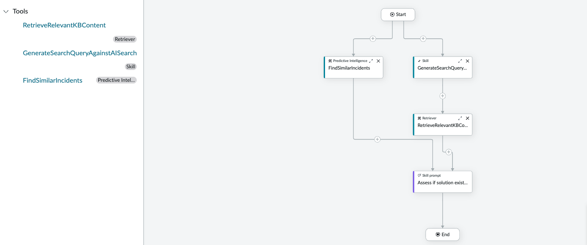

```
                        Start
                          │
            ┌─────────────┴─────────────┐
            ▼                           ▼
  FindSimilarIncidents          GenerateSearchQuery...
  (Predictive Intelligence)     (Skill — parallel node)
            │                           │
            │                           ▼
            │                  RetrieveRelevantKBCo...
            │                  (Retriever — RAG)
            │                           │
            └─────────────┬─────────────┘
                          ▼ (merge)
                  Assess if solution exist...
                  (Skill Prompt)
                          │
                          ▼
                         End
```

**Tools panel (left):**
- `RetrieveRelevantKBContent` — Retriever
- `GenerateSearchQueryAgainstAISearch` — Skill
- `FindSimilarIncidents` — Predictive Intel...

> **Key topology:** `GenerateSearchQueryAgainstAISearch.response` flows into `RetrieveRelevantKBContent` as the search query. `FindSimilarIncidents` bypasses the Retriever entirely and merges directly at the `Assess if solution exists` prompt. The prompt therefore receives two context sources: `{{RetrieveRelevantKBContent.Rag Results}}` (KB articles) and `{{FindSimilarIncidents.outputs}}` (similar incidents).

---

### Step 9: Publish the Skill

Navigate to the **Edit prompt** tab → finalize the `Assess if solution exists within Internal Knowledge sources` prompt → click **Publish skill**.

The **Publish Skill** dialog opens:

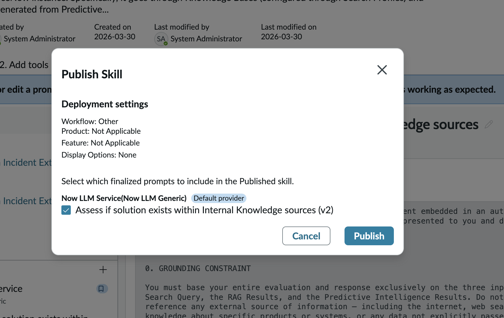

| Field | Value |
|-------|-------|
| Workflow | Other |
| Product | Not Applicable |
| Feature | Not Applicable |
| Display Options | None |
| Provider | Now LLM Service (Now LLM Generic) — Default provider |
| Prompt | `Assess if solution exists within Internal Knowledge sources (v2)` ✅ |

Click **Publish**.

> The prompt is labelled `v2` — indicating it has been finalized twice. Only finalized prompts appear in the publish dialog. If your prompt shows `v1`, that is correct for a first-time publish; select it and proceed.

---

### Step 10: Activate the Skill

Navigate to **All → Admin Center → Now Assist Admin → Now Assist Skills → Other → Available**.

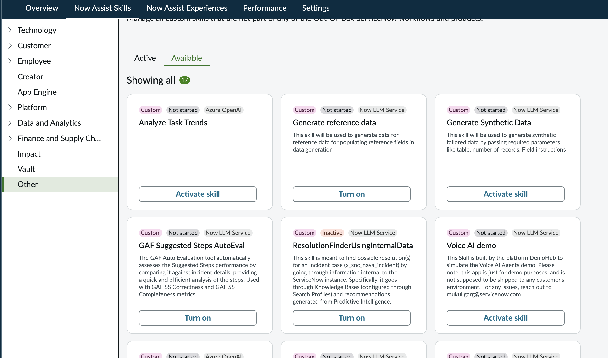

Locate `ResolutionFinderUsingInternalData` (Custom | Inactive | Now LLM Service) → click **Turn on** → confirm activation.

> The skill card shows **Inactive** status — this is expected for a newly published skill before activation. Click **Turn on** to make it callable from Flow Designer as an Execute Skill action in the Fulfiller Flow workflow.

---

## Key Configuration Summary

| Field | Value |
|-------|-------|
| Skill name | `ResolutionFinderUsingInternalData` |
| Skill type | Custom skill |
| Default provider | Azure OpenAI / Chat Completions |
| Input 1 | `Record from Incident Extend table` — Record (table: incident extend) |
| Input 2 | `Record from Incident Extend table String` — String |
| Tool 1 | `FindSimilarIncidents` — Predictive Intelligence — Workflow Similarity — topNResult: 3 |
| Tool 2 | `GenerateSearchQueryAgainstAISearch` — Skill — parallel node — Resource: `CreateOptimalSearchQuery` |
| Tool 3 | `RetrieveRelevantKBContent` — Retriever — RAG — Semantic — E5FT — Top K: 3 |
| Search query source | `{{GenerateSearchQueryAgainstAISearch.response}}` |
| Search profile | `quick_action_kb_search_profile` |
| Prompt | `Assess if solution exists within Internal Knowledge sources (v2)` |
| User access | Select roles → `itil` |
| Role restrictions | `itil` |
| Deployment workflow | Other |

---

## Technical Notes

### Canvas Topology — Why the Retriever is Not Parallel

`FindSimilarIncidents` and `GenerateSearchQueryAgainstAISearch` run in parallel because they have no data dependency on each other. The Retriever (`RetrieveRelevantKBContent`) cannot run in parallel because it **depends on** `GenerateSearchQueryAgainstAISearch.response` as its search query — it must wait for that output before it can execute. This sequential dependency is enforced by placing the Retriever node on the `GenerateSearchQueryAgainstAISearch` branch, not on the parallel Start connectors.

### Semantic Search vs Keyword Search

The Retriever is configured with **Semantic** search criteria using the **ServiceNow Embedding (E5)** model. This means KB articles are matched by semantic similarity (cosine distance in embedding space) rather than literal keyword overlap. The `Assess if solution exists` prompt receives semantically relevant passages even when the user's error description doesn't use the exact words present in KB articles.

### Chunking — Small to Big

The Small to Big chunking strategy scores each small chunk (750 words) for relevance, then expands the returned snippet to 750 words in context. This balances retrieval precision (small chunks → more accurate similarity scores) with prompt richness (large snippets → more context for the LLM to reason from).

### Document Matching Threshold 0.8

A threshold of 0.8 (out of 1.0 cosine similarity) is deliberately high — only very similar content passes. This prevents the `Assess if solution exists` prompt from reasoning on loosely related articles, which could produce false positives (incorrectly claiming a solution exists when it doesn't).

### Prompt — Grounding Constraint

The `Assess if solution exists within Internal Knowledge sources` prompt operates under a strict grounding constraint (visible in the background of the Publish Skill screenshot): the LLM must base its evaluation **exclusively** on the three provided inputs — the AI Search Query, the RAG Results, and the Predictive Intelligence Results. It must not reference any external source of information. This prevents hallucination and ensures the skill only confirms resolutions that are actually present in the instance's KB or historical incidents.

---

## Reference

- [Now Assist Skill Kit — Tool and Deployment Options](https://www.servicenow.com/community/now-assist-articles/now-assist-skill-kit-tool-and-deployment-options/ta-p/3284803)
- [Now Assist Skill Kit FAQ](https://www.servicenow.com/community/now-assist-articles/now-assist-skill-kit-nask-faq/ta-p/3007953)
- [Retrievers and RAG in NASK](https://www.servicenow.com/community/now-assist-articles/now-assist-skill-kit-tool-and-deployment-options/ta-p/3284803)

---

## Next Steps

→ With `ResolutionFinderUsingInternalData` published and active, it is invocable from Flow Designer via the **Execute Now Assist Skill** action in the Fulfiller Flow.

→ If `Assess if solution exists` confirms a resolution: the workflow builds a Resolution Plan, writes it to the Incident work notes, and continues to Phase 3 (External Integration / VM Remediation).

→ If no resolution is confirmed: the flow falls to **Path B** — a privacy-safe web search fires with PII and internal identifiers stripped from the query. If that also yields nothing, the Incident escalates to L2 manual pickup and Phase 3 is not triggered.
