# 04a — NASK: CreateOptimalSearchQuery

> **Release:** Zurich | **Flow:** Fulfiller Flow — Phase 2, Path A, Step 1 **Source:** [Now Assist Skill Kit — ServiceNow Community](https://www.servicenow.com/community/now-assist-articles/now-assist-skill-kit-tool-and-deployment-options/ta-p/3284803) | [Create a custom skill — ServiceNow Docs](https://www.servicenow.com/docs/bundle/zurich-intelligent-experiences/page/administer/now-assist-skill-kit/concept/now-assist-skill-kit-landing.html)

***

## What It Is

**Now Assist Skill Kit (NASK)** is the custom skill authoring tool built into the ServiceNow platform. It lets you build generative AI skills that are not available in the standard out-of-the-box Now Assist catalogue — combining LLM prompts with pre-processing tools (Flow Actions, Subflows, Retrievers, Scripts) into a single deployable unit.

Each NASK skill follows a four-step authoring workflow:

```
1. Edit prompt      → author the LLM prompt and skill inputs
2. Add tools        → attach pre-processing tools to augment context
3. Optimize         → test and evaluate prompt performance
4. Deploy           → configure workflow, product, and publish
```

This section covers building the **`CreateOptimalSearchQuery`** skill — the first skill to fire in the Fulfiller Flow (Path A, Step 1).

***

## Role in the Fulfiller Flow

```
Fulfiller Flow — Phase 2 (triggered when state = In Progress AND
                          channel = chat AND
                          u_extracted_error_code ≠ empty)
        │
        ▼
Path A — Step 1 (parallel fire from workflow Start node):

  ┌────────────────────────────────────────────────────┐
  │  CreateOptimalSearchQuery skill fires              │
  │  ↓                                                 │
  │  GetIncidentExtendDetail (Flow Action)             │
  │  → reads Incident extend table fields              │
  │  → outputs: short_description, error_code, CI,     │
  │    description, product_name, serial_number, etc.  │
  │  ↓                                                 │
  │  GenerateOptimalPromptForRAG (Skill Prompt)        │
  │  → LLM constructs an optimised AI Search query     │
  │    from the incident context                       │
  └────────────────────────────────────────────────────┘
        │
        ▼  (output: optimised search query string ready for AI Search)
Path A — Step 2: RetrieveRelevantKBContent skill
        (receives the query → fetches ranked KB results via AI Search RAG)
```

> **Why this skill exists:** Raw error codes and messy incident case records make poor search queries. This skill transforms the structured incident data (error code, CI name, product, description) into an LLM-optimised query string that AI Search can rank meaningfully — improving KB retrieval quality significantly.

***

## Skill Architecture

The skill has two nodes on its canvas, executed in sequence:

| Node                          | Type         | Purpose                                                                                                                             |
| ----------------------------- | ------------ | ----------------------------------------------------------------------------------------------------------------------------------- |
| `GetIncidentExtendDetail`     | Flow Action  | Pre-processing tool — reads all relevant fields from the Incident extend record and outputs them as structured data for the prompt  |
| `GenerateOptimalPromptForRAG` | Skill Prompt | LLM prompt — takes the Flow Action outputs as context and generates an optimised AI Search query string                             |

The skill takes one input — `incidentextendrecord` (the Incident record identifier) — and outputs a query string ready for the AI Search retriever in the next step.

***

## Prerequisites

| Requirement                           | Detail                                                                                               |
| ------------------------------------- | ---------------------------------------------------------------------------------------------------- |
| Now Assist Skill Kit plugin           | `sn_now_assist_skill_kit` — must be Active                                                           |
| Now LLM Service or Azure OpenAI       | LLM provider configured in the instance                                                              |
| `GetIncidentExtendDetail` Flow Action | Must exist — this is the Flow Action resource referenced by the tool                                 |
| Incident Extend table                 | `x_nava_agentic_lab_incident_extend` (or equivalent) — must be populated by the time the skill fires |

***

## Lab Exercise — Steps to Build

### Step 1: Navigate to Now Assist Skill Kit

Navigate to **All → Now Assist Skill Kit → Home** → click **Create skill**.

The **New skill** wizard opens on **General info**.

***

### Step 2: Configure General Info

Fill in the skill identity:

| Field       | Value                                                                                                           |
| ----------- | --------------------------------------------------------------------------------------------------------------- |
| Skill name  | `CreateOptimalSearchQuery`                                                                                      |
| Description | `This skill is created to generate the optimal search query for AI Search to be returned with the best results` |

> Skill names must use letters, numbers, dashes, and underscores only — no spaces or symbols.

**Choose default provider:**

The page presents a model picker. **Now LLM generic** is the recommended default (specialised in enterprise tasks, data analysis, and complex reasoning).

For this lab, the following provider is selected:

| Field                | Value                                                          |
| -------------------- | -------------------------------------------------------------- |
| Default provider     | `Azure OpenAI`                                                 |
| Default provider API | `Chat Completions`                                             |
| Available models     | gpt_small, gpt-4-turbo, gpt-4o-mini, gpt-4o, gpt\_large, gpt4  |

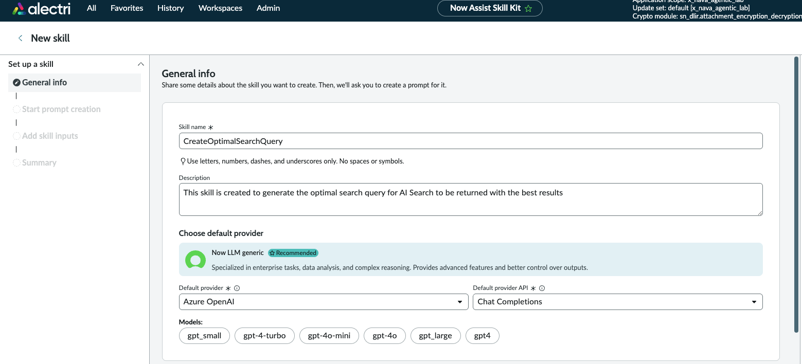

> The provider selection determines which LLM processes the prompt. Azure OpenAI is used here for its GPT model range. If your instance uses Now LLM Service natively, select that instead — the skill logic is provider-agnostic.

***

### Step 3: Configure Security Controls

Scroll down on the General info page to reach **Configure security controls**.

**Define user access with an Access Control List (ACL):**

| Field       | Value          |
| ----------- | -------------- |
| User access | `Select roles` |
| Roles       | `itil`         |

**Apply role restrictions to skill:**

| Field | Value  |
| ----- | ------ |
| Roles | `itil` |

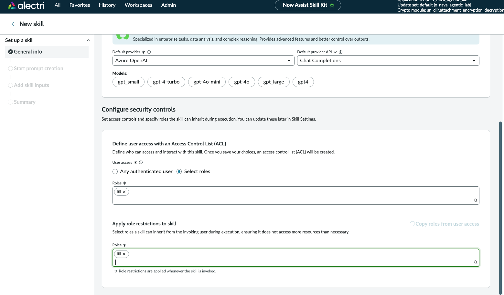

> **User access** controls who can invoke this skill. **Role restrictions** set the maximum privilege level the skill can inherit when it executes — even if the invoking user has broader roles, the skill operates within `itil` limits. Both are set to `itil` to match the access model established in the L1 Agent.

Click **Continue** to proceed to prompt creation.

***

### Step 4: Add Skill Input

Before authoring the prompt, define the skill input that will be passed in at runtime.

| Field                | Value                          |
| -------------------- | ------------------------------ |
| Datatype             | `String`                       |
| Name                 | `incidentextendrecord`         |
| Description          | `Table for extended incidents` |
| Make input mandatory | Unchecked                      |
| Allow truncation     | Unchecked                      |

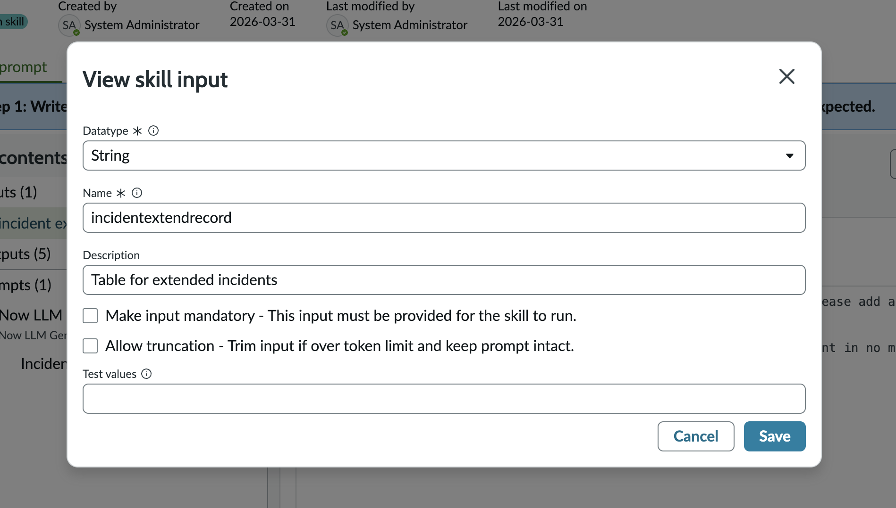

> `incidentextendrecord` is the identifier passed in by the Fulfiller Flow when the skill is invoked. It references the extended Incident record that `GetIncidentExtendDetail` will query. This input is threaded through to the Flow Action tool as `{{incidentextendrecord}}`.

***

### Step 5: Add Tools — Canvas

After saving the skill input, navigate to the **Add tools** tab (Step 2 of the NASK wizard).

The canvas shows the execution flow: **Start → \[tool nodes] → End**. Click the **+** connector between Start and End to add a node.

Select **Tool node** and click **Add**.

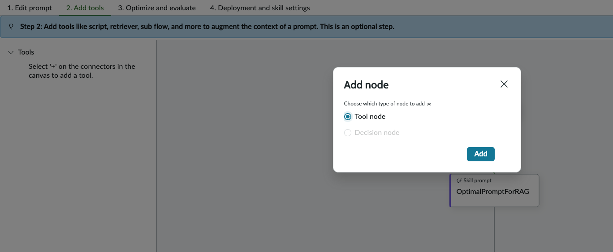

The tool type picker appears.

Select **Flow Action** as the tool type and click **Configure tool**.

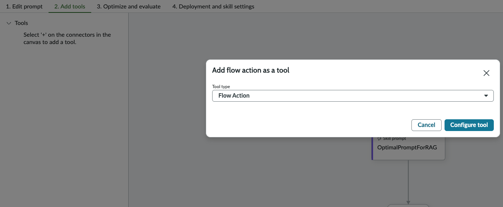

***

### Step 6: Configure the Flow Action Tool — General Info

The **Add flow action as a tool** wizard opens (5-step wizard: General info → Tool inputs → Tool outputs → Tool conditions → Summary).

**Step 1 — General info:**

| Field    | Value                                                      |
| -------- | ---------------------------------------------------------- |
| Name     | `GetIncidentExtendDetail`                                  |
| Resource | `Retrieval of Relevant Fields from Incident Extract table` |

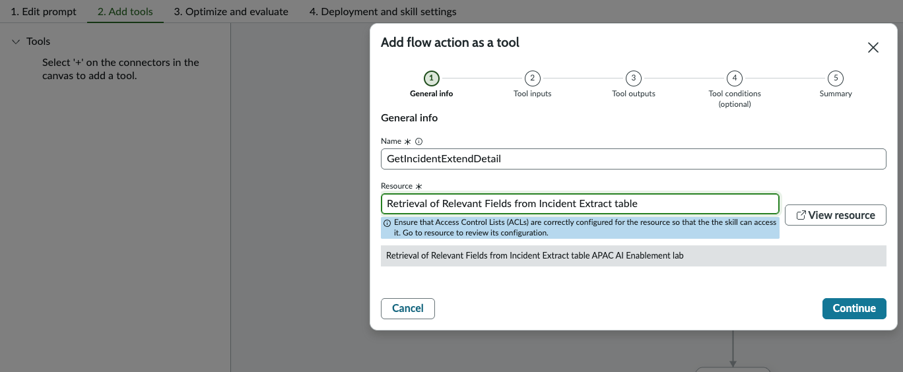

> The **Resource** field references the Flow Action that reads the extended Incident table. Ensure ACLs are correctly configured on this resource — the platform shows a warning: _"Ensure that Access Control Lists (ACLs) are correctly configured for the resource so that the skill can access it."_

Click **Continue**.

***

### Step 7: Configure the Flow Action Tool — Tool Inputs

**Step 2 — Tool inputs:**

| Field    | Value                      |
| -------- | -------------------------- |
| Name     | `Incident Number`          |
| Datatype | `String`                   |
| Value    | `{{incidentextendrecord}}` |

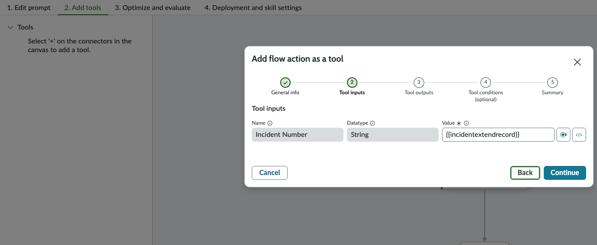

> `{{incidentextendrecord}}` is the skill input defined in Step 4 — it is passed directly into the Flow Action here. This is how the runtime Incident record is threaded through the skill into the pre-processing tool.

Click **Continue**.

***

### Step 8: Configure the Flow Action Tool — Tool Outputs

**Step 3 — Tool outputs:**

The Flow Action returns the following outputs from the extended Incident table. All outputs flow into the prompt template as context variables:

| Output field         | Type       | Used for                                  |
| -------------------- | ---------- | ----------------------------------------- |
| Action Status        | Object     | Execution status of the Flow Action       |
| Short Description    | String     | Incident short description                |
| Don't Treat as Error | True/False | Error handling flag                       |
| Description          | String     | Full incident description                 |
| Configuration Item   | String     | Affected CI name                          |
| Error Code           | String     | Extracted error code (from NADI)          |
| Product Bar Code     | String     | Device barcode                            |
| Product Name         | String     | Device product name                       |
| Serial Number        | String     | Device serial number                      |
| Category             | String     | Incident category                         |
| Work Notes           | String     | Diagnostic notes from the L1 conversation |

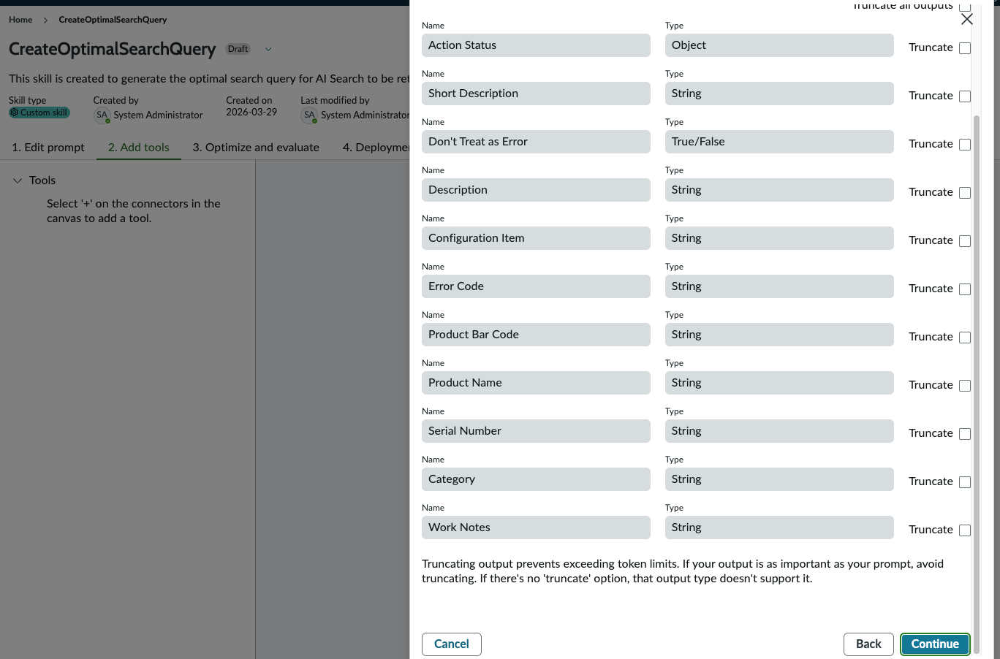

> Truncation is available per output field — enabling truncation trims the field value if it exceeds the token limit, keeping the prompt intact. Leave all truncation unchecked unless you hit token limit issues in testing.

Click **Continue**.

***

### Step 9: Configure the Flow Action Tool — Tool Conditions

**Step 4 — Tool conditions (optional):**

| Field | Value                 |
| ----- | --------------------- |
| Type  | **None (Always run)** |

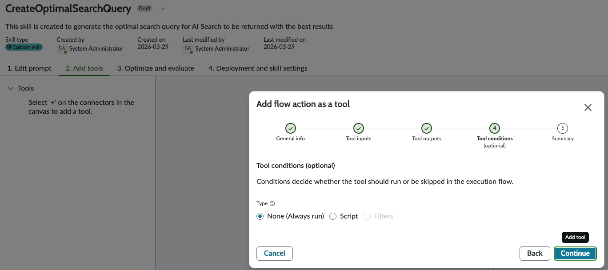

> Tool conditions let you specify whether the tool should run or be skipped based on a script or filter. **None (Always run)** means the `GetIncidentExtendDetail` Flow Action executes unconditionally every time the skill is invoked — the correct setting here since the prompt always needs the Incident context.

Click **Continue** → review the Summary → click **Add tool**.

***

### Step 10: Review Tool Summary

**Step 5 — Summary:**

Verify all fields before adding:

| Section         | Field           | Value                                                      |
| --------------- | --------------- | ---------------------------------------------------------- |
| Type            | —               | Flow Action                                                |
| General info    | Name            | `GetIncidentExtendDetail`                                  |
| General info    | Resource        | `Retrieval of Relevant Fields from Incident Extract table` |
| Inputs          | Incident Number | `{{incidentextendrecord}}`                                 |
| Outputs         | (all 11 fields) | String / Object / True/False as defined                    |
| Tool conditions | Type            | none                                                       |

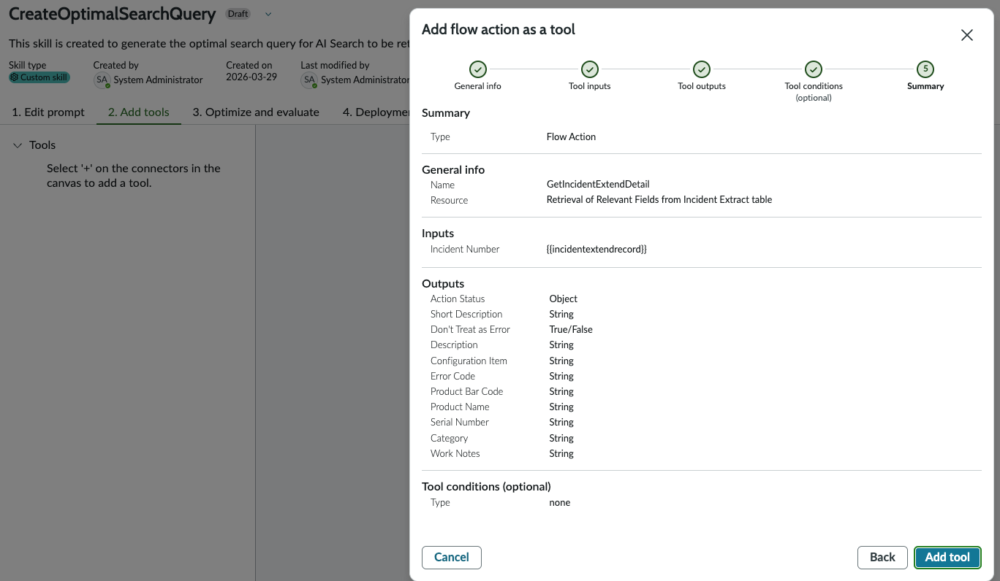

Click **Add tool**.

***

### Step 11: Verify Canvas

After adding the tool, the canvas updates to show the full skill execution flow:

```
Start
  │
  ▼
GetIncidentExtendDetail   ← Flow Action (Tool node)
  │
  ▼
GenerateOptimalProm...    ← Skill Prompt node (auto-created)
  │
  ▼
End
```

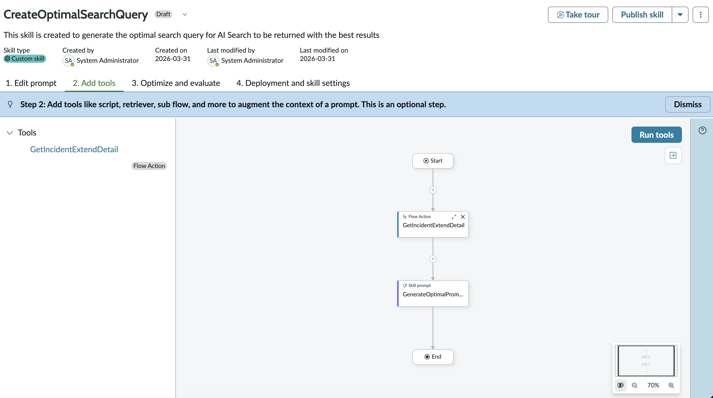

The left panel shows **Tools** → `GetIncidentExtendDetail` / Flow Action.

> The **Skill prompt** node (`GenerateOptimalProm...` = `GenerateOptimalPromptForRAG`) is the LLM prompt step. Navigate to **Step 1: Edit prompt** to author the prompt template — reference the Flow Action outputs using `{{GetIncidentExtendDetail.field_name}}` syntax (e.g. `{{GetIncidentExtendDetail.short_description}}`, `{{GetIncidentExtendDetail.error_code}}`).

***

### Step 12: Configure Deployment Settings

Navigate to **Step 4: Deployment and skill settings** → select **Deployment settings** from the left nav.

| Field    | Value                          |
| -------- | ------------------------------ |
| Workflow | `Other`                        |
| Product  | (leave blank — not applicable) |

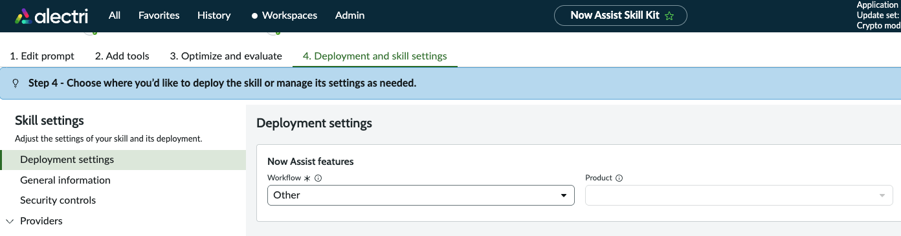

> The **Workflow** field determines where this skill appears in the Now Assist Admin → Skills catalogue. Setting it to **Other** places the skill under the **Other** category — making it findable when activating it for use in Flow Designer.

***

### Step 13: Publish the Skill

Click **Publish skill** (top right of the skill editor).

The **Publish Skill** dialog opens:

Review the deployment settings summary:

| Field           | Value          |
| --------------- | -------------- |
| Workflow        | Other          |
| Product         | Not Applicable |
| Feature         | Not Applicable |
| Display Options | None           |

Under **Select which finalized prompts to include in the Published skill:**

| Provider                                             | Prompt                                              | Action     |
| ---------------------------------------------------- | --------------------------------------------------- | ---------  |
| Now LLM Service (Now LLM Generic) — Default provider | `GenerateOptimalPromptForRAG (v1)` — Default prompt | ✅ Checked |

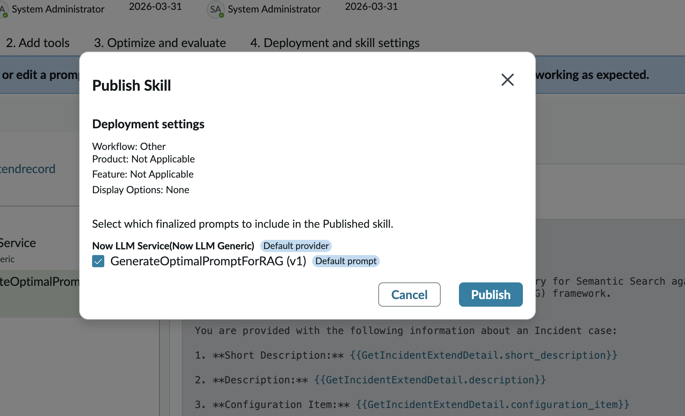

Click **Publish**.

> A prompt must be **finalized** before it can be selected here. If no finalized prompts appear, return to Step 1 (Edit prompt), complete the prompt, and click **Finalize prompt** before returning to publish.

***

### Step 14: Activate the Skill

After publishing, navigate to **All → Admin Center → Now Assist Admin → Now Assist Skills** tab.

Locate `CreateOptimalSearchQuery` under the **Other** workflow (it will show **Custom | Not started | Now LLM Service**). Click **Turn on** → set role restrictions as required → confirm activation.

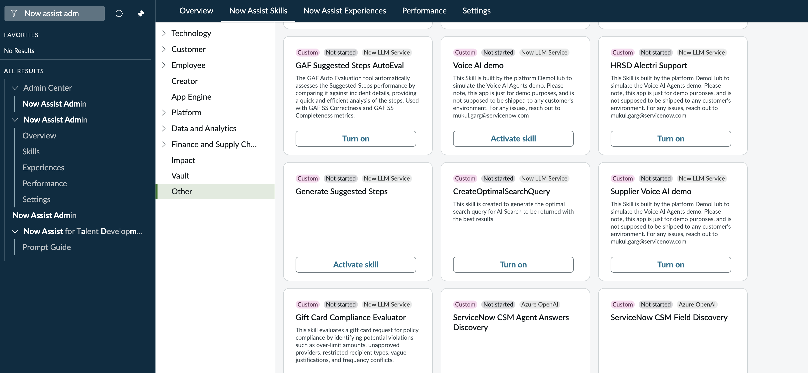

> The skill must be **Active** in Now Assist Admin for it to be callable as a Flow Action from the Fulfiller Flow in Flow Designer. Publishing alone is not sufficient — activation is a separate step.

***

## Key Configuration Summary

| Field                   | Value                                                      |
| ----------------------- | ---------------------------------------------------------- |
| Skill name              | `CreateOptimalSearchQuery`                                 |
| Skill type              | Custom skill                                               |
| Default provider        | Azure OpenAI / Now LLM generic                             |
| Skill input             | `incidentextendrecord` (String)                            |
| Tool                    | `GetIncidentExtendDetail` — Flow Action                    |
| Tool resource           | `Retrieval of Relevant Fields from Incident Extract table` |
| Tool input              | `Incident Number` → `{{incidentextendrecord}}`             |
| Tool outputs            | 11 fields from extended Incident table                     |
| Tool condition          | None (Always run)                                          |
| Prompt                  | `GenerateOptimalPromptForRAG (v1)`                         |
| Workflow (deployment)   | Other                                                      |
| User access             | Select roles → `itil`                                      |
| Role restrictions       | `itil`                                                     |
| Status after activation | Active                                                     |

***

## Technical Notes

### Flow Action Outputs as Prompt Context

All 11 outputs from `GetIncidentExtendDetail` are available as template variables in the skill prompt using the syntax `{{GetIncidentExtendDetail.<output_name>}}`. The prompt uses these to construct a semantically rich query — combining the error code, CI name, product details, and work notes into a single optimised string that AI Search can rank accurately.

### Why "Retrieval of Relevant Fields from Incident Extract table"?

The standard Incident table does not contain the custom fields added by NADI (`u_extracted_error_code`, product barcode, serial number, etc.). The `GetIncidentExtendDetail` Flow Action reads from the **extended Incident table** (`x_nava_agentic_lab_incident_extend`) which stores these enriched fields — giving the LLM the full device and error context it needs to generate a precise query.

### Tool Condition: None (Always run)

Tool conditions can be used to skip a tool based on a script evaluation or filter — for example, only running a retriever if a field is non-empty. For this skill, `None (Always run)` is correct: the Flow Action must always fire because the prompt has no fallback context without it.

### Finalize vs Publish

In NASK, prompts go through a two-stage lifecycle: **Finalize** locks the prompt version (creating v1, v2, etc.) and **Publish** deploys the skill with selected finalized prompts to the Now Assist ecosystem. You can have multiple finalized versions and choose which to publish. The published version is what runs in production.

***

## Reference

* [Now Assist Skill Kit — Tool and Deployment Options](https://www.servicenow.com/community/now-assist-articles/now-assist-skill-kit-tool-and-deployment-options/ta-p/3284803)
* [Now Assist Skill Kit FAQ](https://www.servicenow.com/community/now-assist-articles/now-assist-skill-kit-nask-faq/ta-p/3007953)
* [Creating a Custom Skill with NASK — Part 1](https://www.servicenow.com/community/developer-blog/creating-a-custom-skill-with-now-assist-skill-kit-part-1/ba-p/3448719)
* [Trigger a Custom Skill via Flow — Part 1](https://www.servicenow.com/community/developer-blog/trigger-a-custom-now-assist-skill-via-flow-part-1/ba-p/3453557)

***

## Next Steps

→ The published `CreateOptimalSearchQuery` skill outputs an optimised query string that feeds directly into the next step of the Fulfiller Flow.

→ Continue to the next section to configure the `RetrieveRelevantKBContent` skill (Path A — Step 2), which takes this query and fetches ranked Knowledge Base results using the AI Search RAG retriever.
