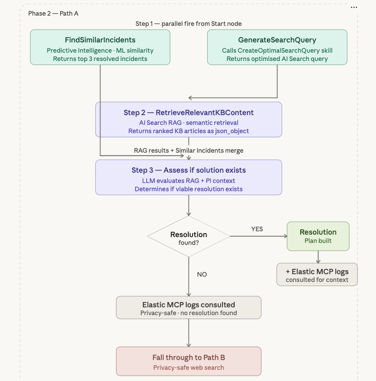
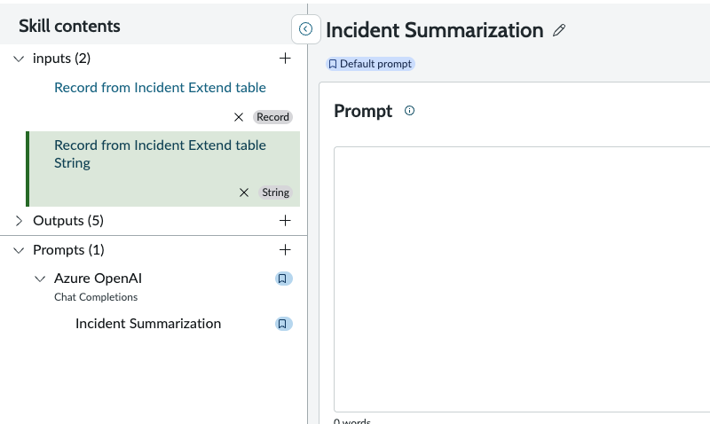
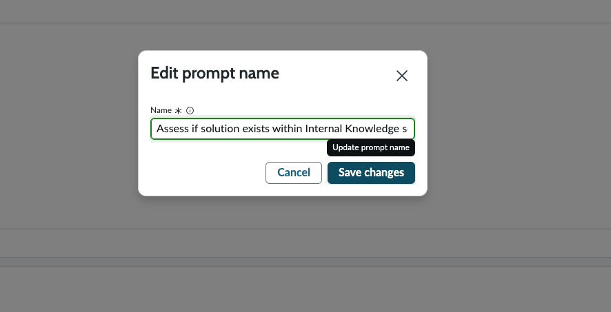
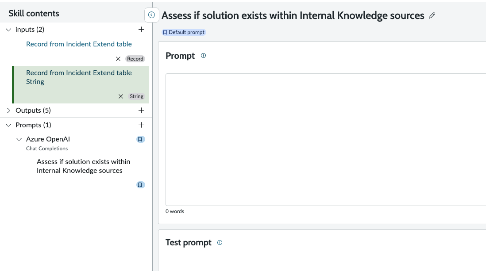
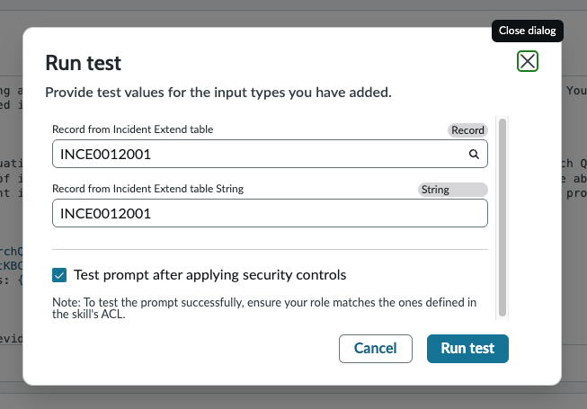
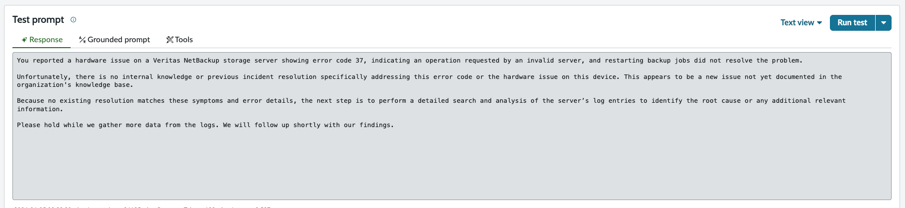
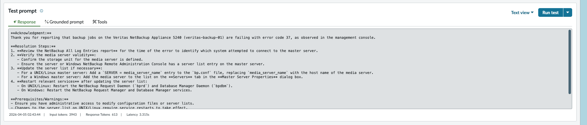

# 04b — NASK: ResolutionFinderInternalData

> **Release:** Zurich | **Flow:** Fulfiller Flow — Phase 2, Path A (Steps 1–3) **Source:** [Now Assist Skill Kit — Tool and Deployment Options](https://www.servicenow.com/community/now-assist-articles/now-assist-skill-kit-tool-and-deployment-options/ta-p/3284803) | [NASK FAQ](https://www.servicenow.com/community/now-assist-articles/now-assist-skill-kit-nask-faq/ta-p/3007953)

***

## What It Is

`ResolutionFinderInternalData` is the **orchestrating skill** for the Fulfiller Flow. It combines three tools — two running in parallel and one sequentially — then feeds all their outputs into a single LLM reasoning step that determines whether a viable resolution exists.

This skill covers **all three steps of Path A**:



> **Correct canvas topology:** `FindSimilarIncidents` and `GenerateSearchQueryAgainstAISearch` fire in parallel. `GenerateSearchQueryAgainstAISearch.response` feeds directly into `RetrieveRelevantKBContent` as the search query. `FindSimilarIncidents` output bypasses the Retriever and merges at the `Assess if solution exists` prompt together with the RAG results.

.png>)

***

## Skill Architecture

| Node                                 | Type                    | Fires                      | Purpose                                                                           |
| ------------------------------------ | ----------------------- | -------------------------- | --------------------------------------------------------------------------------- |
| `FindSimilarIncidents`               | Predictive Intelligence | Parallel (from Start)      | ML similarity — top 3 similar resolved incidents as `json_object`                 |
| `GenerateSearchQueryAgainstAISearch` | Skill (parallel node)   | Parallel (from Start)      | Calls `CreateOptimalSearchQuery` — returns optimised query string                 |
| `RetrieveRelevantKBContent`          | Retriever (RAG)         | After GenerateSearchQuery  | Semantic KB search using optimised query — returns `Rag Results` as `json_object` |
| `Assess if solution exist...`        | Skill Prompt            | After Retriever + PI merge | LLM reasoning — evaluates RAG + PI combined output                                |

***

## Skill Inputs

| Input name                                 | Datatype                              | Used by                                                                                         |
| ------------------------------------------ | ------------------------------------- | ----------------------------------------------------------------------------------------------- |
| `Record from Incident Extend table`        | **Record** (table: `incident extend`) | `FindSimilarIncidents` — PI tool reads record fields directly                                   |
| `Record from Incident Extend table String` | **String**                            | `GenerateSearchQueryAgainstAISearch` — passes as `{{record_from_incident_extend_table_string}}` |

***

## Prerequisites

| Requirement                      | Detail                                                                     |
| -------------------------------- | -------------------------------------------------------------------------- |
| Now LLM Service or Azure OpenAI  | LLM provider configured in the instance                                    |
| `CreateOptimalSearchQuery` skill | Published and active                                                       |
| PI solution                      | `Find possible resolution for similar Incident cases` — trained and active |
| AI Search / RAG                  | Enabled — Search profile `quick_action_kb_search_profile` configured       |
| KB articles                      | Indexed with E5FT embedding model on `body` and `title` semantic indexes   |
| Incident Extend table            | `x_snc_apacaienable_incident_extend` — populated before skill fires        |

***

## Lab Exercise — Steps to Build

### Step 1: Create the Skill — General Info

Navigate to **All → Now Assist Skill Kit → Home → Create skill**.

| Field                | Value                                                                                                                                                                                                                                                                                                                          |
| -------------------- | ------------------------------------------------------------------------------------------------------------------------------------------------------------------------------------------------------------------------------------------------------------------------------------------------------------------------------ |
| Skill name           | `ResolutionFinderInternalData`                                                                                                                                                                                                                                                                                                 |
| Description          | `This skill is meant to find possible resolution(s) for an Incident case (x_snc_apacaienable_incident_extend) by going through information internal to the ServiceNow instance. Specifically, it goes through Knowledge Bases (configured through Search Profiles) and recommendations generated from Predictive Intelligence` |
| Default provider     | `Azure OpenAI`                                                                                                                                                                                                                                                                                                                 |
| Default provider API | `Chat Completions`                                                                                                                                                                                                                                                                                                             |

.png>)

***

### Step 2: Configure Security Controls

| Field                           | Value          |
| ------------------------------- | -------------- |
| User access                     | `Select roles` |
| Roles                           | `itil`         |
| Apply role restrictions — Roles | `itil, x_snc_apacaienable.incident_extend_user`         |


***

### Step 3: Add Skill Inputs

Two inputs are required — one per tool type.

#### Input 1 — Record (for Predictive Intelligence tool)

| Field                | Value                               |
| -------------------- | ----------------------------------- |
| Datatype             | `Record`                            |
| Table name           | `incident extend`                   |
| Name                 | `Record from Incident Extend table` |
| Description          | `Record from Incident Extend table` |
| Make input mandatory | Unchecked                           |
| Allow truncation     | Unchecked                           |

.png>)

#### Input 2 — String (for Skill tool)

| Field                | Value                                      |
| -------------------- | ------------------------------------------ |
| Datatype             | `String`                                   |
| Name                 | `Record from Incident Extend table String` |
| Description          | `Record from Incident Extend table String` |
| Make input mandatory | Unchecked                                  |
| Allow truncation     | Unchecked                                  |

.png>)

***

### Step 4: Rename the Prompt

When the skill is created, NASK auto-generates a default prompt named **Incident Summarization**. This default name is misleading — this skill does not summarise incidents. It evaluates whether a viable resolution exists based on internal knowledge sources. The prompt must be renamed to reflect its actual purpose.

1. In the **Skill contents** panel (left side), expand **Prompts** → **Azure OpenAI** → **Chat Completions**
2. Click on **Incident Summarization** to select it



3. Click the **pencil icon** next to the prompt name to open the **Edit prompt name** dialog
4. Change the **Name** from `Incident Summarization` to `Assess if solution exists within Internal Knowledge sources`



5. Click **Save changes**
6. Confirm the prompt name now displays as **Assess if solution exists within Internal Knowledge sources** in the Skill contents panel and the prompt editor header



> The prompt name appears throughout the skill — on the canvas (as the Skill prompt node label), in the Publish dialog, and in the finalized prompt selector. Renaming it now ensures consistency across all surfaces. This is also the prompt name that appears when you publish the skill in Step 11.

***

### Step 5: Add Tool 1 — Predictive Intelligence (FindSimilarIncidents)

Navigate to the **Add tools** tab. Click **+** on the canvas → **Tool node** → **Add**.

Select **Predictive Intelligence** → **Configure tool**.

.png>)

#### Step 5a — General Info

| Field            | Value                                                                                    |
| ---------------- | ---------------------------------------------------------------------------------------- |
| Name             | `FindSimilarIncidents`                                                                   |
| Type of solution | `Workflow Similarity`                                                                    |
| Solution label   | `Find possible resolution for similar Incident cases`                                    |
| Solution name    | `ml_x_snc_x_snc_apacaienable_global_find_possible_resolution_for_similar_incident_cases` |

.png>)

#### Step 5b — Tool Inputs

| Input name          | Datatype | Value                                                     |
| ------------------- | -------- | --------------------------------------------------------- |
| `category`          | string   | `{{record_from_incident_extend_table.category}}`          |
| `cmdb_ci`           | string   | `{{record_from_incident_extend_table.cmdb_ci}}`           |
| `error_code`        | string   | `{{record_from_incident_extend_table.error_code}}`        |
| `pn_bar_code`       | string   | `{{record_from_incident_extend_table.pn_bar_code}}`       |
| `product`           | string   | `{{record_from_incident_extend_table.product}}`           |
| `serial_number`     | string   | `{{record_from_incident_extend_table.serial_number}}`     |
| `short_description` | string   | `{{record_from_incident_extend_table.short_description}}` |
| `topNResult`        | —        | `3`                                                       |

.png>)

#### Step 5c — Tool Outputs

| Output    | Type          |
| --------- | ------------- |
| `outputs` | `json_object` |

.png>)

#### Step 5d — Tool Conditions

Type: **None (Always run)**

.png>)

#### Step 5e — Summary

Verify and click **Save changes**.

.png>)

> After saving, the canvas shows the FindSimilarIncidents node added below Start:

.png>)

***

### Step 6: Add Tool 2 — Skill (GenerateSearchQueryAgainstAISearch) as Parallel Node

Click the **+** on the **parallel branch from Start**. Select **Tool node** → **Add**.

.png>)

Select **Skill**, check **Add as parallel node** → **Configure tool**.

.png>)

#### Step 6a — General Info

| Field        | Value                                                                                                           |
| ------------ | --------------------------------------------------------------------------------------------------------------- |
| Name         | `GenerateSearchQueryAgainstAISearch`                                                                            |
| Description  | `This skill is created to generate the optimal search query for AI Search to be returned with the best results` |
| Resource     | `CreateOptimalSearchQuery`                                                                                      |
| Provider API | `Chat Completions`                                                                                              |

.png>)

#### Step 6b — Tool Inputs

| Input                  | Datatype | Value                                          |
| ---------------------- | -------- | ---------------------------------------------- |
| `incidentextendrecord` | string   | `{{record_from_incident_extend_table_string}}` |

.png>)

#### Step 6c — Tool Outputs

| Output      | Type   |
| ----------- | ------ |
| `provider`  | string |
| `response`  | string |
| `error`     | string |
| `errorCode` | string |
| `status`    | string |

> `response` carries the optimised AI Search query string — this is what `RetrieveRelevantKBContent` uses as its search query input.

.png>)

#### Step 6d — Tool Conditions

Type: **None (Always run)**

.png>)

#### Step 6e — Summary

Verify **Add as a parallel node: Yes** → click **Add tool**.

.png>)

***

### Step 7: Canvas State After Two Parallel Tools

With both parallel tools added, the canvas shows:

```
                    Start
                      │
          ┌───────────┴───────────┐
          ▼                       ▼
FindSimilarIncidents        GenerateSearchQuery...
(Predictive Intelligence)   (Skill — parallel node)
          │                       │
          └──────────+──────────┘
                     │
              Assess if solution exist...
              (Skill Prompt)
                     │
                    End
```

.png>)

> At this point the Retriever has not yet been added. The next step inserts `RetrieveRelevantKBContent` between `GenerateSearchQueryAgainstAISearch` and the `Assess if solution exists` prompt. Click on the **(+)** connector on the line **after the GenerateSearchQueryAgainstAISearch node** — not the one after Predictive Intelligence.

***

### Step 8: Add Tool 3 — Retriever (RetrieveRelevantKBContent)

Click the **+** connector on the `GenerateSearchQueryAgainstAISearch` branch (as described above). Select **Tool node** → **Add**.

.png>)

The tool type picker appears. Select **Retriever** → **Configure tool**.

.png>)

The **Add retriever as a tool** wizard opens (5 steps).

***

#### Step 8a — General Info

| Field       | Value                                                                                                                                         |
| ----------- | --------------------------------------------------------------------------------------------------------------------------------------------- |
| Name        | `RetrieveRelevantKBContent`                                                                                                                   |
| Description | `This is capability which can be used to retrieve the results from multiple context(keyword, semantic, hybrid) based on the inputs provided.` |
| Resource    | `RAG`                                                                                                                                         |

.png>)

> **Resource: RAG** is the platform's built-in Retrieval Augmented Generation engine. It handles the AI Search query, embedding, chunking, and re-ranking pipeline internally — the configuration below controls its behaviour for this specific retrieval.

Click **Continue**.

***

#### Step 8b — Tool Inputs

The retriever tool inputs configure the full search pipeline. This is the most detailed configuration step in the skill.

**Core search configuration:**

| Field             | Value                                                                                                                                   |
| ----------------- | --------------------------------------------------------------------------------------------------------------------------------------- |
| Search query      | `{{GenerateSearchQueryAgainstAISearch.response}}`                                                                                       |
| Search space type | `Search-profile-based`                                                                                                                  |
| Search profile    | `Quick Action - KB Search Profile`                                                                                                      |
| Search sources    | `kb_knowledge`                                                                                                                          |
| Fields returned   | `kb_knowledge.text`, `kb_knowledge.short_description`, `kb_knowledge.article_type`, `kb_knowledge.category`, `kb_knowledge.description` |
| Limit             | `10`                                                                                                                                    |
| Search Criteria   | `Semantic`                                                                                                                              |
| Rewrite query     | `No` (unchecked)                                                                                                                        |
| Embedding model   | `ServiceNow Embedding (E5)`                                                                                                             |
| Semantic Indexes  | `body`, `title`                                                                                                                         |

.png>)

> \*\*If your 'Edit retriever tool' form does not look like the one above, it is likely a UI defect. Refer to [NASK Retriever workaround](nask-retriever-defect.md) for temporary workaround.

> **Search query wired to the parallel skill output:** `{{GenerateSearchQueryAgainstAISearch.response}}` is the optimised query string produced by `CreateOptimalSearchQuery`. This is the critical data hand-off — the LLM-generated query drives the semantic KB search.
>
> **Rewrite query must be disabled.** The upstream `CreateOptimalSearchQuery` skill has already optimised the query using the full Incident context and the structured `ISSUE → SYMPTOMS → ERROR → SYSTEM → CATEGORY → DESCRIPTION` template. Enabling Rewrite query would allow the RAG engine to rewrite the query with its own LLM pass — discarding the carefully constructed upstream output. Keep this unchecked.
>
> **Search-profile-based** uses the `quick_action_kb_search_profile` search profile, which defines which KB sources and indexes are searched. **Semantic** criteria uses the E5FT embedding model to find semantically similar articles, not just keyword matches.

**Advanced settings — Chunking:**

| Field                             | Value                 |
| --------------------------------- | --------------------- |
| Document matching threshold       | `0.8`                 |
| Chunking and Re-Ranking           | ✅ Enabled             |
| Chunking strategy                 | `Small to Big`        |
| Chunking unit                     | `Words (Recommended)` |
| Chunk Size                        | `750`                 |
| Expanded snippet size             | `750`                 |
| Max number of chunks per document | `10`                  |

.png>)

**Advanced settings — Re-Ranking:**

| Field         | Value |
| ------------- | ----- |
| Top K results | `3`   |

.png>)

> **Chunking — Small to Big:** Documents are chunked into small units (750 words) for precise similarity scoring, then expanded to 750-word snippets when returned to the prompt — giving the LLM sufficient context around the matched passage.
>
> **Document matching threshold 0.8:** Only chunks with a cosine similarity score ≥ 0.8 are considered relevant. This prevents low-relevance articles from polluting the prompt context.
>
> **Top K results: 3:** After re-ranking, only the top 3 chunks are returned to the skill prompt — matching the `topNResult: 3` pattern used for the PI tool, keeping total token consumption bounded.

Click **Continue**.

***

#### Step 8c — Tool Outputs

| Output        | Type          |
| ------------- | ------------- |
| `Rag Results` | `json_object` |

.png>)

> The `Rag Results` JSON object contains the top 3 re-ranked KB article chunks with their field values (`text`, `short_description`, `article_type`, `category`, `description`). The `Assess if solution exists` prompt receives this alongside `{{FindSimilarIncidents.outputs}}` to evaluate whether a resolution exists.

Click **Continue**.

***

#### Step 8d — Tool Conditions

Type: **None (Always run)**

.png>)

Click **Continue**.

***

#### Step 8e — Summary

Verify the complete configuration before saving:

| Section         | Field                       | Value                                                                            |
| --------------- | --------------------------- | -------------------------------------------------------------------------------- |
| Type            | —                           | Retriever                                                                        |
| General info    | Name                        | `RetrieveRelevantKBContent`                                                      |
| General info    | Resource                    | RAG                                                                              |
| Inputs          | Search query                | `{{GenerateSearchQueryAgainstAISearch.response}}`                                |
| Inputs          | Search space type           | Search-profile-based                                                             |
| Inputs          | Search profile              | `quick_action_kb_search_profile`                                                 |
| Inputs          | Search sources              | `kb_knowledge`                                                                   |
| Inputs          | Fields returned             | kb\_knowledge.text, .short\_description, .article\_type, .category, .description |
| Inputs          | Limit                       | 10                                                                               |
| Inputs          | Search Criteria             | Semantic                                                                         |
| Inputs          | Embedding model             | E5FT                                                                             |
| Inputs          | Semantic Indexes            | body, title                                                                      |
| Inputs          | Document matching threshold | 0.8                                                                              |
| Inputs          | Chunking                    | Small to Big, Words, 750/750, max 10                                             |
| Inputs          | Top K results               | 3                                                                                |
| Outputs         | Rag Results                 | json\_object                                                                     |
| Tool conditions | Type                        | none                                                                             |

.png>)

.png>)

Click **Save changes**.

***

### Step 9: Final Canvas — Complete Skill Flow

After all three tools are added, the canvas shows the complete four-node flow:

```
                        Start
                          │
            ┌─────────────┴─────────────┐
            ▼                           ▼
  FindSimilarIncidents          GenerateSearchQuery...
  (Predictive Intelligence)     (Skill — parallel node)
            │                           │
            │                           ▼
            │                  RetrieveRelevantKBCo...
            │                  (Retriever — RAG)
            │                           │
            └─────────────┬─────────────┘
                          ▼ (merge)
                  Assess if solution exist...
                  (Skill Prompt)
                          │
                          ▼
                         End
```

.png>)

**Tools panel (left):**

* `RetrieveRelevantKBContent` — Retriever
* `GenerateSearchQueryAgainstAISearch` — Skill
* `FindSimilarIncidents` — Predictive Intel...

> **Key topology:** `GenerateSearchQueryAgainstAISearch.response` flows into `RetrieveRelevantKBContent` as the search query. `FindSimilarIncidents` bypasses the Retriever entirely and merges directly at the `Assess if solution exists` prompt. The prompt therefore receives two context sources: `{{RetrieveRelevantKBContent.Rag Results}}` (KB articles) and `{{FindSimilarIncidents.outputs}}` (similar incidents).

***

### Step 10: Author the Prompt

Navigate back to **Step 1: Edit prompt** in the NASK wizard tab bar. Click on the **Assess if solution exists within Internal Knowledge sources** prompt in the Skill contents panel to open the prompt editor.

This is the most critical prompt in the entire skill — it is the LLM reasoning step that evaluates whether a viable resolution exists based on the combined output of all three tools: the AI Search query, the RAG results from KB articles, and the Predictive Intelligence similar incidents.

The prompt for this skill is provided in the lab repository. Copy the full prompt text from the following link listed in step 1 and paste it into the **Prompt** text area:

1. Open the file at [`../NASKprompts/ResolutionFinderInternalData-CustomNASK-Prompt`](https://raw.githubusercontent.com/raadlakha/AILab2.0/main/NASKprompts/ResolutionFinderInternalData-CustomNASK-Prompt) in the lab repository
2. **Read through the entire prompt before pasting anything.** This prompt is more complex than the upstream skills — it must reason across two distinct data sources (RAG KB results and PI similar incidents) and make a binary determination (resolution found or not). Understand the evaluation logic, the grounding constraints, and the expected output structure before proceeding
3. Copy the prompt text and paste it into the **Prompt** field in the NASK editor
4. **Review and adapt the prompt to your environment.** Agentic AI systems are intelligent systems — the prompts that drive them should not be treated as static artefacts to be copied verbatim. The provided prompt is a proven starting point, but your environment, data, and use case may warrant adjustments. Consider the following as you review:

| Area to Review                  | What to Consider                                                                                                                                                                                                                                                                                                                       |
| ------------------------------- | -------------------------------------------------------------------------------------------------------------------------------------------------------------------------------------------------------------------------------------------------------------------------------------------------------------------------------------- |
| Grounding constraint            | The prompt enforces that the LLM must base its evaluation **exclusively** on the three provided inputs (AI Search Query, RAG Results, PI Results). Verify this constraint aligns with your organisation's requirements — in some environments you may want to relax this to allow the LLM to draw on general knowledge as a supplement |
| RAG Results evaluation criteria | How should the LLM weigh KB article relevance? The prompt defines thresholds and matching criteria — adjust these if your KB articles are structured differently or if you want more/less permissive matching                                                                                                                          |
| PI Results evaluation criteria  | How should the LLM assess similar incident matches? Consider whether the top 3 results from PI are sufficient, or whether the evaluation logic should account for confidence scores or resolution quality                                                                                                                              |
| Output format and structure     | Does the expected output (resolution found / not found, with supporting evidence) align with how the downstream Agentic Workflow consumes the result? If the workflow expects specific field names or JSON structure, ensure the prompt produces them                                                                                  |
| Error code specificity          | Are the error codes in your Veritas NetBackup demo data consistent with the examples in the prompt? If your incidents reference different error codes or product types, update the examples accordingly                                                                                                                                |
| Tone and decision threshold     | How confident should the LLM be before confirming a resolution exists? A conservative prompt (requiring strong evidence from both RAG and PI) reduces false positives but may miss valid resolutions. A permissive prompt increases recall but risks hallucination                                                                     |

5. Verify that the prompt references the tool output variables correctly:
   * `{{GenerateSearchQueryAgainstAISearch.response}}` — the optimised search query from the upstream skill
   * `{{RetrieveRelevantKBContent.Rag Results}}` — the top 3 re-ranked KB article chunks
   * `{{FindSimilarIncidents.outputs}}` — the top 3 similar resolved incidents from PI
6. Click **Save** to save the prompt

> **Do not copy blindly.** The provided prompt has been tested against the Veritas NetBackup triage scenario and represents a considered approach to multi-source resolution evaluation — but it is a starting point, not a finished product. The strength of an agentic system lies in its ability to adapt to the data and context it operates in. As you run end-to-end tests and observe how the LLM reasons across RAG and PI outputs, you will find areas where the prompt benefits from iteration: tighter grounding rules, adjusted evaluation thresholds, additional examples of what constitutes a "valid" resolution, or restructured output formatting. Finalize v1 now, test it, and create v2 when you have real execution data to inform improvements.

***

### Step 11: Test the Prompt

Before publishing, use the built-in **Test prompt** feature to validate that the skill's three tools execute correctly and that the LLM produces an appropriate resolution evaluation. This skill is more complex to test than `CreateOptimalSearchQuery` — it involves three tools converging (PI, Skill, and Retriever), so the test validates the entire pipeline end-to-end.

1. In the NASK skill editor, locate the **Test prompt** panel (right-hand side of the prompt editor)
2. Click the **Run test** button — the **Run test** dialog opens
3. This skill requires **two inputs** (unlike the upstream skill which had one). Enter the same Incident Extend record number in both fields:

| Input field                                | Type   | Value         |
| ------------------------------------------ | ------ | ------------- |
| `Record from Incident Extend table`        | Record | `INCE0012001` |
| `Record from Incident Extend table String` | String | `INCE0012001` |

4. Ensure **Test prompt after applying security controls** is checked
5. Click **Run test**



> **Both inputs must reference the same record.** The Record input feeds the PI tool (which reads fields directly from the table), and the String input feeds the Skill tool (which passes the incident number to `CreateOptimalSearchQuery`). Using different values would cause the PI and RAG paths to evaluate different incidents — producing an incoherent result at the prompt merge.

6. Wait for the test to complete — the **Response** tab in the Test prompt panel will display the LLM-generated evaluation. The result will fall into one of two outcomes:

***

#### Outcome A — No Resolution Found (Path B fallthrough)

If the RAG results and PI similar incidents do not contain sufficient evidence to resolve the issue, the LLM will indicate that no internal resolution was found. The response will typically:

* Acknowledge the reported issue, error code, and affected system
* State that no internal knowledge or previous incident resolution matches the specific error and symptoms
* Indicate that the issue appears to be new or not yet documented
* Recommend next steps such as gathering additional data (e.g., log analysis)



> **What this means:** The downstream Agentic Workflow will fall through to **Path B** if searching log entries through Elastic MCP server does not return anything conclusive as well — a privacy-safe web search with PII stripped. This is the expected behaviour when the KB, historical incidents and log entries do not contain a matching resolution.

***

#### Outcome B — Resolution Found (Path A success)

If the RAG results and/or PI similar incidents contain relevant resolution information, the LLM will construct a resolution response. The response will typically include:

* An **Acknowledgment** confirming the reported issue, error code, affected system, and hostname
* **Resolution Steps** — a numbered, actionable set of steps derived from the KB articles and/or similar incident resolution notes (e.g., reviewing log entries, verifying server validity, updating configuration, restarting services)
* **Prerequisites / Warnings** — any conditions or caveats for executing the resolution steps



> **What this means:** The downstream Agentic Workflow will proceed with **Path A** — the resolution is written to the Incident work notes as a proposed Resolution Plan, and the flow continues to Phase 3.

***

#### What to verify across both outcomes

| Check                    | Expected Behaviour                                                                                                                                    |
| ------------------------ | ----------------------------------------------------------------------------------------------------------------------------------------------------- |
| All three tools executed | Click the **Tools** tab to confirm `FindSimilarIncidents`, `GenerateSearchQueryAgainstAISearch`, and `RetrieveRelevantKBContent` all ran successfully |
| Grounding constraint     | The response references only data from the KB articles (RAG) and/or similar incidents (PI) — no hallucinated external information                     |
| Error code accuracy      | The response correctly identifies the error code from the Incident record (e.g., error code 37)                                                       |
| System identification    | The response identifies the correct product and hostname (e.g., Veritas NetBackup Appliance 5240, veritas-backup-01)                                  |
| Binary determination     | The response clearly indicates whether a resolution was found or not — there should be no ambiguity                                                   |

> **Tip:** Click the **Grounded prompt** tab to inspect the fully rendered prompt sent to the LLM — this shows the actual RAG Results and PI outputs that were substituted into the prompt. The **Tools** tab shows the execution status and output of each tool individually. Both are essential for debugging when the response does not match expectations.
>
> **Testing with different records:** Run the test with multiple Incident Extend records to observe both outcomes. Records with common error codes that match KB articles (e.g., error code 84 with a published Veritas Backup Failure article) should produce Outcome B. Records with uncommon or undocumented error codes should produce Outcome A. Testing both paths confirms the skill's evaluation logic is working correctly.

7. If the response does not match the expected behaviour for either outcome, return to the prompt editor (Step 10) and adjust the evaluation logic, grounding constraints, or output structure — then re-finalize and re-test
8. Click **Manage prompt** → **Finalize prompt** to lock the prompt version

> **Finalize vs. Save:** Saving preserves your edits as a working draft. Finalizing locks the prompt as an immutable version (`v1`, `v2`, etc.) that can be selected for publishing. You must finalize at least one version before the prompt appears in the Publish dialog (Step 11). You can continue editing the draft after finalizing — subsequent finalizations create new versions without overwriting previous ones.

***

### Step 12: Publish the Skill

Navigate to the **Edit prompt** tab → finalize the `Assess if solution exists within Internal Knowledge sources` prompt → click **Publish skill**.

The **Publish Skill** dialog opens:

| Field           | Value                                                           |
| --------------- | --------------------------------------------------------------- |
| Workflow        | Other                                                           |
| Product         | Not Applicable                                                  |
| Feature         | Not Applicable                                                  |
| Display Options | None                                                            |
| Provider        | Azure OpenAI                                                    |
| Prompt          | `Assess if solution exists within Internal Knowledge sources` ✅ |

.png>)

Click **Publish**.

***

### Step 13: Activate the Skill

Navigate to **All → Admin Center → Now Assist Admin → Now Assist Skills → Other → Available**.

Locate `ResolutionFinderInternalData` → click **Turn on** → confirm activation.

.png>)

> The skill card shows **Inactive** status — this is expected for a newly published skill before activation. Click **Turn on** to make it callable from Flow Designer as an Execute Skill action in the Fulfiller Flow workflow.

***

## Key Configuration Summary

| Field               | Value                                                                                               |
| ------------------- | --------------------------------------------------------------------------------------------------- |
| Skill name          | `ResolutionFinderInternalData`                                                                      |
| Skill type          | Custom skill                                                                                        |
| Default provider    | Azure OpenAI / Chat Completions                                                                     |
| Input 1             | `Record from Incident Extend table` — Record (table: incident extend)                               |
| Input 2             | `Record from Incident Extend table String` — String                                                 |
| Tool 1              | `FindSimilarIncidents` — Predictive Intelligence — Workflow Similarity — topNResult: 3              |
| Tool 2              | `GenerateSearchQueryAgainstAISearch` — Skill — parallel node — Resource: `CreateOptimalSearchQuery` |
| Tool 3              | `RetrieveRelevantKBContent` — Retriever — RAG — Semantic — E5FT — Top K: 3                          |
| Search query source | `{{GenerateSearchQueryAgainstAISearch.response}}`                                                   |
| Search profile      | `quick_action_kb_search_profile`                                                                    |
| Prompt              | `Assess if solution exists within Internal Knowledge sources`                                       |
| User access         | Select roles → `itil`                                                                               |
| Role restrictions   | `itil, x_snc_apacaienable.incident_extend_user`                                                                                              |
| Deployment workflow | Other                                                                                               |

***

## Technical Notes

### Canvas Topology — Why the Retriever is Not Parallel

`FindSimilarIncidents` and `GenerateSearchQueryAgainstAISearch` run in parallel because they have no data dependency on each other. The Retriever (`RetrieveRelevantKBContent`) cannot run in parallel because it **depends on** `GenerateSearchQueryAgainstAISearch.response` as its search query — it must wait for that output before it can execute. This sequential dependency is enforced by placing the Retriever node on the `GenerateSearchQueryAgainstAISearch` branch, not on the parallel Start connectors.

### Semantic Search vs Keyword Search

The Retriever is configured with **Semantic** search criteria using the **ServiceNow Embedding (E5)** model. This means KB articles are matched by semantic similarity (cosine distance in embedding space) rather than literal keyword overlap. The `Assess if solution exists` prompt receives semantically relevant passages even when the user's error description doesn't use the exact words present in KB articles.

### Chunking — Small to Big

The Small to Big chunking strategy scores each small chunk (750 words) for relevance, then expands the returned snippet to 750 words in context. This balances retrieval precision (small chunks → more accurate similarity scores) with prompt richness (large snippets → more context for the LLM to reason from).

### Document Matching Threshold 0.8

A threshold of 0.8 (out of 1.0 cosine similarity) is deliberately high — only very similar content passes. This prevents the `Assess if solution exists` prompt from reasoning on loosely related articles, which could produce false positives (incorrectly claiming a solution exists when it doesn't).

### Prompt — Grounding Constraint

The `Assess if solution exists within Internal Knowledge sources` prompt operates under a strict grounding constraint: the LLM must base its evaluation **exclusively** on the three provided inputs — the AI Search Query, the RAG Results, and the Predictive Intelligence Results. It must not reference any external source of information. This prevents hallucination and ensures the skill only confirms resolutions that are actually present in the instance's KB or historical incidents.

### Rewrite Query — Why It Must Be Disabled

The `Rewrite query` setting in the Retriever tool controls whether the RAG engine applies its own LLM pass to rewrite the search query before executing the semantic search. For this skill, it must remain **unchecked**. The upstream `CreateOptimalSearchQuery` skill has already transformed the raw Incident data into a structured, template-driven query optimised for AI Search retrieval. Enabling Rewrite query would allow the RAG engine to overwrite this carefully constructed query with its own interpretation — potentially losing the structured `ISSUE → SYMPTOMS → ERROR → SYSTEM → CATEGORY → DESCRIPTION` format that maximises multi-facet retrieval quality.

***

## Reference

* [Now Assist Skill Kit — Tool and Deployment Options](https://www.servicenow.com/community/now-assist-articles/now-assist-skill-kit-tool-and-deployment-options/ta-p/3284803)
* [Now Assist Skill Kit FAQ](https://www.servicenow.com/community/now-assist-articles/now-assist-skill-kit-nask-faq/ta-p/3007953)
* [Retrievers and RAG in NASK](https://www.servicenow.com/community/now-assist-articles/now-assist-skill-kit-tool-and-deployment-options/ta-p/3284803)

***

## Next Steps

→ With `ResolutionFinderInternalData` published and active, it is invocable from Flow Designer via the **Execute Now Assist Skill** action in the Fulfiller Flow.

→ If `Assess if solution exists` confirms a resolution: the workflow builds a Resolution Plan, writes it to the Incident work notes, and continues to Phase 3 (External Integration / VM Remediation).

→ If no resolution is confirmed: the flow falls to **Path B** — a privacy-safe web search fires with PII and internal identifiers stripped from the query. If that also yields nothing, the Incident escalates to L2 manual pickup and Phase 3 is not triggered.
