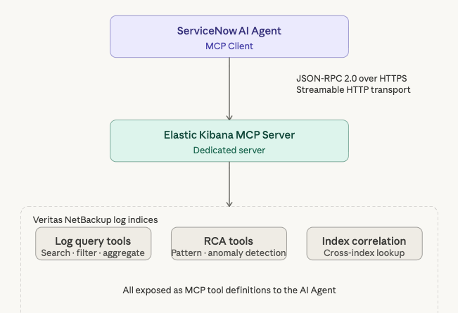
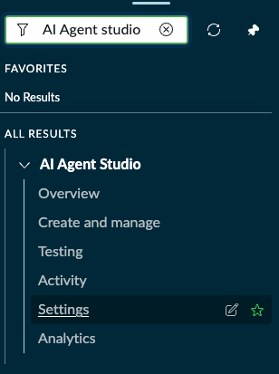

# 05 — Elastic MCP Integration

> **Release:** Zurich Patch 4+ | **Flow:** Fulfiller Flow — External Tool Integration **Source:** [Enable MCP and A2A for your agentic workflows](https://www.servicenow.com/community/now-assist-articles/enable-mcp-and-a2a-for-your-agentic-workflows-with-faqs-updated/ta-p/3373907) | [AI Agent Studio — Manage MCP servers](https://www.servicenow.com/docs/bundle/zurich-intelligent-experiences/page/administer/model-context-protocol-client/concept/add-mcp-client-on-ai-agent-studio.html)

***

## What It Is

**Model Context Protocol (MCP)** is an open standard (created by Anthropic, Nov 2024) that allows AI agents to connect to external tools, databases, and APIs in a consistent and discoverable way. ServiceNow's Zurich Patch 4 release introduces native MCP client support — making ServiceNow AI Agents able to consume external MCP servers as tool providers.

In this lab, ServiceNow acts as the **MCP client** and Elastic (Kibana) acts as the **MCP server**. The Elastic MCP server exposes the Veritas NetBackup log analysis and RCA tools — allowing the `Resolution Pathfinder for Incident case Agent` (Fulfiller flow) to query Elastic directly as a named tool, without needing a custom REST integration.



***

## Prerequisites

| Requirement             | Detail                                             |
| ----------------------- | -------------------------------------------------- |
| MCP Server Endpoint URL | Kibana endpoint active and URL to the MCP endpoint |
| API key                 | Elastic API key with access to the MCP endpoint    |

***

## Step 1: Validate Connectivity Before Configuring

Before registering the MCP server in ServiceNow, verify the Elastic endpoint is reachable and the API key is valid. Run the following curl from a terminal that has network access to the Elastic deployment:

```bash
curl -X POST \
  "https://b221c428a7b54a0ab8e12a6469693ba1.us-central1.gcp.cloud.es.io/api/agent_builder/mcp" \
  -H "Authorization: <ApiKey>" \
  -H "Content-Type: application/json" \
  -H "Accept: application/json, text/event-stream" \
  -d '{"id":1,"method":"initialize","params":{"clientInfo":{"name":"test-client","version":"1.0.0"},"capabilities":{},"protocolVersion":"2024-11-05"},"jsonrpc":"2.0"}'
```

Replace `<key>` with the Elastic API key value (format: `ApiKey <base64_encoded_id:api_key>`). Note that the word ApiKey within the format is **must**.

**Expected response:** A JSON-RPC 2.0 response containing the MCP server's `serverInfo`, `protocolVersion: "2024-11-05"`, and `capabilities` object — confirming the endpoint is live and the API key is authorised.

> **Protocol version note:** ServiceNow's MCP client supports protocol version `2024-11-05`. If the Elastic MCP server returns a protocol version mismatch error, confirm the Kibana deployment is on a compatible MCP version.

***

## Step 2: Navigate to Manage MCP Servers

Navigate to **All → AI Agent Studio → Settings → Manage MCP servers**.



The **Manage Model Context Protocol servers** page lists all registered MCP server connections. This is the central registry for all external tool providers available to AI Agents in this instance.

> **Navigation:** From AI Agent Studio, click the **Settings** tab in the top nav → select **Manage MCP servers** from the left nav panel (under External AI agents).

***

## Step 3: Add the Elastic MCP Server

Click **Add MCP server**. The **Add MCP server** dialog opens.


Configure the following fields:

| Field               | Value                                                                                                                                           |
| ------------------- | ----------------------------------------------------------------------------------------------------------------------------------------------- |
| Name                | `elasticMCPConn`                                                                                                                                |
| Authentication type | `API Key`                                                                                                                                       |
| MCP server URL      | `https://fb689ac9039a42bfb2458d8b4715423b.us-central1.gcp.cloud.es.io/api/agent_builder/mcp`                                                             |
| API key             | _(enter your Elastic API key — it will be provided during lab day itself, or reach out to the Lab instructors to provide you with the API key)_ |

> **Authentication type — API Key:** ServiceNow's MCP client supports three authentication modes: OAuth 2.1 (recommended for production), API Key, and Authless. API Key is used here because Elastic Kibana's MCP endpoint uses API key authentication. The key is stored securely as a Connection & Credential Alias — it is not stored in plaintext.
>
> **MCP server URL:** This is the Kibana agent builder MCP endpoint. It uses Streamable HTTP transport (the successor to SSE transport in the MCP spec). The `/api/agent_builder/mcp` path is Kibana's native MCP server mount point.

Click **Add**.

***

## Step 4: Verify the MCP Server Record

After adding, ServiceNow creates a **Model Context Protocol Server** record and a corresponding **Connection Alias**.

.png>)

Verify the record:

| Field            | Value                                                                                                   |
| ---------------- | ------------------------------------------------------------------------------------------------------- |
| Server name      | `elasticMCPconn` (or whatever you have decided to name it as)                                           |
| Connection Alias | `x_snc_apacaienable.elasticMCPconn_1775179359877` _(auto-generated, can be different across instances)_ |
| Application      | `x_nava_agentic_lab`                                                                                    |

***

## Step 5: Use the MCP Server Tool in an AI Agent

Once registered, the `elasticMCPConn` MCP server's tools are available as **MCP server tool** type in the AI Agent Studio tool picker.

To add an Elastic MCP tool to an AI Agent (to be added in section 06 - Resolution Pathfinder Agent):

1. Navigate to the AI Agent → **Add tools and information** tab
2. Click **Add tool ▼** → select **MCP server tool**
3. Select `elasticMCPconn` as the server
4. The available tools exposed by the Elastic MCP server will be listed — select the relevant log analysis or RCA tool
5. Configure the tool inputs and conditions as required

> The tools available from the MCP server are discovered dynamically using the MCP `tools/list` method at connection time. The list reflects whatever tools Kibana's agent builder has configured on the Elastic side — no manual tool definition is needed in ServiceNow.

***

## Key Configuration Summary

| Field               | Value                                                                               |
| ------------------- | ----------------------------------------------------------------------------------- |
| MCP server name     | `elasticMCPconn`                                                                    |
| Authentication type | API Key                                                                             |
| MCP server URL      | `https://fb689ac9039a42bfb2458d8b4715423b.us-central1.gcp.cloud.es.io/api/agent_builder/mcp` |
| API key             | _(your Elastic API key)_                                                            |
| Connection Alias    | `x_snc_apacaienable.elasticMCPconn_1775179359877` (auto-generated)                  |
| Application scope   | x\_nava\_agentic\_lab                                                               |
| Protocol version    | `2024-11-05`                                                                        |
| Transport           | Streamable HTTP                                                                     |
| Navigation          | All → AI Agent Studio → Settings → Manage MCP servers                               |

***

## Technical Notes

### MCP Client Architecture in ServiceNow

ServiceNow acts as the MCP **client** in this integration. The platform manages session lifecycle, authentication headers, and JSON-RPC 2.0 message framing. When an AI Agent invokes an MCP server tool during a conversation, the platform:

1. Looks up the Connection Alias for the named MCP server
2. Sends an `initialize` handshake to establish the session
3. Calls `tools/list` to discover available tools
4. Invokes the selected tool via `tools/call` with the provided inputs
5. Returns the tool response to the agent's context window

### Session Expiry

MCP sessions have a finite lifetime. After a session expires, further requests return a `400` error. ServiceNow refreshes sessions per-user — each user's first request after expiry generates a new session. If you observe consistent 400 errors across all users, check the `sn_mcp_client_server_session_mapping` table for accumulated stale sessions and clear them.

### Protocol Version Compatibility

The MCP `initialize` handshake negotiates the protocol version. ServiceNow's client uses `2024-11-05`. Ensure the Elastic Kibana MCP server (or whatever MCP server that you are trying to connect to in the future) is on a compatible version. If there is a mismatch, the connection will fail with a protocol version error in the ServiceNow system log (`sn_mcp_client.MCPRequestExecutor: MCP Protocol not supported version`).

***

## Reference

* [Enable MCP and A2A for your agentic workflows — ServiceNow Community](https://www.servicenow.com/community/now-assist-articles/enable-mcp-and-a2a-for-your-agentic-workflows-with-faqs-updated/ta-p/3373907)
* [Add an MCP server in AI Agent Studio — ServiceNow Docs](https://www.servicenow.com/docs/bundle/zurich-intelligent-experiences/page/administer/model-context-protocol-client/concept/add-mcp-client-on-ai-agent-studio.html)
* [MCP — The Protocol Powering Agentic AI — ServiceNow Community](https://www.servicenow.com/community/ceg-ai-coe-articles/mcp-the-protocol-powering-agentic-ai/ta-p/3508887)
* [Elastic Kibana — MCP Agent Builder endpoint documentation](https://www.elastic.co/docs)

***

## Next Step

Continue to [06 — Fulfiller AI Agent: Resolution Pathfinder](06-fulfiller-ai-agent.md) to build out your fulfiller flow AI Agent (Resolution Pathfinder for Incident case Agent) now that you have all the components needed!
