# 06 — Fulfiller AI Agent: Resolution Pathfinder for Incident case Agent

> **Release:** Zurich | **Flow:** Fulfiller Flow — Phase 2, all paths
> **Source:** [ServiceNow Zurich — AI Agent Studio](https://www.servicenow.com/docs/bundle/zurich-intelligent-experiences/page/administer/now-assist-ai-agents/concept/ai-agent-studio.html) | [Create an AI agent](https://www.servicenow.com/docs/r/zurich/intelligent-experiences/configure-next-best-action-agent.html) | [Add tools and information](https://www.servicenow.com/docs/r/zurich/intelligent-experiences/add-tool-aia.html)

---

## What It Is

The **Resolution Pathfinder for Incident case Agent** is a Chat AI Agent that operates on the fulfiller side — triggered automatically in the background when an Incident meets the Phase 2 trigger conditions. It is the orchestrating intelligence of the Fulfiller Flow, searching across three data sources in sequence to build a complete, actionable resolution plan and writing it directly to the Incident record.

The agent uses six tools covering all three search paths:

```
Fulfiller Flow — Phase 2 trigger:
  state = In Progress AND contact_type = chat AND u_extracted_error_code ≠ empty
        │
        ▼
Resolution Pathfinder for Incident case Agent
        │
        ├── Tool 1: Flow action — Retrieve relevant fields from Incident Extract table
        │          Reads incident context: error code, CI, product, description, work notes
        │
        ├── Tool 2: Now Assist skill — Resolution Finder Internal Data
        │          Calls ResolutionFinderUsingInternalData
        │          (PI similarity + KB RAG — Path A)
        │
        ├── Tool 3: Now Assist skill — Generate Web Search Question for Resolution Plan
        │          Calls GenerateWebSearchQnsForResolutionPlan
        │          Generates optimised web search query (Path B fallback)
        │
        ├── Tool 4: MCP server tool — platform_core_execute_esql
        │          Runs ES|QL query against Elastic — returns log results in tabular format
        │          Must receive query from platform_core_generate_esql or user verbatim
        │
        ├── Tool 5: MCP server tool — platform_core_get_index_mapping
        │          Retrieves Elastic index mappings — helps agent understand schema
        │          before constructing queries
        │
        └── Tool 6: Web search — Search the web
                   Gemini AI answer provider
                   Privacy-safe web search (Path B final fallback)
        │
        ▼
Agent writes resolution plan + source citation to Incident work notes
```

---

## What the Agent Enables

| Capability | Tool | How |
|-----------|------|-----|
| Incident context retrieval | Tool 1 — Flow action | Reads all enriched fields from the extended Incident table before any search begins |
| Internal KB + PI resolution | Tool 2 — Now Assist skill | Searches similar resolved incidents + KB articles via RAG and Predictive Intelligence |
| Web search query generation | Tool 3 — Now Assist skill (Supervised) | Generates a privacy-safe, optimised query for web search — supervised to ensure PII is stripped |
| Elastic log query execution | Tool 4 — MCP server tool | Executes ES\|QL queries against Elastic log indices — must use a pre-generated query |
| Elastic index discovery | Tool 5 — MCP server tool (Supervised) | Retrieves index mappings so agent can understand log schema before querying |
| Web search | Tool 6 — Web search | Gemini AI answer — searches the internet when internal and log sources yield no resolution |

---

## Prerequisites

| Requirement | Detail |
|-------------|--------|
| AI Agent Studio | Now Assist Pro+ — `sn_aia` plugin Active |
| `ResolutionFinderUsingInternalData` skill | Published and active (built in doc 03-part2) |
| `GenerateWebSearchQnsForResolutionPlan` skill | Published and active |
| Elastic MCP server | `elastic mcp server` registered in AI Agent Studio → Settings → Manage MCP servers (built in doc 05) |
| Web search provider | Gemini AI answer configured in Now Assist Admin |
| Role | `sn_aia.admin` or `admin` |

---

## Lab Exercise — Steps to Build

### Wizard Step 1 — Define the Specialty

Navigate to **All → AI Agent Studio → Create and manage → AI Agents → New**.

The wizard opens on **Define the specialty**.

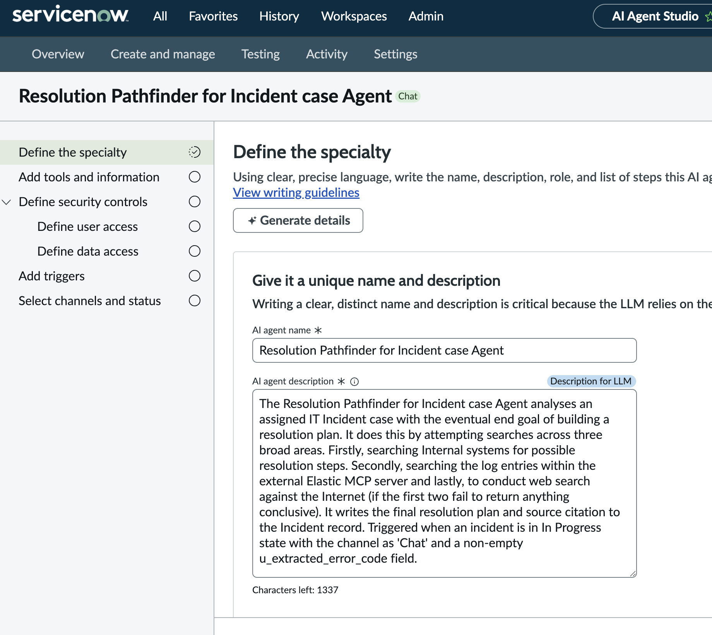

| Field | Value |
|-------|-------|
| AI agent name | `Resolution Pathfinder for Incident case Agent` |
| AI agent description *(Description for LLM)* | `The Resolution Pathfinder for Incident case Agent analyses an assigned IT Incident case with the eventual end goal of building a resolution plan. It does this by attempting searches across three broad areas. Firstly, searching Internal systems for possible resolution steps. Secondly, searching the log entries within the external Elastic MCP server and lastly, to conduct web search against the Internet (if the first two fail to return anything conclusive). It writes the final resolution plan and source citation to the Incident record. Triggered when an incident is in In Progress state with the channel as 'Chat' and a non-empty u_extracted_error_code field.` |

> The description explicitly covers all three search paths and the trigger conditions — this is critical because the LLM uses it to understand the agent's scope and the Orchestrator uses it to route queries to this agent.

Click **Save and continue**.

---

### Wizard Step 2 — Add Tools and Information

The wizard advances to **Add tools and information**.

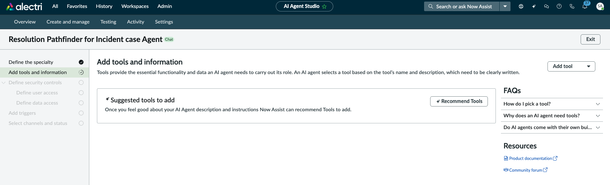

Six tools must be added. Use **Add tool ▼** to select the tool type for each.

---

#### Tool 1 — Flow Action (Retrieve Incident Fields)

From **Add tool ▼** select **Flow action**.

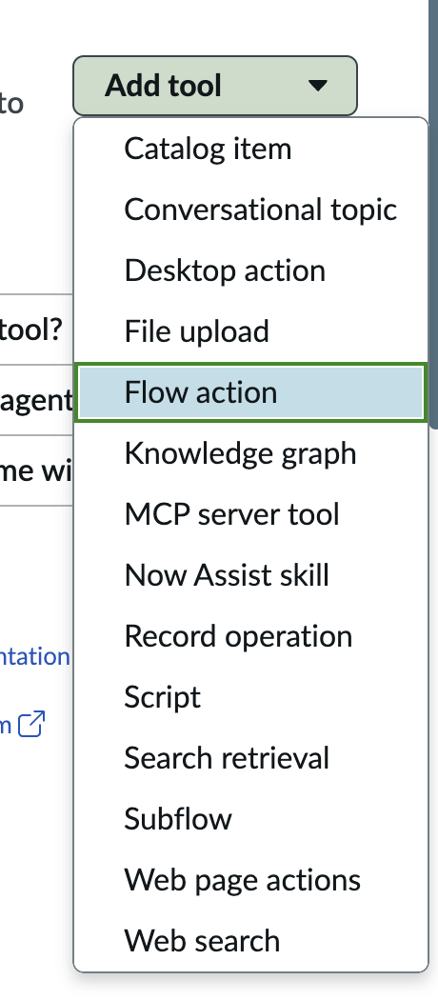

The **Edit flow action** dialog opens:

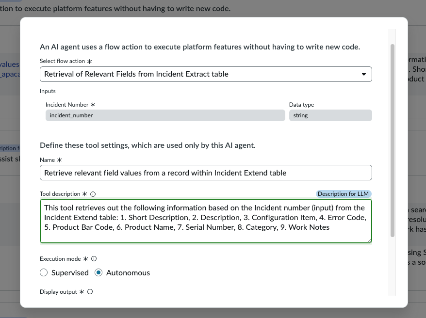

| Field | Value |
|-------|-------|
| Select flow action | `Retrieval of Relevant Fields from Incident Extract table` |
| Input — Incident Number | `incident_number` (string) |
| Name | `Retrieve relevant field values from a record within Incident Extract (x_snc_nava_incident_extend` |
| Tool description *(Description for LLM)* | `This tool retrieves out the following information based on the Incident_number (input) from the Incident Extract table: 1. Short Description, 2. Description, 3. Configuration Item, 4. Error Code, 5. Product Bar Code, 6. Product Name, 7. Serial Number, 8. Category, 9. Work Notes` |
| Execution mode | **Autonomous** |

> **Why first:** This tool gives the agent all the structured Incident context it needs before any search begins — error code, CI, product details, and prior work notes. All subsequent tools draw on this context to form their queries.

Click **Save**.

---

#### Tool 2 — Now Assist Skill (Resolution Finder Internal Data)

From **Add tool ▼** select **Now Assist skill**.


The **Edit Now Assist skill** dialog opens:

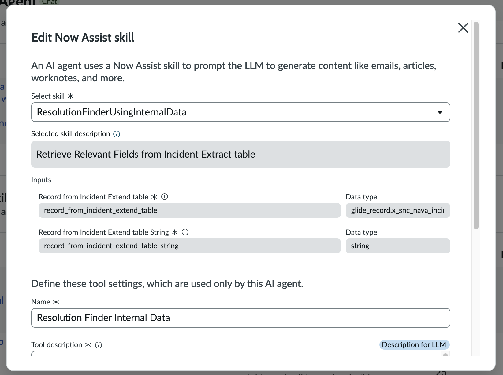

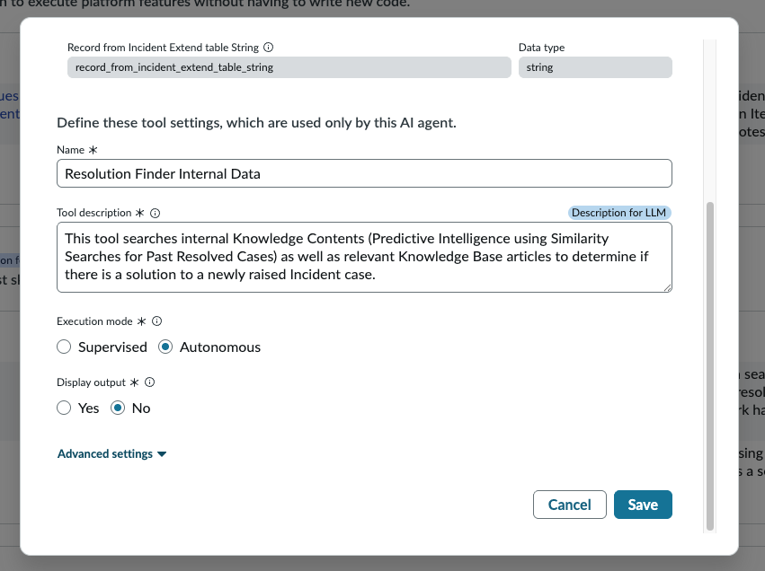

| Field | Value |
|-------|-------|
| Select skill | `ResolutionFinderUsingInternalData` |
| Selected skill description *(read-only)* | `Retrieve Relevant Fields from Incident Extract table` |
| Input — Record from Incident Extend table | `record_from_incident_extend_table` (glide_record.x_snc_nava_inci...) |
| Input — Record from Incident Extend table String | `record_from_incident_extend_table_string` (string) |
| Name | `Resolution Finder Internal Data` |
| Tool description *(Description for LLM)* | `This tool searches internal Knowledge Contents (Predictive Intelligence using Similarity Searches for Past Resolved Cases) as well as relevant Knowledge Base articles to determine if there is a solution to a newly raised Incident case.` |
| Execution mode | **Autonomous** |
| Display output | **No** |

> **Path A tool.** This is the first search path — it calls `ResolutionFinderUsingInternalData` which runs `FindSimilarIncidents` (PI) and `RetrieveRelevantKBContent` (RAG) in parallel. If a resolution is confirmed by the `Assess if solution exists` prompt within that skill, this is the terminal step and the agent writes the resolution plan to the Incident.

Click **Save**.

---

#### Tool 3 — Now Assist Skill (Generate Web Search Question)

From **Add tool ▼** select **Now Assist skill**.

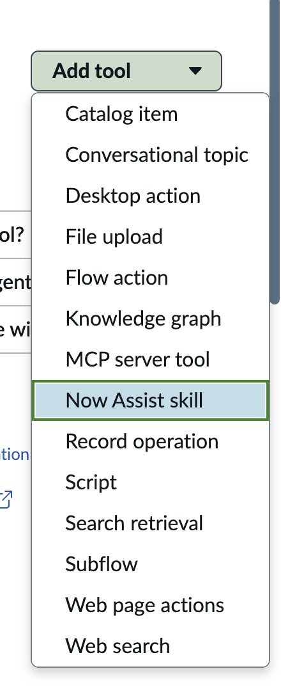

The **Edit Now Assist skill** dialog opens:

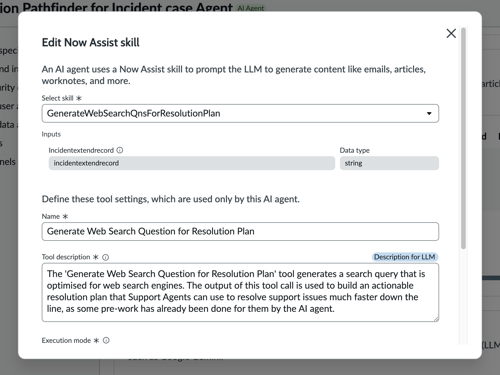

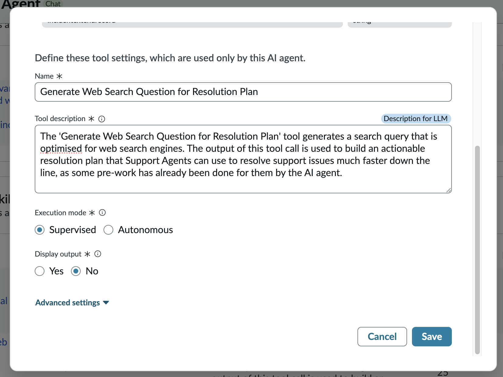

| Field | Value |
|-------|-------|
| Select skill | `GenerateWebSearchQnsForResolutionPlan` |
| Selected skill description *(read-only)* | `Retrieve Relevant Fields from Incident Extract table` |
| Input — Incidentextendrecord | `incidentextendrecord` (string) |
| Name | `Generate Web Search Question for Resolution Plan` |
| Tool description *(Description for LLM)* | `The 'Generate Web Search Question for Resolution Plan' tool generates a search query that is optimised for web search engines. The output of this tool call is used to build an actionable resolution plan that Support Agents can use to resolve support issues much faster down the line, as some pre-work has already been done for them by the AI agent.` |
| Execution mode | **Supervised** |
| Display output | **No** |

> **Path B tool — Supervised.** Execution mode is **Supervised** rather than Autonomous — this is deliberate. Web search query generation must be reviewed before sending externally, ensuring PII and internal identifiers are stripped from the query. The agent pauses and presents the generated query for approval before proceeding to Tool 6 (Web search).

Click **Save**.

---

#### Tool 4 — MCP Server Tool (platform_core_execute_esql)

From **Add tool ▼** select **MCP server tool**.

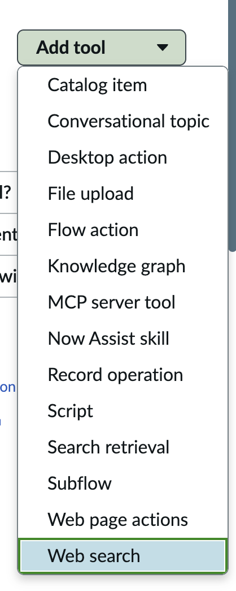

The **Add a Model Context Protocol Tool** dialog opens:

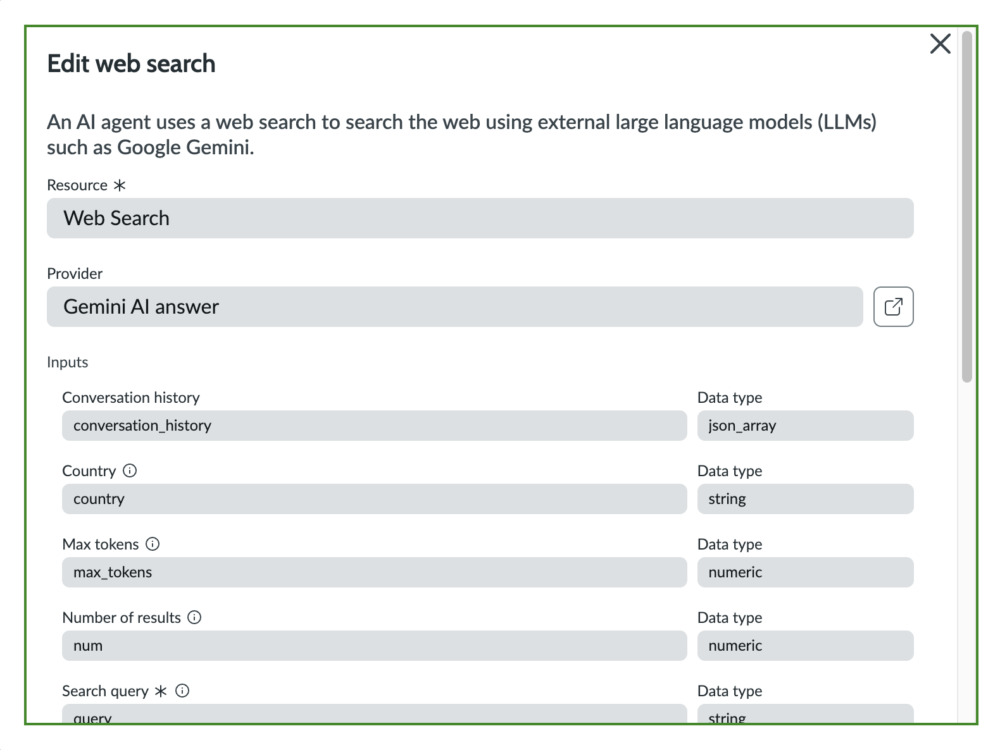

| Field | Value |
|-------|-------|
| Select Model Context Protocol server | `elastic mcp server` |
| Select tool | `platform_core_execute_esql` |

The tool settings section:

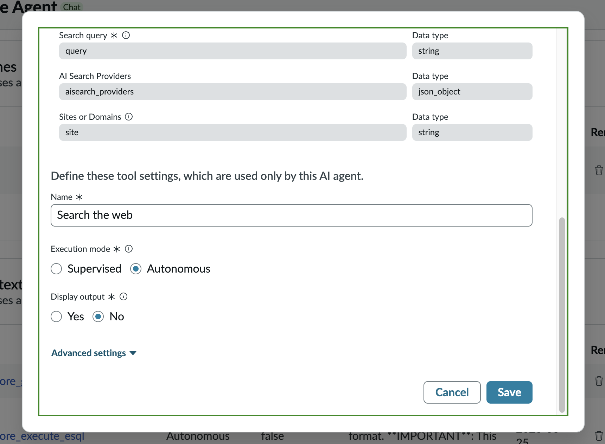

| Field | Value |
|-------|-------|
| Name | `platform_core_execute_esql` |
| Tool description *(Description for LLM)* | `Execute an ES\|QL query and return the results in a tabular format. **IMPORTANT**: This tool only **runs** queries; it does not write them. Think of this as the final step after a query has been prepared. You **must** get the query from one of two sources before calling this tool: 1. The output of the \`platform.core.generate_esql\` tool (if the tool is available). 2. A verbatim query provided directly by the user. Under no circumstances should you invent, guess, or modify a query yourself for this tool. If you need a query, use the \`platform.core.generate_esql\` tool first.` |
| Execution mode | **Autonomous** |
| Display output | **No** |

> **The tool description is a hard guardrail.** It explicitly instructs the LLM that it must never invent or modify an ES\|QL query — it must either receive one from `platform.core.generate_esql` or from the user verbatim. This prevents hallucinated queries from corrupting or returning false log results.

Click **Add**.

---

#### Tool 5 — MCP Server Tool (platform_core_get_index_mapping)

From **Add tool ▼** select **MCP server tool**.


The **Add a Model Context Protocol Tool** dialog opens:

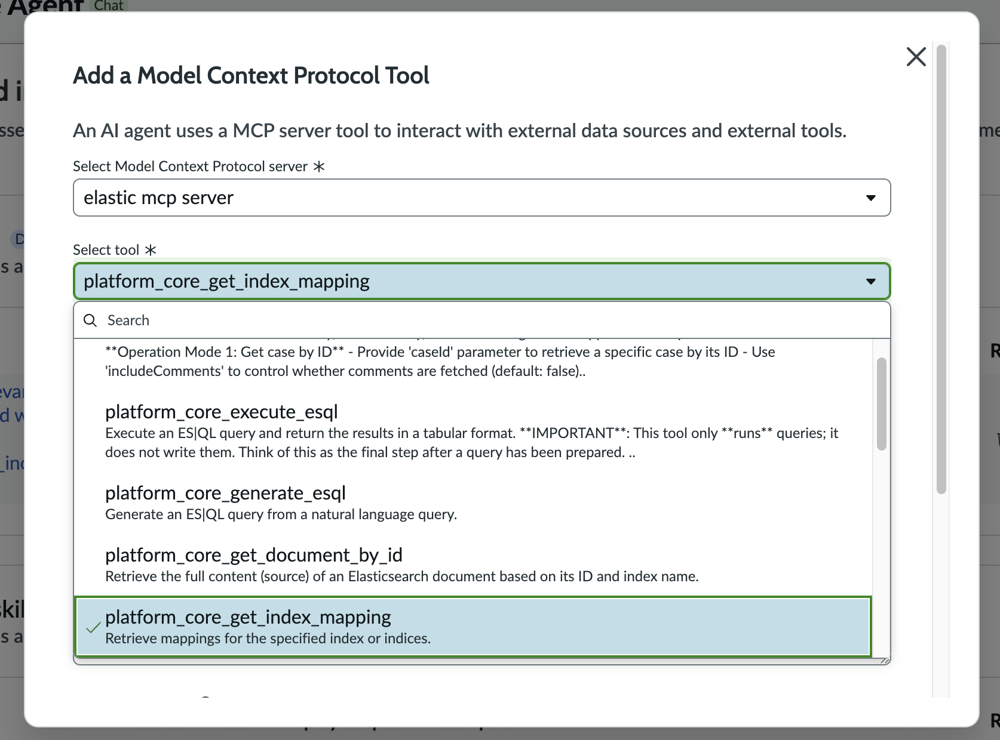

| Field | Value |
|-------|-------|
| Select Model Context Protocol server | `elastic mcp server` |
| Select tool | `platform_core_get_index_mapping` |

The available Elastic tools visible in the dropdown:
- `platform_core_cases` — Retrieves cases from Elastic Security, Observability, or Stack Management
- `platform_core_execute_esql` — Execute an ES\|QL query (Tool 4)
- `platform_core_generate_esql` — Generate an ES\|QL query from a natural language query
- `platform_core_get_document_by_id` — Retrieve the full content of an Elasticsearch document by ID
- `platform_core_get_index_mapping` ✓ — Retrieve mappings for the specified index or indices

The tool settings section:

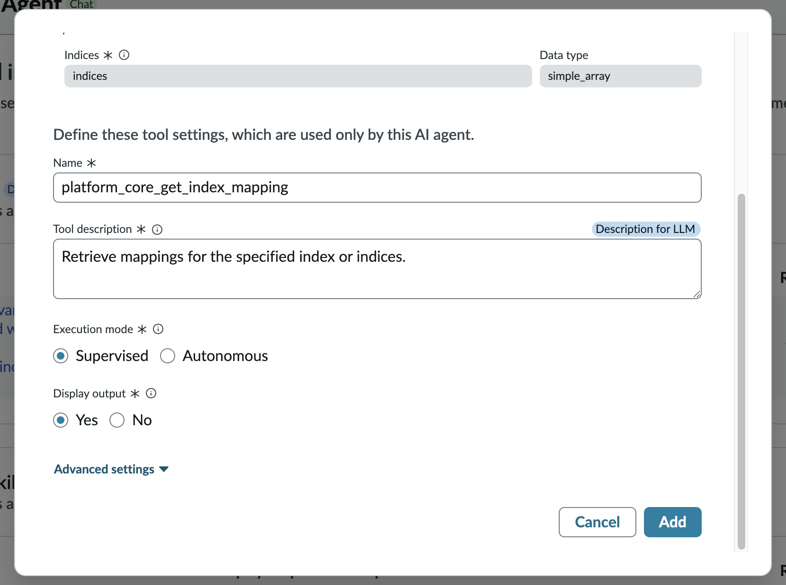

| Field | Value |
|-------|-------|
| Input — Indices | `indices` (simple_array) |
| Name | `platform_core_get_index_mapping` |
| Tool description *(Description for LLM)* | `Retrieve mappings for the specified index or indices.` |
| Execution mode | **Supervised** |
| Display output | **Yes** |

> **Supervised + Display output Yes.** This tool is supervised because index mapping inspection is a schema discovery step — the agent presents the mapping to the human operator for review before deciding how to structure the ES\|QL query. Display output Yes ensures the mapping is visible in the conversation context, enabling the agent (and operator) to reason about field names and types before calling `platform_core_execute_esql`.

Click **Add**.

---

#### Tool 6 — Web Search (Search the web)

From **Add tool ▼** select **Web search**.

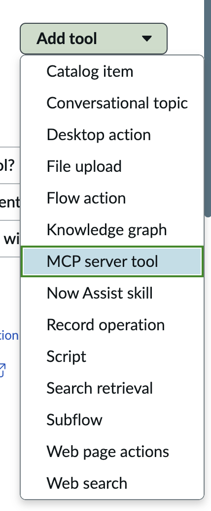

The **Edit web search** dialog opens:

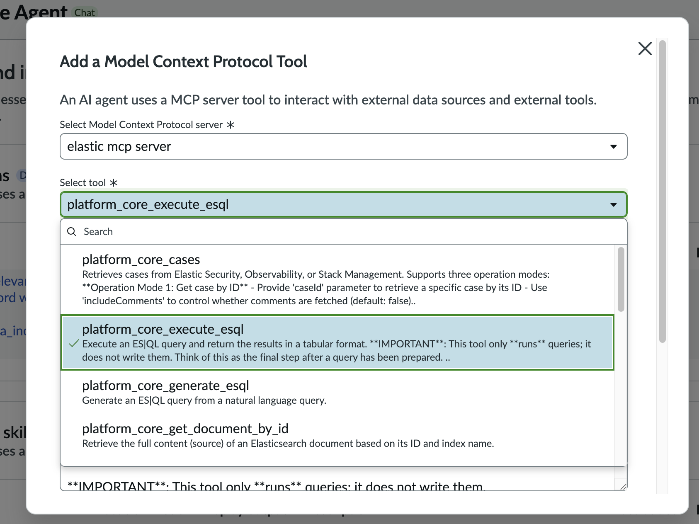

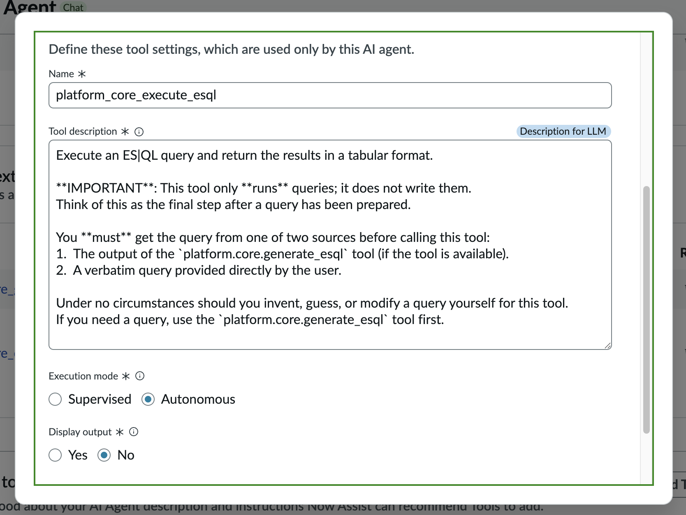

| Field | Value |
|-------|-------|
| Resource | `Web Search` |
| Provider | `Gemini AI answer` |
| Input — Conversation history | `conversation_history` (json_array) |
| Input — Country | `country` (string) |
| Input — Max tokens | `max_tokens` (numeric) |
| Input — Number of results | `num` (numeric) |
| Input — Search query *(mandatory)* | `query` (string) |
| Input — AI Search Providers | `aisearch_providers` (json_object) |
| Input — Sites or Domains | `site` (string) |
| Name | `Search the web` |
| Execution mode | **Autonomous** |
| Display output | **No** |

> **Path B final fallback.** This tool is invoked only when both internal KB/PI search (Tool 2) and Elastic log analysis (Tools 4+5) fail to produce a conclusive resolution. The `query` input comes from Tool 3 (`Generate Web Search Question for Resolution Plan`) — the LLM-generated, privacy-safe search string. The **Gemini AI answer** provider uses Google Gemini to execute the web search and synthesise results.

Click **Save**.

---

### Wizard Step 3 — Define User Access

The wizard advances to **Define security controls → Define user access**.

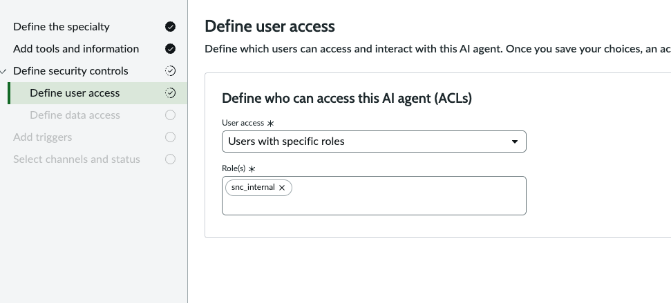

| Field | Value |
|-------|-------|
| User access | `Users with specific roles` |
| Role(s) | `itil` |

> Restricts agent invocation to `itil` role users — consistent with the access model across all lab capabilities.

Click **Save and continue**.

---

## Key Configuration Summary

| Field | Value |
|-------|-------|
| Agent name | `Resolution Pathfinder for Incident case Agent` |
| Type | Chat |
| Tool 1 | Flow action — `Retrieve relevant field values from a record within Incident Extract (x_snc_nava_incident_extend` |
| Tool 2 | Now Assist skill — `Resolution Finder Internal Data` → `ResolutionFinderUsingInternalData` — Autonomous |
| Tool 3 | Now Assist skill — `Generate Web Search Question for Resolution Plan` → `GenerateWebSearchQnsForResolutionPlan` — **Supervised** |
| Tool 4 | MCP server tool — `platform_core_execute_esql` — elastic mcp server — Autonomous |
| Tool 5 | MCP server tool — `platform_core_get_index_mapping` — elastic mcp server — **Supervised**, Display output **Yes** |
| Tool 6 | Web search — `Search the web` — Gemini AI answer — Autonomous |
| User access | `Users with specific roles` → `itil` |
| Trigger | state = In Progress, contact_type = chat, u_extracted_error_code ≠ empty |

---

## Technical Notes

### Tool Execution Mode Choices

The mix of Autonomous and Supervised execution modes is intentional:

| Tool | Mode | Reason |
|------|------|--------|
| Tool 1 — Flow action | Autonomous | Data retrieval — no risk, always needed |
| Tool 2 — ResolutionFinderInternalData | Autonomous | Internal-only search — safe to run without human review |
| Tool 3 — GenerateWebSearchQns | **Supervised** | Query goes external — human must confirm PII/internal data is stripped |
| Tool 4 — platform_core_execute_esql | Autonomous | Query execution only — ES\|QL guardrails prevent hallucination |
| Tool 5 — platform_core_get_index_mapping | **Supervised** | Schema discovery — human should review mapping before query is built |
| Tool 6 — Web search | Autonomous | Fires after supervised query generation is approved — safe to execute |

### ES|QL Guardrails

The `platform_core_execute_esql` tool description contains hard instructions telling the LLM it must never generate or modify an ES\|QL query itself. This is a prompt-level guardrail embedded in the tool description (Description for LLM) — ensuring the agent follows the correct two-step pattern: generate with `platform_core_generate_esql` first, then execute. Without this guardrail, the LLM could fabricate syntactically plausible but semantically incorrect queries that return misleading log results.

### Three-Path Search Architecture

The agent's description and instructions define a strict search hierarchy:

1. **Path A — Internal:** `ResolutionFinderUsingInternalData` (PI + KB RAG). If confirmed → write plan → stop.
2. **Elastic logs:** `platform_core_get_index_mapping` + `platform_core_execute_esql`. If conclusive → write plan → stop.
3. **Path B — Web:** `GenerateWebSearchQnsForResolutionPlan` (supervised) + `Search the web`. Writes plan + URL citation.

If all three paths yield nothing, the agent writes a structured "no resolution found" note documenting what was searched — arming L2 engineers with full context on what the AI already tried.

---

## Reference

- [ServiceNow Zurich — AI Agent Studio](https://www.servicenow.com/docs/bundle/zurich-intelligent-experiences/page/administer/now-assist-ai-agents/concept/ai-agent-studio.html)
- [ServiceNow Zurich — Create an AI agent](https://www.servicenow.com/docs/r/zurich/intelligent-experiences/configure-next-best-action-agent.html)
- [ServiceNow Zurich — Add tools and information](https://www.servicenow.com/docs/r/zurich/intelligent-experiences/add-tool-aia.html)
- [Enable MCP and A2A for your agentic workflows](https://www.servicenow.com/community/now-assist-articles/enable-mcp-and-a2a-for-your-agentic-workflows-with-faqs-updated/ta-p/3373907)

---

## Next Steps

→ Complete the remaining wizard steps: **Define data access**, **Add triggers** (configure the Incident trigger conditions), and **Select channels and status**.

→ After the agent is published and active, the Fulfiller Flow fires automatically when an Incident meets the trigger conditions — no human initiation required.
