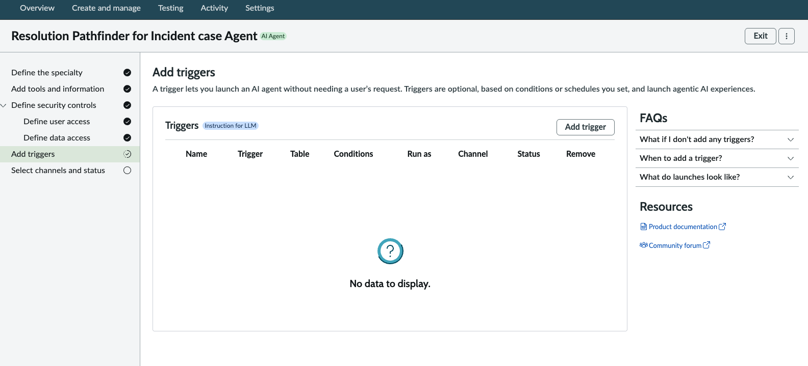

# 06 — Fulfiller AI Agent (Resolution Pathfinder)

> **Release:** Zurich | **Flow:** Fulfiller Flow — Phase 2 (Root Cause Analysis and to attempt to resolve the issue) **Source:** [ServiceNow Zurich — AI Agent Studio](https://www.servicenow.com/docs/bundle/zurich-intelligent-experiences/page/administer/now-assist-ai-agents/concept/ai-agent-studio.html) | [Create an AI agent](https://www.servicenow.com/docs/r/zurich/intelligent-experiences/configure-next-best-action-agent.html) | [Add tools and information](https://www.servicenow.com/docs/r/zurich/intelligent-experiences/add-tool-aia.html)

***

## What It Is

The **Resolution Pathfinder for Incident case Agent** is a Chat AI Agent that operates on the fulfiller side — triggered automatically in the background when an Incident meets the Phase 2 trigger conditions. It is the orchestrating intelligence of the Fulfiller Flow, searching across three data sources in sequence to build a complete, actionable resolution plan and writing it directly to the Incident record.

The agent uses six tools covering all three search paths:

```
Fulfiller Flow — Phase 2 trigger:
  'Assigned to' is not empty
        │
        ▼
Resolution Pathfinder for Incident case Agent
        │
        ├── Tool 1: Flow action — Retrieve relevant fields from Incident Extend table
        │          Reads incident context: error code, CI, product, short description, work notes
        │
        ├── Tool 2: Now Assist skill — Resolution Finder Internal Data
        │          Calls ResolutionFinderInternalData
        │          (PI similarity + KB RAG to determine if internal information is sufficient to provide a resolution plan)
        |
        ├── Tool 3: Elastic MCP server tool — platform_core_get_index_mapping
        │          Retrieves Elastic index mappings — helps agent understand schema
        │          before constructing queries
        │
        ├── Tool 4: Elastic MCP server tool — platform_core_execute_esql
        │          Runs ES|QL query against Elastic — returns log results in tabular format
        │          Must receive query from platform_core_generate_esql or user verbatim
        |
        ├── Tool 5: Now Assist skill — Generate Web Search Question for Resolution Plan
        │          Calls GenerateWebSearchQnsForResolutionPlan
        │          Generates optimised web search query (Path B fallback)
        │
        └── Tool 6: Web search — Search the web
                   Gemini AI answer provider
                   Privacy-safe web search (Path B final fallback)
        │
        ▼
AI Agent generates appropriate resolution plan + source citation that is to be written into the Incident case work notes regardless of outcome
```

***

## What the Agent Enables

| Capability                  | Tool                                   | How                                                                                                                           |
| --------------------------- | -------------------------------------- | ----------------------------------------------------------------------------------------------------------------------------- |
| Incident context retrieval  | Tool 1 — Flow action                   | Retrieves and reads all relevant fields from the Incident extend record before any search begins                              |
| Internal KB + PI resolution | Tool 2 — Now Assist skill              | Searches similar resolved incidents and internal Knowledge articles (Predictive Intelligence) + KB articles via RAG                                           |
| Elastic index discovery     | Tool 3 — MCP server tool               | Retrieves index mappings so agent can understand log schema before querying                                                   |
| Elastic log query execution | Tool 4 — MCP server tool               | Executes ES\|QL queries against Elastic log indices — must use a pre-generated query                                          |
| Web search query generation | Tool 5 — Now Assist skill              | Generates a privacy-safe, optimised query for web search — supervised to ensure PII and all sensitive information is stripped |
| Web search                  | Tool 6 — Web search                    | Gemini AI answer — searches the internet when internal and log sources yield no resolution                                    |

***

## Prerequisites

| Requirement                    | Detail                                                                                                                                             |
| ------------------------------ | -------------------------------------------------------------------------------------------------------------------------------------------------- |
| Custom Now Assist Skills built | Custom Now Assist Skills for CreateOptimalSearchQuery, ResolutionFinderInternalData and GenerateWebSearchQnsForResolutionPlan must be created |
| Elastic MCP server             | `elastic mcp server` registered in AI Agent Studio → Settings → Manage MCP servers (built earlier - 05 section)                                    |

***

## Lab Exercise — Steps to Build

### Wizard Step 1 — Define the Specialty

Navigate to **All → AI Agent Studio → Create and manage → AI Agents → New**.

The wizard opens on **Define the specialty**.

.png>)

| Field                                        | Value                                           |
| -------------------------------------------- | ----------------------------------------------- |
| AI agent name                                | `Resolution Pathfinder for Incident case Agent` |
| AI agent description _(Description for LLM)_ | `See full text below`                           |

AI agent description Expectation: SC to build the prompt for the description

AI agent role Expectation: SC to build the prompt for the role

List of Steps Expectation: SC to build the prompt for the list of steps

Click **Save and continue**.

***

### Wizard Step 2 — Add Tools and Information

The wizard advances to **Add tools and information**.

.png>)

Six tools must be added. Use **Add tool ▼** to select the tool type for each.

***

#### Tool 1 — Flow Action (Retrieve Incident Fields)

From **Add tool ▼** select **Flow action**.

.png>)

The **Edit flow action** dialog opens:


| Field                                    | Value                                                                                                                                                                                                                                                                                    |
| ---------------------------------------- | ---------------------------------------------------------------------------------------------------------------------------------------------------------------------------------------------------------------------------------------------------------------------------------------- |
| Select flow action                       | `Retrieval of Relevant Fields from Incident Extract table`                                                                                                                                                                                                                               |
| Input — Incident Number                  | `incident_number` (string)                                                                                                                                                                                                                                                               |
| Name                                     | `Retrieve relevant field values from a record within Incident Extend  table`                                                                                                                                                                        |
| Tool description _(Description for LLM)_ | `This tool retrieves out the following information based on the Incident number (input) from the Incident Extend table: 1. Short Description, 2. Description, 3. Configuration Item, 4. Error Code, 5. Product Bar Code, 6. Product Name, 7. Serial Number, 8. Category, 9. Work Notes` |
| Execution mode                           | **Autonomous**                                                                                                                                                                                                                                                                           |
| Display output                           | `No`                                                                                                                                                                                                                                                                                     |

> **Why first:** This tool gives the agent all the structured Incident context it needs before any search begins — error code, CI, product details, and prior work notes. All subsequent tools draw on this context to form their queries.

Click **Save**.

***

#### Tool 2 — Now Assist Skill (Resolution Finder Internal Data)

From **Add tool ▼** select **Now Assist skill**.

.png>)

The **Edit Now Assist skill** dialog opens:

.png>)

.png>)

| Field                                    | Value                                                                                                                                                                                                                                         |
| ---------------------------------------- | --------------------------------------------------------------------------------------------------------------------------------------------------------------------------------------------------------------------------------------------- |
| Select skill                             | `ResolutionFinderInternalData`                                                                                                                                                                                                           |
| Selected skill description               | `Retrieve Relevant Fields from Incident Extend table`                                                                                                                                                                                        |
| Name                                     | `Resolution Finder Internal Data`                                                                                                                                                                                                             |
| Tool description _(Description for LLM)_ | `This tool searches internal Knowledge Contents (Predictive Intelligence using Similarity Searches for Past Resolved Cases) as well as relevant Knowledge Base articles to determine if there is a solution to a newly raised Incident case.` |
| Execution mode                           | **Autonomous**                                                                                                                                                                                                                                |
| Display output                           | **No**                                                                                                                                                                                                                                        |

> This is the first search path that the AI Agent will take to solve the Incident case — it calls `ResolutionFinderInternalData` which runs `FindSimilarIncidents` (PI) and `RetrieveRelevantKBContent` (RAG) in parallel. If a probable resolution is confirmed by the `Assess if solution exists` prompt within that skill, the suggested Resolution Plan is shared back with the AI Agent.

Click **Save**.

***

#### Tool 3 — MCP Server Tool (platform\_core\_get\_index\_mapping)

From **Add tool ▼** select **MCP server tool**.

.png>)

The **Add a Model Context Protocol Tool** dialog opens:

.png>)

| Field                                | Value                                                                                                                  |
| ------------------------------------ | ---------------------------------------------------------------------------------------------------------------------- |
| Select Model Context Protocol server | `elastic mcp server (or whatever is the name of the Elastic MCP server that you have defined in the previous section)` |
| Select tool                          | `platform_core_get_index_mapping`                                                                                      |

The tool settings section:

.png>)

| Field                                    | Value                                                   |
| ---------------------------------------- | ------------------------------------------------------- |
| Name                                     | `platform_core_get_index_mapping`                       |
| Tool description _(Description for LLM)_ | `Retrieve mappings for the specified index or indices.` |
| Execution mode                           | **Supervised**                                          |
| Display output                           | **Yes**                                                 |

Click **Add**.

***

#### Tool 4 — MCP Server Tool (platform\_core\_execute\_esql)

From **Add tool ▼** select **MCP server tool**.

.png>)

The **Add a Model Context Protocol Tool** dialog opens:

.png>)

| Field                                | Value                                                                                                                  |
| ------------------------------------ | ---------------------------------------------------------------------------------------------------------------------- |
| Select Model Context Protocol server | `elastic mcp server (or whatever is the name of the Elastic MCP server that you have defined in the previous section)` |
| Select tool                          | `platform_core_execute_esql`                                                                                           |

The tool settings section:

.png>)

| Field                                    | Value                                                                                                                                                                                                                                                                                                                                                                                                                                                                                                                                                                                                       |
| ---------------------------------------- | ----------------------------------------------------------------------------------------------------------------------------------------------------------------------------------------------------------------------------------------------------------------------------------------------------------------------------------------------------------------------------------------------------------------------------------------------------------------------------------------------------------------------------------------------------------------------------------------------------------- |
| Name                                     | `platform_core_execute_esql`                                                                                                                                                                                                                                                                                                                                                                                                                                                                                                                                                                                |
| Tool description _(Description for LLM)_ | `Execute an ES\|QL query and return the results in a tabular format. **IMPORTANT**: This tool only **runs** queries; it does not write them. Think of this as the final step after a query has been prepared. You **must** get the query from one of two sources before calling this tool: 1. The output of the \`platform.core.generate\_esql\` tool (if the tool is available). 2. A verbatim query provided directly by the user. Under no circumstances should you invent, guess, or modify a query yourself for this tool. If you need a query, use the \`platform.core.generate\_esql\` tool first.\` |
| Execution mode                           | **Autonomous**                                                                                                                                                                                                                                                                                                                                                                                                                                                                                                                                                                                              |
| Display output                           | **No**                                                                                                                                                                                                                                                                                                                                                                                                                                                                                                                                                                                                      |

> **The tool description is a hard guardrail.** It explicitly instructs the LLM that it must never invent or modify an ES|QL query — it must either receive one from `platform.core.generate_esql` or from the user verbatim. This prevents hallucinated queries from corrupting or returning false log results.

Click **Add**.

***

#### Tool 5 — Now Assist Skill (Generate Web Search Question)

From **Add tool ▼** select **Now Assist skill**.

.png>)

The **Edit Now Assist skill** dialog opens:

.png>)

.png>)

| Field                                    | Value                                                                                                                                                                                                                                                                                                                                                          |
| ---------------------------------------- | -------------------------------------------------------------------------------------------------------------------------------------------------------------------------------------------------------------------------------------------------------------------------------------------------------------------------------------------------------------- |
| Select skill                             | `GenerateWebSearchQnsForResolutionPlan`                                                                                                                                                                                                                                                                                                                        |
| Selected skill description               | `Retrieve Relevant Fields from Incident Extend table`                                                                                                                                                                                                                                                                                                         |
| Input — Incidentextendrecord             | `incidentextendrecord` (string)                                                                                                                                                                                                                                                                                                                                |
| Name                                     | `Generate Web Search Question for Resolution Plan`                                                                                                                                                                                                                                                                                                             |
| Tool description _(Description for LLM)_ | `The 'Generate Web Search Question for Resolution Plan' tool generates a search query that is optimised for web search engines. The output of this tool call is used to build an actionable resolution plan that Support Agents can use to resolve support issues much faster down the line, as some pre-work has already been done for them by the AI agent.` |
| Execution mode                           | **Supervised**                                                                                                                                                                                                                                                                                                                                                 |
| Display output                           | **No**                                                                                                                                                                                                                                                                                                                                                         |

> **Path B tool — Supervised.** Execution mode is **Supervised** rather than Autonomous — this is deliberate. Web search queries must be reviewed by user before sending externally, ensuring PII and internal identifiers are stripped from the query. The agent pauses and presents the generated query for approval before proceeding to Tool 6 (Web search).

Click **Save**.

***

#### Tool 6 — Web Search (Search the web)

From **Add tool ▼** select **Web search**.

.png>)

The **Edit web search** dialog opens:

.png>)

.png>)

| Field                              | Value                                |
| ---------------------------------- | ------------------------------------ |
| Resource                           | `Web Search`                         |
| Provider                           | `Gemini AI answer`                   |
| Input — Conversation history       | `conversation_history` (json\_array) |
| Input — Country                    | `country` (string)                   |
| Input — Max tokens                 | `max_tokens` (numeric)               |
| Input — Number of results          | `num` (numeric)                      |
| Input — Search query _(mandatory)_ | `query` (string)                     |
| Input — AI Search Providers        | `aisearch_providers` (json\_object)  |
| Input — Sites or Domains           | `site` (string)                      |
| Name                               | `Search the web`                     |
| Execution mode                     | **Autonomous**                       |
| Display output                     | **No**                               |

> **Path B final fallback.** This tool is invoked only when both internal KB/PI search (Tool 2) and Elastic log analysis (Tools 4+5) fail to produce a conclusive resolution. The `query` input comes from Tool 3 (`Generate Web Search Question for Resolution Plan`) — the LLM-generated, privacy-safe search string. The **Gemini AI answer** provider uses Google Gemini to execute the web search and synthesise results.

Click **Save**.

***

### Wizard Step 3 — Define User Access

The wizard advances to **Define security controls → Define user access**.

.png>)

| Field       | Value                       |
| ----------- | --------------------------- |
| User access | `Users with specific roles` |
| Role(s)     | `snc_internal`              |

> Restricts agent invocation to `snc_internal` role users — consistent with the access model across all lab capabilities.

Click **Save and continue**.

***

### Wizard Step 4 — Define Data Access

The wizard advances to **Define security controls → Define data access**.

.png>)

| Field       | Value                                                         |
| ----------- | ------------------------------------------------------------- |
| Data access | `Dynamic user`                                                |
| Role(s)     | `snc_internal, itil, x_snc_apacaienable.incident_extend_user` |

> Restricts agent's maximum data access privilege to `snc_internal, itil and x_snc_apacaienable.incident_extend_user` roles. Additional roles are given here as the Custom Now Assist Skills are created in itil role and the AI Agent needs to have access to x\_snc\_apacaienable\_incident\_extend role in order to get data from the custom table.

Click **Save and continue**.

***

### Wizard Step 5 — Add Triggers

The wizard advances to **Add triggers**.



| Setting  | Value              |
| -------- | ------------------ |
| Triggers | None — leave empty |

Click **Save and continue**.

***

### Wizard Step 6 — Select Channels and Status

The wizard advances to **Select channels and status**.

.png>)

| Setting                             | Value          |
| ----------------------------------- | -------------- |
| Engage via Virtual Agent assistants | **Allow: OFF** |

Click **Save and continue** to complete the agent configuration.

***

## Key Configuration Summary

| Field       | Value                                                                                                                            |
| ----------- | -------------------------------------------------------------------------------------------------------------------------------- |
| Agent name  | `Resolution Pathfinder for Incident case Agent`                                                                                  |
| Type        | Chat                                                                                                                             |
| Tool 1      | Flow action — `Retrieve relevant field values from a record within Incident Extend (x_snc_apacaienable_incident_extend)`       |
| Tool 2      | Now Assist skill — `Resolution Finder Internal Data` → `ResolutionFinderInternalData` — Autonomous                          |
| Tool 3      | MCP server tool — `platform_core_get_index_mapping` — elastic mcp server — **Supervised**, Display output **Yes**                |
| Tool 4      | MCP server tool — `platform_core_execute_esql` — elastic mcp server — Autonomous                                                 |
| Tool 5      | Now Assist skill — `Generate Web Search Question for Resolution Plan` → `GenerateWebSearchQnsForResolutionPlan` — **Supervised** |
| Tool 6      | Web search — `Search the web` — Gemini AI answer — Autonomous                                                                    |
| User access | `Users with specific roles` → `snc_internal`                                                                                     |

***

## Technical Notes

### Tool Execution Mode Choices

The mix of Autonomous and Supervised execution modes is intentional:

| Tool                                         | Mode           | Reason                                                                 |
| -------------------------------------------- | -------------- | ---------------------------------------------------------------------- |
| Tool 1 — Flow action                         | Autonomous     | Data retrieval — no risk, always needed                                |
| Tool 2 — ResolutionFinderInternalData        | Autonomous     | Internal-only search — safe to run without human review                |
| Tool 3 — platform\_core\_get\_index\_mapping | **Supervised** | Schema discovery — human should review mapping before query is built   |
| Tool 4 — platform\_core\_execute\_esql       | Autonomous     | Query execution only — ES\|QL guardrails prevent hallucination         |
| Tool 5 — GenerateWebSearchQns                | **Supervised** | Query goes external — human must confirm PII/internal data is stripped |
| Tool 6 — Web search                          | Autonomous     | Fires after supervised query generation is approved — safe to execute  |

### ES|QL Guardrails

The `platform_core_execute_esql` tool description contains hard instructions telling the LLM it must never generate or modify an ES|QL query itself. This is a prompt-level guardrail embedded in the tool description (Description for LLM) — ensuring the agent follows the correct two-step pattern: generate with `platform_core_generate_esql` first, then execute. Without this guardrail, the LLM could fabricate syntactically plausible but semantically incorrect queries that return misleading log results.

### Three-Path Search Architecture

The agent's description and instructions define a strict search hierarchy:

**1. Internal:** `ResolutionFinderInternalData` (PI + KB RAG)
**2. Elastic logs:** `platform_core_get_index_mapping` + `platform_core_execute_esql`
**3. Path B — Web:** `GenerateWebSearchQnsForResolutionPlan` (supervised) + `Search the web`

If all three paths yield nothing, the agent writes a structured "no resolution found" note documenting what was searched — arming L2 engineers with full context on what the AI already tried.

***

## Reference

* [ServiceNow Zurich — AI Agent Studio](https://www.servicenow.com/docs/bundle/zurich-intelligent-experiences/page/administer/now-assist-ai-agents/concept/ai-agent-studio.html)
* [ServiceNow Zurich — Create an AI agent](https://www.servicenow.com/docs/r/zurich/intelligent-experiences/configure-next-best-action-agent.html)
* [ServiceNow Zurich — Add tools and information](https://www.servicenow.com/docs/r/zurich/intelligent-experiences/add-tool-aia.html)
* [Enable MCP and A2A for your agentic workflows](https://www.servicenow.com/community/now-assist-articles/enable-mcp-and-a2a-for-your-agentic-workflows-with-faqs-updated/ta-p/3373907)

***

## Next Steps

Continue to [07 — External Agent Integration: ServiceNow as A2A Primary Agent](07-external-agent-integration.md) to onboard an external A2A Agent onto ServiceNow Platform to be used within your Agentic Workflow Orchestration.
