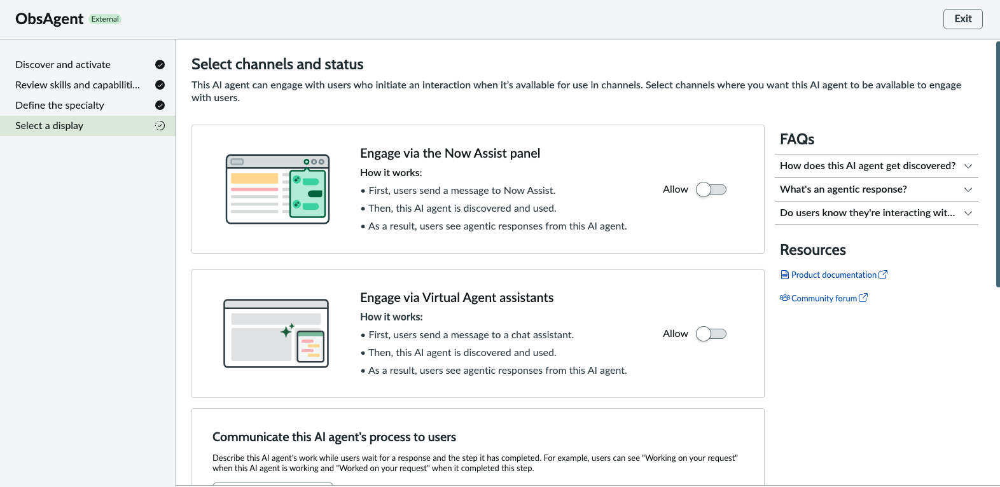

# 07 — External Agent Integration (A2A)

> **Release:** Zurich Patch 4+ | **Feature:** AI Agent Fabric — Agent2Agent (A2A) Protocol **Role in Veritas:** Phase 3 — External Integration (Observability & Action Agent via A2A) **Sources:** [External Agents via Google A2A — SN Community](https://www.servicenow.com/community/now-assist-articles/external-agents-in-servicenow-via-google-a2a-servicenow-as/xta-p/3467587) | [Enable MCP and A2A — AI Agent Fabric](https://www.servicenow.com/community/now-assist-articles/enable-mcp-and-a2a-for-your-agentic-workflows-with-faqs-updated/ta-p/3373907) | [Create external AI agent — Zurich Docs](https://www.servicenow.com/docs/r/zurich/intelligent-experiences/create-a2a-agent.html)

***

## What This Doc Covers

This document walks through the complete configuration required to connect ServiceNow AI Agent Studio to an **external Azure AI Foundry ObsAgent** using the **Agent2Agent (A2A) protocol** — making ServiceNow the **primary (orchestrating) agent** and Azure AI Foundry the **remote (execution) agent**.

This is **Phase 3 of the Veritas Resolution Agentic Workflow** — triggered only when Path A of the Fulfiller Flow produces a resolution plan. It does **not** trigger on Path B.

The configuration covers two distinct setup layers:

1. **OAuth 2.0 Client Credentials** — establishing authenticated outbound connectivity from ServiceNow to the Azure AI Foundry agent endpoint
2. **External AI Agent registration** — registering and activating the ObsAgent in AI Agent Studio via the A2A protocol's Well-Known URI discovery mechanism

***

## Phase 3 Flow Overview

```
Phase 3 — External Integration — Observability & Action Agent via A2A
        │
        Trigger: Path A of Fulfiller Flow (Resolution Pathfinder for Incident case Agent) produces a resolution plan
        (Does NOT trigger on Path B)
        │
        ▼
Step 1: Observability & Action Agent (ServiceNow — primary orchestrator)
        receives the resolution plan → constructs structured remediation action set
        │
        ▼
Step 2: Remediation plan serialised and dispatched to Azure AI Foundry
        via A2A protocol
        ServiceNow = orchestrator | Azure AI Foundry = remote execution agent
        │
        ▼
Step 3: Azure AI Foundry executes prescribed remediation actions
        (service restart, config patch, queue flush, etc.)
        Execution telemetry streams back to ServiceNow
        │
        ├── Path 3A — Success:
        │   Incident auto-resolved, resolution notes + execution outcome
        │   generated and ready to be written to incident record, ticket closed
        │   No human intervention required
        │
        └── Path 3B — Fail / Partial:
            Full execution log, attempted steps, and failure reason
            generated and ready to be written to incident work notes
            Incident escalated to L2 with complete context
```

***

## A2A Protocol — Concepts

The **Agent2Agent (A2A) protocol** is an open standard (co-developed by Google and 50+ partners including ServiceNow, SAP, Salesforce, Workday) for agent-to-agent interoperability across platforms and frameworks.

### How A2A Works

| Concept            | Description                                                                                                                                                     |
| ------------------ | --------------------------------------------------------------------------------------------------------------------------------------------------------------- |
| **Agent Card**     | JSON file at `/.well-known/agent.json` that an agent exposes to advertise its name, version, description, and skills. ServiceNow fetches this during discovery. |
| **Well-Known URI** | Standard discovery endpoint: `https://<agent-host>/.well-known/agent.json`                                                                                      |
| **Client Agent**   | The orchestrating agent that initiates the task — in this lab, **ServiceNow**                                                                                   |
| **Remote Agent**   | The execution agent that receives and acts on the task — in this lab, **Azure AI Foundry ObsAgent**                                                             |
| **Task lifecycle** | Tasks move through a defined lifecycle: submitted → working → completed / failed / cancelled                                                                    |
| **Communication**  | Messages contain typed parts (text, data) negotiated between agents                                                                                             |

### ServiceNow's A2A Role in Zurich

ServiceNow AI Agent Studio supports A2A from **Zurich Patch 4** as part of **AI Agent Fabric**:

| Mode                   | ServiceNow Role                                             | When used                                                                   |
| ---------------------- | ----------------------------------------------------------- | --------------------------------------------------------------------------- |
| **Primary (Client)**   | ServiceNow orchestrates and delegates to external agents    | This lab — SN calls Azure AI Foundry                                        |
| **Secondary (Server)** | ServiceNow exposes its own agents to external orchestrators | External platforms calling SN agents (Not scoped as part of this Lab build) |

In this lab, ServiceNow acts as the **primary (client) agent** — the Observability & Action Agent in AI Agent Studio calls the Azure AI Foundry ObsAgent via A2A and awaits the remediation result.

***

## Prerequisites

| Requirement               | Detail                                                                              |
| ------------------------- | ----------------------------------------------------------------------------------- |
| ServiceNow release        | Zurich Patch 4 or later                                                             |
| Azure AI Foundry ObsAgent | Deployed on Azure Container Apps, A2A-compliant, exposing `/.well-known/agent.json` |
| Azure App Registration    | Client ID, Client Secret, and Token URL available from Azure portal                 |

***

## Part 1: OAuth 2.0 Setup — Authenticating to Azure AI Foundry

The A2A call from ServiceNow to Azure AI Foundry is authenticated via **OAuth 2.0 Client Credentials flow**. This is the machine-to-machine OAuth flow — no user login, no redirect. ServiceNow exchanges a Client ID + Secret for a Bearer token and attaches it to every A2A request.

Three records must be created in sequence:

```
Application Registry (OAuth Entity)
        ↓
Connection & Credential Alias (FoundryConnectCreds)
        ↓
HTTP Connection (FoundryConnect) — ties URL + credential alias together
```

***

### Step 1: Create the OAuth Application Registry

Navigate to **All → System OAuth → Application Registry** (search `application registry` in the All menu).

.png>)

The Application Registry menu shows two paths:

* Under **Security Operations → Utilities**: SecOps Application Registry
* Under **System OAuth**: **Application Registry** ← use this one

Click **New**. The **"What kind of OAuth application?"** picker appears:

.png>)

Select **"Connect to a third party OAuth Provider - Outbound"** and click **Continue**.

This creates an **Outbound OAuth 2.0 provider** record — the standard path for ServiceNow calling an external OAuth-protected API.

***

### Step 2: Configure the Application Registry Record

The **Application Registries** form opens with the OAuth provider detail fields.

.png>)

Fill in the following fields. All values come from your **Azure App Registration** in the Azure portal:

| Field              | Value                                                                                                                                                                      | Notes                                                                            |
| ------------------ | -------------------------------------------------------------------------------------------------------------------------------------------------------------------------- | -------------------------------------------------------------------------------- |
| Name               | `FoundryOAuth`                                                                                                                                                             | Unique identifier for this OAuth provider in SN                                  |
| Client ID          | `45067447-9ccd-46a6-8ab1-c74875f043ba`                                                                                                                                     | Azure App Registration → Application (client) ID                                 |
| Client Secret      | `Client Secret value will be provided on the day of the lab itself / ask from the Lab instructors for what the client secret value is`                                     | Azure App Registration → Client secrets → Value                                  |
| Default Grant type | `Client Credentials`                                                                                                                                                       | **Critical** — must be set to Client Credentials (not Authorization Code)        |
| Token URL          | `https://login.microsoftonline.com/3ce2a773-b126-4efb-97d8-067bbcc3495a/oauth2/v2.0/token`                                                                                 | Azure tenant-specific token endpoint                                             |
| Redirect URL       | `https://demoalectriallwfzu144198.service-now.com/oauth_redirect.do (The instance host name will change based on your instance host name. Do not blindly copy the value.)` | Auto-populated from instance                                                     |
| Send Credentials   | `In Request Body (Form URL-Encoded)`                                                                                                                                       | **Critical** — Azure requires credentials in request body, not Basic Auth header |
| Accessible from    | `All application scopes`                                                                                                                                                   |                                                                                  |
| Active             | ✅ Checked                                                                                                                                                                  |                                                                                  |

> **Lab note:** The annotation on the screenshot highlights the three critical settings: Client ID + Client Secret + Token URL come from Azure. Default Grant = **Client Credentials**. Send Credentials = **In Request Body**.

Save (right-click header → Save).

***

### Step 3: Add the OAuth Entity Scope

After saving the Application Registry, navigate to the **OAuth Entity Scopes** tab.

.png>)

Add a new scope row:

| Field       | Value                                                 |
| ----------- | ----------------------------------------------------- |
| Name        | `FoundryOauthOutboundScope`                           |
| OAuth Scope | `api://45067447-9ccd-46a6-8ab1-c74875f043ba/.default` |

> The scope value `api://<client-id>/.default` is the standard Azure AD scope format for Client Credentials flow — it requests all permissions configured for the app registration. This scope is what gets sent in the token request body to Azure's token endpoint.

Click **Submit** to save the scope row.

***

### Step 4: Create the OAuth 2.0 Credential Record

Navigate to **All → IntegrationHub → Connections & Credentials → Credentials**.

Click **New > OAuth 2.0 Credentials** and configure:

.png>)

| Field                                 | Value                                                                       |
| ------------------------------------- | --------------------------------------------------------------------------- |
| Name                                  | `FoundryOAuthCreds`                                                         |
| Active                                | ✅ Checked                                                                   |
| OAuth Entity Profile                  | `FoundryOauth default_profile` (auto-created from the Application Registry) |
| Applies to                            | `All MID servers`                                                           |
| Order                                 | `100`                                                                       |
| Connect to Auth Server via MID Server | Unchecked                                                                   |

> The **OAuth Entity Profile** field links this credential record to the `FoundryOAuth` Application Registry created in Step 2. It references the `default_profile` that ServiceNow auto-generates when you create the Application Registry. This is the record that actually holds the live OAuth token once it's fetched.

Save the record.

***

### Step 5: Test the OAuth Token

After saving `FoundryOAuthCreds`, scroll down to **Related Links** and click **Get OAuth Token**.

.png>)

> The banner at the top of the saved credential record shows: _"OAuth Access or Refresh tokens are not available. Verify the OAuth configuration and click the 'Get OAuth Token' link below to request a new token."_ This is expected before the first token fetch — click **Get OAuth Token** circled in green to initiate the Client Credentials flow.

ServiceNow makes a POST to the Azure token endpoint with the Client ID, Client Secret, and scope. On success:

.png>)

The green banner confirms: **"OAuth token flow completed successfully"**

> The browser redirects to `oauth_client_credentials_input.do` and returns this success page. This confirms that ServiceNow can reach Azure's token endpoint and the Client ID + Secret + scope are correct. The OAuth token is now stored in `FoundryOAuthCreds` and will be used automatically for all A2A calls.

> If the retrieval of OAuth token is not successful for you, check if the OAuth scopes have been defined clearly. Click into OAuth Entity Profile (FoundryOauth default\_profile) and ensure that OAuth Entity Scope and OAuth scope has been populated as well. If not, do so and test again.

| Field       | Value                                                 |
| ----------- | ----------------------------------------------------- |
| Name        | `FoundryOauthOutboundScope`                           |
| OAuth Scope | `api://45067447-9ccd-46a6-8ab1-c74875f043ba/.default` |

***

## Part 2: Connection & Credential Alias Setup

The **Connection & Credential Alias** is the ServiceNow object that bundles a **Connection URL** (where to call) with a **Credential** (how to authenticate). The A2A provider registration in AI Agent Studio references this alias — not the individual credential or connection records directly.

***

### Step 6: Create the Connection & Credential Alias

Navigate to **All → IntegrationHub → Connections & Credentials → Connection & Credential Aliases**.

.png>)

> In the All menu, search `Connections & Cre` to see both the IntegrationHub section and the standalone Connections & Credentials section. Use **Connection & Credential Aliases** (highlighted with the green star — it's already in Favorites from prior use).

Click **New** and configure:

.png>)

| Field                               | Value                       |
| ----------------------------------- | --------------------------- |
| Name                                | `FoundryConnectCreds`       |
| Application                         | `Global`                    |
| Type                                | `Connection and Credential` |
| Connection type                     | `HTTP`                      |
| Default Retry Policy                | `Default HTTP Retry Policy` |
| Support Multiple Active Connections | Unchecked                   |

Save (right-click header → Save).

***

### Step 7: Create the HTTP Connection Under the Alias

After saving `FoundryConnectCreds`, navigate to the **Connections** tab. It will show "No records to display".

.png>)

> The annotation on the screenshot says: _"Click New — This is part of Connection & Credentials"_. Click **New** in the top-right of the Connections related list.

The **HTTP(s) Connection** form opens:

.png>)

| Field            | Value                                                                                            |
| ---------------- | ------------------------------------------------------------------------------------------------ |
| Name             | `FoundryConnect`                                                                                 |
| Credential       | `FoundryOAuthCreds`                                                                              |
| Connection alias | `FoundryConnectCreds`                                                                            |
| Connection URL   | `https://obs-agent-a2a.bravepebble-9e145bb4.eastus.azurecontainerapps.io/.well-known/agent.json` |
| Active           | ✅ Checked                                                                                        |
| Domain           | `global`                                                                                         |
| Use MID server   | Unchecked                                                                                        |

> **Connection URL** is the A2A Agent Card URL of the Azure AI Foundry ObsAgent, hosted on Azure Container Apps. ServiceNow uses this URL for the initial agent discovery call (`GET /.well-known/agent.json`) and for all subsequent A2A task execution calls. The `FoundryOAuthCreds` credential is attached here — it auto-injects the Bearer token from the OAuth flow into every HTTP request made through this connection.

Save the record.

***

## Part 3: External AI Agent Registration in AI Agent Studio

With OAuth and the Connection Alias configured, the agent can now be registered in AI Agent Studio.

***

### Step 8: Add External AI Agent

Navigate to **All → AI Agent Studio → Create and manage → AI agents**.

.png>)

The **AI agents** list shows 366 agents (the lab instance). Click the **Add** dropdown (top right) and select **External**.

The **"Select a method for adding an external AI agent"** dialog appears:

.png>)

Two options are presented:

| Option                         | When to use                                                                                     |
| ------------------------------ | ----------------------------------------------------------------------------------------------- |
| **Manual integration**         | Enter connection and AI agent details manually — for non-standard protocols or custom endpoints |
| **Agent2Agent (A2A) protocol** | Discover AI agents through providers and activate one — **use this option**                     |

Select **Agent2Agent (A2A) protocol** (shown selected with the teal border) and click **Continue**.

This launches the **New AI Agent (External)** guided wizard with four steps:

1. Discover and activate
2. Review skills and capabilities
3. Define the specialty
4. Select a display

***

### Step 9: Add a New Provider (Discover and Activate — Step 1)

The **Discover and activate** screen opens. Click **+ Add new provider**.

The **Add provider** form appears:

.png>)

| Field                           | Value                                                                                            |
| ------------------------------- | ------------------------------------------------------------------------------------------------ |
| Name                            | `AzObservabilityAgent`                                                                           |
| Discovery type                  | `Well-Known URI / Direct Configuration`                                                          |
| Agent card URL                  | `https://obs-agent-a2a.bravepebble-9e145bb4.eastus.azurecontainerapps.io/.well-known/agent.json` |
| Connection and credential alias | `FoundryConnectCreds`                                                                            |
| Select subflow                  | `External AI Agent Card - A2A Protocol`                                                          |

> **Discovery type: Well-Known URI / Direct Configuration** — ServiceNow fetches the Agent Card directly from the `/.well-known/agent.json` endpoint of the Azure Container Apps hosted ObsAgent. This is the standard A2A discovery mechanism.
>
> **Select subflow: External AI Agent Card - A2A Protocol** — this is the platform-provided subflow that handles the A2A handshake, task serialisation, and response parsing. It is highlighted in green in the screenshot as the critical selection.

Click **Add**.

***

### Step 10: Discover the External AI Agent

Back on the **Discover and activate** screen, select `AzObservabilityAgent` from the Provider dropdown and click **Discover external AI agent**.

.png>)

ServiceNow calls `GET /.well-known/agent.json` using the `FoundryConnectCreds` connection (with the OAuth Bearer token). On success, the discovered agent appears in the list:

| Agent name | Version | State      |
| ---------- | ------- | ---------- |
| ObsAgent   | 1       | **Active** |

Click **ObsAgent** to review the Agent Card details.

***

### Step 11: Review Agent Card and Activate

The **ObsAgent** detail panel opens:

.png>)

Two tabs are available: **Basic info** and **Agent card**.

**Basic info tab shows:**

| Field       | Value                                                                                              |
| ----------- | -------------------------------------------------------------------------------------------------- |
| Name        | `ObsAgent`                                                                                         |
| Version     | `1`                                                                                                |
| Description | `Azure AI Foundry Observability Agent, answers questions about veritas resolution recommendation.` |
| Skills      | `—` (listed in Agent card tab)                                                                     |

> The description confirms this is the Azure AI Foundry agent built for the Veritas architecture — it answers questions about Veritas resolution recommendations and executes remediation actions.

Click **Activate** (highlighted with the green annotation).

The wizard completes Step 1 (Discover and activate ✅) and advances to Step 2 (Review skills and capabilities ✅).

***

### Step 12: Define the Specialty (Step 3 of Wizard)

In **Step 3: Define the specialty**, configure the agent's runtime behaviour:

.png>)

**Communication mode:**

| Setting            | Value           |
| ------------------ | --------------- |
| Communication mode | **Synchronous** |

> Synchronous mode means ServiceNow waits for the A2A response before proceeding. Appropriate when remediation actions complete within the HTTP timeout window (\~30 seconds). For long-running remediations (batch operations, multi-step sequences), Asynchronous mode with callback would be used instead.

**Add authentication:**

| Setting                         | Value                 |
| ------------------------------- | --------------------- |
| Connection and credential alias | `FoundryConnectCreds` |

> This links the agent execution calls to the same `FoundryConnectCreds` alias used for discovery — ensuring the OAuth token is injected for every A2A task dispatch.

**Define who can access the AI Agent:**

| Setting     | Value                    |
| ----------- | ------------------------ |
| User access | `Any authenticated user` |

> Any authenticated ServiceNow user can invoke this agent through the Veritas workflow. In production, restrict to specific roles for tighter governance.

***

### Step 13: Select Channels and Status (Step 4 of Wizard)

The wizard advances to **Select channels and status**.



| Setting                             | Value          |
| ----------------------------------- | -------------- |
| Engage via Now Assist panel         | **Allow: OFF** |
| Engage via Virtual Agent assistants | **Allow: OFF** |

Click **Save and continue** to complete the agent configuration.

***

## Configuration Summary

### OAuth Chain

```
Azure App Registration (FoundryOAuth)
  Client ID:      45067447-9ccd-46a6-8ab1-c74875f043ba
  Grant type:     Client Credentials
  Token URL:      https://login.microsoftonline.com/<tenant>/oauth2/v2.0/token
  Scope:          api://45067447-9ccd-46a6-8ab1-c74875f043ba/.default
  Send creds:     In Request Body
        ↓
OAuth 2.0 Credential (FoundryOAuthCreds)
  Profile:        FoundryOauth default_profile
  Token status:   ✅ "OAuth token flow completed successfully"
        ↓
Connection & Credential Alias (FoundryConnectCreds)
  Type:           Connection and Credential
  Connection:     HTTP
        ↓
HTTP Connection (FoundryConnect)
  URL:            https://obs-agent-a2a.bravepebble-9e145bb4.eastus.azurecontainerapps.io/.well-known/agent.json
  Credential:     FoundryOAuthCreds
```

### External Agent Registration

| Field              | Value                                                                                            |
| ------------------ | ------------------------------------------------------------------------------------------------ |
| Agent type         | External                                                                                         |
| Protocol           | Agent2Agent (A2A)                                                                                |
| Provider name      | `AzObservabilityAgent`                                                                           |
| Discovery type     | Well-Known URI / Direct Configuration                                                            |
| Agent Card URL     | `https://obs-agent-a2a.bravepebble-9e145bb4.eastus.azurecontainerapps.io/.well-known/agent.json` |
| Subflow            | External AI Agent Card - A2A Protocol                                                            |
| Discovered agent   | `ObsAgent` — Version 1 — Active                                                                  |
| Communication mode | Synchronous                                                                                      |
| Auth alias         | `FoundryConnectCreds`                                                                            |
| User access        | Any authenticated user                                                                           |
| Minimum release    | Zurich Patch 4                                                                                   |

***

## Technical Deep Dive

### Why Client Credentials Flow?

The A2A connection from ServiceNow to Azure AI Foundry is **machine-to-machine** — there is no human user in the loop. Client Credentials flow is the correct OAuth 2.0 grant type for this pattern:

* No user login or redirect required
* ServiceNow exchanges App Registration credentials directly for a Bearer token
* Token is auto-refreshed by the `FoundryOAuthCreds` credential record
* Azure validates the token against the App Registration and grants access to the ObsAgent endpoint

The two critical settings in the Application Registry that many labs get wrong:

* **Default Grant type = Client Credentials** (not Authorization Code)
* **Send Credentials = In Request Body** (Azure requires this — it rejects Basic Auth header format)

### The Agent Card — What ServiceNow Expects

When ServiceNow calls `GET /.well-known/agent.json`, it expects an A2A-compliant Agent Card. The ObsAgent exposes:

```json
{
  "name": "ObsAgent",
  "version": "1",
  "description": "Azure AI Foundry Observability Agent, answers questions about veritas resolution recommendation.",
  "skills": [...],
  "capabilities": {
    "streaming": false,
    "pushNotifications": false
  }
}
```

ServiceNow reads `name`, `version`, `description`, and `skills` from this card and populates the **Basic info** and **Agent card** tabs in the wizard. The `skills` section tells the ServiceNow Observability & Action Agent what capabilities it can delegate.

### A2A Endpoint Structure (ServiceNow)

For reference, the ServiceNow A2A endpoint structure (when SN acts as the server) is:

| Endpoint                  | Path                                                      |
| ------------------------- | --------------------------------------------------------- |
| Agent Card V1 (discovery) | `GET /api/sn_aia/a2a/id/{agent_id}/well_known/agent_json` |
| Agent Card V2 (discovery) | `GET /api/sn_aia/a2a/v2/agent_card/id/{agent_id}`         |
| Agent Execution V1        | `POST /api/sn_aia/a2a/v1/agent/id/{agent_id}`             |
| Agent Execution V2        | `POST /api/sn_aia/a2a/v2/agent/id/{agent_id}`             |

In this lab, the Azure ObsAgent is the server — so the above structure applies to its Azure Container Apps endpoint, not to ServiceNow.

### Synchronous vs Asynchronous Communication

| Mode             | How it works                                                                       | When to use                                                    |
| ---------------- | ---------------------------------------------------------------------------------- | -------------------------------------------------------------- |
| **Synchronous**  | ServiceNow sends the A2A task and blocks until the response arrives                | Remediations completing in <30s (service restart, cache flush) |
| **Asynchronous** | ServiceNow sends the task and registers a callback URL; Azure calls back when done | Long-running remediations (batch jobs, multi-step sequences)   |

The Veritas lab uses Synchronous mode. If the Azure remediation takes longer than the HTTP timeout, switch to Asynchronous and configure the **External Agent Callback Registry** (`sn_aia_external_agent_callback_registry`) for result delivery.

### Troubleshooting

| Symptom                                                        | Likely cause                                 | Fix                                                                                            |
| -------------------------------------------------------------- | -------------------------------------------- | ---------------------------------------------------------------------------------------------- |
| OAuth token flow fails                                         | Wrong Token URL or Client Secret             | Verify Token URL matches Azure tenant ID; regenerate Client Secret in Azure portal             |
| "Send Credentials" error                                       | Credentials sent as Basic Auth               | Set Send Credentials = **In Request Body (Form URL-Encoded)**                                  |
| Discovery returns empty                                        | Agent Card URL wrong or ObsAgent not running | Verify Azure Container App is running; test Agent Card URL directly in browser                 |
| Agent discovered but Activate greyed out                       | Agent Card missing required fields           | Check ObsAgent's `agent.json` includes `name`, `version`, `skills`                             |
| OAuth token expires during demo                                | Token lifespan too short                     | Increase Refresh Token Lifespan in Application Registry (default 8,640,000 seconds = 100 days) |
| A2A call returns empty `output.result`                         | Agent response format mismatch               | Verify ObsAgent returns correct A2A response payload with `status`, `output.result` fields     |
| "Security restricted: Read operation on table sys\_connection" | Cross-scope ACL issue                        | Add cross-scope privilege for `sys_connection` table read from `x_nava_agentic_lab` scope      |

***

## What the ObsAgent Does at Runtime

When the Veritas workflow reaches Phase 3 and the Observability & Action Agent fires the A2A call:

1. ServiceNow serialises the resolution plan into an A2A task message
2. ServiceNow POSTs to the ObsAgent's execution endpoint with the Bearer token
3. ObsAgent receives the resolution plan, parses the remediation steps
4. ObsAgent executes against the target environment (Azure-hosted infrastructure)
5. ObsAgent returns a structured response: `{ status, actions_taken, timestamp }`
6. ServiceNow summarises the result and generates it into an actionable Resolution Plan to be populated within the Incident Extend record's `work_notes`

**Path 3A — Success:** Resolution notes + execution outcome written to record → ticket auto-closed. No human intervention.

**Path 3B — Fail/Partial:** Full execution log + attempted steps + failure reason written to work notes → incident escalated to L2 with complete context for investigation.

***

## Reference

* [External Agents in ServiceNow via Google A2A — ServiceNow as Primary Agent](https://www.servicenow.com/community/now-assist-articles/external-agents-in-servicenow-via-google-a2a-servicenow-as/ta-p/3467587)
* [Enable MCP and A2A for your agentic workflows (AI Agent Fabric)](https://www.servicenow.com/community/now-assist-articles/enable-mcp-and-a2a-for-your-agentic-workflows-with-faqs-updated/ta-p/3373907)
* [Create an external AI agent with A2A — Zurich Docs](https://www.servicenow.com/docs/r/zurich/intelligent-experiences/create-a2a-agent.html)
* [A2A Protocol specification](https://a2aprotocol.ai/)

***

## Next Steps

→ With the ObsAgent registered and activated, it is now available as a tool/agent in the Veritas Agentic Workflow. → For the ObsAgent's role in the full Fulfiller Flow, continue to [# 08 — Wrapping Agents in the Veritas Resolution Agentic Workflow](08-wrapping-in-agentic-workflow.md).
