# 08 — Veritas Resolution Agentic Workflow

> **Release:** Zurich | **Feature:** AI Agent Studio — Agentic Workflows **Role in Veritas:** Orchestration layer that binds the Resolution Pathfinder Agent and the ObsAgent (A2A) under a single LLM-governed workflow, with trigger conditions, security controls, and channel configuration. **Sources:** [Create an agentic workflow — Zurich Docs](https://www.servicenow.com/docs/bundle/zurich-intelligent-experiences/page/administer/now-assist-ai-agents/task/configure-use-case-ai-agents.html) | [Get Familiar with Agentic Workflows & AI Agents — Community](https://www.servicenow.com/community/developer-articles/get-familiar-with-agentic-workflows-amp-ai-agent/ta-p/3326559) | [General guidelines for creating AI agents and agentic workflows — Zurich Docs](https://www.servicenow.com/docs/bundle/zurich-intelligent-experiences/page/administer/now-assist-ai-agents/concept/gg-creating-aia.html)

***

## What This Doc Covers

An **Agentic Workflow** in ServiceNow AI Agent Studio is the orchestration container that ties together:

* A natural language **description** that the LLM uses to decide _when_ to use this workflow and _which agents_ to call for each step
* One or more **AI Agents** that perform the work
* **Security controls** — who can access and what data the workflow can touch
* **Triggers** — the record conditions that automatically launch the workflow
* **Channels** — where the workflow surfaces to users

This document walks through building the **Veritas Resolution Agentic Workflow** — the top-level orchestration layer for the entire Agentic Workflow architecture. It wraps the Resolution Pathfinder Agent (internal KB + Elastic + web search) and the ObsAgent (A2A execution via Azure AI Foundry) into a single governed workflow.

***

## What an Agentic Workflow Is — Platform Concepts

### LLM-Governed Orchestration

Each agentic workflow is controlled by a Large Language Model that interprets the workflow's description to determine:

1. **When to use this workflow** — matched against the trigger objective and user intent
2. **The steps required to complete the workflow** — derived from the workflow description's `<List of steps>` block
3. **The AI agents needed to complete the steps** — the LLM matches step descriptions to agent names and descriptions

> This is the key design principle: the **LLM reads the description and decides which agent to call for which step**. Agent matching is semantic — the LLM compares terminology in an agent's name and description to the workflow step. This means agent descriptions and workflow step language must be aligned.

### Agentic Workflow vs AI Agent

| Concept              | What it is                                                                            | Analogy                  |
| -------------------- | ------------------------------------------------------------------------------------- | ------------------------ |
| **Agentic Workflow** | The orchestration container — defines the goal, steps, agents, security, and triggers | The project brief        |
| **AI Agent**         | The worker that executes specific steps — has tools, a system prompt, and a model     | The specialist           |
| **Trigger**          | The record condition that auto-launches the workflow / AI Agent                       | The alarm                |
| **Channel**          | Where the workflow output surfaces (Now Assist panel, Virtual Agent)                  | The communication medium |

### Wizard Structure

The Agentic Workflow creation wizard has five steps:

```
1. Define key requirements   → Workflow name, description (LLM instructions), AI agents
2. Define security controls  → User access (ACL) + Data access (identity)
3. Add triggers              → Table, conditions, trigger objective, channel
4. Select channels & status  → Now Assist panel, UI Actions
```

***

## Prerequisites

| Requirement         | Detail                                                               |
| ------------------- | -------------------------------------------------------------------- |
| AI Agents built out | Resolution Pathfinder for Incident case Agent and ObsAgent built out |

***

## Lab Exercise — Step-by-Step Build

### Step 1: Define Key Requirements — Workflow Name and Description

Navigate to **All → AI Agent Studio → Create and manage → Agentic workflows → New**.

The **Veritas Resolution Agentic Workflow** wizard opens on **Define key requirements**.

.png>)

The page explains the LLM's three jobs: know _when_ to use the workflow, know the _steps_ to complete it, and know the _AI agents_ needed.

**Workflow Name** - Veritas Resolution Agentic Workflow

**Workflow description** - Expectation: SC to build the prompt for the description

**List of Steps** -Expectation: SC to build the prompt for the list of steps

***

### Step 2: Add AI Agents to the Workflow

Still on **Define key requirements**, scroll down to the **"Add AI agents that can perform these steps"** section.

.png>)

The platform explains: _"The LLM compares the terminology in an AI agent's name and description to a workflow step, looking for a match. That's how it chooses an AI agent to complete a given step."_

Click **Add AI agents** and add both agents:

| Name                                              | Description (truncated)                               | Tools / Knowledge                                      | Model support | Active   |
| ------------------------------------------------- | ----------------------------------------------------- | ------------------------------------------------------ | ------------- | -------- |
| **Resolution Pathfinder for Incident case Agent** | The Resolution Pathfinder for Incident case Agent...  | ResolutionFinderUsingInternalData, Gather support i... | ✅ Available   | ● Active |
| **ObsAgent**                                      | Azure AI Foundry Observability Agent — answers que... | —                                                      | ✅ Available   | ● Active |

> The LLM uses semantic matching between the step descriptions in the workflow description and the agent's `name` + `description` fields. This is why the ObsAgent's description explicitly says "Azure AI Foundry Observability Agent, answers questions about veritas resolution recommendation" — it aligns with the second step's language about remediation execution. If the agent description is too generic, the LLM may route the wrong step to the wrong agent.

Click **Save and continue**.

***

### Step 3: Define User Access (Security Controls)

The wizard advances to **Define security controls → Define user access**.

.png>)

**Define who can access this agentic workflow (ACL):**

| Field       | Value                       |
| ----------- | --------------------------- |
| User access | `Users with specific roles` |
| Role(s)     | `snc_internal`              |

> Once saved, an ACL record is automatically generated. Users with the `snc_internal` role can discover and interact with this workflow through its configured channels (Now Assist panel). Without this ACL, no users will be able to trigger or see the workflow's output.

***

### Step 4: Define Data Access (Security Controls)

The wizard advances to **Define data access**.

.png>)

**Select the entity this agentic workflow will run as:**

| Field              | Value                                                         |
| ------------------ | ------------------------------------------------------------- |
| User identity type | `Dynamic user`                                                |
| Approved role(s)   | `snc_internal, itil, x_snc_apacaienable.incident_extend_user` |

> **Dynamic user** means the workflow runs as the user who triggered it — it inherits that user's roles and data permissions. This ensures the workflow cannot access data the triggering user couldn't access themselves. The **Approved role(s)** field caps the maximum privilege: even if the triggering user has admin, the workflow operates within `snc_internal, itil and x_snc_apacaienable.incident_extent_user` bounds. This is the correct governance model for a workflow that reads incident records and writes work notes.

***

### Step 5: Add a Trigger

The wizard advances to **Add triggers**. Click **+ Add trigger**.

The **Add a trigger** dialog opens:

.png>)

**Top section:**

| Field             | Value                                                                       |
| ----------------- | --------------------------------------------------------------------------- |
| Select a trigger  | `Created or updated`                                                        |
| Name              | `Trigger when an Incident Extend record is either being created or updated` |
| Trigger objective | `Help me resolve ${number}`                                                 |
| Trigger is ON     | ✅ Enabled                                                                   |

> **Trigger objective** is the natural language message sent to the workflow's LLM when the trigger fires. It becomes the initial user message that activates the agentic workflow. The `${number}` is a dynamic variable — it is substituted with the actual incident number at runtime (e.g., `Help me resolve Number: INCE0011002`). This is how the workflow LLM knows _which_ incident to work on.
>
> The platform note warns: _"Make sure this agentic workflow is ready to launch before turning on this trigger."_ Keep the trigger OFF until the full workflow is configured and tested.

***

### Step 6: Configure Trigger Conditions

Scroll down in the **Edit a trigger** dialog to **Define when this trigger occurs**.

.png>)

**Table and conditions:**

| Field | Value             |
| ----- | ----------------- |
| Table | `incident extend` |

**Conditions (AND logic):**

| Field       | Operator | Value        |
| ----------- | -------- | ------------ |
| Assigned to | is       | `Not empty`. |

> The trigger fires on the **`incident extend`** table (`x_snc_apacaienable_incident_extend`), not the base `incident` table — because the error code and extended fields that drive the workflow live in the extend table, populated by NADI.

***

### Step 7: Configure Trigger User Identity and Channel

Still in the **Edit a trigger** dialog, scroll down to **Define the user identity** and **Select where to show this launch**.

.png>)

**Define the user identity of this trigger:**

| Field                                   | Value                   |
| --------------------------------------- | ----------------------- |
| Choose how to define this user identity | `Use an existing table` |
| Sys\_user                               | `Assigned to [task]`    |

> This sets _who the workflow runs as_ when the trigger fires automatically (not from a human clicking a button). `Assigned to [task]` means the workflow runs as the user assigned to the incident at the time of trigger — preserving their data permissions and ensuring audit traceability back to a real user in `sys_user`.

**Select where to show this launch:**

| Field                  | Value              |
| ---------------------- | ------------------ |
| Channel                | `Now Assist panel` |
| Show an alert to users | `Yes`              |

> **Now Assist panel** is the recommended channel — it surfaces the workflow's agentic responses in the fulfiller's Now Assist sidebar. **Show an alert to users = Yes** means the assigned user receives a notification that the agentic workflow has been automatically triggered on their incident — giving them visibility without requiring them to initiate it manually.

Click **Save** to save the trigger.

***

### Step 8: Select Channels and Status

The wizard advances to the final step: **Select channels and status**.

.png>)

Two channel options are presented:

**Engage via the Now Assist panel** ← Recommended

| Setting | Value |
| ------- | ----- |
| Display | ✅ ON  |

How it works: Users send a message to Now Assist → this agentic workflow is discovered and used → users see agentic responses from this workflow.

**Engage via UI actions on specific records**

How it works: Users select a UI Action on a record → this agentic workflow is activated → users see the action performed in their records.

> For the Veritas workflow, **Now Assist panel** with Display ON is the correct channel — it allows both the auto-trigger (from the trigger condition) and manual invocation (from the fulfiller typing in Now Assist panel on an incident record). The UI Actions option is available for additional manual-trigger scenarios.

> The **FAQs** panel on the right provides inline guidance: "How does this agentic workflow get triggered?", "What's an agentic response?", "Do users know they're interacting with AI?" — useful for understanding the end-user experience before publishing.

***

### Step 9: Test the End-to-End Agentic Workflow
 
This is where everything comes together.
 
In Section 06, you tested the Resolution Pathfinder agent in **isolation** using the Manual Test console — simulating a task and observing tool execution in a sandbox. That validated the agent's three-path search logic. Now, you are testing the **full Agentic Workflow as it would run in production** — triggered by a real record update on the Incident Extend table, surfaced in the **Now Assist panel** on the fulfiller's workspace, with the Resolution Pathfinder Agent and the ObsAgent (A2A external agent) working in concert under a single orchestrated workflow.
 
The key difference: this test validates not just the agent, but the **trigger conditions, the channel delivery, the LLM orchestration across two agents, and the A2A external integration** — the complete chain from incident assignment to resolution execution.
 
***
 
#### 9.1 — Impersonate Amelia Bryant
 
**Amelia Bryant** is the lab's designated **Support Agent (fulfiller)**. In a real-world scenario, Amelia is responsible for monitoring unassigned Incident tickets in the Service Operations Workspace, triaging them, and routing them to the appropriate team — or assigning them to herself for resolution. It is this act of assignment — setting the `Assigned to` field — that triggers the Veritas Resolution Agentic Workflow.
 
1. In the ServiceNow platform UI, click on your **user avatar / profile icon** in the top-right banner
2. From the dropdown menu, select **Impersonate user**
 
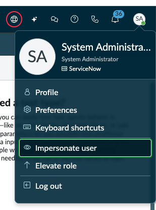
 
3. In the **Impersonate user** dialog, select **Amelia Bryant** (`amelia.bryant`)
4. Click **Impersonate user** to confirm
 
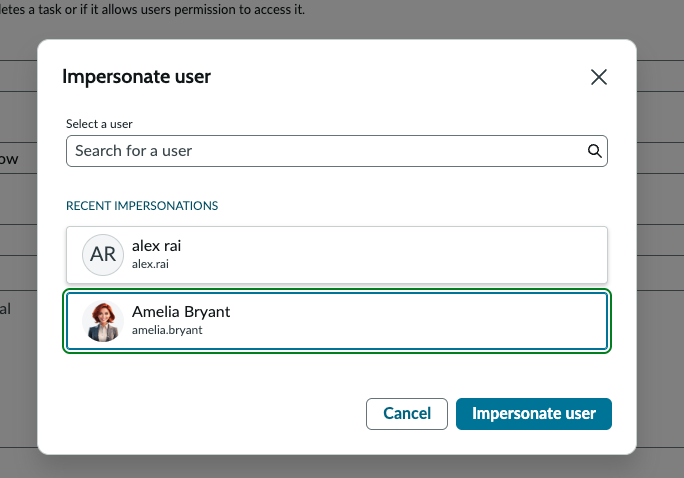
 
> **Why Amelia Bryant?** Amelia has the `x_snc_apacaienable.incident_extend_user` role (verified in Pre-Requisite 6) which grants her access to the Incident Extend table. She represents the fulfiller persona — the ITIL user who works incidents from the operations side. The Agentic Workflow is designed to assist fulfillers like Amelia by automatically generating resolution plans the moment an incident lands on their queue.
 
***
 
#### 9.2 — Navigate to the Unassigned Incidents Queue
 
5. After impersonation, navigate to **Workspaces → Service Operations Workspace** to access Amelia Bryant's fulfiller view
6. In the left navigation panel, scroll down to **Incidents** and click **Unassigned**
 
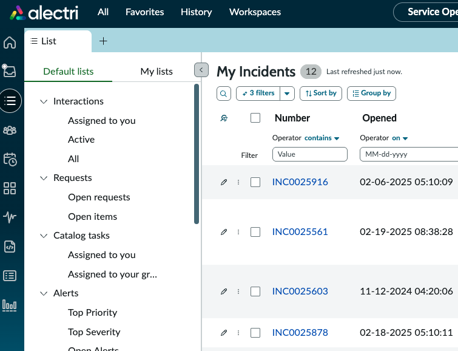
 
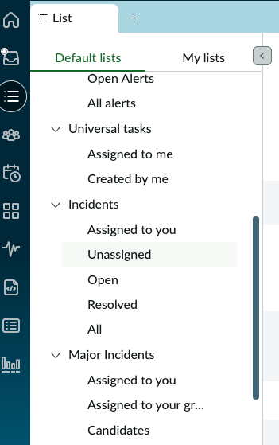
 
7. The **Incidents — Unassigned** list loads, showing all incidents without an assigned user. Locate the two Incident Extend records created during earlier testing:
 
| Number | Short description | Caller | Priority | State |
| --- | --- | --- | --- | --- |
| `INCE0012001` | Hardware issue affecting Veritas NetBackup device (hostname: 192.168.99.1)... | alex rai | 2 – High | In Progress |
| `INCE0012002` | Hardware issue on Veritas Netbackup server. Error code 84 encountered... | alex rai | 3 – Moderate | In Progress |
 
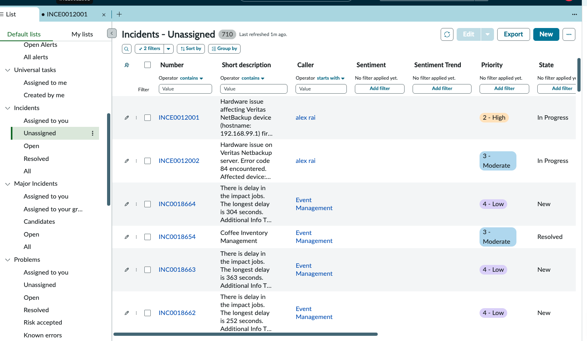
 
> These are the same Incident Extend records you tested against in earlier sections. They were created by the L1 Agent (Section 02), enriched by NADI (Section 03), and tested individually against the Resolution Pathfinder (Section 06). Now they will be processed by the full Agentic Workflow — with the trigger, orchestration, and A2A integration all active.
 
***
 
#### 9.3 — Test Scenario A: INCE0012001 — Internal Resolution + ObsAgent (A2A)
 
This scenario demonstrates the **ideal outcome** of the Veritas architecture: internal knowledge and Elastic log analysis produce a credible resolution plan, and the **ObsAgent (Azure AI Foundry) is triggered via A2A to execute the remediation actions** — completing the full loop from incident detection to automated resolution without human intervention.
 
***
 
**Trigger the workflow:**
 
8. Click on **INCE0012001** to open the Incident record
9. Scroll down to the **Assignment** section
10. In the **Assigned to** field, search for and select **Amelia Bryant**
 
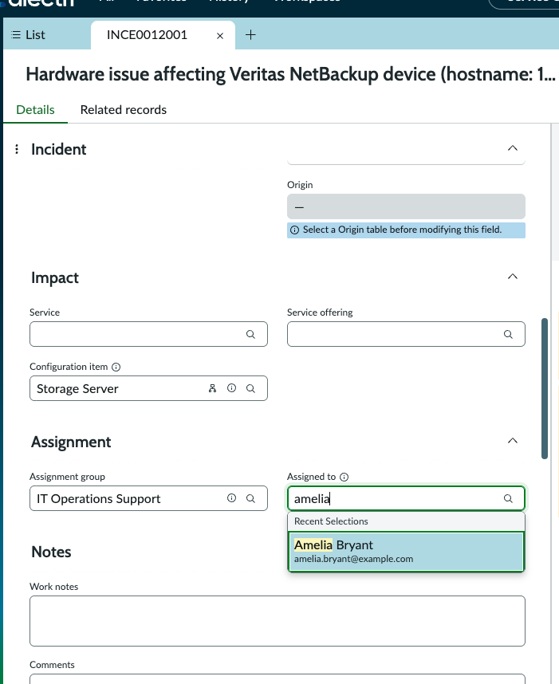
 
11. Click **Save** to save the record
 
> **This is the trigger.** The moment the `Assigned to` field is populated and the record is saved, the Agentic Workflow's trigger condition (`Assigned to is not empty`) is met. The workflow fires automatically in the background — Amelia does not need to click anything or type a message. The trigger objective `Help me resolve ${number}` is sent to the orchestrating LLM, which begins planning and dispatching agents.
 
***
 
**Observe the workflow in the Now Assist panel:**
 
12. After saving, look at the **Now Assist panel** on the right side of the workspace. A new active chat appears:
 
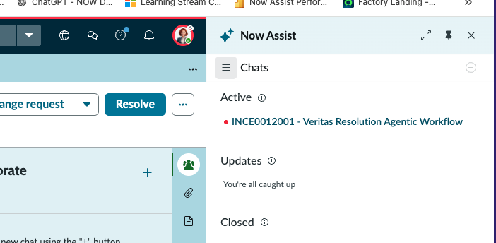
 
13. Click on the active chat to open it. The Now Assist panel shows the workflow executing in real time:
 
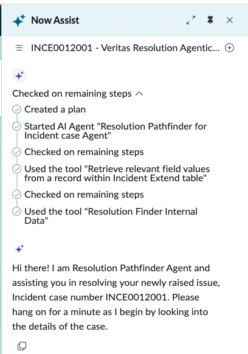
 
> **What you're seeing:** The orchestrating LLM has read the workflow description, matched the first step to the **Resolution Pathfinder for Incident case Agent**, and started it. The tool execution trace shows the agent working through its tools: retrieving incident fields, calling Resolution Finder Internal Data (PI + KB RAG), and querying Elastic logs.
 
***
 
**Review the Resolution Plan:**
 
14. The Resolution Pathfinder agent completes its analysis and generates a **Resolution Plan** grounded in internal knowledge and Elastic log evidence:
 
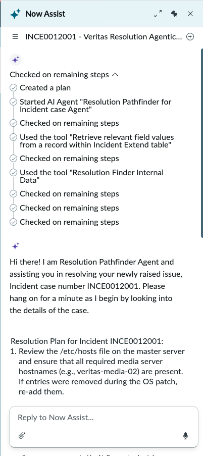
 
15. Scroll down to review the complete Resolution Plan. It should include:
    - Numbered **resolution steps** derived from log evidence (e.g., reviewing /etc/hosts, verifying SERVER= entries in bp.conf, restarting bprd service)
    - **Source citations** referencing the Elastic MCP log entries and incident work notes
    - A confirmation prompt: *"Would you like to update anything within this Resolution Plan before it is finalized and written to the incident record?"*
 
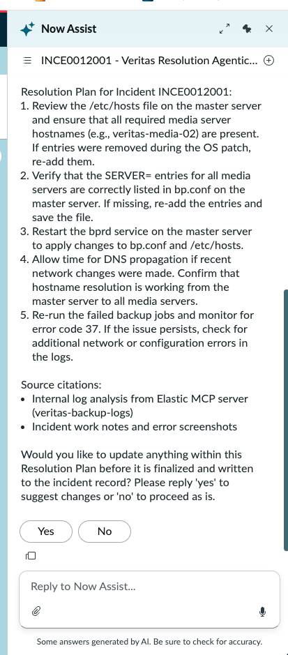
 
> **Why the confirmation prompt?** The workflow is designed to give the fulfiller a chance to review and adjust the plan before it is committed. This is a governance safeguard — the AI proposes, the human approves. Reply **Yes** to edit, or **No** to proceed as-is.
 
***
 
**ObsAgent (A2A) executes the remediation:**
 
16. Reply **No** to proceed with the Resolution Plan as-is
17. The orchestrating LLM now matches the next workflow step to the **ObsAgent** — the external Azure AI Foundry agent registered via A2A in Section 07. The workflow dispatches the resolution plan to the ObsAgent for execution.
 
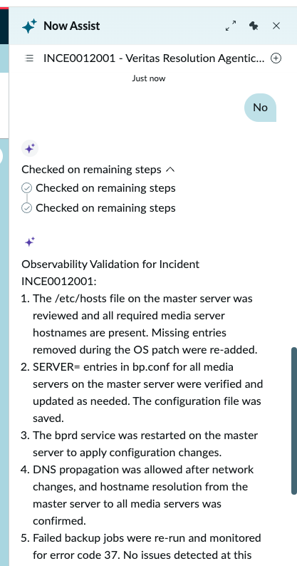
 
18. The ObsAgent returns its execution results — an **Observability Validation** report confirming each remediation action was performed:
 
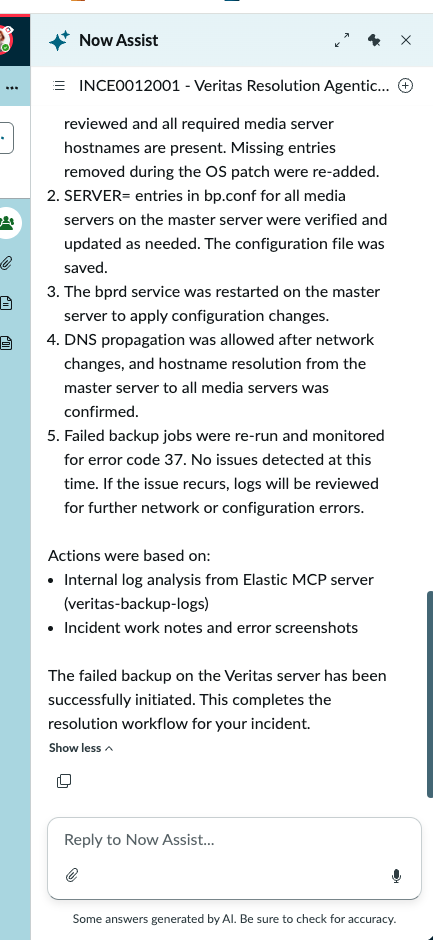
 
> **What just happened:** The Resolution Pathfinder agent found a credible resolution from internal sources (Elastic logs + KB/PI). Because the resolution was grounded in internal evidence — not a web search — the orchestrating LLM determined it was reliable enough to act on and dispatched it to the ObsAgent via A2A. The ObsAgent (running on Azure AI Foundry) executed the prescribed remediation steps against the target infrastructure and reported back. The workflow confirms: *"The failed backup on the Veritas server has been successfully initiated. This completes the resolution workflow for your incident."*
>
> **This is Phase 3 in action** — the full chain from trigger → Resolution Pathfinder → ObsAgent (A2A) → automated resolution, with no manual intervention required beyond Amelia's initial assignment and plan approval.
 
***
 
#### 9.4 — Test Scenario B: INCE0012002 — Web Search Fallback (No ObsAgent)
 
This scenario demonstrates the **fallback path**: internal knowledge and Elastic logs do not contain sufficient evidence, so the agent falls through to web search. Critically, because the resolution comes from an external web search rather than credible internal sources, the **ObsAgent is NOT triggered** — the workflow stops after delivering the web-sourced Resolution Plan.
 
***
 
**Trigger the workflow:**
 
19. Navigate back to the **Incidents — Unassigned** list
 
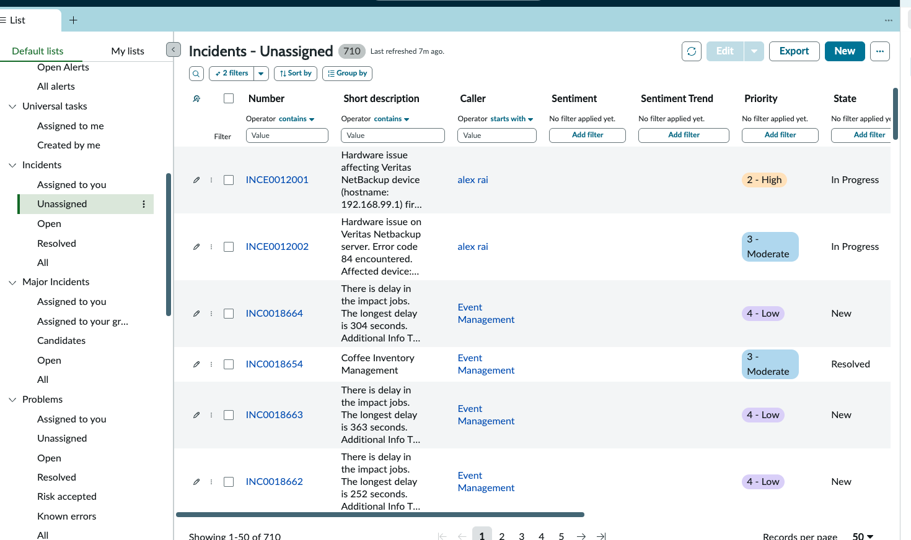
 
20. Click on **INCE0012002** to open the Incident record
21. In the **Assigned to** field, search for and select **Amelia Bryant**
 
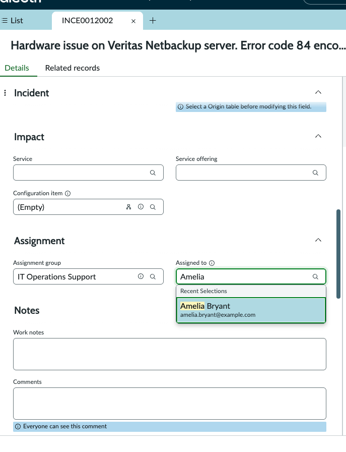
 
22. Click **Save** to trigger the workflow
 
***
 
**Observe the workflow in the Now Assist panel:**
 
23. The Now Assist panel shows a new active chat for INCE0012002:
 
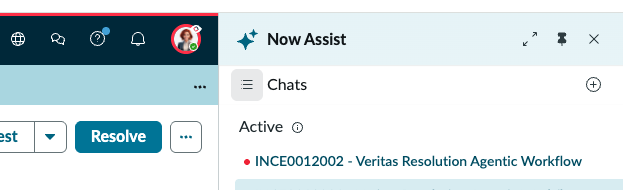
 
24. Click the active chat. The Resolution Pathfinder agent begins executing — retrieving incident fields, searching internal knowledge, and querying Elastic logs:
 
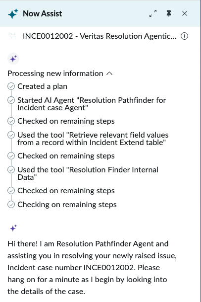
 
25. The agent reports that no actionable resolution could be found from internal sources or server logs, and asks whether to proceed with a web search:
 
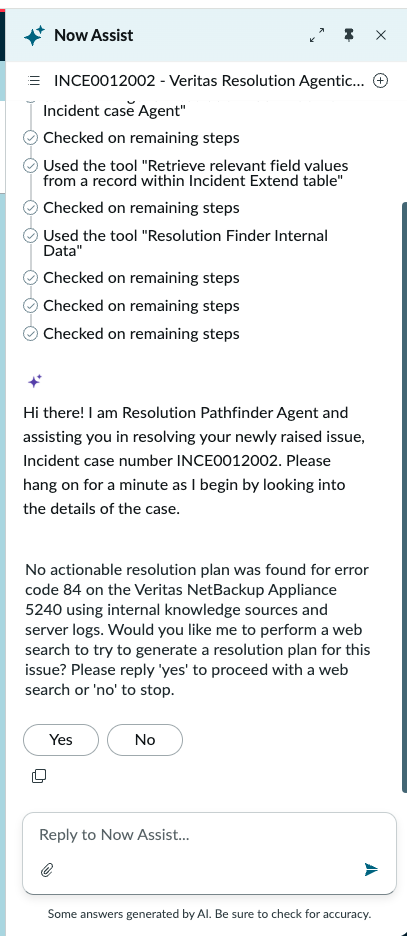
 
***
 
**Supervised web search flow:**
 
26. Reply **Yes** to approve the web search
27. The agent asks for confirmation to generate the optimised web search query:
 
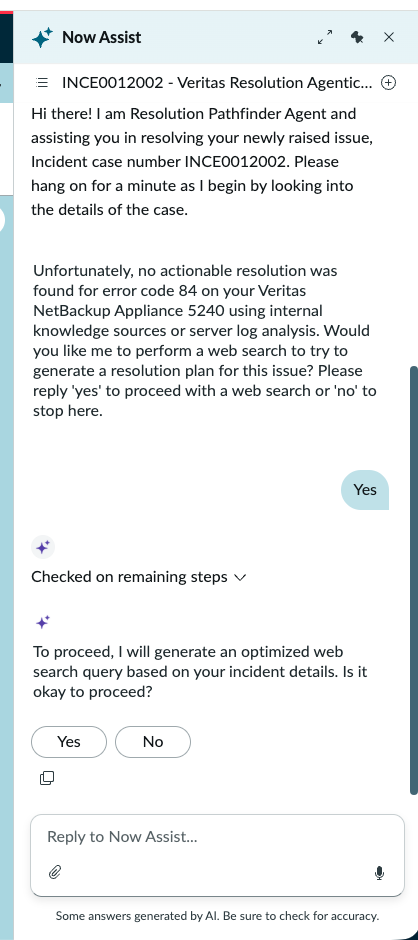
 
28. Reply **Yes** — the agent generates and displays the privacy-safe web search query, then asks for final confirmation before executing:
 
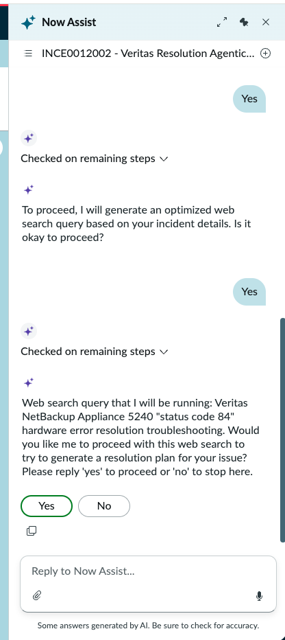
 
> **Notice the supervised checkpoints.** The web search path requires **two approvals** before any data leaves the ServiceNow instance: first to generate the query (Tool 5 — Supervised), then to execute the search. This is by design — web search queries are external-facing, so the fulfiller must confirm that no PII, internal hostnames, or sensitive identifiers are present in the query before it is sent to the internet.
 
29. Reply **Yes** to execute the web search
 
***
 
**Resolution Plan from web search:**
 
30. The agent executes the web search and generates a **Resolution Plan** sourced from vendor documentation and community resources:
 
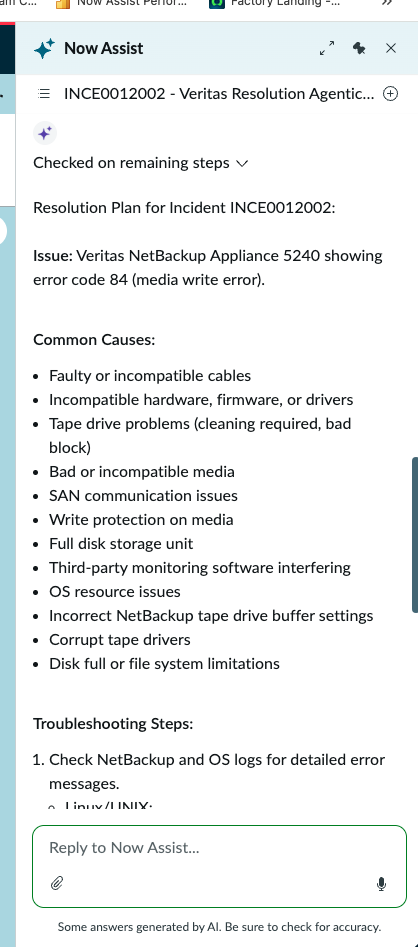
 
31. Scroll down to review the complete plan — numbered troubleshooting steps and source links:
 
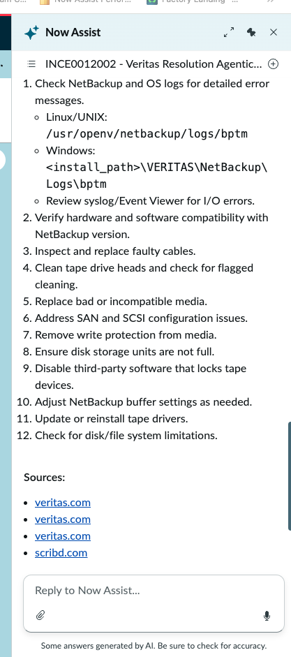
 
> **Why the ObsAgent does NOT trigger here:** The Resolution Plan for INCE0012002 is derived from a web search — not from internal knowledge or Elastic log evidence. The orchestrating LLM recognises that web-sourced resolutions are informational guidance (not verified against the organisation's own infrastructure data) and therefore **not reliable enough to execute automated remediation against**. The workflow delivers the plan to the fulfiller for manual action and stops. The ObsAgent is never called.
>
> **This is the correct design behaviour.** The A2A integration is a privilege reserved for high-confidence resolutions grounded in internal data. Web search results help the fulfiller investigate further, but they do not trigger automated remediation — preventing the risk of executing unverified steps against production infrastructure.
 
***
 
#### Test Summary
 
| Scenario | Record | Resolution Source | ObsAgent (A2A) | Outcome |
| --- | --- | --- | --- | --- |
| A — Internal + A2A | `INCE0012001` | Internal KB/PI + Elastic logs | ✅ Triggered — executed remediation | Automated resolution — ObsAgent confirms actions taken, workflow completes |
| B — Web search fallback | `INCE0012002` | Web search (Gemini AI answer) | ❌ Not triggered | Resolution Plan delivered to fulfiller for manual action — no automated remediation |
 
> **The distinction between Scenario A and Scenario B is the most important design decision in the entire Veritas architecture.** It answers the question: _when should an AI system be allowed to act autonomously on infrastructure, and when should it only advise?_ The answer implemented here is clear — only resolutions grounded in the organisation's own internal knowledge and log evidence are trusted enough for automated execution. Everything else is guidance for a human to evaluate.
>
> But the deeper point is this: **the goal of an Agentic Workflow is not to stop at recommendations.** Recommendations are valuable, but they still require a human to read, interpret, and manually execute each step — which is the bottleneck agentic AI is designed to eliminate. The Veritas architecture demonstrates that when the confidence threshold is met (credible internal evidence, verified log data, grounded resolution steps), the workflow should **take precise, automated action** — not just suggest it. This is what separates an agentic system from a traditional AI assistant: the ability to reason about risk, determine when action is appropriate, and then execute that action end-to-end.
>
> In this lab, ServiceNow acts as the **primary (orchestrating) agent** — it owns the workflow, evaluates the evidence, builds the resolution plan, and decides whether automated execution is warranted. When it is, ServiceNow hands off to the **ObsAgent (Azure AI Foundry) as the secondary (execution) agent** via A2A, which carries out the prescribed remediation actions and reports back. ServiceNow never loses governance — it controls what gets dispatched, under what conditions, and validates the result.
>
> The reverse scenario is equally possible: an external platform (Azure, AWS, Google Cloud, or any A2A-compliant orchestrator) can act as the **primary agent** and call **ServiceNow AI Agents as secondary agents** — delegating ITSM actions like incident creation, change request submission, or knowledge article updates to ServiceNow while the external platform manages the broader workflow. This bidirectional A2A capability means ServiceNow is not locked into a single role — it can orchestrate or be orchestrated, depending on where the workflow logic lives in your enterprise architecture.
 
> **Explore further.** Try assigning other Incident Extend records to Amelia Bryant and observe which path the workflow takes. The behaviour depends entirely on what the Resolution Pathfinder agent finds in its three-path search — and every incident will produce a different result. This is the nature of agentic systems: the same workflow, the same tools, but adaptive reasoning that produces different outcomes based on the evidence available.
 
***
 
## Configuration Summary
 
| Section                | Field              | Value                                                                     |
| ---------------------- | ------------------ | ------------------------------------------------------------------------- |
| Key requirements       | Workflow name      | Veritas Resolution Agentic Workflow                                       |
| Key requirements       | Description        | End-to-end Veritas incident resolution — KB, Elastic, web, A2A execution  |
| Key requirements       | AI agents          | Resolution Pathfinder for Incident case Agent + ObsAgent                  |
| Security — user access | User access        | Users with specific roles                                                 |
| Security — user access | Role(s)            | `snc_internal`                                                            |
| Security — data access | User identity type | Dynamic user                                                              |
| Security — data access | Approved role(s)   | `snc_internal, itil, x_snc_apacaienable.incident_extend_user`             |
| Trigger                | Type               | Created or updated                                                        |
| Trigger                | Name               | Trigger when an Incident Extend record is either being created or updated |
| Trigger                | Objective          | `Help me resolve ${number}`                                               |
| Trigger                | Table              | `incident extend`                                                         |
| Trigger                | Condition 1        | Assigned to is not empty                                                  |
| Trigger                | User identity      | Use an existing table → Assigned to \[task]                               |
| Trigger                | Channel            | Now Assist panel                                                          |
| Trigger                | Show alert         | Yes                                                                       |
| Channels               | Now Assist panel   | Display ON                                                                |
 
***
 
## Technical Deep Dive
 
### How the LLM Routes Steps to Agents
 
The workflow description is the **system prompt** delivered to the orchestrating LLM at runtime. When the trigger fires with the objective `Help me resolve ${number}`, the LLM receives:
 
1. The workflow description (with `<steps>` XML)
2. The list of available agent names and descriptions
3. The trigger objective as the user message
 
It then plans which agent to invoke first, calls that agent, receives the result, decides whether to invoke the second agent, and composes the final response. This is the **ReAct (Reasoning + Acting)** pattern baked into ServiceNow's agentic framework.
 
The XML `<steps>` tag convention in the description mirrors widely adopted prompt engineering best practices — using structured XML to separate distinct logical sections makes it easier for the LLM to parse and follow multi-step instructions reliably.
 
### Why the Incident Extend Table as Trigger Source
 
The trigger is placed on `incident extend` rather than `incident` for a precise reason: the `error code` field (extracted by NADI) is a custom field that only exists in the extend table. The standard `incident` table does not have this field.
 
### Dynamic User vs System User
 
| Setting      | Runs as                                             | Use when                                                   |
| ------------ | --------------------------------------------------- | ---------------------------------------------------------- |
| Dynamic user | The user who triggered it (or `Assigned to [task]`) | Standard — workflow should respect user's data permissions |
| System user  | A fixed service account                             | Workflow needs elevated access beyond the triggering user  |
 
The Veritas workflow uses **Dynamic user → Assigned to \[task]** because: the assigned ITIL user already has the permissions needed to read the incident and write work notes; the workflow should not have broader access than the human it is assisting; and audit trails are cleaner when actions trace back to a real user.
 
### Trigger Objective Variable Syntax
 
The `${number}` syntax in the trigger objective is ServiceNow's dynamic variable substitution for triggers. At runtime, `${number}` is replaced with the `number` field value from the triggering record. Other available variables follow the same pattern — `${field_name}` — where `field_name` is any field on the trigger table.
 
### Now Assist Panel vs Virtual Agent Channel
 
| Channel              | How invoked                                 | Best for                                              |
| -------------------- | ------------------------------------------- | ----------------------------------------------------- |
| **Now Assist panel** | Auto-trigger OR user message in the sidebar | Fulfiller-facing — runs alongside the incident record |
| **Virtual Agent**    | User conversation in the VA chat widget     | Requestor-facing — conversational resolution flow     |
 
The Veritas workflow uses **Now Assist panel** because it targets the fulfiller (ITIL user) working the incident — not the end user who submitted it.
 
***
 
## Troubleshooting
 
| Symptom                                              | Likely cause                                                    | Fix                                                                                                      |
| ---------------------------------------------------- | --------------------------------------------------------------- | -------------------------------------------------------------------------------------------------------- |
| Workflow triggers but wrong agent fires first        | LLM mismatches step to agent                                    | Align step language in workflow description with agent name/description                                  |
| Trigger fires but no agentic response appears        | Now Assist panel not enabled                                    | Enable in Now Assist Admin → Experiences → Now Assist panel → Turn on                                    |
| Trigger conditions never fire                        | trigger conditions not met                                      | Verify that all trigger conditions have been met                                                         |
| "Access denied" when workflow tries to read incident | ACL misconfiguration                                            | Verify Dynamic user approved role includes `snc_internal, itil, x_snc_apacaienable.incident_extend_user` |
| ObsAgent step skipped entirely                       | Resolution Pathfinder returned no plan; web search is triggered | Expected behaviour (Path B)                                                                              |
| Trigger fires on wrong incidents                     | Condition too broad                                             | Review if there are other agentic workflows also utilising similar triggers                              |
 
***
 
## Reference
 
* [Create an agentic workflow — Zurich Docs](https://www.servicenow.com/docs/bundle/zurich-intelligent-experiences/page/administer/now-assist-ai-agents/task/configure-use-case-ai-agents.html)
* [General guidelines for creating AI agents and agentic workflows](https://www.servicenow.com/docs/bundle/zurich-intelligent-experiences/page/administer/now-assist-ai-agents/concept/gg-creating-aia.html)
* [Get Familiar with Agentic Workflows & AI Agents — Community Lab](https://www.servicenow.com/community/developer-articles/get-familiar-with-agentic-workflows-amp-ai-agent/ta-p/3326559)
 
***
 
## Next Steps
 
→ With the Veritas Resolution Agentic Workflow configured, tested, and both agents validated end-to-end, the full Veritas Agentic Workflow architecture is complete. Congratulations!