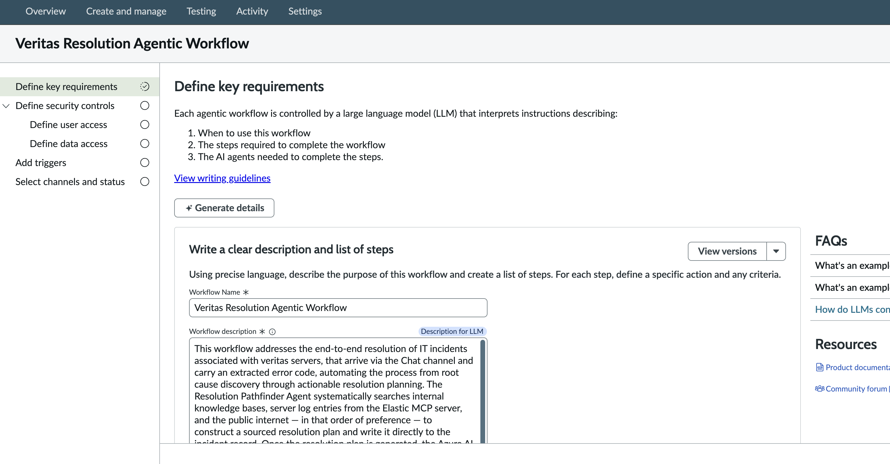
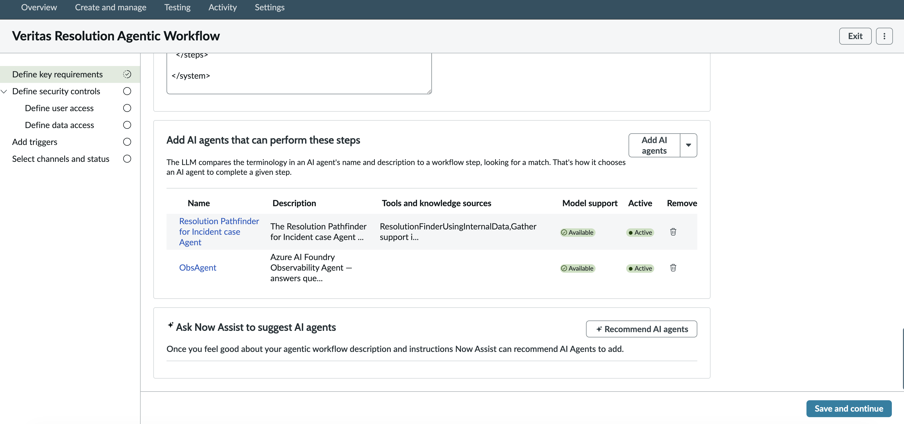
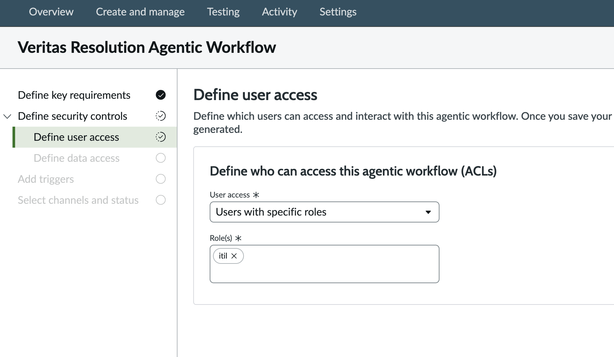
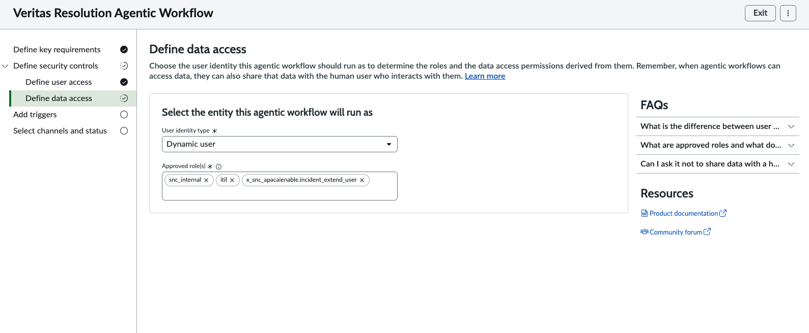
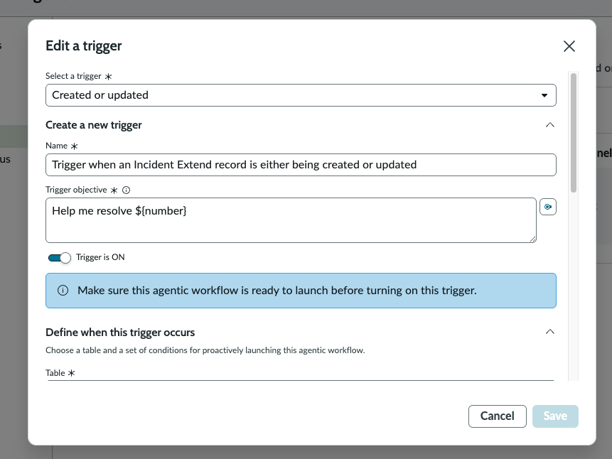
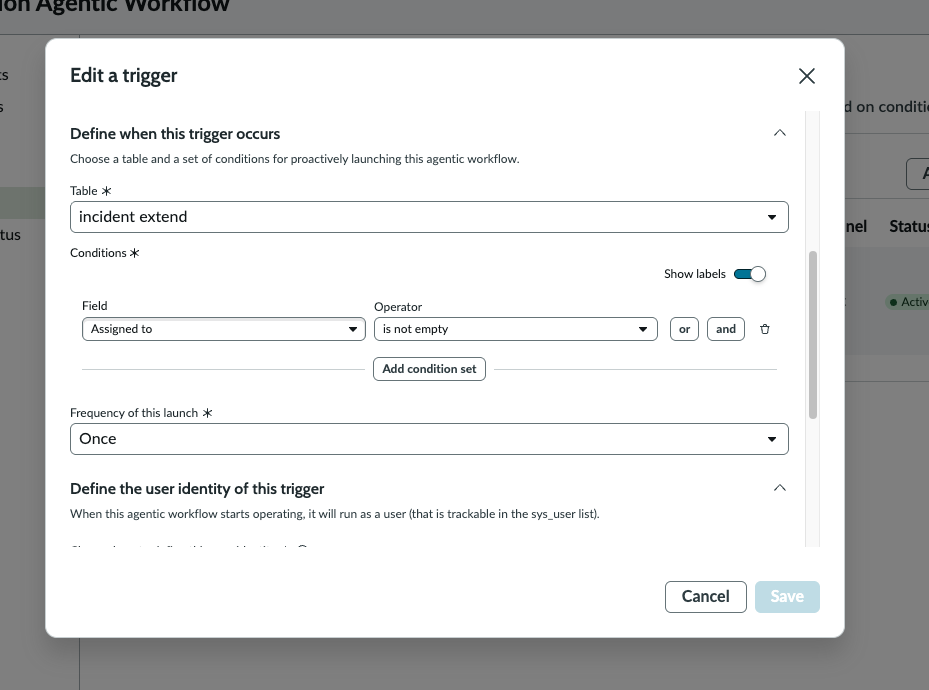
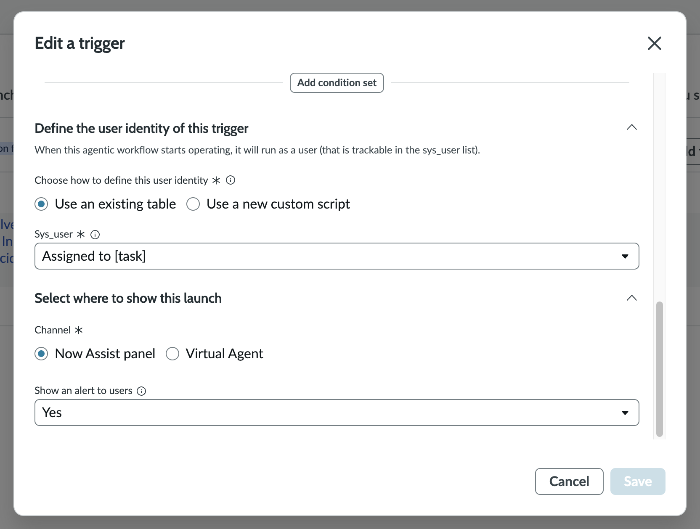
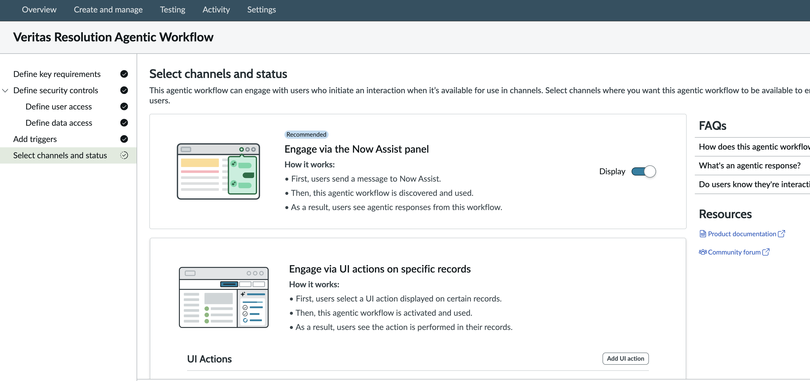

# 08 — Wrapping Agents in the Veritas Resolution Agentic Workflow

> **Release:** Zurich | **Feature:** AI Agent Studio — Agentic Workflows
> **Role in Veritas:** Orchestration layer that binds the Resolution Pathfinder Agent and the ObsAgent (A2A) under a single LLM-governed workflow, with trigger conditions, security controls, and channel configuration.
> **Sources:** [Create an agentic workflow — Zurich Docs](https://www.servicenow.com/docs/bundle/zurich-intelligent-experiences/page/administer/now-assist-ai-agents/task/configure-use-case-ai-agents.html) | [Get Familiar with Agentic Workflows & AI Agents — Community](https://www.servicenow.com/community/developer-articles/get-familiar-with-agentic-workflows-amp-ai-agent/ta-p/3326559) | [General guidelines for creating AI agents and agentic workflows — Zurich Docs](https://www.servicenow.com/docs/bundle/zurich-intelligent-experiences/page/administer/now-assist-ai-agents/concept/gg-creating-aia.html)

---

## What This Doc Covers

An **Agentic Workflow** in ServiceNow AI Agent Studio is the orchestration container that ties together:

- A natural language **description** that the LLM uses to decide *when* to use this workflow and *which agents* to call for each step
- One or more **AI Agents** that perform the work
- **Security controls** — who can access and what data the workflow can touch
- **Triggers** — the record conditions that automatically launch the workflow
- **Channels** — where the workflow surfaces to users

This document walks through building the **Veritas Resolution Agentic Workflow** — the top-level orchestration layer for the entire Veritas architecture. It wraps the Resolution Pathfinder Agent (internal KB + Elastic + web search) and the ObsAgent (A2A execution via Azure AI Foundry) into a single governed workflow.

---

## What an Agentic Workflow Is — Platform Concepts

### LLM-Governed Orchestration

Each agentic workflow is controlled by a Large Language Model that interprets the workflow's description to determine:

1. **When to use this workflow** — matched against the trigger objective and user intent
2. **The steps required to complete the workflow** — derived from the workflow description's `<steps>` block
3. **The AI agents needed to complete the steps** — the LLM matches step descriptions to agent names and descriptions

> This is the key design principle: the **LLM reads the description and decides which agent to call for which step**. Agent matching is semantic — the LLM compares terminology in an agent's name and description to the workflow step. This means agent descriptions and workflow step language must be aligned.

### Agentic Workflow vs AI Agent

| Concept | What it is | Analogy |
|---------|-----------|---------|
| **Agentic Workflow** | The orchestration container — defines the goal, steps, agents, security, and triggers | The project brief |
| **AI Agent** | The worker that executes specific steps — has tools, a system prompt, and a model | The specialist |
| **Trigger** | The record condition that auto-launches the workflow | The alarm |
| **Channel** | Where the workflow output surfaces (Now Assist panel, Virtual Agent) | The communication medium |

### Wizard Structure

The Agentic Workflow creation wizard has five steps:

```
1. Define key requirements   → Workflow name, description (LLM instructions), AI agents
2. Define security controls  → User access (ACL) + Data access (identity)
3. Add triggers              → Table, conditions, trigger objective, channel
4. Select channels & status  → Now Assist panel, UI Actions
```

---

## Prerequisites

| Requirement | Detail |
|-------------|--------|
| AI Agent Studio | `sn_aia` plugin Active — Zurich |
| Resolution Pathfinder Agent | Built and Active (see [06 — Fulfiller AI Agent](06-fulfiller-ai-agent.md)) |
| ObsAgent (External) | Registered and Active (see [07 — External Agent Integration](07-external-agent-integration.md)) |
| Incident Extend table | `x_nava_agentic_lab_incident_extend` populated |
| Now Assist Panel | Enabled in Now Assist Admin → Experiences |
| Role | `sn_aia.admin` or `admin` |

---

## Lab Exercise — Step-by-Step Build

### Step 1: Define Key Requirements — Workflow Name and Description

Navigate to **All → AI Agent Studio → Create and manage → Agentic workflows → New**.

The **Veritas Resolution Agentic Workflow** wizard opens on **Define key requirements**.



The page explains the LLM's three jobs: know *when* to use the workflow, know the *steps* to complete it, and know the *AI agents* needed.

**Workflow Name:**

```
Veritas Resolution Agentic Workflow
```

**Workflow description** (the LLM system prompt — tagged `Description for LLM`):

```xml
This workflow addresses the end-to-end resolution of IT incidents
associated with veritas servers, that arrive via the Chat channel and
carry an extracted error code, automating the process from root
cause discovery through actionable resolution planning. The
Resolution Pathfinder Agent systematically searches internal
knowledge bases, server log entries from the Elastic MCP server,
and the public internet — in that order of preference — to
construct a sourced resolution plan and write it directly to the
incident record. Once the resolution plan is generated, the Azure AI
Foundry ObsAgent executes the prescribed remediation actions against
the target environment and returns the execution outcome.
```

> **Writing the description well is critical.** The LLM uses this text — not the agent names alone — to decide when to activate the workflow and which agent handles which step. Use precise, domain-specific language that mirrors the terminology in your agent names and descriptions. Click **View writing guidelines** for ServiceNow's official guidance on prompt engineering for agentic workflows.

The description should continue with the XML `<steps>` block that enumerates each step, the responsible agent, and the conditions:

```xml
<steps>
  <step>
    <name>Root cause discovery and resolution planning</name>
    <agent>Resolution Pathfinder for Incident case Agent</agent>
    <description>
      Search the internal KB, Elastic log server via MCP, and the
      public internet in order to identify the root cause and construct
      an actionable, sourced resolution plan. Write the plan to the
      incident work notes.
    </description>
  </step>
  <step>
    <name>Autonomous remediation execution</name>
    <agent>ObsAgent</agent>
    <description>
      Receive the resolution plan and execute the prescribed
      remediation actions against the Veritas server environment via
      the A2A protocol. Return the execution outcome (success / partial
      / failure) and write it to the incident work notes.
    </description>
    <condition>Only execute if Step 1 produced a resolution plan.</condition>
  </step>
</steps>

</system>
```

> The closing `</steps>` and `</system>` tags visible at the top of the screenshot (Image 2) indicate the full system prompt uses XML tags — consistent with Anthropic-style prompt engineering conventions used throughout the Veritas architecture.

Click **View versions** to manage prompt versioning. Click **+ Generate details** to use Now Assist to auto-generate a description draft based on the workflow name.

---

### Step 2: Add AI Agents to the Workflow

Still on **Define key requirements**, scroll down to the **"Add AI agents that can perform these steps"** section.



The platform explains: *"The LLM compares the terminology in an AI agent's name and description to a workflow step, looking for a match. That's how it chooses an AI agent to complete a given step."*

Click **Add AI agents** and add both agents:

| Name | Description (truncated) | Tools / Knowledge | Model support | Active |
|------|--------------------------|-------------------|--------------|--------|
| **Resolution Pathfinder for Incident case Agent** | The Resolution Pathfinder for Incident case Agent... | ResolutionFinderUsingInternalData, Gather support i... | ✅ Available | ● Active |
| **ObsAgent** | Azure AI Foundry Observability Agent — answers que... | — | ✅ Available | ● Active |

> The LLM uses semantic matching between the step descriptions in the workflow description and the agent's `name` + `description` fields. This is why the ObsAgent's description explicitly says "Azure AI Foundry Observability Agent, answers questions about veritas resolution recommendation" — it aligns with the second step's language about remediation execution. If the agent description is too generic, the LLM may route the wrong step to the wrong agent.

The **+ Ask Now Assist to suggest AI agents** section at the bottom allows Now Assist to recommend agents based on the workflow description — useful when building workflows with many available agents.

Click **Save and continue**.

---

### Step 3: Define User Access (Security Controls)

The wizard advances to **Define security controls → Define user access**.



**Define who can access this agentic workflow (ACL):**

| Field | Value |
|-------|-------|
| User access | `Users with specific roles` |
| Role(s) | `itil` |

> Once saved, an ACL record is automatically generated. Users with the `itil` role can discover and interact with this workflow through its configured channels (Now Assist panel). Without this ACL, no users will be able to trigger or see the workflow's output.

---

### Step 4: Define Data Access (Security Controls)

The wizard advances to **Define data access**.



**Select the entity this agentic workflow will run as:**

| Field | Value |
|-------|-------|
| User identity type | `Dynamic user` |
| Approved role(s) | `itil` |

> **Dynamic user** means the workflow runs as the user who triggered it — it inherits that user's roles and data permissions. This ensures the workflow cannot access data the triggering user couldn't access themselves. The **Approved role(s)** field caps the maximum privilege: even if the triggering user has admin, the workflow operates within `itil` bounds. This is the correct governance model for a workflow that reads incident records and writes work notes.
>
> The alternative — **System user** — runs the workflow as a high-privilege service account and should only be used when the workflow requires access beyond the triggering user's permissions.

---

### Step 5: Add a Trigger

The wizard advances to **Add triggers**. Click **+ Add trigger**.

The **Add a trigger** dialog opens:



**Top section:**

| Field | Value |
|-------|-------|
| Select a trigger | `Created` |
| Name | `Trigger to resolve newly created Incident record from Incident Extend table` |
| Trigger objective | `Help me resolve Veritas Incident Number: ${number}` |
| Trigger is ON | ✅ Enabled |

> **Trigger objective** is the natural language message sent to the workflow's LLM when the trigger fires. It becomes the initial user message that activates the agentic workflow. The `${number}` is a dynamic variable — it is substituted with the actual incident number at runtime (e.g., `Help me resolve Veritas Incident Number: INCE0011002`). This is how the workflow LLM knows *which* incident to work on.
>
> The platform note warns: *"Make sure this agentic workflow is ready to launch before turning on this trigger."* Keep the trigger OFF until the full workflow is configured and tested.

---

### Step 6: Configure Trigger Conditions

Scroll down in the **Edit a trigger** dialog to **Define when this trigger occurs**.



**Table and conditions:**

| Field | Value |
|-------|-------|
| Table | `incident extend` |

**Conditions (AND logic):**

| Field | Operator | Value |
|-------|----------|-------|
| State | is | `In Progress` |
| Channel | is | `Chat` |
| error code | is not empty | — |

> These three conditions together define the Veritas trigger gate — they match the exact same conditions that drive the Fulfiller Flow in Phase 2:
> - **State = In Progress** — incident has been acknowledged and is being worked
> - **Channel = Chat** — incident arrived via the chat interface (NAVA → Virtual Agent)
> - **error code is not empty** — NADI has extracted an error code; the workflow has structured data to work with
>
> The trigger fires on the **`incident extend`** table (`x_nava_agentic_lab_incident_extend`), not the base `incident` table — because the error code and extended fields that drive the workflow live in the extend table, populated by NADI.

---

### Step 7: Configure Trigger User Identity and Channel

Still in the **Edit a trigger** dialog, scroll down to **Define the user identity** and **Select where to show this launch**.



**Define the user identity of this trigger:**

| Field | Value |
|-------|-------|
| Choose how to define this user identity | `Use an existing table` |
| Sys_user | `Assigned to [task]` |

> This sets *who the workflow runs as* when the trigger fires automatically (not from a human clicking a button). `Assigned to [task]` means the workflow runs as the user assigned to the incident at the time of trigger — preserving their data permissions and ensuring audit traceability back to a real user in `sys_user`.

**Select where to show this launch:**

| Field | Value |
|-------|-------|
| Channel | `Now Assist panel` |
| Show an alert to users | `Yes` |

> **Now Assist panel** is the recommended channel — it surfaces the workflow's agentic responses in the fulfiller's Now Assist sidebar. **Show an alert to users = Yes** means the assigned user receives a notification that the agentic workflow has been automatically triggered on their incident — giving them visibility without requiring them to initiate it manually.

Click **Save** to save the trigger.

---

### Step 8: Select Channels and Status

The wizard advances to the final step: **Select channels and status**.



Two channel options are presented:

**Engage via the Now Assist panel** ← Recommended

| Setting | Value |
|---------|-------|
| Display | ✅ ON |

How it works: Users send a message to Now Assist → this agentic workflow is discovered and used → users see agentic responses from this workflow.

**Engage via UI actions on specific records**

How it works: Users select a UI Action on a record → this agentic workflow is activated → users see the action performed in their records.

> For the Veritas workflow, **Now Assist panel** with Display ON is the correct channel — it allows both the auto-trigger (from the trigger condition) and manual invocation (from the fulfiller typing in Now Assist panel on an incident record). The UI Actions option is available for additional manual-trigger scenarios.

> The **FAQs** panel on the right provides inline guidance: "How does this agentic workflow get triggered?", "What's an agentic response?", "Do users know they're interacting with AI?" — useful for understanding the end-user experience before publishing.

---

## Configuration Summary

| Section | Field | Value |
|---------|-------|-------|
| Key requirements | Workflow name | Veritas Resolution Agentic Workflow |
| Key requirements | Description | End-to-end Veritas incident resolution — KB, Elastic, web, A2A execution |
| Key requirements | AI agents | Resolution Pathfinder for Incident case Agent + ObsAgent |
| Security — user access | User access | Users with specific roles |
| Security — user access | Role(s) | `itil` |
| Security — data access | User identity type | Dynamic user |
| Security — data access | Approved role(s) | `itil` |
| Trigger | Type | Created |
| Trigger | Name | Trigger to resolve newly created Incident record from Incident Extend table |
| Trigger | Objective | `Help me resolve Veritas Incident Number: ${number}` |
| Trigger | Table | `incident extend` |
| Trigger | Condition 1 | State is In Progress |
| Trigger | Condition 2 | Channel is Chat |
| Trigger | Condition 3 | error code is not empty |
| Trigger | User identity | Use an existing table → Assigned to [task] |
| Trigger | Channel | Now Assist panel |
| Trigger | Show alert | Yes |
| Channels | Now Assist panel | Display ON |

---

## Technical Deep Dive

### How the LLM Routes Steps to Agents

The workflow description is the **system prompt** delivered to the orchestrating LLM at runtime. When the trigger fires with the objective `Help me resolve Veritas Incident Number: INCE0011002`, the LLM receives:

1. The workflow description (with `<steps>` XML)
2. The list of available agent names and descriptions
3. The trigger objective as the user message

It then plans which agent to invoke first, calls that agent, receives the result, decides whether to invoke the second agent, and composes the final response. This is the **ReAct (Reasoning + Acting)** pattern baked into ServiceNow's agentic framework.

The XML `<steps>` tag convention in the description mirrors Anthropic's prompt engineering best practices — using structured XML to separate distinct logical sections makes it easier for the LLM to parse and follow multi-step instructions reliably.

### Why the Incident Extend Table as Trigger Source

The trigger is placed on `incident extend` rather than `incident` for a precise reason: the `error code` field (extracted by NADI) is a custom field that only exists in the extend table. The standard `incident` table does not have this field. By triggering on `incident extend`, the condition `error code is not empty` can be evaluated directly — ensuring the workflow only fires when NADI has successfully extracted an error code from the chat conversation.

### Dynamic User vs System User

| Setting | Runs as | Use when |
|---------|---------|---------|
| Dynamic user | The user who triggered it (or `Assigned to [task]`) | Standard — workflow should respect user's data permissions |
| System user | A fixed service account | Workflow needs elevated access beyond the triggering user |

The Veritas workflow uses **Dynamic user → Assigned to [task]** because: the assigned ITIL user already has the permissions needed to read the incident and write work notes; the workflow should not have broader access than the human it is assisting; and audit trails are cleaner when actions trace back to a real user.

### Trigger Objective Variable Syntax

The `${number}` syntax in the trigger objective is ServiceNow's dynamic variable substitution for triggers. At runtime, `${number}` is replaced with the `number` field value from the triggering record. Other available variables follow the same pattern — `${field_name}` — where `field_name` is any field on the trigger table.

### Now Assist Panel vs Virtual Agent Channel

| Channel | How invoked | Best for |
|---------|------------|---------|
| **Now Assist panel** | Auto-trigger OR user message in the sidebar | Fulfiller-facing — runs alongside the incident record |
| **Virtual Agent** | User conversation in the VA chat widget | Requestor-facing — conversational resolution flow |

The Veritas workflow uses **Now Assist panel** because it targets the fulfiller (ITIL user) working the incident — not the end user who submitted it.

---

## Troubleshooting

| Symptom | Likely cause | Fix |
|---------|-------------|-----|
| Workflow triggers but wrong agent fires first | LLM mismatches step to agent | Align step language in workflow description with agent name/description |
| Trigger fires but no agentic response appears | Now Assist panel not enabled | Enable in Now Assist Admin → Experiences → Now Assist panel → Turn on |
| Trigger conditions never fire | error code field empty | Verify NADI is populating `u_extracted_error_code` in the extend table |
| "Access denied" when workflow tries to read incident | ACL misconfiguration | Verify Dynamic user approved role includes `itil` |
| ObsAgent step skipped entirely | Resolution Pathfinder returned no plan | Expected behaviour (Path 3B) — escalation to L2 via work notes |
| Trigger fires on wrong incidents | Condition too broad | Add `Channel is Chat` condition to scope to NAVA-originated incidents only |

---

## Reference

- [Create an agentic workflow — Zurich Docs](https://www.servicenow.com/docs/bundle/zurich-intelligent-experiences/page/administer/now-assist-ai-agents/task/configure-use-case-ai-agents.html)
- [General guidelines for creating AI agents and agentic workflows](https://www.servicenow.com/docs/bundle/zurich-intelligent-experiences/page/administer/now-assist-ai-agents/concept/gg-creating-aia.html)
- [Get Familiar with Agentic Workflows & AI Agents — Community Lab](https://www.servicenow.com/community/developer-articles/get-familiar-with-agentic-workflows-amp-ai-agent/ta-p/3326559)
- [06 — Fulfiller AI Agent (Resolution Pathfinder)](06-fulfiller-ai-agent.md)
- [07 — External Agent Integration (ObsAgent A2A)](07-external-agent-integration.md)
- [12 — Observability and Action Agent](12-observability-action-agent.md)

---

## Next Steps

→ With the Veritas Resolution Agentic Workflow configured and both agents added, the full Veritas architecture is complete.

→ Enable the trigger once testing is confirmed (keep **Trigger is ON** toggled off until end-to-end testing passes).

→ Return to [00 — Use Case Summary](00-use-case-summary.md) for the complete architecture overview across all phases.
