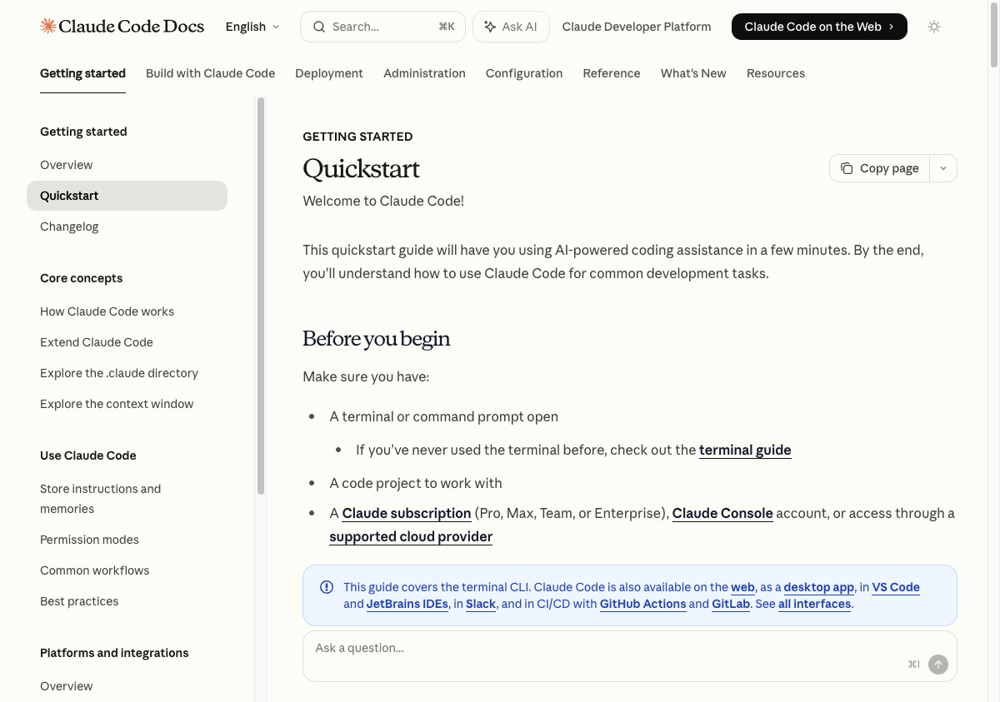
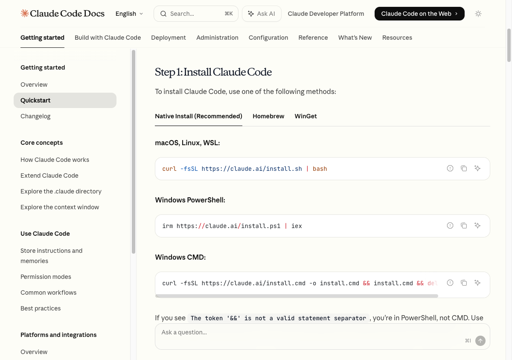
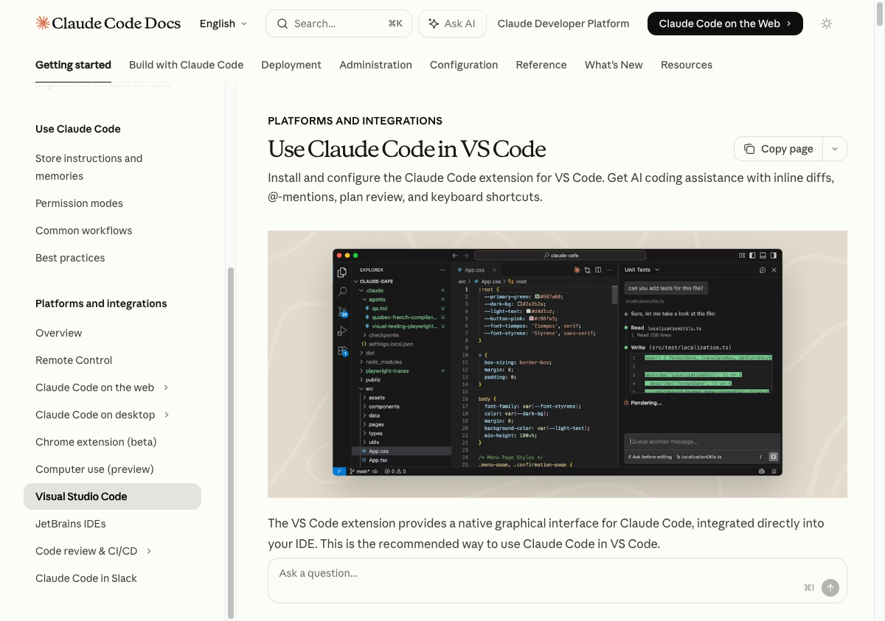
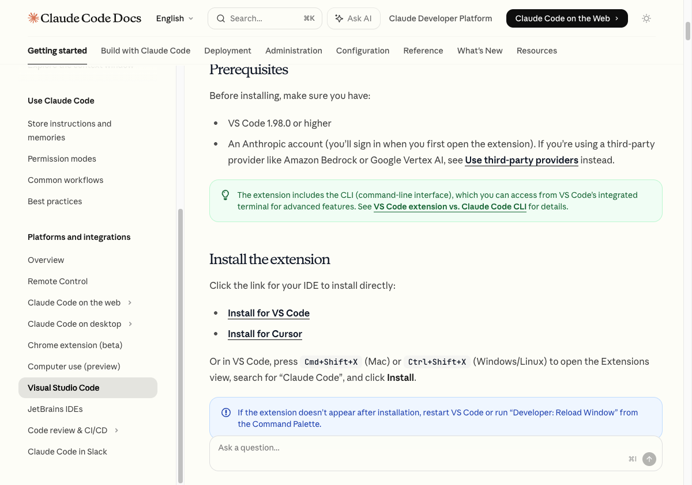

# Claude Code Install Walkthrough

> Step-by-step setup guide for macOS — Terminal + VS Code

---

## Part 1 — Install Claude Code CLI

### Step 1: Open the Quickstart Docs

Open your browser and navigate to the Claude Code quickstart page:
[https://code.claude.com/docs/en/quickstart](https://code.claude.com/docs/en/quickstart)



Then open **Terminal** on your Mac:

- Press `Command + Space` to open Spotlight
- Type **Terminal** and press `Return`
- Or find it under **Applications > Utilities > Terminal**

> **Tip:** Keep the Terminal open beside your browser to make navigation easier.

---

### Step 2: Run the Install Command

On the quickstart page under **Step 1**, find the **macOS / Linux / WSL** section. Copy the install command and paste it into your Terminal, then press `Return`:



```bash
curl -fsSL https://claude.ai/install.sh | bash
```

A successful install will output something like:

```text
✓ Claude Code successfully installed!
  Version: 2.x.x
  Location: ~/.local/bin/claude
✅ Installation complete!
```

---

### Step 3: Start Your First Session

Navigate to your project directory and start Claude Code:

```bash
cd /path/to/your/project
claude
```

> **Note:** This step may fail if `~/.local/bin` is not in your PATH. That's expected — proceed to Step 4 to resolve it.

---

### Step 4: Fix PATH Issue (if Step 3 fails)

If you see an error like:

```text
zsh: command not found: claude
```

Use the **Sparkle Assistant** on the Claude Code docs site to troubleshoot:

1. Copy all the text from your Terminal output
2. Go back to the Claude Code docs site
3. Click the **sparkle icon (✨)** next to the Step 3 code block (to the right of the copy button)
4. In the input field, type:

   > `This did not work: [paste your copied terminal text here]`

The assistant will diagnose your issue and generate a fix command.

---

### Step 5: Run the Generated Fix Command

The sparkle assistant will generate an `echo` command tailored to your error. Copy it and paste it into your Terminal, then press `Return`. It will look something like:

```bash
echo 'export PATH="$HOME/.local/bin:$PATH"' >> ~/.zshrc && source ~/.zshrc
```

After running it, retry `claude` from your project directory.

---

### Step 6: Configure Claude Code

Once Claude Code launches successfully:

1. **Choose a color mode** — Select your preferred theme (light/dark)
2. **Authorize in your browser** — A browser window will open. Click **Authorize** to connect Claude Code to your Claude account
3. **Sign in with your enterprise account** when prompted
4. If a verification code appears in the browser, paste it back into the Terminal prompt
5. Press `Return` through the security notes screen
6. Select **#1 — Yes, use recommended settings** for terminal setup
7. Select **#1 — Yes, I trust this folder** for workspace access

> **Setup complete in Terminal!** You should now see the Claude Code prompt.

---

#### Troubleshoot: OAuth Timeout Error

If you see:

```text
⚠ OAuth error: timeout of 15000ms exceeded
```

This typically means the Claude service is experiencing an outage or connectivity issue.

- Check the Claude status page: [https://status.claude.com/](https://status.claude.com/)
- Press `Return` to retry once the service is back online

---

## Part 2 — Install VS Code + Claude Code Extension

### Step 7: Install Visual Studio Code

1. Open the **Self Service** app on your Mac
2. Search for **Visual Studio Code**
3. Click **Install**
4. Once installed, click **Open**
5. Close the **"Walkthrough: Set up VS Code"** tab by clicking the `×`
6. Close the **"Build with Agent"** panel by clicking the `×`

---

### Step 8: Open Extensions in VS Code

Click the **Extensions icon** in the left sidebar — it looks like four square blocks (`⊞`).

You can also use the keyboard shortcut: `Command + Shift + X`

---

### Step 9: Install the Claude Code Extension



1. In the Extensions search bar, type: `Claude Code for VS Code`
2. Find the extension published by **Anthropic** (look for the verified publisher badge)
3. Click **Install**
4. When prompted, click **"Trust Publisher & Install"**



---

## Setup Complete

Claude Code is now installed in both your Terminal and VS Code. You're ready to go.

---

ServiceNow Confidential — For Internal Use Only
