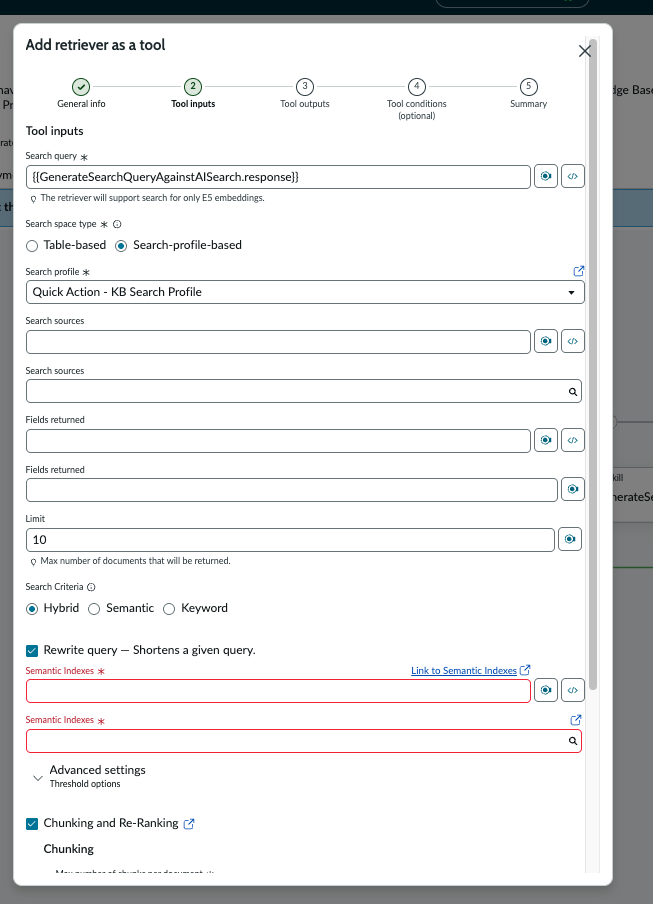
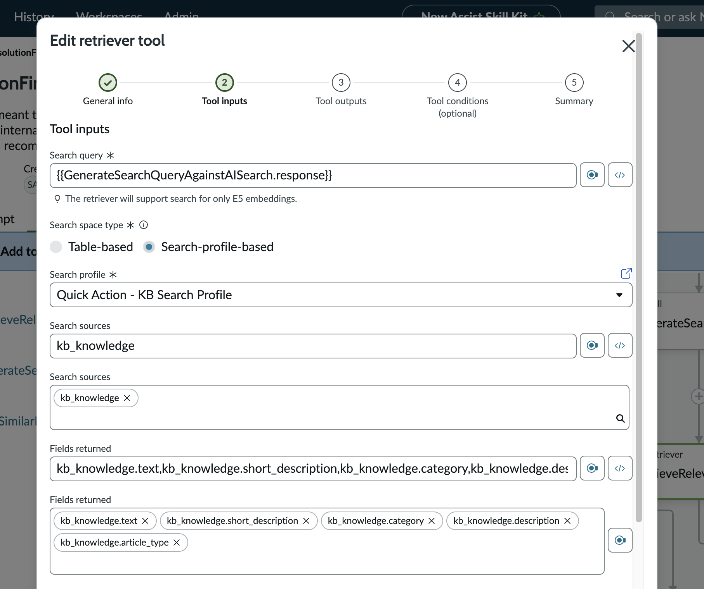
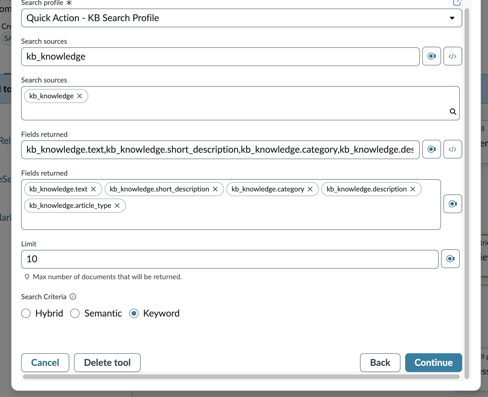

# 04b-alternative — Retriever Configuration: Keyword Search (Alternative Path)
 
> **Applies to:** 04b — NASK: ResolutionFinderInternalData → Step 7b (Tool Inputs)
> **Use this guide if:** Your instance does not support Semantic search in the Retriever tool configuration
 
---
 
## When to Use This Guide
 
When configuring the **RetrieveRelevantKBContent** Retriever tool in Step 7b of [04b — ResolutionFinderInternalData](https://sn-ai-platform.gitbook.io/sn-ai-lab/phase-2-fulfiller-flow/04b-now-assist-skill-kit-part2-resolutionfinderinternaldataskill#step-7b-tool-inputs), the standard instructions call for **Semantic** search criteria with the ServiceNow Embedding (E5) model, semantic indexes on `body` and `title`, and chunking with re-ranking.
 
However, on some lab instances you may encounter the following when you reach the Tool Inputs screen:
 

 
**Symptoms that indicate you need this alternative path:**
 
- Duplication of `Search sources, Fields returned and Semantic Indexes` fields on the form
- When clicking onto Semantic Indexes, nothing shows up (usually body, title should appear)
 
> **This is UI defect that we are currently working with Now Support and Engineering on. For more details, see PRB2008944 and Dev task CSTASK1389575.
 
---
 
## Step 7b (Alternative): Configure Tool Inputs — Keyword Search
 
Replace the Semantic search configuration from the main 04b guide with the following Keyword search configuration.
 
**Core search configuration:**
 
| Field | Value |
|-------|-------|
| Search query | `{{GenerateSearchQueryAgainstAISearch.response}}` |
| Search space type | `Search-profile-based` |
| Search profile | `Quick Action - KB Search Profile` |
| Search sources | `kb_knowledge` |
| Fields returned | `kb_knowledge.text`, `kb_knowledge.short_description`, `kb_knowledge.category`, `kb_knowledge.description`, `kb_knowledge.article_type` |
| Limit | `10` |
| Search Criteria | **`Keyword`** |
 

 

---

## Step 7c (Alternative): Tool Outputs

| Output        | Type          |
| ------------- | ------------- |
| `Rag Results` | `string`      |

Click **Continue**.

---

## Step 7d (Alternative): Tool Conditions

Type: **None (Always run)**

Click **Continue**.

---

## Step 7e (Alternative) — Summary

Verify the complete configuration before saving:

| Section         | Field                       | Value                                                                            |
| --------------- | --------------------------- | -------------------------------------------------------------------------------- |
| Type            | —                           | Retriever                                                                        |
| General info    | Name                        | `RetrieveRelevantKBContent`                                                      |
| General info    | Resource                    | RAG                                                                              |
| Inputs          | Search query                | `{{GenerateSearchQueryAgainstAISearch.response}}`                                |
| Inputs          | Search space type           | Search-profile-based                                                             |
| Inputs          | Search profile              | `quick_action_kb_search_profile`                                                 |
| Inputs          | Search sources              | `kb_knowledge`                                                                   |
| Inputs          | Fields returned             | kb\_knowledge.text, .short\_description, .article\_type, .category, .description |
| Inputs          | Limit                       | 10                                                                               |
| Inputs          | Search Criteria             | Keyword                                                                          |
| Outputs         | Rag Results                 | string                                                                           |
| Tool conditions | Type                        | none                                                                             |

Click **Save changes**.

 
---
 
## Impact on Downstream Behaviour
 
Switching from Semantic to Keyword search changes how the retriever matches KB articles, but does **not** change the rest of the skill flow. The output object stays consistent as `Rag Results`, but it changes from `json_object` to `string`, and the `Assess if solution exists` prompt still receives the same data structure. This however does not have any impact on the overall flow of this skill creation.
 
| Aspect | Semantic Search | Keyword Search |
|--------|----------------|----------------|
| Matching method | Cosine similarity in E5 embedding space | Keyword frequency / BM25 relevance |
| Handles synonyms | Yes — semantically similar terms match | Limited — requires exact or stemmed keyword overlap |
| Requires embedding model | Yes — E5FT | No |
| Requires semantic indexes | Yes — `body`, `title` | No |
| Chunking and re-ranking | Available | Not available |
| Query quality sensitivity | Moderate — embeddings compensate for imprecise queries | High — keyword search is more literal, so query quality matters more |
 
> **Practical impact for the lab:** With Keyword search, the `CreateOptimalSearchQuery` skill's output becomes even more critical. The LLM-generated query must contain the exact keywords present in the KB articles (e.g., "Veritas", "backup failure", "error 84") for keyword matching to succeed. If you find that the retriever returns no results during testing, review the query output from `CreateOptimalSearchQuery` and ensure it contains specific, concrete terms from the KB article rather than abstract descriptions.
 
---
 
## After This Step
 
Once you have configured the Keyword search Tool Inputs and clicked **Continue**, rejoin the main 04b guide at **Step 7c — Tool Outputs**. All subsequent steps (Tool Outputs, Tool Conditions, Summary, Final Canvas, Publish, Activate) are identical regardless of whether you used Semantic or Keyword search.
 
→ Return to [04b — Step 8: Final Canvas - Complete Skill Flow](https://sn-ai-platform.gitbook.io/sn-ai-lab/phase-2-fulfiller-flow/04b-now-assist-skill-kit-part2-resolutionfinderinternaldataskill#step-8-final-canvas-complete-skill-flow)