# ServiceNow MCP Server + Claude Desktop Integration

This guide walks through connecting ServiceNow to Claude Desktop as an MCP (Model Context Protocol) client, then optionally extending that into an AI Agent in AI Agent Studio that can call external MCP tools. Every step is derived from a hands-on lab and all values shown are real examples — substitute your own instance URL, credentials, and names where indicated.

---

## Overview

**What you are building:**

```text
Claude Desktop (MCP Client)
    │
    │  OAuth + JWT
    ▼
ServiceNow MCP Server Console
    │
    ├── Look up incident records
    ├── Problems investigation skill
    └── Incident summarization
```

In the bonus section you will also register an external MCP server (e.g. Microsoft Learn) inside AI Agent Studio and wire it into a ServiceNow AI Agent that follows a ReACT reasoning loop.

---

## Prerequisites

| Requirement | How to verify |
| --- | --- |
| Node.js 18+ / npx | `npx --version` → should print a version like `11.9.0` |
| Claude Desktop app (Mac or Windows) | Installed and signed in |
| ServiceNow instance with MCP Server Console plugin | Admin access required |

---

## Part 1 — Create the MCP Server in ServiceNow

### 1.1 Open MCP Server Console

In ServiceNow, click the **Admin Center** icon in the top-left navigation, then look under **All Results** for **MCP Server Console** and open it.

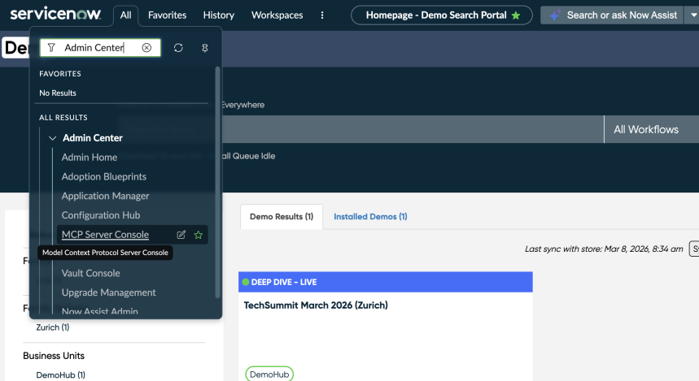

You will land on a list view showing any existing servers. A banner at the top may read _"OAuth setup required."_ — ignore this for now, you will address it after creating the server.

### 1.2 Create a new server

Click **New** in the top-right corner of the Servers panel.

On the **Create new server** form, fill in:

| Field | Value |
| --- | --- |
| **Label** | `claude_desktop` |
| **Name** | `claude_desktop` (auto-populated from the label) |
| **Application** | `Global` |
| **Short description** | `MCP Server for Claude Desktop` |

The **Server URL** is auto-generated by the platform. It follows this pattern:

```text
https://<your-instance>.service-now.com/sncapps/mcp-server/mcp/claude_desktop
```

Copy this URL — you will need it later.

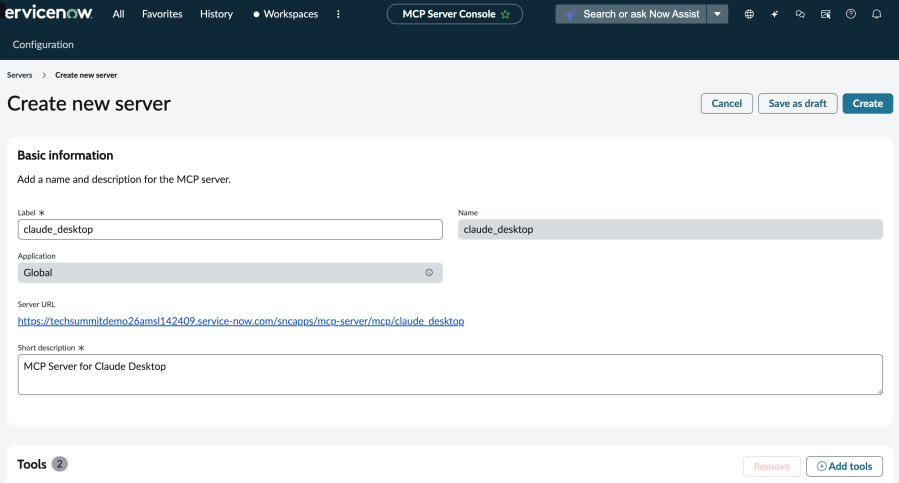

### 1.3 Add tools to the server

Scroll down to the **Tools** section and click **+ Add tools**.

In the modal that appears, select the following tools (use the search box to find them):

- **Look up incident records** — queries ServiceNow Incident records using structured parameters
- **Problems investigation skill** — assists with root cause investigation of IT problems
- **Incident summarization** — provides NowAssist-powered summarization of incidents

Check each one and click **Add**.

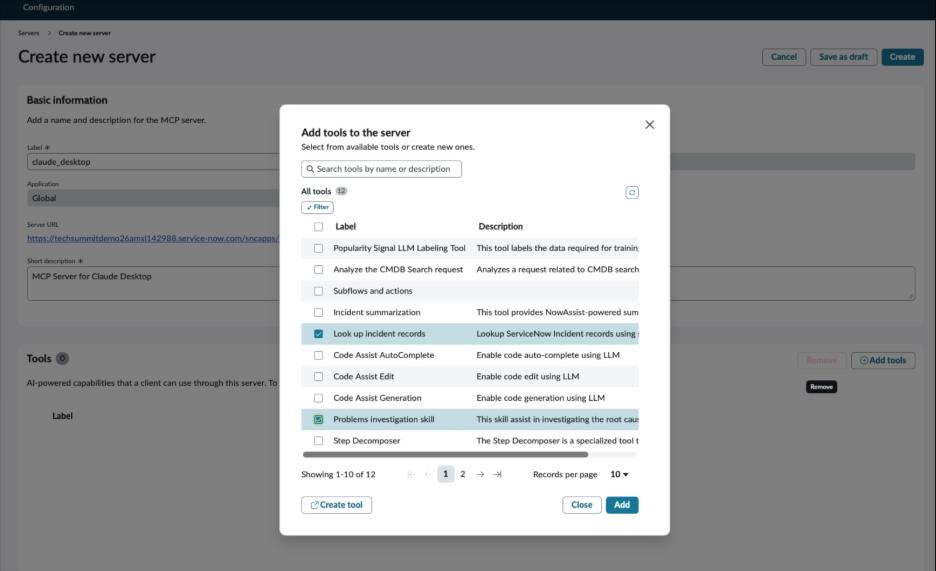

After adding, the Tools section should show **3** tools attached.

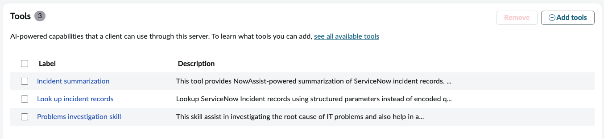

### 1.4 Save the server

Click **Create** in the top-right. The server status changes to **Active**, but a prompt immediately appears:

> _"Set up OAuth to use claude_desktop — Your claude_desktop is active, but you need an OAuth inbound integration to connect it to a client."_

Click **Open MIC** to proceed to the OAuth configuration.

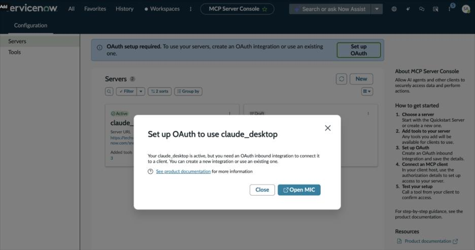

---

## Part 2 — Configure OAuth in Machine Identity Console

This step creates the OAuth Authorization Code Grant that Claude Desktop will use to authenticate against your ServiceNow instance.

### 2.1 Create an inbound OAuth integration

The **Open MIC** button takes you to **Machine Identity Console → Inbound Integrations**. Click **New** (or **Authorization code grant**) to create a new entry.

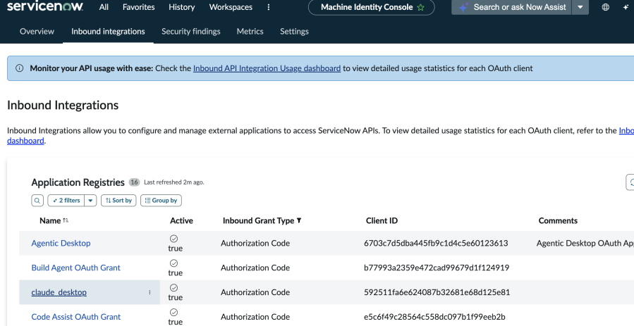

### 2.2 Fill in the Details section

| Field | Value |
| --- | --- |
| **Name** | `claude_desktop` |
| **Provider name** | `claude` |
| **Redirect URL** | `https://<your-instance>.service-now.com/mcp_redirect.do` |
| **This is a public client** | Leave **unchecked** |
| **Active** | Checked |

After saving, the platform generates a **Client ID** and **Client Secret**. Copy both values and store them somewhere safe — you will need them in the launcher script.

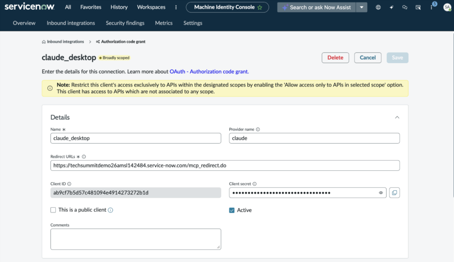

> **Important:** The Redirect URL must end with `/mcp_redirect.do` exactly. This is the callback endpoint the MCP Server Console uses to complete the OAuth handshake.

### 2.3 Configure the Auth scope

Scroll down to the **Auth scope** section. Set:

| Field | Value |
| --- | --- |
| **Auth scope** | `useraccount` |

The `useraccount` scope grants access to all resources available to the signed-in user. Leave **Scope validation settings** at their defaults.

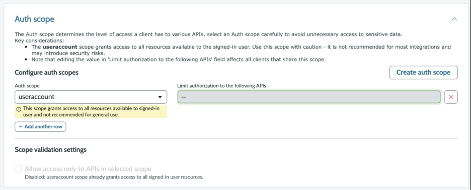

### 2.4 Set Advanced options

Expand **Advanced options (optional)** and configure:

| Field | Value | Reason |
| --- | --- | --- |
| **Token Format** | `JWT` | Required by the MCP Server |
| **Subject Claim** | `Sys ID` | Identifies the user in the token |
| **Access token lifespan** | `8640000` | ~100 days, avoids frequent re-auth |
| **Refresh token lifespan** | `8640000` | Same, keeps the session alive |

Leave **Enforce token restriction** unchecked unless you want to lock the client to specific REST APIs.

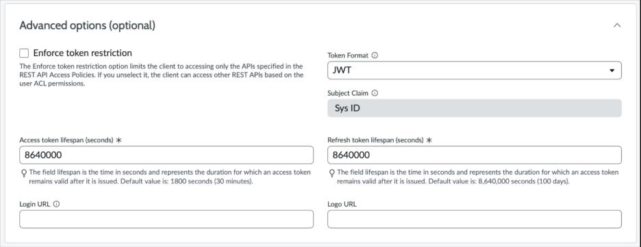

### 2.5 Save and note your credentials

Click **Save**. Verify your Client ID is now visible in the Details section.

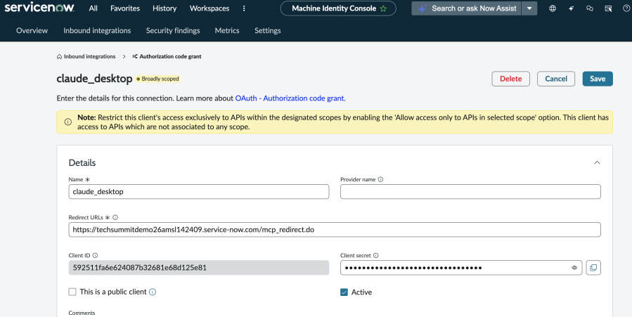

Record the following — you will need them in the next section:

```text
SN_INSTANCE=https://<your-instance>.service-now.com
TOKEN_CLIENT_ID=<client-id-from-this-page>
TOKEN_CLIENT_SECRET=<client-secret-from-this-page>
SN_SERVER_NAME=claude_desktop
```

---

## Part 3 — Configure Claude Desktop

### 3.1 Verify Node.js is installed

Open a terminal and run:

```bash
npx --version
```

You should see a version number (e.g. `11.9.0`). If the command is not found, install Node.js from [nodejs.org](https://nodejs.org) before continuing.

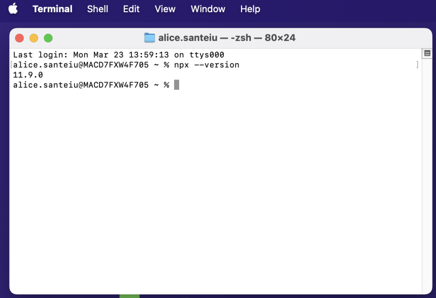

### 3.2 Open Claude Desktop Settings

Launch Claude Desktop. From the menu bar, click **Claude → Settings** (or press `⌘,`).

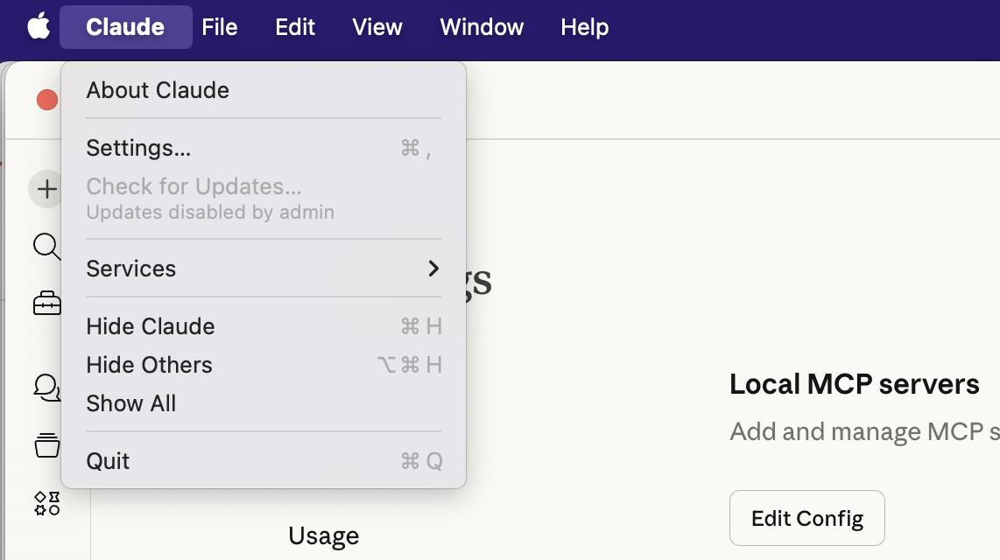

In the Settings sidebar, click **Developer** (under the Desktop App section). You will see the **Local MCP servers** panel with an **Edit Config** button.

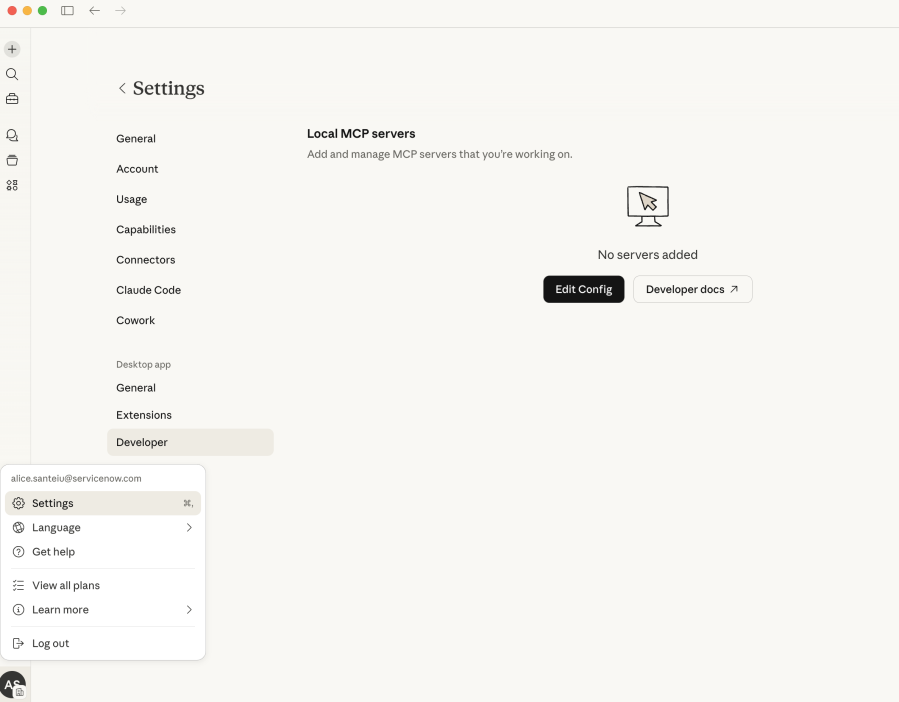

### 3.3 Locate the config directory

Click **Edit Config**. This opens a Finder window at:

```text
~/Library/Application Support/Claude/
```

The file `claude_desktop_config.json` lives here. This is also where you need to place the launcher script in the next step.

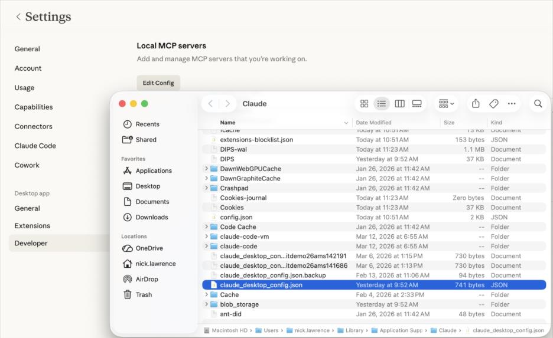

To open this folder directly from the terminal:

```bash
open ~/Library/Application\ Support/Claude/
```

Or use **Finder → Go → Go to Folder** (`⇧⌘G`) and paste `~/Library/Application Support/Claude/`.

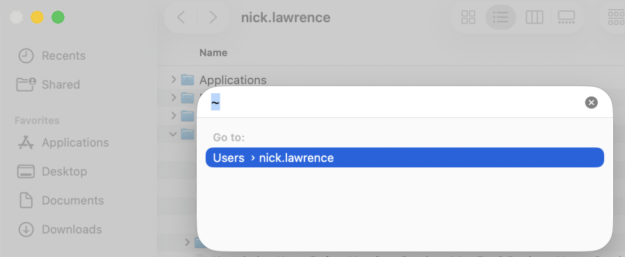

### 3.4 Create the launcher script

Inside `~/Library/Application Support/Claude/`, create a new file named `sn-mcp-launcher.sh` with the following content. Replace every placeholder with your actual values from Part 2.

```bash
#!/bin/bash

# ─── Configuration ───────────────────────────────────────────────────────────
SN_INSTANCE="https://<your-instance>.service-now.com"
TOKEN_CLIENT_ID="<your-client-id>"
TOKEN_CLIENT_SECRET="<your-client-secret>"
SN_SERVER_NAME="claude_desktop"
# ─────────────────────────────────────────────────────────────────────────────

if [ -z "$SN_INSTANCE" ] || [ -z "$TOKEN_CLIENT_ID" ] || [ -z "$TOKEN_CLIENT_SECRET" ]; then
  echo "ERROR: Please set SN_INSTANCE, TOKEN_CLIENT_ID, and TOKEN_CLIENT_SECRET in this script." >&2
  exit 1
fi

TOKEN_URL="${SN_INSTANCE}/oauth_token.do"

# Obtain an access token using the client credentials flow
ACCESS_TOKEN=$(curl -s -X POST "$TOKEN_URL" \
  --data-urlencode "grant_type=client_credentials" \
  --data-urlencode "client_id=${TOKEN_CLIENT_ID}" \
  --data-urlencode "client_secret=${TOKEN_CLIENT_SECRET}" \
  | python3 -c "import sys, json; print(json.load(sys.stdin).get('access_token',''))" 2>/dev/null)

if [ -z "$ACCESS_TOKEN" ]; then
  echo "ERROR: Failed to obtain access token. Check your CLIENT_ID, CLIENT_SECRET, and instance URL." >&2
  exit 1
fi

echo "Token obtained successfully, launching mcp-remote..." >&2

# Launch the MCP server proxy using npx
exec npx -y @modelcontextprotocol/server-everything \
  --header "Authorization: Bearer ${ACCESS_TOKEN}" \
  "${SN_INSTANCE}/sncapps/mcp-server/mcp/${SN_SERVER_NAME}"
```

> **Note:** The actual `npx` command used by ServiceNow is `@servicenow/mcp` or a similar package — check the Server URL shown in MCP Server Console and adjust the final `exec npx` line to match what your instance documentation specifies.

The file should appear in Finder alongside `claude_desktop_config.json`.

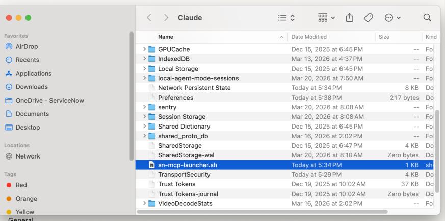

### 3.5 Make the script executable

Open a terminal and run:

```bash
chmod +x ~/Library/Application\ Support/Claude/sn-mcp-launcher.sh
```

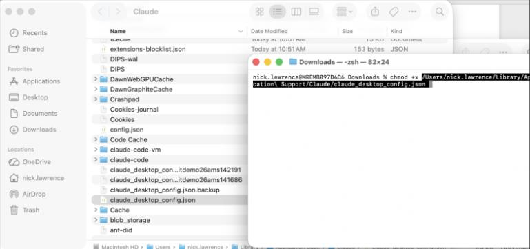

### 3.6 Edit claude_desktop_config.json

Right-click `sn-mcp-launcher.sh` in Finder and choose **Open With → TextEdit** (or any text editor).

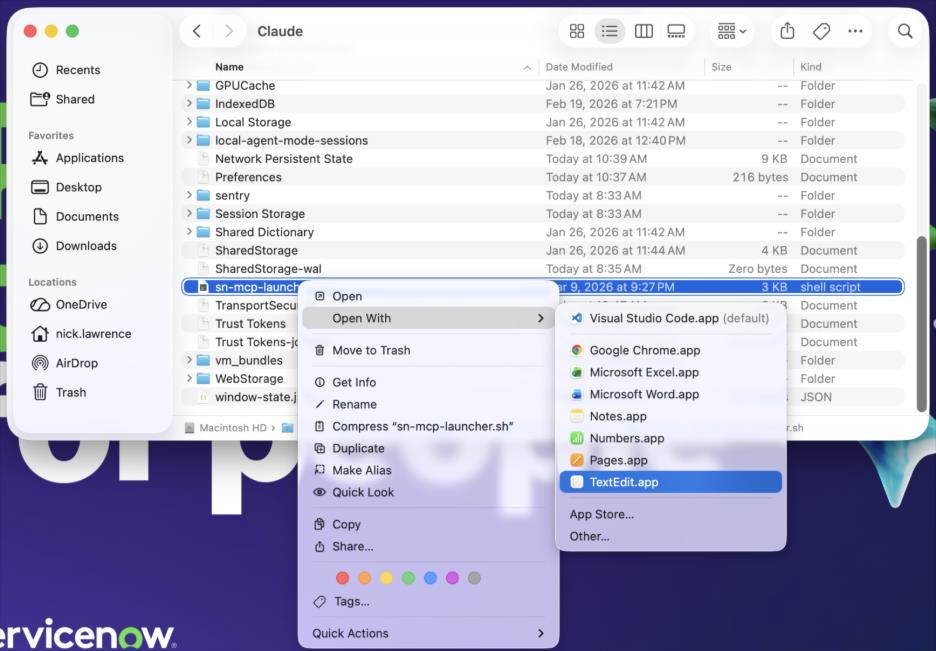

Now open `claude_desktop_config.json` in the same directory and add or update the `mcpServers` block:

```json
{
  "mcpServers": {
    "servicenow": {
      "command": "/Users/<your-username>/Library/Application Support/Claude/sn-mcp-launcher.sh"
    }
  }
}
```

Use the absolute path to the script (replace `<your-username>` with your macOS username). Save the file.

### 3.7 Restart Claude Desktop

Fully quit Claude Desktop (`⌘Q`) and reopen it. The MCP server connects during startup. If there is an error, check the terminal output from the launcher script for clues.

---

## Part 4 — Test the Integration

### 4.1 Confirm tool availability

In a new Claude Desktop conversation, type:

> _"Do you have anything to look up incidents?"_

Claude should respond by listing the tools available via the connected MCP server:

- **Look Up Incident Records** — Search ServiceNow Incident records using structured parameters
- **Problems Investigation Skill** — Investigate root causes of IT problems

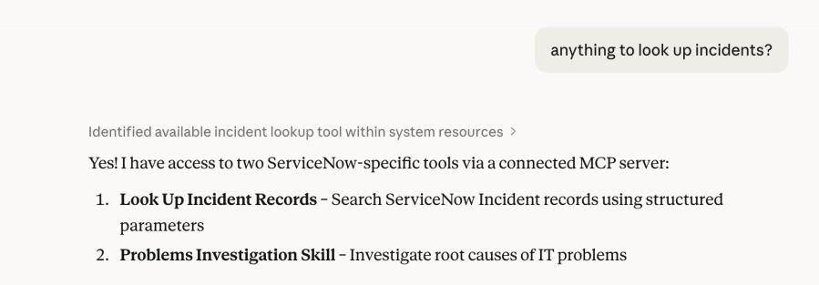

### 4.2 Run a live query

Ask Claude:

> _"Look up the 5 most recent open P1 and P2 incidents"_

Claude will invoke both tools in parallel, then return a formatted list of incidents from your ServiceNow instance.

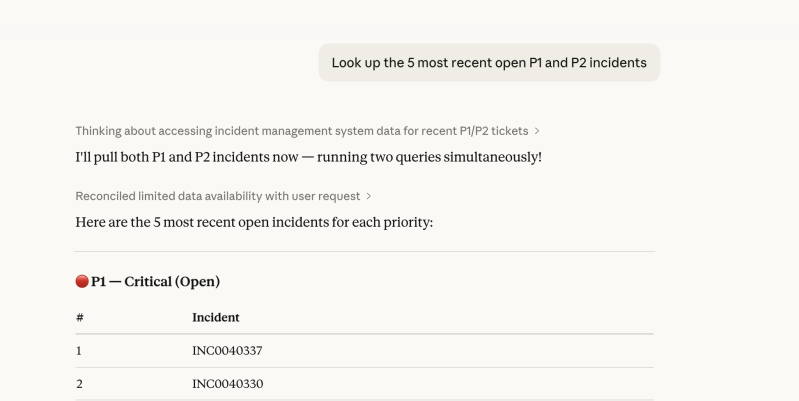

---

## Part 5 (Bonus) — Register an External MCP Server in AI Agent Studio

This section shows how to add an external MCP server (such as Microsoft Learn) so that ServiceNow AI Agents can call it as a tool alongside native ServiceNow capabilities.

### 5.1 Open AI Agent Studio

In ServiceNow, search for **AI Agent** in the top nav and navigate to **AI Agent Studio → Settings → Manage MCP servers**.

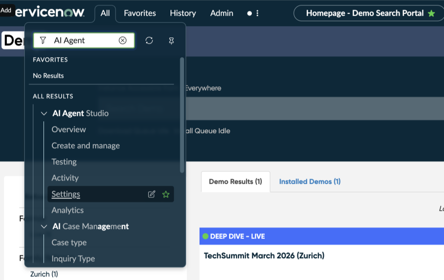

The **Manage Model Context Protocol (MCP) servers** page shows all registered external MCP servers.

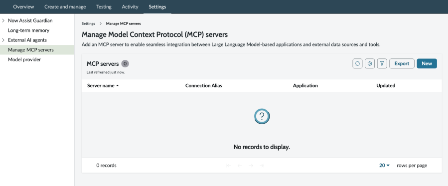

### 5.2 Register the external MCP server

Click **New** and fill in the dialog:

| Field | Value |
| --- | --- |
| **Name** | `Microsoft Learn` |
| **Authentication type** | `API Key` |
| **MCP server URL** | `https://learn.microsoft.com/api/mcp` |
| **API key** | Your API key for the service |

Click **Add**.

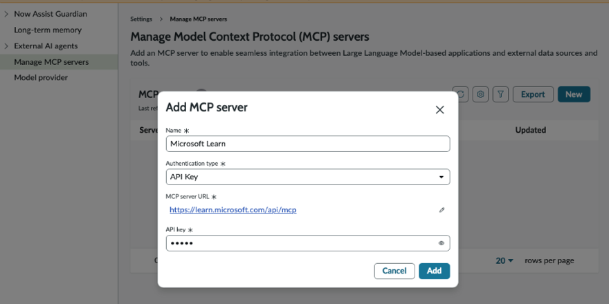

### 5.3 Verify the server appears

The server record opens for review. Confirm the name, URL, and application scope are correct.

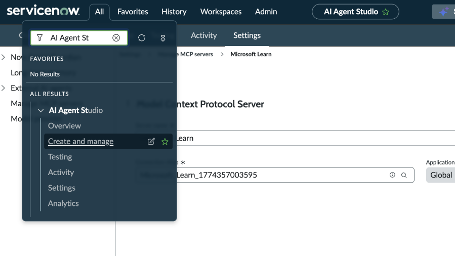

---

## Part 6 (Bonus) — Create an AI Agent that uses MCP tools

### 6.1 Navigate to Create and Manage

In AI Agent Studio, click **Create and manage** in the top nav. You will see a list of existing agents.

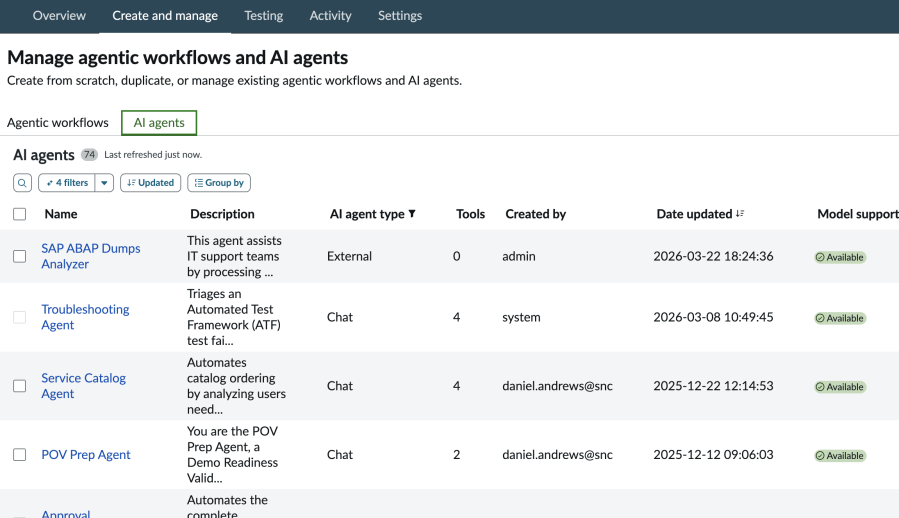

### 6.2 Open or create the Incident Resolver agent

Open the **ITSM Incident resolution Investigation AI agent** (or click **New** to create one from scratch).

**Define the specialty** — write a concise description of what this agent does. Example:

> _"Get details of incidents, add incident additional comments, AIA RAG retriever, get similar incidents"_

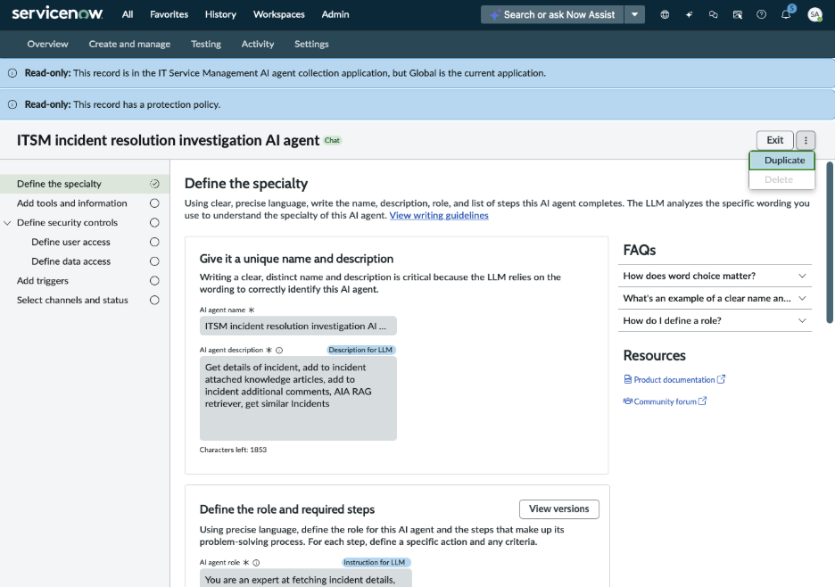

### 6.3 Define the role and required steps

In the **Define the role and required steps** section, write the system prompt that guides the agent. This becomes the agent's instruction set for the ReACT reasoning loop. Example:

```text
You are an expert at fetching incident details, similar resolved incidents, and knowledge articles.
You are an expert at analysing the incident and relevant information to generate the incident resolution plan, regardless of the actual problem described in the incident.
You are an expert to update the generated incident resolution plan on the incident work notes.
```

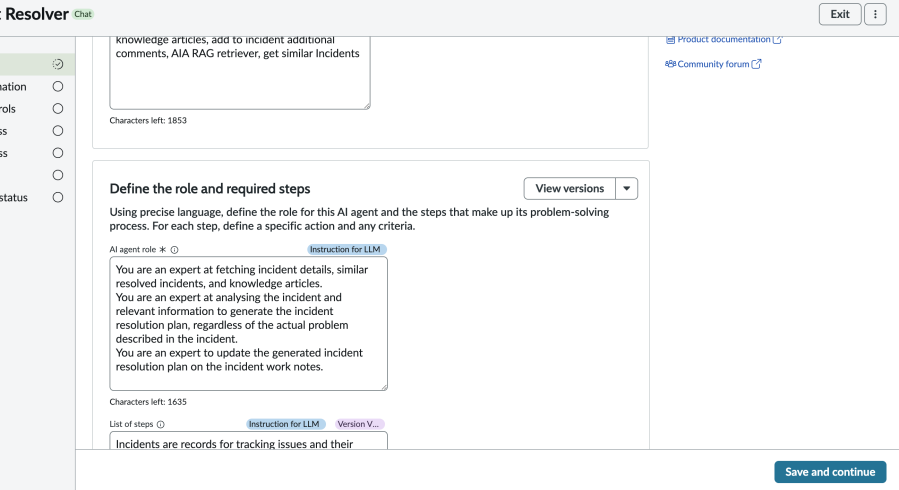

### 6.4 Create a new version with an updated step list

Click **View versions → Create new version**. In the modal:

| Field | Value |
| --- | --- |
| **Version name** | `V2 Steps Includes MS Learn` |
| **Set as active** | Toggle on |

In the **List of steps** field (this is the "Instruction for LLM" tab), enter the ordered steps:

```text
Incidents are records for tracking issues and their resolution updates through a set of journal entries. Your objective is to understand what the issue with the incoming incident is, search for potential solutions, consult external Microsoft documentation, and come up with a comprehensive plan for solving the issue presented in the incident.

IMPORTANT: Only run each step one time.

To generate the incident resolution plan, ALWAYS follow this progression of steps in order:

1. First step should be to get the details of the incident. If the incident details are not found, then find processes immediately; the provided incident is not correct.
```

Continue adding your remaining steps as needed.

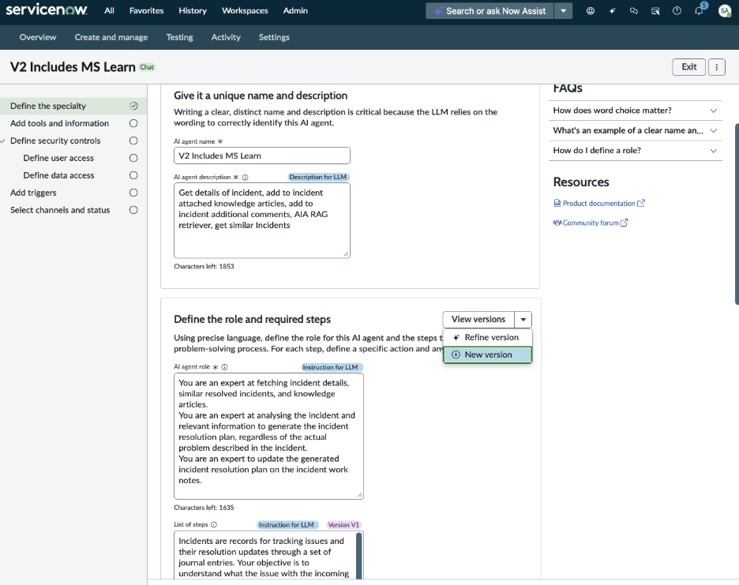

Click **Create**.

### 6.5 Add tools including the MCP tool

In the **Add tools and information** section, add the tools the agent can invoke:

- **Get details of Incident** (native)
- **Get similar incidents** (native)
- **Get relevant knowledge articles** (native)
- **Add a resolution plan to Incident's work notes** (native)
- **Organize general knowledge** (native)
- **MS Learn MCP Tool** (external MCP)

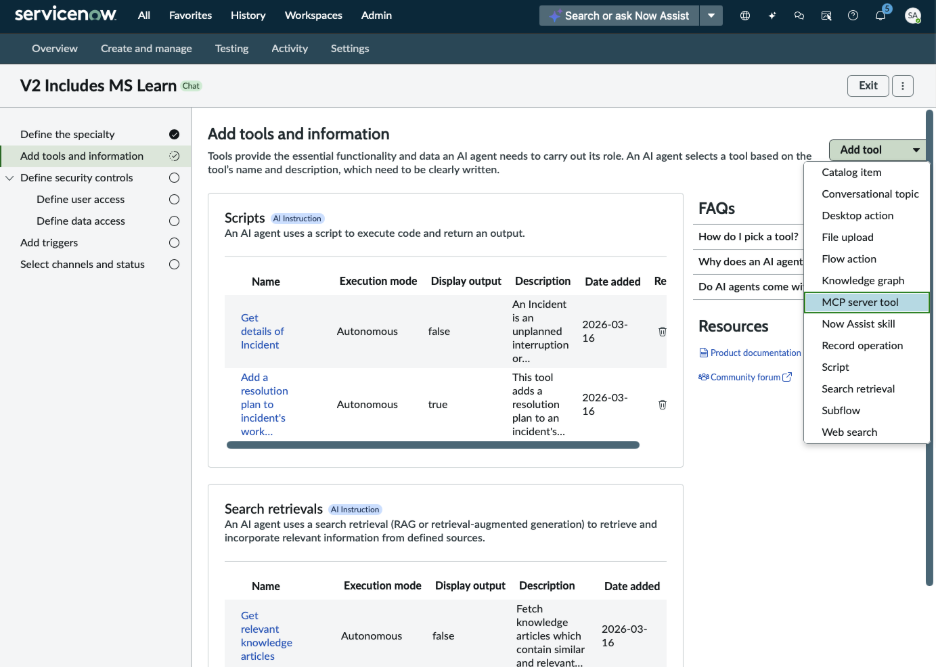

When adding the MS Learn MCP tool, configure it:

| Field | Value |
| --- | --- |
| **Name** | `MS Learn MCP Tool` |
| **Tool description** | `Searches Microsoft Learn documentation for technical guidance on Microsoft products and services. Use this when internal knowledge articles are insufficient.` |
| **Execution mode** | `Autonomous` |
| **Display output** | `Yes` |

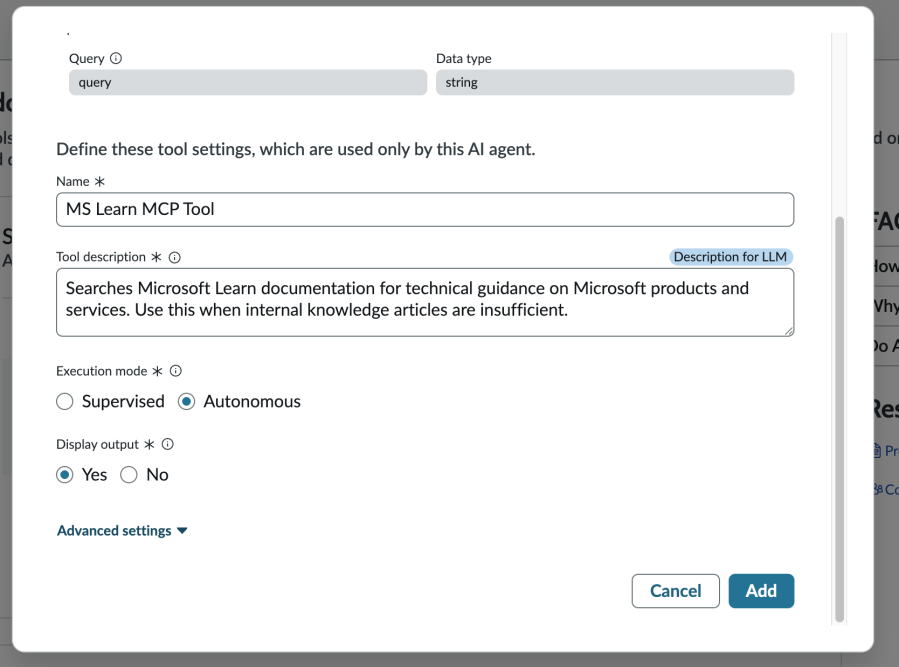

Click **Add**, then **Save and continue**.

### 6.6 Test the agent

Go to the **Testing** tab and create a test:

| Field | Value |
| --- | --- |
| **Test on** | AI agent or workflow |
| **Name of agent or workflow** | `Nick Incident resolver` |
| **Version** | `V2 - V2 steps Includes MS Learn (Active)` |
| **Test** | `Investigate and resolve incident INC0039737` |

Click **Continue to Test Chat Response**.

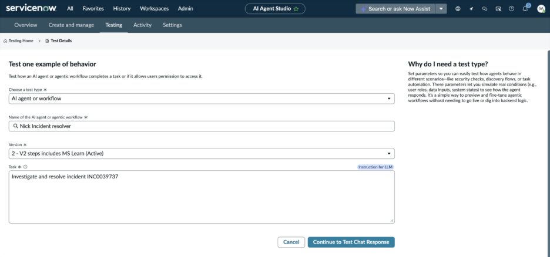

### 6.7 Review the AI agent decision logs

After the test runs, inspect the **AI agent decision logs** on the right side. Each reasoning step is shown in order:

1. Access verification
2. Gen AI - AIA ReAct Engine
3. Tool - Get details of Incident ✅
4. Gen AI - AIA ReAct Engine
5. Tool - Get similar incidents ✅
6. Gen AI - AIA ReAct Engine
7. Tool - Get relevant knowledge articles ✅
8. Gen AI - AIA ReAct Engine
9. Tool - Microsoft Learn ✅
10. Gen AI - AIA ReAct Engine
11. Tool - Add a resolution plan to Incident's work notes ✅
12. Tool - Organize general knowledge ✅

This is the **ReACT (Reasoning + Acting) loop** in action: the agent reasons about what to do next, calls a tool, observes the result, and repeats until it has enough information to complete the task.

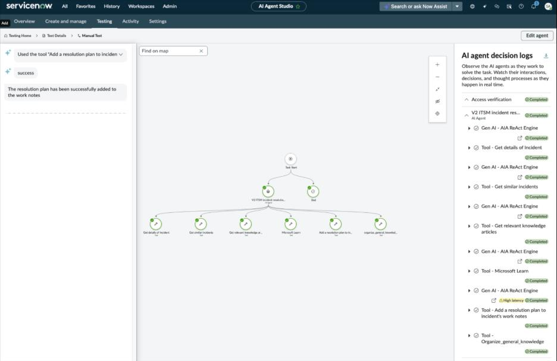

### 6.8 Verify the result in the Incident record

Navigate to the incident that was tested (e.g. INC0039737). Open the **Notes** tab and check **Work notes** — the AI agent should have posted a structured resolution plan with numbered troubleshooting steps as a NowAssist-generated note.

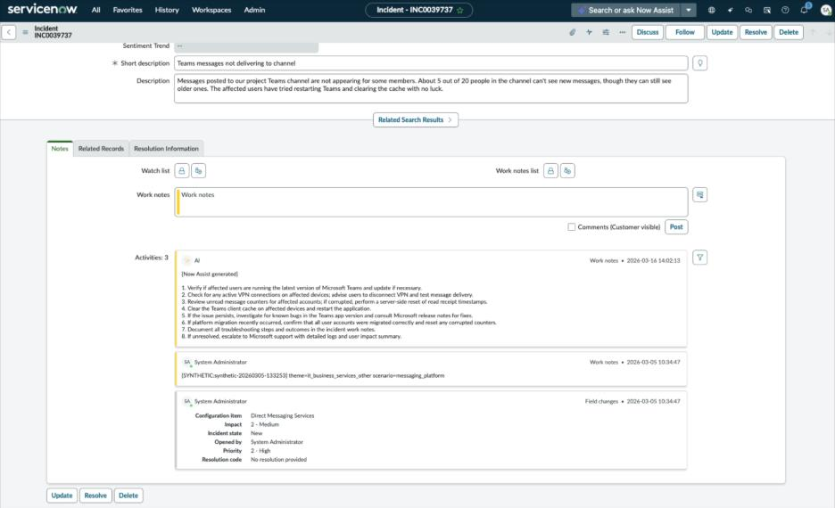

---

## Troubleshooting

| Symptom | Likely cause | Fix |
| --- | --- | --- |
| `npx: command not found` | Node.js not installed or not on PATH | Install Node.js and ensure `$(which npx)` returns a path |
| OAuth token request fails | Wrong Client ID / Secret or instance URL | Double-check credentials from Machine Identity Console |
| Claude shows no tools | Launcher script not executable or path wrong in config | Run `chmod +x` on the script; verify the absolute path in `claude_desktop_config.json` |
| `401 Unauthorized` from ServiceNow | Token expired or scope mismatch | Increase token lifespan in the OAuth config; confirm Auth scope is `useraccount` |
| MCP server shows "Draft" not "Active" | Server was saved with "Save as draft" | Re-open the server record and click **Activate** |
| AI Agent decision log shows tool failure | MCP server URL unreachable from ServiceNow | Confirm the external MCP server URL is accessible from your ServiceNow instance network |
